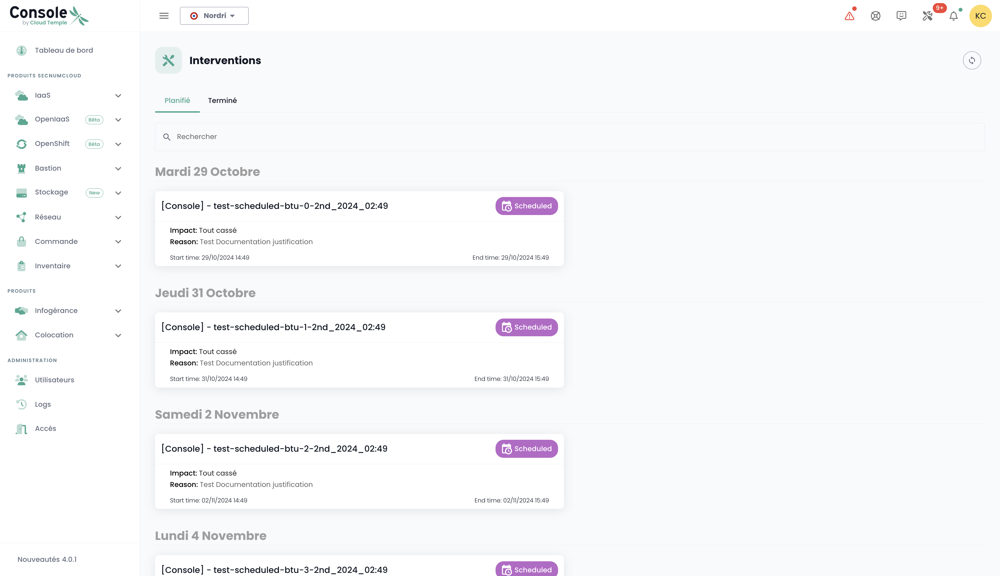

title: Planned Operations and Incident Management
---

Like any Cloud infrastructure platform, the Cloud Temple platform undergoes regular hardware and software maintenance and upgrades.

## Access to ongoing operations and incidents

The operations tracking icon allows you to view planned operations on the Cloud Temple infrastructure as well as open incidents on the tenant. This icon is accessible in the icon bar at the top left of the screen and has the shape of a __'Tools'__ icon.

This icon aims to provide visibility on ongoing and completed planned interventions and/or incidents on the tenant.

When interventions and/or incidents are in progress, a number appears on the icon.

By clicking on quick view, you will find the ongoing interventions. It is also possible to click on __'All interventions'__ or __'All tenant incidents and reports'__ to display more details.

## Tracking planned interventions

The Interventions page is composed of two tabs. The first tab allows you to view interventions planned for the next 30 days and ongoing interventions.

Completed interventions are visible in the second 'Completed' tab.

Access to this information requires the '**intervention_read**' permission for the user profile.

## Incident management

Two types of incidents can be distinguished: global incidents that affect the entire system and incidents specific to a client perimeter that impact only the resources or services associated with a particular client.

### Global incidents

Retrieving information about global incidents does not require any special permission. A red banner is displayed as soon as you connect to the console to warn of the presence of a global incident being resolved. The user has the possibility to temporarily hide this banner during their session, but it will reappear at each new connection or when refreshing the page as long as the incident remains unresolved.

A __'Learn more'__ button redirects to the public incident tracking page allowing access to additional information about the ongoing incident:

It is possible to obtain reports of global incidents. Access to these reports requires the specific permission '**incident_management**'.

Here is an example of the tab displaying these reports:

### Incidents on a client perimeter

Visibility of incidents specific to a client perimeter requires the **incident_read** permission. These incidents are represented by a dedicated icon accompanied by a red badge indicating the number of ongoing incidents.

The icon is clickable, allowing to list the tickets associated with the incidents. Each ticket includes a link to the incident details, offering the possibility to follow the progress of their resolution:

To view the details of an incident, it is necessary to be the author of the incident ticket or to have the **support_management** permission.

### Notification management

In order to quickly inform users in case of a new incident, an email notification system has been set up. From their user profile, a tab entitled '*My subscriptions*' allows users to subscribe to notifications for both types of incidents. Thus, they will receive an email within a very short time when an incident is declared or resolved.

The subject of the email will indicate the type of incident and, in the case of a perimeter-related incident, the name of the impacted perimeter. The notification will also contain a link allowing direct access to the incident details:

