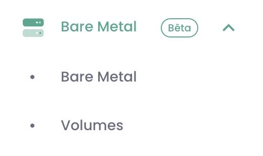

# QuickStart for the Bare Metal Offer

This page guides you through the initial steps to use the **Bare Metal** offer from the Cloud Temple console. Follow these instructions to discover the menus and available features.

---

## Prerequisites
Before starting, make sure of the following points:
1. **Subscription activated**: Your organization must have subscribed to the Bare Metal offer.
2. **User permissions**: Your user account must have the necessary rights to access and manage Bare Metal resources.

---

## Access to the Bare Metal Interface

Once the subscription is activated and permissions are configured, a new menu titled **Bare Metal** appears in the Cloud Temple console. This menu contains two main sub-menus: **Bare Metal** and **Volumes**.

---

### 1. **Bare Metal** Sub-menu

The **Bare Metal** sub-menu presents a table listing all available Bare Metal instances. This table includes the main information for each instance:
- **Bare Metal Name**
- **State**
- **Hardware Configuration**
- **IP Address**

#### Main Features
- **Action Button**: Allows direct access to the Bare Metal administration console.
- **Clickable Name**: By clicking on the name of a Bare Metal instance, a new page appears with the **complete details** of the instance:
  - Hardware information (RAM, CPU, GPU, etc.).
  - Network configuration (associated IP addresses).
  - Connectivity information for management.

---

### 2. **Volumes** Sub-menu

The **Volumes** sub-menu displays a table listing all storage volumes associated with your Bare Metal subscription. For each volume, the following information is available:
- **Volume Name**
- **Capacity**
- **Performance Class** (IOPS per TB)
- **State** (Available, Deploying, etc.)

#### Main Features
- Volume management: From this table, you can map volumes to your Bare Metal instances.

---