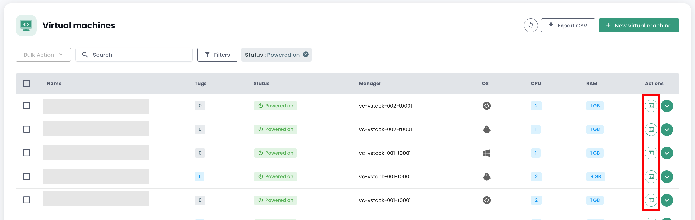

## Compute

### Managing Virtual Machines

The management interface for your virtual machines is available in the Shiva console in the __'IaaS'__ menu located on the green bar to the left of the screen.

### List of Virtual Machines

In the __'Virtual Machines'__ section, you have access to the list of your virtual machines hosted on your trusted Cloud.


You have access to the following information for each virtual machine:
- its name,
- the tags assigned to it,
- its status (powered off, powered on, processing, host disconnected, or invalid),
- its manager (in a VMware environment, the associated Vcenter),
- its operating system,
- The amount of virtual CPUs (vCPU),
- The amount of virtual memory (vRAM).

### Actions on Virtual Machines

The following actions are possible from this interface:

- Refresh the list of virtual machines;
- Export the list in CSV format;
- Filter the list;
- Search for a virtual machine by its name;
- Create a new virtual machine.


__An alert banner may be present at the top of the list__: it indicates that critical alarms have been triggered on one or more of your virtual machines.
The __'View'__ button allows you to see the virtual machines affected by this notification.


When you click the green drop-down arrow on the right of the list for a virtual machine:


You access all the information regarding it:


A quick banner allows you to perform the following actions:


- Power on the virtual machine;
- Power it off;
- Restart it;
- Modify the guest OS power options;
- Open the console;
- Mount an ISO;
- Unmount an ISO;
- Clone the virtual machine;
- Move it (vMotion);
- Rename it;
- Delete it.

A quick view provides a visualization of the virtual machine's __storage__, __CPU__, and __RAM__.


In the __'General Information'__ tab, you will find detailed information about your virtual machine, such as its OS, its physical location (datacenter, datastore, etc.), RAM, CPU, IP addresses, logs, and others.


From this view, you can perform the following actions:

- Modify the operating system (the virtual machine must be powered off),
- Update the hardware version (the virtual machine must be powered off),
- Modify the RAM or the CPU.

An __'Advanced'__ tab allows you to view more specific information such as "VMware tools" info, hardware version, manager, etc.


### Editing the RAM or CPU of a Virtual Machine
Go to the __'Virtual Machines'__ tab, display the details of a virtual machine,
select the __'General Info'__ tab and click on the edit button of the variable to be modified:


### Disk Modes

You can add different disk modes:
  - __Persistent__: Changes are immediately and permanently written to the virtual disk. **This is the recommended mode.**
  - __Independent non-persistent__: Changes to the virtual disk are logged in a new log and deleted on power-off. Not affected by snapshots. **It is not supported by backup.**
  - __Independent persistent__: Changes are immediately and permanently written to the virtual disk. Not affected by snapshots. **It is not supported by backup.**

### Managing Virtual Machine Controllers

You can modify the disk controller type for your virtual machine.


Virtual machines can be equipped with SCSI and NVME controllers, with a limit of 4 controllers of each type. Each controller can manage up to 15 disks.

A SCSI controller can be configured with different sub-types: Para Virtual, Bus Logic, LSI Logic, or LSI Logic SAS.

The Para Virtual controller stands out for its extended capacity. It can support up to 64 disks when the virtual machine's hardware version is compatible with an ESXi version 6.7 or higher.

> **Important**: If you want to change the type of a Para Virtual controller that has more than 15 disks, you will need to detach the disks on the affected slots first.

### Virtual Machine Console

The console of a virtual machine is accessible from the list of virtual machines by clicking on the __'Console'__ icon:



A new tab in your browser opens and displays your machine's console, based on a VNC client:


In the VNC menu, it is possible to:

- request specific keypresses,
- perform copy/paste from your OS's clipboard,
- switch to full-screen mode,
- change the window size (scaling).

Keyboard management with the virtual machines' console works perfectly in an entirely *English* environment.

The input in the console depends on your physical machine's keyboard language, your virtual machine's keyboard language, and whether the 'enforce keyboard' option is activated on the left side of the screen.
Here's a summary of possible situations with the French language:

| Physical machine's keyboard language (input) | Virtual machine's keyboard language       | 'Enforce keyboard' option selected     | Result (output)                                   |
| --------------------------------------------- | ----------------------------------------- | -------------------------------------- | --------------------------------------------------- |
| French                                        | French                                    | No                                     | Not recommended (issues with special characters)     |
| French                                        | French                                    | Yes                                    | < and > don't work                                |
| French                                        | English                                   | No                                     | Not recommended (issues with special characters)     |
| French                                        | English                                   | Yes                                    | English                                           |
| English                                       | French                                    | No                                     | < and > don't work                                |
| English                                       | French                                    | Yes                                    | < and > don't work                                |
| English                                       | English                                   | No                                     | English                                           |
| English                                       | English                                   | Yes                                    | English                                           |

__Note__:

- If the combination __'AltGr'__ and __'@'__ on the keyboard does not work, activate the __'enforce key'__ button in the console's __'VNC'__ menu and try again.
- If it still does not work and your physical machine's OS is __Windows__, set your physical machine's keyboard to English and try entering the @ symbol the usual way__ *(azerty output: AltGr + 0 key or qwerty output: 2 key)*.

### Cloud Temple Virtual Machine Catalogs

Cloud Temple offers you a catalog of `Templates` regularly enriched and updated by our teams.
It currently includes several dozen `Templates` and images to mount on your virtual machines.


To publish an ISO/OVF, go to the __'Catalog'__ view and click on the __'publish files'__ button at the top of the page:


It is possible to turn a VM into a template and export it to the catalog. To do this, select a virtual machine and use the __'clone'__ action button:


Select __'Export as vm-template'__:


Then fill in the necessary information. You will then be able to deploy a new VM from the template via the __'New virtual machine'__ button or from the __'Catalogs'__ page. It is also possible to export the VM as an OVF.

**Good to know**: you can convert an OVA file to OVF and vice versa.
The most commonly used method is VMware converter, but there is also a simple method using ```tar```

Extract the ova file:
```
$ tar -xvf vmName.ova
```

Create an OVA file from an OVF file:
```
$ tar -cvf vmName-NEW.ova vmName.ovf vmName-disk1.vmdk vmName.mf
```

### Advanced Virtual Machine Configuration: Extra Config

The Extra Config provides a flexible way to include key=value pairs in a virtual machine's configuration. The keys and values are interpreted by the system when the virtual machine is deployed.

Now, you can modify __Extra Config__ properties yourself in the advanced options of a virtual machine:


You can add a property from a list of keys. Additionally, you can modify the value of a key that you have added yourself. Existing key=value pairs are not modifiable.

Please contact support for any request to add new keys.


__Note__ : *For GPU usage by the virtual machine, it is mandatory to enable the key 'pciPassthru.use64bitMMIO' and allocate the necessary amount of MMIO (Memory-mapped I/O) space via 'pciPassthru.64bitMMIOSizeGB'. It is highly recommended to refer to the [official Nvidia documentation](https://docs.nvidia.com/vgpu/17.0/grid-vgpu-release-notes-vmware-vsphere/index.html#tesla-p40-large-memory-vms).*

### Advanced Settings for Virtual Machines: vAPP

You can also modify __vAPP__ properties in the advanced options of a virtual machine:


You can add, modify, or delete a property. Four types of properties are offered: String, Number, Boolean, Password:


__Note__ : *The virtual machine must be stopped to modify its vAPP properties.*

### Managing __'hypervisors'__ and __'Cpool'__ (hypervisor clusters)

Managing your hypervisors is done within the __'Compute'__ submenu of the __'IaaS'__ menu located in the green banner on the left side of your screen.


In this submenu, you have a view on:

- The hypervisor software stack, their AZ, and their resources,
- The backup software stack.

As of January 2024, the hypervisor offering available on the Cloud Temple qualified infrastructure is based on VMware. The backup software used is IBM Spectrum Protect Plus.

### Managing VMware Clusters

To access VMware cluster management, click in the __'Compute'__ submenu of the __'IaaS'__ menu:

By default, the first tab lists all hypervisors (all clusters combined):


You can view the details of a hypervisor by clicking on its name:


There is a tab for each hypervisor cluster to view the details of each:


If you click on a cluster, you see a summary of its composition:

- The total computing power expressed in Ghz,
- The total available memory and the used ratio,
- The total storage space (all types combined) and the used share,
- Automation mechanisms on unavailability of a compute blade (__'Vsphere DRS'__),
- The number of virtual machines,
- The number of hypervisors.

<!-- TODO: Add missing page. -->
<!-- By consulting the page of a cluster, several tabs are available. The __'Rules'__ tab allows you to define [affinity / anti-affinity rules](compute.md#management-of-virtual-machine-affinity). -->


For each hypervisor in the __'Hosts'__ tab, you will see:

- CPU__ and __Memory__ usage,
- The number of assigned virtual machines,
- The availability of a new build for the hypervisor operating system if applicable,
- The status of the hypervisor (connected in production, in maintenance, off, ...),
- An action menu.


Several actions are possible from the __'Hosts'__ tab:

- order new hypervisors via the __'Add a host'__ button:


- possibility to view __the details of a hypervisor__:


- to enter or exit the __maintenance state__ of a hypervisor,
- to __update__ the hypervisor if necessary; to do this, __it must be in maintenance__. There are two types of updates:

1. VMware builds (new hypervisor versions):


2. Firmware update of your compute blade (BIOS and daughter card firmware):


*__Remark__* :

- *Cloud Temple regularly provides builds for hypervisors. It is important to regularly update your hypervisors, particularly to allow for the application of security patches. However, __we do not update your hypervisors ourselves__. Cloud Temple has no visibility over your workload availability commitments. Therefore, we allow you to implement your change management and apply the new builds at the best time.*
- *The update process is fully automated. You must have at least two hypervisors in your cluster to allow for an update without service interruption.*

<!-- TODO: Add missing page. -->
<!-- - *It is necessary to have [the appropriate permissions](../console/permissions.md) to perform the different actions.* -->

You also see all the affinity/anti-affinity rules for your hypervisor cluster in the __'Rules'__ section.

### Managing the Affinity of Your Virtual Machines

__Affinity and anti-affinity rules__ allow you to control the placement of virtual machines on your hypervisors.
They can be used to manage the resource usage of your __'Cpool'__.
For example, they can help balance the workload between servers or isolate resource-hungry workloads.
In a __'Cpool'__ VMware, these rules are often used to manage the behavior of virtual machines with vMotion.
vMotion enables the movement of virtual machines from one host to another without service interruption.

With rule management, you can configure:

- __Affinity Rules__: These rules ensure that certain virtual machines run on the same physical host.
They are used to improve performance by keeping virtual machines that frequently communicate
together on the same server to reduce network latency. Affinity rules are useful in scenarios
where performance is critical, such as in the case of databases or applications requiring fast communication between servers.

- __Anti-affinity Rules__: Conversely, these rules ensure that certain virtual machines do not run
on the same physical host. They are important for availability and resilience, for example,
to avoid all critical machines being affected in the event of a single server failure.
Anti-affinity rules are crucial for applications needing high availability,
such as in production environments where fault tolerance is a priority.
For instance, you don't want your two Active Directories on the same hypervisor.

When creating a rule, you define the type of rule (affinity/anti-affinity), the name of the rule,
its activation state (__'Status'__), and the affected machines from your hypervisor cluster.


*Note: the affinity/anti-affinity rules offered in the console are rules concerning virtual machines themselves (no rules between hypervisors and virtual machines).*

## Backup

### Create a Backup Policy

To add a new backup policy, you need to make a request to support. Support is accessible from the buoy icon at the top right of the window.

The creation of a new backup policy is done through __a service request__ indicating:

    The name of your Organization
    The name of a contact with their email and phone number to finalize the configuration
    The tenant name
    The name of the backup policy
    The characteristics (x days, y weeks, z months, ...)


### Assign a Backup Policy to a Virtual Machine

When an SLA is assigned to a virtual machine (VM), all disks associated with that VM automatically inherit the same SLA. Subsequently, it is possible to manually trigger the backup execution via the "Backup Policies" tab. Without manual triggering, the backup will execute automatically according to the schedule configured by the SLA.

SecNumCloud makes it mandatory to assign a backup policy to a virtual machine before it starts. Otherwise, you will receive the following notification:


Click on the __'Backup Policies'__ tab from your virtual machine's menu. You can view the policy or policies assigned to it.

To assign a new backup policy to the virtual machine, click on the __'Add Policy'__ button and select the desired backup policy.


### Assign a Backup Policy to a Virtual Disk

It is also possible to assign an SLA directly to a specific virtual disk of a machine. In this case, the virtual machine does not inherit the SLA applied individually to the disk. However, it is not possible to manually trigger the backup execution at the disk level, as this functionality is not supported in Spectrum Protect Plus.

However, it is possible to exclude certain disks from one or more backup policies (SLAs) of the VM, which allows for unassigning one or more SLA(s) on a disk-by-disk basis. This approach offers the flexibility to manually trigger the execution of an SLA backup without affecting all disks of the virtual machine, thus allowing for more fine-grained backup management.

Click on the action bar of the disk to which you want to assign a backup policy. Then, click on __'Policies'__ and select the desired backup policy.


*Note* : The policy to add must be in a different availability zone than the virtual machine.

### Execute a backup policy

In the __'Backup Policies'__ menu of your virtual machine, click on the __'Execute'__ button in the __'Actions'__ column of the backup policy you wish to execute.


To execute a backup policy, you can also go to the __'Backups'__ section in your virtual machine's menu. Click on the __'Run Backup'__ button, then select the backup you wish to execute from the drop-down list.


### Remove a backup policy

In the __'Backup Policies'__ menu of your virtual machine, click on the __'Remove'__ button in the __'Actions'__ column of the backup policy you wish to remove.


__Warning, it is not possible to remove the last SLA from a running virtual machine:__


### Deleting a backup policy: case of a suspended ("held") backup policy

When the last resource is dissociated from an SLA policy, the system automatically detects this situation. Consequently, all jobs related to this SLA policy automatically switch to the "Suspended" ("Held") state. It is important to note that at this stage, direct deletion of the SLA policy is not possible due to the existence of dependent jobs. To proceed with the deletion of the policy, a series of steps must be followed.

It is necessary to verify that the affected jobs are indeed in the "Suspended" state. Once this verification is done, these jobs can be deleted. Only after deleting these dependent jobs can the SLA policy be definitively removed from the system.

A particular case deserves specific attention: adding a new resource to an SLA policy whose dependent jobs have not been deleted. In this situation, the job identifiers will be retained. However, it is crucial to note that jobs in the "Suspended" state will not automatically resume. A manual intervention will be necessary to reactivate them and allow their execution.

note: For any clarification on this situation, contact Cloud Temple support.

The Cloud Temple console prevents the assignment of a virtual machine to a suspended policy:


Likewise, it is not possible to start a virtual machine that is associated with a suspended backup policy:


### Restore a backup

The __'Backups'__ tab in the menu of your virtual machines allows you to access the list of backups for those machines.
To restore a backup, click on the __'Restore'__ button in the row corresponding to the backup you wish to restore.


1. __Production mode__: Production mode allows disaster recovery on the local site from primary storage or a remote disaster recovery site by replacing the original machine images with recovery images. All configurations are transferred as part of the recovery, including names and identifiers, and all data copy jobs associated with the virtual machine continue to run. As part of a production mode restore, you can choose to replace the storage in the virtual machine with a virtual disk from a previous virtual machine backup.

2. __Test mode__: Test mode creates temporary virtual machines for development, testing, snapshot verification, and disaster recovery verification according to a repeatable schedule, without impacting production environments. Test machines run as long as needed to perform the test and verification, and then they are cleaned up. Through isolated networking, you can establish a safe environment to test your jobs without interfering with the virtual machines used for production. Virtual machines created in test mode have unique names and identifiers to avoid any conflicts in your production environment.

3. __Clone mode__: Clone mode creates copies of virtual machines for use cases requiring permanent or long-running copies for data exploration or the duplication of a test environment on an isolated network. Virtual machines created in clone mode have unique names and identifiers to avoid any conflicts in your production environment. In clone mode, you must be mindful of resource consumption as clone mode creates permanent or long-term machines.

__The default restore mode is "TEST" to preserve production__, and you can choose the name of the restored VM:


Note that if the tests are satisfactory, it is possible to switch a virtual machine from test mode to production mode:


