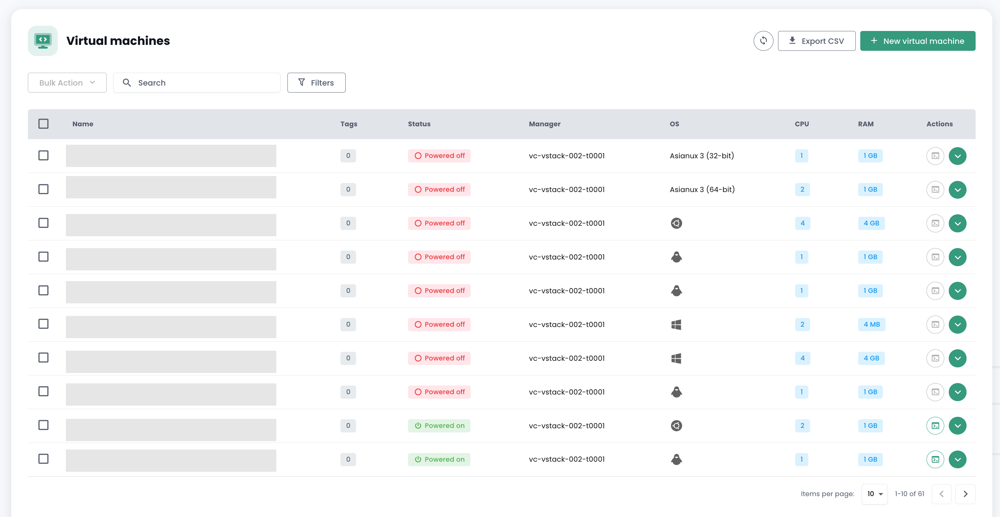
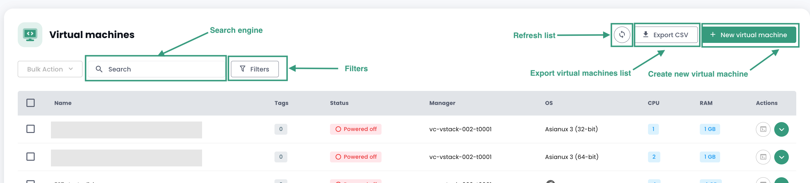
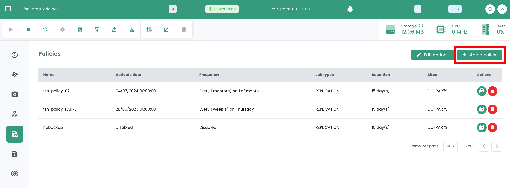

## Compute

### Managing Virtual Machines

The interface for managing your virtual machines is available in the Shiva console in the __'IaaS'__ menu located on the green bar on the left side of the screen.

### List of Virtual Machines

In the __'Virtual Machines'__ section, you have access to the list of your virtual machines hosted on your trusted Cloud.

You have access to the following information for each virtual machine:

- its name,
- the tags assigned to it,
- its status (off, on, in process, host disconnected, or invalid),
- its manager (in VMware environment, the associated Vcenter),
- its operating system,
- the amount of virtual CPUs (vCPU),
- the amount of virtual memory (vRAM).

### Actions on Virtual Machines

The following actions are possible from this interface:

- Refresh the list of virtual machines;
- Export the list in CSV format;
- Filter the list;
- Search for a virtual machine by its name;
- Create a new virtual machine.

__An alert banner may be present at the top of the list__: it indicates that critical alarms have been triggered on one or more of your virtual machines.
The __'View'__ button allows you to check the virtual machines concerned by this notification.

When you click on the green drop-down arrow on the right of the list for a virtual machine:

You access all the information concerning it:

A quick banner allows you to perform the following actions:

- Power on the virtual machine;
- Power it off;
- Restart it;
- Modify the guest OS power options;
- Open the console;
- Mount an ISO;
- Unmount an ISO;
- Clone the virtual machine;
- Move it (vMotion);
- Rename it;
- Delete it.

A quick view offers a visualization of the virtual machine's __storage__, __CPU__, and __RAM__.

In the __'General Information'__ tab, you will find detailed information related to your virtual machine, such as its OS, its physical location (datacenter, datastore, etc.), RAM, CPU, IP addresses, logs, and others.

From this view, you can perform the following actions:

- Modify the operating system (the virtual machine must be turned off),
- Upgrade hardware version (the virtual machine must be turned off),
- Modify RAM or CPU.

An __'Advanced'__ tab allows you to view more specific information such as "VMware Tools" info, hardware version, manager, etc...

### Modifying a Virtual Machine's Disk Controller

You can modify the disk controller type for your virtual machine. Supported types are __SCSI__ and __NVME__. You can add controllers with a maximum of 4 controllers of each type.

### Virtual Machine Console

The console of a virtual machine is accessible from the list of virtual machines by clicking on the __'Console'__ icon:

A new tab of your browser opens displaying the console of your machine, based on a VNC client:

In the VNC menu, it is possible to:

- request the sending of special keys,
- perform copy/paste operations from your OS clipboard,
- switch to full-screen mode,
- change the window size (scaling).

Keyboard management with the virtual machine console works perfectly in a fully *English* environment.

The input in the console depends on the keyboard language of your physical machine, the keyboard language of the virtual machine, and whether the 'enforce keyboard' option is enabled on the left side of the screen.
Here is a summary of possible situations with the French language:

| Physical machine keyboard language (input) | Virtual machine keyboard language | 'enforce keyboard' option selected | Result (output)                                   |
| ----------------------------------------- | --------------------------------- | --------------------------------- | ------------------------------------------------- |
| French                                    | French                            | No                                | Not recommended (issues with special characters)  |
| French                                    | French                            | Yes                               | < and > do not work                               |
| French                                    | English                           | No                                | Not recommended (issues with special characters)  |
| French                                    | English                           | Yes                               | English                                           |
| English                                   | French                            | No                                | < and > do not work                               |
| English                                   | French                            | Yes                               | < and > do not work                               |
| English                                   | English                           | No                                | English                                           |
| English                                   | English                           | Yes                               | English                                           |

__Note__:

- If the __'AltGr'__ and __'@'__ combination on the keyboard does not work, activate the __'enforce key'__ button in the console's __'VNC'__ menu and try again.
- If it still does not work and the OS of the physical machine is __Windows, put the physical machine's keyboard in English and try to enter the @ in the usual way__ *(azerty layout: AltGr + 0 key or qwerty layout: 2 key)*.

### Cloud Temple Virtual Machine Catalogs

Cloud Temple provides you with a catalog of `Templates` regularly enriched and updated by our teams.
To date, it includes several dozen `Templates` and images to mount on your virtual machines.

### Advanced Virtual Machine Configuration: Extra Config

Extra Config provides a flexible way to include key=value pairs in a virtual machine's configuration. The keys and values are interpreted by the system when the virtual machine is deployed.

You can now modify __Extra Config__ properties yourself in the advanced options of a virtual machine:

You can add a property from a list of keys. You can also modify the value of a key that you have added yourself. Already existing key=value pairs cannot be modified.

Please contact support for any requests to add new keys.

__Note__: *For the use of GPU by the virtual machine, it is mandatory to enable the key 'pciPassthru.use64bitMMIO' and allocate the required amount of MMIO (Memory-mapped I/O) space via 'pciPassthru.64bitMMIOSizeGB'. It is highly recommended to refer to the [official Nvidia documentation](https://docs.nvidia.com/vgpu/17.0/grid-vgpu-release-notes-vmware-vsphere/index.html#tesla-p40-large-memory-vms).*

### Advanced Virtual Machine Configuration: vAPP

You can also modify __vAPP__ properties in the advanced options of a virtual machine:

You can add a property, modify it, or delete it. Four types of properties are provided, String, Number, Boolean, Password:

__Note__: *The virtual machine must be stopped to modify its vAPP properties.*

### Managing __'hypervisors'__ and __'Cpool'__ (hypervisor clusters)

Managing your hypervisors is done in the __'Compute'__ submenu of the __'IaaS'__ menu, located on the green bar on the left side of your screen.

In this submenu, you have a view of:

- The hypervisors' software stack, their AZ, and their resources,
- The backup software stack.

As of January 2024, the hypervisor offering available on the Cloud Temple qualified infrastructure is based on VMware. The backup software used is IBM Spectrum Protect Plus.

### Managing VMware Clusters

To access VMware cluster management, click in the __'Compute'__ submenu of the __'IaaS'__ menu:

By default, the first tab lists all hypervisors (all clusters combined):

It is possible to view the details of a hypervisor by clicking on its name:

There is a tab for each hypervisor cluster to view the details of each:

If you click on a cluster, you see the summary of its composition:

- The total computing power expressed in GHz,
- The total available memory and the used ratio,

- The total storage space (all types combined) and the used share,
- Automation mechanisms in case of a computing blade unavailability (__'Vsphere DRS'__),
- The number of virtual machines,
- The number of hypervisors.

<!-- TODO: Add missing page. -->
<!-- When consulting the page of a cluster, several tabs are available. The __'Rules'__ tab allows you to define the [affinity / anti-affinity rules](compute.md#gestion-de-laffinité-de-vos-machines-virtuelles) -->

You will see for each hypervisor in the __'Hosts'__ tab:

- __CPU__ and __Memory__ usage,
- The number of assigned virtual machines,
- Availability of a new build for the hypervisor's operating system if applicable,
- The status of the hypervisor (connected in production, in maintenance, off, ...),
- An action menu.

Several actions are possible from the __'Hosts'__ tab:

- order new hypervisors via the __'Add a host'__ button:

- possibility to consult __the details of a hypervisor__:

- to enter or exit the __maintenance mode__ of a hypervisor,
- to __update__ this hypervisor if necessary; to do this, __it must be in maintenance__. There are two types of updates:

1. VMware builds (new versions of the hypervisor):

2. Firmware update for your computing blade (bios and firmware daughter cards):

*__Note__* :

- *Cloud Temple provides builds for hypervisors at regular intervals.
It is important to regularly update your hypervisors, in particular to allow the application of security patches.
However, __we do not update your hypervisors ourselves__. Cloud Temple does not have visibility on your workloads' availability commitments.
We therefore leave it up to you to implement your change management and apply the new builds at the best time.*
- *The update process is fully automated. You must have at least two hypervisors in your cluster to allow an update without service interruption.*

<!-- TODO: Add missing page. -->
<!-- - *It is necessary to have [the appropriate permissions](../console/permissions.md) to perform the various actions.* -->

You will also see all affinity/anti-affinity rules for your hypervisor cluster in the __'Rules'__ section.

### Managing the affinity of your virtual machines

The __affinity and anti-affinity rules__ allow you to control the placement of virtual machines on your hypervisors.
They can be used to manage the resource usage of your __'Cpool'__.
For example, they can help balance the workload between servers or isolate resource-hungry workloads.
In a VMware __'Cpool'__, these rules are often used to manage the behavior of virtual machines with vMotion.
vMotion allows you to move virtual machines from one host to another without service interruption.

You can configure the rules management feature :

- __Affinity Rules__: These rules ensure that certain virtual machines are run on the same physical host.
They are used to improve performances by keeping virtual machines that communicate frequently
together on the same server to reduce network latency. Affinity rules are useful in scenarios
where performance is critical, such as for databases or applications that require quick communication between servers.

- __Anti-affinity Rules__: Conversely, these rules ensure that certain virtual machines are not run on the same physical host.
They are important for availability and resilience, for example,
to prevent all critical machines from being affected in the event of a single server failure.
Anti-affinity rules are crucial for applications requiring high availability,
such as in production environments where fault tolerance is a priority.
For example, you do not want your two Active Directories on the same hypervisor.

When creating a rule, you define the type of rule (affinity / anti-affinity), the rule name,
its activation state (__'Status'__), and the machines concerned in your hypervisor cluster.

*Note: the affinity/anti-affinity rules offered in the console are rules concerning virtual machines between themselves (no rules between hypervisors and virtual machines).*

## Backup

### Create a backup policy

To add a new backup policy, you must make a request with support. Support is accessible from the buoy icon at the top right of the window.

Creating a new backup policy is performed via __a service request__ indicating:

    The name of your Organization
    The name of a contact with their email and phone number to finalize the configuration
    The tenant name
    The backup policy name
    The characteristics (x days, y weeks, z months, ...)

### Assign a backup policy to a virtual machine

When an SLA is assigned to a virtual machine (VM), all disks associated with this VM automatically inherit the same SLA. Subsequently, it is possible to manually start the execution of the backup via the "Backup Policies" tab. Failing a manual start, the backup will run automatically according to the schedule configured by the SLA.

SecNumCloud makes it mandatory to assign a backup policy to a virtual machine before it starts. Otherwise, you will receive the following notification:

Click on the __'Backup Policies'__ tab in your virtual machine's menu. You can view the backup policies assigned to it there.

To assign a new backup policy to the virtual machine, click the __'Add a policy'__ button and select the desired backup policy.

### Assign a backup policy to a virtual disk

It is also possible to assign an SLA directly to a specific virtual disk of a machine. In this case, the virtual machine does not inherit this SLA applied individually to the disk. However, it is not possible to manually start the backup execution at the disk level, as this feature is not supported in Spectrum Protect Plus.

However, it is possible to exclude certain disks from one or more backup policies (SLA) of the VM, which allows for the unassignment of one or more SLA(s) on a disk-by-disk basis. This approach provides the flexibility to manually start the backup execution of an SLA without affecting all disks of the virtual machine, allowing for finer management of backups.

Click on the action bar of the disk to which you want to assign a backup policy. Then, click __'Policies'__ and select the desired backup policy.

*Note*: The policy to be added must be on a different availability zone than the virtual machine.

### Execute a backup policy

In the __'Backup Policies'__ menu of your virtual machine, click the __'Execute'__ button in the __'Actions'__ column of the backup policy you want to execute.

To execute a backup policy, you can also go to the __'Backups'__ section in your virtual machine's menu. Click the __'Run backup'__ button, then select the backup you want to execute from the dropdown list.

### Remove a backup policy

In the __'Backup Policies'__ menu of your virtual machine, click the __'Remove'__ button in the __'Actions'__ column of the backup policy you want to remove.

__Attention, it is not possible to remove the last SLA on a running virtual machine:__

### Deleting a backup policy: case of a suspended backup policy ("held")

When the last resource is disassociated from an SLA policy, the system automatically detects this situation. Consequently, all jobs related to this SLA policy automatically switch to the "Held" state. It is important to note that at this point, direct deletion of the SLA policy is not possible due to the existence of dependent jobs. To proceed with the deletion of the policy, a series of steps must be followed.

You must verify that the concerned jobs are indeed in the "Held" state. Once this verification is done, these jobs can be deleted. Only after deleting these dependent jobs can the SLA policy be permanently erased from the system.
Un cas particulier mérite une attention spécifique : l'ajout d'une nouvelle ressource à une politique SLA dont les travaux dépendants n'ont pas été supprimés. Dans cette situation, les identifiants des travaux seront conservés. Cependant, il est crucial de noter que les travaux en état "Suspendu" ne reprendront pas automatiquement. Une intervention manuelle sera nécessaire pour les réactiver et permettre leur exécution.

note: For any clarification on this situation, contact Cloud Temple support.

The Cloud Temple console prevents the assignment of a virtual machine to a suspended policy:

Likewise, it is not possible to start a virtual machine that is associated with a suspended backup policy:

### Restore a backup

The __'Backups'__ tab in the menu of your virtual machines allows you to access the list of backups for it.
To restore a backup, click on the __'Restore'__ button on the line corresponding to the backup you wish to restore.

1. __Production mode__: Production mode allows disaster recovery on the local site from primary storage or a remote disaster recovery site, replacing original machine images with recovery images. All configurations are transferred as part of the recovery, including names and identifiers, and all data copy operations associated with the virtual machine continue to run. As part of a production mode restore, you can choose to replace the storage in the virtual machine with a virtual disk from a previous virtual machine backup.

2. __Test mode__: Test mode creates temporary virtual machines for development, testing, snapshot verification, and disaster recovery verification based on a repeatable schedule, without impacting production environments. Test machines run for as long as necessary to perform the test and verification, then they are cleaned up. Through isolated networking, you can establish a safe environment to test your operations without interfering with the virtual machines used for production. Virtual machines created in test mode have unique names and identifiers to avoid any conflict in your production environment.

3. __Clone mode__: Clone mode creates copies of virtual machines for use cases requiring permanent or long-running copies for data exploration or duplicating a test environment on an isolated network. Virtual machines created in clone mode have unique names and identifiers to avoid any conflict in your production environment. In clone mode, you need to be mindful of resource consumption since clone mode creates permanent or long-term machines.

__The default restoration mode is "TEST" to preserve production__ and you can choose the name of the restored VM:

Note that if the tests are satisfactory, you can switch a virtual machine from test mode to production mode:

