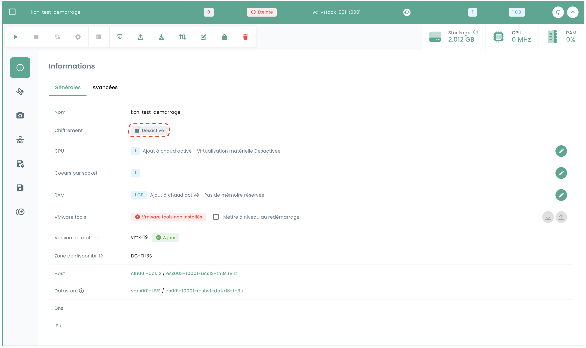

These tutorials help you use and configure the VMWare IaaS part from the Console portal.

## Encrypt a VMWare virtual machine

## Prerequisites

1. **Key Provider (HSM/KMS)**:
   - A key provider must be configured on the vStack. (If no key provider is configured, please contact support service through a ticket.)
   - Ensure that the key provider is properly enabled.

2. **Virtual machine state**:
   - The virtual machine must be turned off.
   - The virtual machine must not be in 'test' spp mode.
   - The virtual machine must not be already encrypted.

## Interface

Once logged into the Console web portal, from the __'IaaS'__ menu, sub-menu __'Configuration'__ then the __'vCenters'__ tab, you will find the information indicating whether encryption is enabled on the vstack in question.

Then go to the __'Virtual Machines'__ sub-menu and select the machine you want to encrypt.

In the general information of the virtual machine, you will find the information indicating whether the machine is already encrypted or not.

If the virtual machine meets the prerequisites, you can continue the procedure by clicking the button with a padlock logo in the toolbar indicating __'Encrypt the virtual machine'__.

A confirmation window will appear, select Encrypt.

Once the action is completed, you should see the information that has changed and which indicates that your machine is encrypted.

