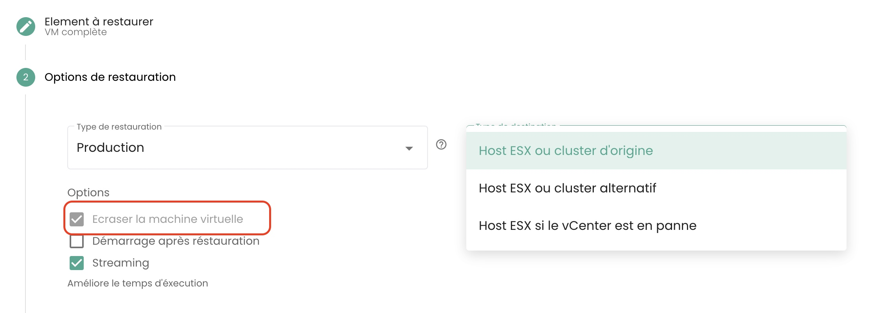

## How to clone a virtual machine?

There are 2 ways to clone a virtual machine:

- The first option allows you to clone a virtual machine directly from the __'Clone'__ icon of your virtual machine:

- The second solution is to clone the virtual machine using __a backup__ of the virtual machine and then using __the clone restore__ from a backup.
Go to the __'Backup'__ section of your virtual machine and choose the action __'Restore'__:

Then choose the __'Clone'__ restore option:

## Why when I go to the "backup policies" page and select a policy, I don't see the same virtual machines as when I go to "backup report" and select the same policy?

This means that the missing virtual machines had the policy in question assigned to them for
some time (explaining their presence on the backup reports) but __this is no longer the case currently__.

## How to add a backup policy to a virtual machine?

Go to the __'Virtual Machines'__ page in the __'IaaS'__ section of the green menu bar on the left side of the screen.

Select a virtual machine then the __'Backup Policies'__ tab of that machine:

Add the desired backup policy:

## How to remove a backup policy from a virtual machine?

Go to the __'Virtual Machines'__ page, select a virtual machine then the __'Backup Policies'__ tab of that machine.

Remove the desired backup policy and confirm the deletion:

__*Note:*__ *Warning! __Secnumcloud requires that there is at least one backup policy__ for each virtual machine.*

## How to check if a backup was successfully executed?

There are 2 possible solutions:

1. Go to the __'Jobs'__ page in the __'Backup'__ menu in the green bar on the left of your screen. Choose the job corresponding to the backup and select it.
Then, find the *jobsession* corresponding to your backup, select it through the __'Actions'__ menu.

These actions allow you to get the detailed logs of the backup execution. You can search in the backup logs:

2. Go to the __'Backup Reports'__ page and select the policy that interests you:

You can then filter by date, download the report in __PDF__ or __CSV__ format to use it in third-party tools.

## How to start a restore?

Go to the __'Virtual Machines'__ page, select a virtual machine then the __'Backups'__ tab of that machine. To start the restore, select the backup to restore.

## What is the quiescing option?

The __quiescing__ is a process of alerting the system to put itself in an appropriate state before the snapshot begins.
By default, the __quiescing is enabled__. It can be manually disabled if the system handles the snapshot poorly or if the hypervisor agent is not installed on the virtual machine.

To do this, in the __'Backups'__ section of your virtual machine, click on __'Edit options'__ and disable __quiescing__:

## What are the restore options for a virtual machine?

3 main options to restore a vm, on its original target or on a different target:

- __'CLONE'__: Restores the virtual machine by renaming it, without replacing the original virtual machine.

- __'PRODUCTION'__: Restores and __replaces__ the production virtual machine (the currently production virtual machine is __destroyed__)

- __'TEST'__: Restores the production virtual machine __without overwriting__ it.

You will find more details in [the backup documentation](../../../iaas/backup.md).

## How to restore and replace the production virtual machine, without keeping the current production virtual machine?

Choose the __'Production'__ restore mode. The 'overwrite virtual machine' option is by default.

## Why is the number of virtual machines different between the backup and compute modules?

The difference in virtual machines may be because the backup module did not retrieve the latest created virtual machines.

To update the backup module, you must ask the backup software layer to re-inventory the virtual machines.
To do this, in the __'Infrastructure'__ menu on the green bar on the left of the screen, navigate to the __'Spectrum Protect Plus'__ submenu and use the inventory __'Action'__ button:

Note that you have the date of the last inventory indicated.

If a virtual machine difference persists, it could be because the virtual machines hosting the system allowing
the backups do not count themselves in the calculation of the number of machines on the backup module.

## How to inventory virtual machines on the backup module?

To launch an inventory of virtual machines on the backup module, in the __'Infrastructure'__ menu on the green bar on the left of the screen, navigate to the __'Spectrum Protect Plus'__ submenu and use the inventory __'Action'__ button:

Note that you have the date of the last inventory indicated.

## Why does the backup of my virtual machine fail indicating a snapshot issue?

This error means that it is the first time your machine is trying to be backed up.

__During the first backup of a virtual machine, no snapshot should be present on the machine.__

## How to restore and replace the production virtual machine, keeping and renaming the current production virtual machine?

Here’s how to proceed:

- Choose the __'CLONE'__ mode (the clone mode causes a change in the MAC address and UUID of the virtual machine),
- Rename the restored virtual machine to the final name (of the production vm),
- Rename the old production virtual machine (as _OLD).

## How to restore a virtual machine without replacing the original virtual machine?

Here’s how to proceed:

- Choose the __'CLONE'__ mode (the clone mode causes a change in the MAC address and UUID of the virtual machine)
- Define the name of the clone (_REST or others)

## Why can't I delete a disk in instant access mode on my virtual machine?

Run the backup inventory: in the __'Infrastructure'__ menu on the green bar on the left of the screen, navigate
to the __'Spectrum Protect Plus'__ submenu and use the inventory __'Action'__ button:

Perform the deletion of the disk once the inventory is finished. Refresh the virtual machine to verify that the disk has been deleted.

## Why can't I start a virtual machine with a policy in Held status (suspended policy)?

A policy in "Held" status is a feature that temporarily suspends retention and data deletion actions, thus ensuring that data remains intact and available beyond its standard retention period for specific reasons such as compliance or legal needs.

Suppose a company has a backup retention policy of 30 days for certain production data. Due to a legal investigation, they receive a request to preserve all relevant backups indefinitely. You have the option to suspend the associated backup policy via the "Held" status to prevent the automatic deletion of these backups after 30 days, thereby ensuring that the data remains available for the entire duration of the investigation.

A suspended backup policy (in Held status) will not execute the backups of its assigned schedule, so the virtual machine cannot be considered protected, which does not comply with SecNumCloud standards.

Do not hesitate to ask our support team for advice on this subject.