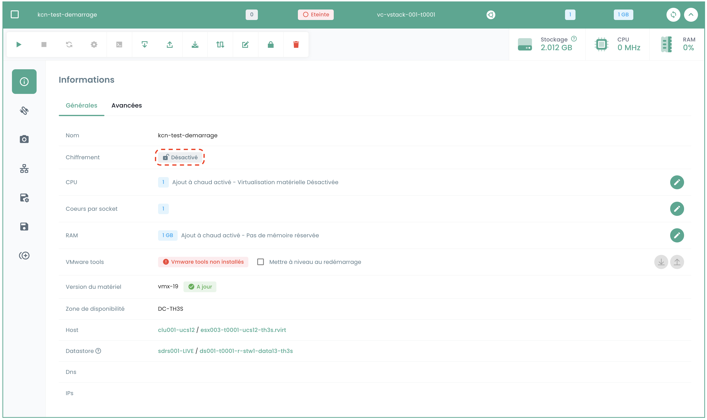

This tutorial helps you encrypt an IaaS VMware virtual machine from the Shiva portal.

### Prerequisites

1. **Key Provider (HSM/KMS)**:
   - A key provider must be configured on the vStack. (If no key provider is configured, please contact the support service through a ticket.)
   - Ensure that the key provider is properly activated.

2. **Virtual Machine State**:
   - The virtual machine must be powered off.
   - The virtual machine must not be in spp 'test' mode.
   - The virtual machine must not already be encrypted.
   - The virtual machine must not have any snapshots.
   - The virtual machine must not be replicated.

### Interface

Once connected to the Shiva web portal, from the __'IaaS'__ menu, __'Configuration'__ sub-menu, then the __'vCenters'__ tab, you will find information indicating whether encryption is enabled on the vstack in question.

Then go to the __'Virtual Machines'__ sub-menu and select the machine you want to encrypt.

In the general information of the virtual machine, you will find information indicating whether the machine is already encrypted or not.

If the virtual machine meets the prerequisites, you can continue the procedure by clicking on the button with a padlock logo in the toolbar indicating __'Encrypt the virtual machine'__.

A confirmation window will appear, select Encrypt.

Once the action is complete, you should see the information that has changed and indicates that your machine is encrypted.

