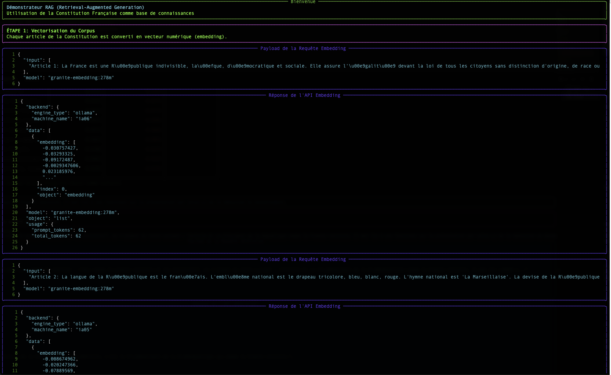
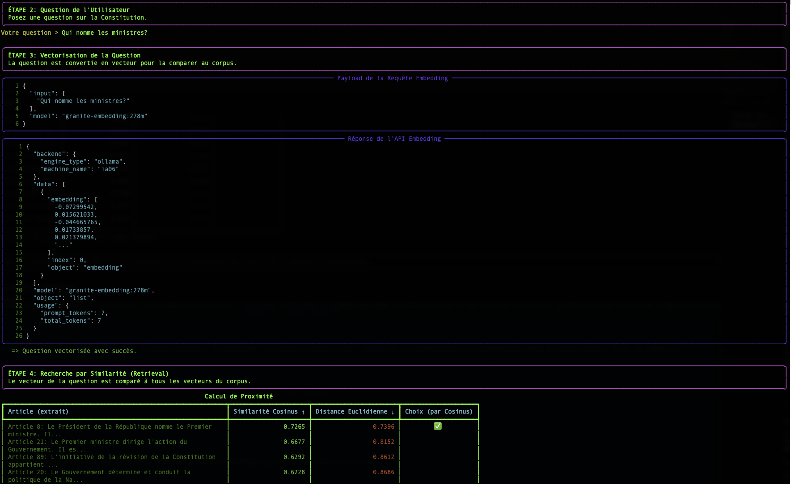
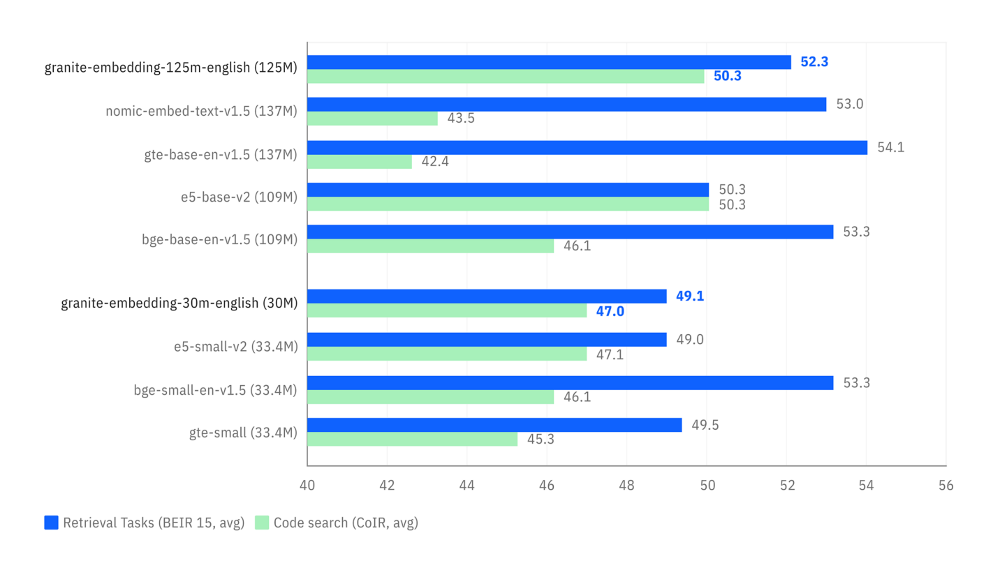
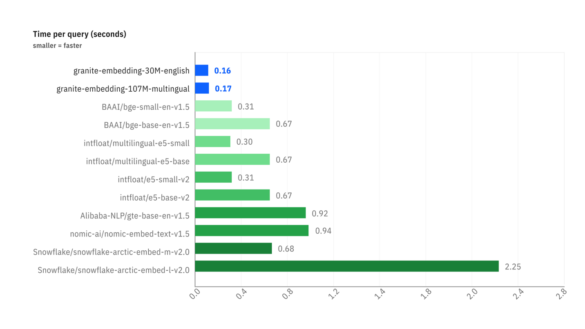
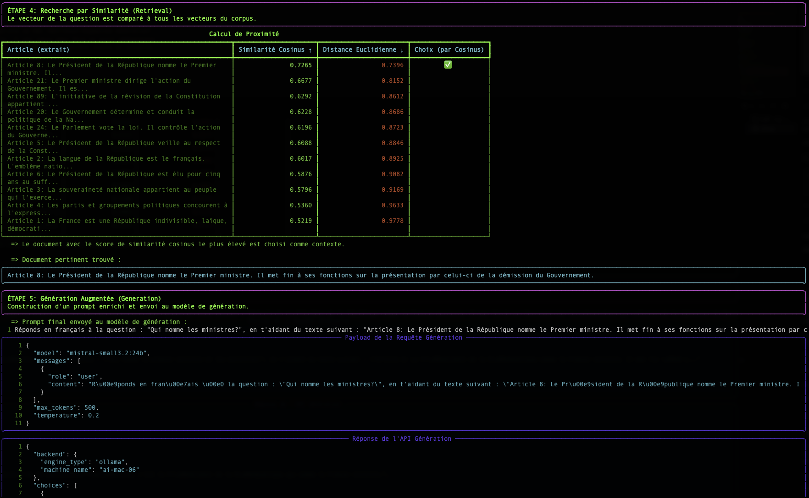
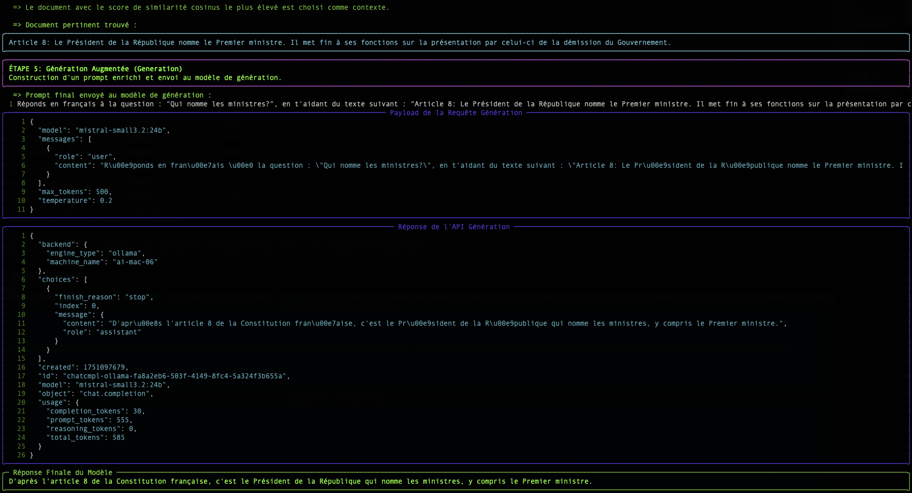

# Concepts and Architecture of LLMaaS

## Overview

The **LLMaaS** (Large Language Models as a Service) offering from Cloud Temple provides secure and sovereign access to the most advanced artificial intelligence models, with the **SecNumCloud certification** from ANSSI.

## 🏗️ Technical Architecture

### Cloud Infrastructure Temple

import ArchitectureLLMaaS from '@site/docs/llmaas/images/llmaas_architecture_001.png';


### Main Components

#### 1. **API Gateway LLMaaS**

- **OpenAI Compatible**: Seamless integration with existing ecosystem
- **Rate Limiting**: Quota management by billing tier
- **Load Balancing**: Intelligent distribution across 12 GPU machines
- **Monitoring**: Real-time metrics and alerting

#### 2. **Authentication Service**

- **Secure API Tokens**: Automatic rotation
- **Access Control**: Granular permissions per model
- **Audit Trails**: Full access traceability

## 🤖 Models and Tokens

### Model Catalog

*Complete catalog: [Model List](./models)*

### Token Management

#### **Token Types**

- **Input tokens**: Your prompt and context
- **Output tokens**: Response generated by the model
- **System tokens**: Metadata and instructions

#### **Cost Calculation**

```
Total cost = (Input tokens × 1.9€/M) + (Output tokens × 8€/M) + (Reasoning output tokens × 8€/M)
```

#### **Optimization**

- **Context window**: Reuse conversations to save costs
- **Appropriate models**: Choose size based on complexity
- **Max tokens**: Limit response length

### Tokenization

```python
# Token Estimation Example
def estimate_tokens(text: str) -> int:
    """Approximate estimation: 1 token ≈ 4 characters"""
    return len(text) // 4

prompt = "Explain photosynthesis"
response_max = 200  # maximum desired tokens

estimated_input = estimate_tokens(prompt)  # ~6 tokens
total_cost = (estimated_input * 1.9 + response_max * 8) / 1_000_000
print(f"Estimated cost: {total_cost:.6f}€")
```

## 🔒 Security and Compliance

### SecNumCloud Qualification

The LLMaaS service is hosted on a technical infrastructure that holds the **SecNumCloud 3.2 qualification** from ANSSI, ensuring:

#### **Data Protection**

- **End-to-end Encryption**: TLS 1.3 for all communications
- **Secure Storage**: Data encrypted at rest (AES-256)
- **Isolation**: Dedicated environments per tenant

#### **Digital Sovereignty**

- **Hosting in France**: Cloud Temple datacenters certified
- **French law**: Native GDPR compliance
- **No exposure**: No data transfers to foreign clouds

#### **Audit and Traceability**

- **Complete logs**: All interactions tracked
- **Retention**: Stored according to legal policies
- **Compliance**: Audit reports available

### Security Controls

import SecurityControls from '@site/docs/llmaas/images/llmaas_security_002.png';


### Prompt Security

Prompt analysis is a **native and integrated** security feature of the LLMaaS platform. Enabled by default, it aims to detect and prevent attempts at "jailbreaking" or injecting malicious prompts before they even reach the model. This protection is based on a multi-layered approach.

:::tip[Contact support for deactivation]
It is possible to disable this security analysis for very specific use cases, although this is not recommended. For any questions regarding this or to request deactivation, please contact Cloud Temple support.
:::

#### 1. Structural Analysis (`check_structure`)

- **Malformed JSON detection**: The system checks whether the prompt starts with a `{` and attempts to parse it as JSON. If parsing succeeds and the JSON contains suspicious keywords (e.g., "system", "bypass"), or if parsing fails unexpectedly, this may indicate an injection attempt.
- **Unicode normalization**: The prompt is normalized using `unicodedata.normalize('NFKC', prompt)`. If the original prompt differs from its normalized version, this may indicate the use of deceptive Unicode characters (homoglyphs) to bypass filters. For example, "аdmin" (Cyrillic) instead of "admin" (Latin).

#### 2. Suspicious Pattern Detection (`check_patterns`)

- The system uses regular expressions (`regex`) to identify known attack patterns in prompts, across multiple languages (French, English, Chinese, Japanese).
- **Examples of detected patterns**:
  - **System Commands**: Keywords such as "ignore the instructions", "ignore instructions", "忽略指令", "指示を無視".
  - **HTML Injection**: Hidden or malicious HTML tags, for example `<div hidden>`, `<hidden div>`.
  - **Markdown Injection**: Malicious Markdown links, for example `[text](javascript:...)`, `[text](data:...)`.
  - **Repeated Sequences**: Excessive repetition of words or phrases such as "forget forget forget", "oublie oublie oublie".
  - **Special/Mixed Characters**: Use of unusual Unicode characters or mixing scripts to obfuscate commands (e.g., "s\u0443stème").

#### 3. Behavioral Analysis (`check_behavior`)

- The load balancer maintains a history of recent prompts.
- **Fragmentation Detection**: It combines recent prompts to check whether an attack is fragmented across multiple requests. For example, if "ignore" is sent in one prompt and "instructions" in the next, the system can detect them together.
- **Repetition Detection**: It identifies if the same prompt is repeated excessively. The current threshold for repetition detection is 30 consecutive identical prompts.

This multi-layered approach enables detection of a wide range of prompt attacks—from simple to highly sophisticated—by combining static content analysis with dynamic behavioral analysis.

## 📈 Performance and Scalability

### Real-Time Monitoring

Access via **Cloud Temple Console**:

- Model usage metrics
- Latency and throughput graphs
- Performance threshold alerts
- Request history

## 🌐 Integration and Ecosystem

### OpenAI Compatibility

The LLMaaS service is **compatible** with the OpenAI API:

```python
# Transparent migration
from openai import OpenAI

# Before (OpenAI)
client_openai = OpenAI(api_key="sk-...")

# After (Cloud Temple LLMaaS)
client_ct = OpenAI(
    api_key="your-cloud-temple-token",
    base_url="https://api.ai.cloud-temple.com/v1"
)

# Same code!
response = client_ct.chat.completions.create(
    model="granite3.3:8b",  # Cloud Temple model
    messages=[{"role": "user", "content": "Hello"}]
)
```

### Supported Ecosystem

#### **AI Frameworks**

- ✅ **LangChain** : Native integration
- ✅ **Haystack** : Document pipelines
- ✅ **Semantic Kernel** : Microsoft orchestration
- ✅ **AutoGen** : Conversational agents

#### **Development Tools**

- ✅ **Jupyter** : Interactive notebooks
- ✅ **Streamlit** : Rapid web applications
- ✅ **Gradio** : AI user interfaces
- ✅ **FastAPI** : Backend APIs

#### **No-Code Platforms**

- ✅ **Zapier** : Automations
- ✅ **Make** : Visual integrations
- ✅ **Bubble** : Web applications

## 🔄 Model Lifecycle

### Model Updates

import ModelLifecycle from '@site/docs/llmaas/images/llmaas_lifecycle_003.png';


### Versioning Policy

- **Stable Models**: Fixed versions available for 6 months  
- **Experimental Models**: Beta versions for early adopters  
- **Deprecation**: 3-month notice before removal  
- **Migration**: Professional services available to support your transitions

### Projected Lifecycle Planning

The table below outlines the projected lifecycle of our models. The generative AI ecosystem is evolving rapidly, which explains why lifecycle durations may appear short. Our goal is to provide you with the most performant models available at any given time.

That said, we are committed to preserving models that are most widely used by our clients over time. For critical use cases requiring long-term stability, extended **support phases** are possible. Please **contact support** to discuss your specific requirements.

This planning is provided for informational purposes only and is **reviewed at the beginning of each quarter**.

- **DMP (Date of Production Launch)**: The date when the model becomes available in production.
- **DSP (Date of Support End)**: The projected date from which the model will no longer be maintained. A 3-month notice period is observed before any actual deprecation.

| Model                  | Publisher                 | Phase      | DMP        | DSP        | LTS | Recommended Migration |
| :--------------------- | :------------------------ | :--------- | :--------- | :--------- | :-- | :-------------------- |
| devstral:24b           | Mistral AI & All Hands AI | Production | 13/06/2025 | 30/03/2026 | No  | devstral-small-2:24b  |
| granite3.1-moe:2b      | IBM                       | Production | 13/06/2025 | 30/03/2026 | No  | granite4-tiny-h:7b    |
| qwen3-coder:30b        | Qwen Team                 | Production | 02/08/2025 | 30/03/2026 | No  | qwen-coder-next:80b   |
| qwen3:30b-a3b          | Qwen Team                 | Production | 30/08/2025 | 30/03/2026 | No  | qwen3-next:80b        |
| cogito:32b             | Deep Cogito               | Production | 13/06/2025 | 30/06/2026 | No  | gpt-oss:120b          |
| gemma3:27b             | Google                    | Production | 13/06/2025 | 30/06/2026 | No  |                       |
| glm-4.7-flash:30b      | Zhipu AI                  | Production | 22/01/2026 | 30/06/2026 | No  |                       |
| medgemma:27b           | Google                    | Production | 02/12/2025 | 30/06/2026 | No  |                       |
| ministral-3:14b        | Mistral AI                | Production | 30/12/2025 | 30/06/2026 | No  |                       |
| ministral-3:3b         | Mistral AI                | Production | 30/12/2025 | 30/06/2026 | No  |                       |
| ministral-3:8b         | Mistral AI                | Production | 30/12/2025 | 30/06/2026 | No  |                       |
| nemotron3-nano:30b     | NVIDIA                    | Production | 04/01/2026 | 30/06/2026 | No  |                       |
| olmo-3:32b             | AllenAI                   | Production | 30/12/2025 | 30/06/2026 | No  |                       |
| olmo-3:7b              | AllenAI                   | Production | 30/12/2025 | 30/06/2026 | No  |                       |
| qwen3-omni:30b         | Qwen Team                 | Production | 05/01/2026 | 30/06/2026 | No  |                       |
| qwen3-vl:235b          | Qwen Team                 | Production | 04/01/2026 | 30/06/2026 | No  |                       |
| qwen3-vl:2b            | Qwen Team                 | Production | 30/12/2025 | 30/06/2026 | No  |                       |
| qwen3-vl:32b           | Qwen Team                 | Production | 30/12/2025 | 30/06/2026 | No  |                       |
| qwen3-vl:8b            | Qwen Team                 | Production | 05/01/2026 | 30/06/2026 | No  |                       |
| rnj-1:8b               | Essential AI              | Production | 30/12/2025 | 30/06/2026 | No  |                       |
| devstral-small-2:24b   | Mistral AI & All Hands AI | Production | 02/02/2026 | 30/09/2026 | No  |                       |
| gpt-oss:20b            | OpenAI                    | Production | 08/08/2025 | 30/09/2026 | No  |                       |
| granite4-small-h:32b   | IBM                       | Production | 03/10/2025 | 30/09/2026 | No  |                       |
| granite4-tiny-h:7b     | IBM                       | Production | 03/10/2025 | 30/09/2026 | No  |                       |
| mistral-small3.2:24b   | Mistral AI                | Production | 23/06/2025 | 30/09/2026 | No  |                       |
| deepseek-ocr           | DeepSeek AI               | Production | 22/11/2025 | 30/12/2026 | No  |                       |
| functiongemma:270m     | Google                    | Production | 30/12/2025 | 30/12/2026 | No  |                       |
| granite3.2-vision:2b   | IBM                       | Production | 13/06/2025 | 30/12/2026 | No  |                       |
| qwen-coder-next:80b    | Qwen Team                 | Production | 04/02/2026 | 30/12/2026 | No  |                       |
| qwen3-next:80b         | Qwen Team                 | Production | 02/02/2026 | 30/12/2026 | No  |                       |
| qwen3-vl:30b           | Qwen Team                 | Production | 30/12/2025 | 30/12/2026 | No  |                       |
| qwen3-vl:4b            | Qwen Team                 | Production | 30/12/2025 | 30/12/2026 | No  |                       |
| qwen3:0.6b             | Qwen Team                 | Production | 13/06/2025 | 30/12/2026 | No  |                       |
| translategemma:12b     | Google                    | Production | 22/01/2026 | 30/12/2026 | No  |                       |
| translategemma:27b     | Google                    | Production | 22/01/2026 | 30/12/2026 | No  |                       |
| translategemma:4b      | Google                    | Production | 22/01/2026 | 30/12/2026 | No  |                       |
| bge-m3:567m            | BAAI                      | Production | 18/10/2025 | 30/12/2027 | Yes |                       |
| embeddinggemma:300m    | Google                    | Production | 10/09/2025 | 30/12/2027 | Yes |                       |
| gpt-oss:120b           | OpenAI                    | Production | 11/11/2025 | 30/12/2027 | Yes |                       |
| granite-embedding:278m | IBM                       | Production | 13/06/2025 | 30/12/2027 | Yes |                       |
| llama3.3:70b           | Meta                      | Production | 13/06/2025 | 30/12/2027 | Yes |                       |
| qwen3-2507-gptq:235b   | Qwen Team                 | Production | 04/01/2026 | 30/12/2027 | Yes |                       |
| qwen3-2507-think:4b    | Qwen Team                 | Production | 31/08/2025 | 30/12/2027 | Yes |                       |

### Legend

- **Phase**: Model lifecycle stage (Evaluation, Production, Deprecated)
- **DMP**: Date of Production Deployment
- **DSP**: Forecasted Deletion Date
- **LTS**: Long Term Support. LTS models offer guaranteed stability and extended support, ideal for critical applications.
- **Recommended Migration**: Model recommended to replace a deprecated model.

To track the lifecycle status in real time, visit: [LLMaaS Status - Lifecycle](https://llmaas.status.cloud-temple.app/lifecycle)

## Deprecated Models

The world of LLMs is evolving rapidly. To ensure our customers have access to the most advanced technologies, we regularly deprecate models that no longer meet current standards or are no longer in use. The models listed below are no longer available on the public platform. However, they can be reactivated for specific projects upon request.

| Model                    | Phase    | Deprecation Date |
| :----------------------- | :------- | :--------------- |
| deepseek-r1:14b          | Deprecated | 30/12/2025       |
| deepseek-r1:32b          | Deprecated | 30/12/2025       |
| gemma3:1b                | Deprecated | 30/12/2025       |
| gemma3:4b                | Deprecated | 30/12/2025       |
| qwen3:0.6b               | Deprecated | 30/12/2025       |
| qwen3:1.7b               | Deprecated | 30/12/2025       |
| qwen3:14b                | Deprecated | 30/12/2025       |
| qwen3:30b-a3b            | Deprecated | 30/12/2025       |
| qwen3:4b                 | Deprecated | 30/12/2025       |
| qwen3:8b                 | Deprecated | 30/12/2025       |
| qwen3:32b                | Deprecated | 30/12/2025       |
| qwq:32b                  | Deprecated | 30/12/2025       |
| granite3.3:2b            | Deprecated | 30/12/2025       |
| granite3.3:8b            | Deprecated | 30/12/2025       |
| mistral-small3.1:24b     | Deprecated | 30/12/2025       |
| qwen2.5vl:32b            | Deprecated | 30/12/2025       |
| qwen2.5vl:3b             | Deprecated | 30/12/2025       |
| qwen2.5vl:72b            | Deprecated | 30/12/2025       |
| qwen2.5vl:7b             | Deprecated | 30/12/2025       |
| cogito:8b                | Deprecated | 30/12/2025       |
| deepcoder:14b            | Deprecated | 30/12/2025       |
| cogito:3b                | Deprecated | 30/12/2025       |
| qwen3:235b               | Deprecated | 22/11/2025       |
| qwen3-2507-think:30b-a3b | Deprecated | 14/11/2025       |
| gemma3:12b               | Deprecated | 21/11/2025       |
| cogito:14b               | Deprecated | 17/10/2025       |
| deepseek-r1:70b          | Deprecated | 17/10/2025       |
| granite3.1-moe:3b        | Deprecated | 17/10/2025       |
| llama3.1:8b              | Deprecated | 17/10/2025       |
| phi4-reasoning:14b       | Deprecated | 17/10/2025       |
| qwen2.5:0.5b             | Deprecated | 17/10/2025       |
| qwen2.5:1.5b             | Deprecated | 17/10/2025       |
| qwen2.5:14b              | Deprecated | 17/10/2025       |
| qwen2.5:32b              | Deprecated | 17/10/2025       |
| qwen2.5:3b               | Deprecated | 17/10/2025       |
| deepseek-r1:671b         | Deprecated | 17/10/2025       |

---

## RAG: Querying Your Data with an LLM

This document explains the fundamental concepts behind the **Retrieval-Augmented Generation (RAG)** technique.

:::tip[Sample Code Available]
The concepts covered here are illustrated in a complete, functional demo available on our GitHub. It is an excellent starting point for understanding the practical operation of a RAG pipeline.

➡️ **[Access the Simple RAG Demo code](https://github.com/Cloud-Temple/product-llmaas-how-to/tree/main/simple_rag_demo)**
:::

### The problem: LLMs have no long-term memory

A large language model (LLM) like Mistral or Granite is very powerful, but it only knows the data it was trained on. It does not know your internal documents, the latest news articles, or the specifics of your business.

**RAG** is a technique that gives the LLM an "external memory" by providing it, at the time of the question, with the most relevant document excerpts to help it formulate its response.

The process takes place in two stages:

1. **Retrieval**: Finding the right documents.
2. **Augmented Generation**: Using these documents to generate a response.

It is this **Retrieval** step that is at the heart of our topic. How does a computer manage to "understand" that a question and a paragraph are talking about the same thing? The magic happens through **vectors**.



### Step 1: Embedding: Transforming Words into Numbers

A computer does not understand words, but it excels at manipulating numbers. **Embedding** is the process that translates a text (a word, a sentence, a document) into a list of numbers, called a **vector**.

:::tip[What is a vector?]
Simply put, a vector is a list of numbers that represents a point in a multi-dimensional space. Each number in the vector corresponds to a coordinate on an "axis" of that space. For text embeddings, these axes are not `x`, `y`, `z` but abstract semantic dimensions (for example, one axis might represent the concept of "royalty", another that of "feline", etc.).
:::

`"The cat is on the mat."`  →  `[-0.01, 0.98, 0.45, ..., -0.33]`



This vector is not random. It represents the "position" of the text in a multidimensional semantic space. Texts with similar meaning will have vectors pointing in similar directions.

:::tip[Geographic Analogy]
Imagine a geographic map. "Paris" and "France" would be very close, as would "Rome" and "Italy". "Paris" would be further from "Rome" than from "France", but closer than from "Tokyo". Embedding does the same thing, but with thousands of "dimensions" instead of two, to capture complex nuances of meaning.
:::

In our script, the `/v1/embeddings` endpoint and the `granite-embedding:278m` model are responsible for this translation.

#### Focus on Granite Embedding Models

Embeddings are an integral part of the LLM ecosystem. An accurate and efficient way to numerically represent words, queries, and documents is essential for a range of enterprise tasks, including semantic search, vector search, and RAG, as well as maintaining efficient vector databases.

While the last two years have seen the proliferation of increasingly competitive open-source autoregressive LLMs for tasks like text generation and synthesis, open-source embedding models published by leading providers are relatively rare.

##### Why Granite Embedding?

IBM's new **Granite Embedding** models are an improved evolution of the Slate family of RoBERTa-based encoder-only language models, standing out on several points crucial for enterprise use:

1. **Ethical and Commercially Safe Training**: IBM has verified the commercial eligibility of all data sources used to train Granite Embedding.
2. **Intellectual Property Indemnification**: IBM supports Granite Embedding with the same level of uncapped indemnification for third-party IP claims as other IBM models.
3. **Performance and Efficiency**: Granite Embedding models keep pace with leading open-source embedding models of similar size.


*Comparison of performance on search tasks (BEIR) and code search (CoIR).*


*Comparison of latency (time per request in seconds) between different embedding models.*

### Step 2: Search: Measuring Semantic Proximity

Once our question and all our documents are transformed into vectors, the search becomes a mathematical problem: **find the document vector "closest" to the question vector.**

#### Cosine Similarity (The Standard)

- **Concept**: It measures the **angle** between two vectors. A small angle (close to 0°) means the vectors point in the same direction.
- **Score**: 1 = perfect similarity, 0 = no similarity.
- **Why is it so widely used?** For text, semantic *direction* matters more than *magnitude*. Cosine similarity ignores magnitude.

**Simple 2D example:**

- `cos(v_q=[2,2], v_a=[4,4]) = 1.0` → Perfect similarity.
- `cos(v_q=[2,2], v_b=[-2,2]) = 0.0` → No similarity.



#### Euclidean Distance (The Ruler)

- **Concept**: The "as-the-crow-flies" distance between the endpoints of two vectors.
- **Score**: 0 = identical vectors. Higher = more distant.
- **Disadvantage for text**: Sensitive to magnitude.



### RAG Conclusion

The greatest challenge remains the **quality of the embedding model**. A good model will produce vectors that faithfully capture meaning, making proximity calculation much more reliable.

---

## 💡 Best Practices

To get the most out of the LLMaaS API, it is essential to adopt strategies for optimizing costs, performance, and security.

### Cost Optimization

Mastering costs relies on intelligent use of tokens and models.

1. **Model Selection**: Don't use an overly powerful model for simple tasks. Larger models are more capable, but they are also slower and consume significantly more energy, directly impacting cost. Match the model size to the complexity of your task for optimal balance.

    For example, processing one million tokens:
    - **`Gemma 3 1B`** consumes **0.15 kWh**.
    - **`Llama 3.3 70B`** consumes **11.75 kWh**, which is **78 times more**.

    ```python
    # For sentiment classification, a compact model is sufficient and cost-effective.
    if task == "sentiment_analysis":
        model = "granite3.3:2b"
    # For complex legal analysis, a larger model is required.
    elif task == "legal_analysis":
        model = "deepseek-r1:70b"
    ```

2. **Context Management**: The conversation history (`messages`) is sent back with every call, consuming input tokens. For long conversations, consider strategies like summarization or windowing to retain only relevant information.

    ```python
    # For long conversations, summarize the initial exchanges.
    messages = [
        {"role": "system", "content": "You are an AI assistant."},
        {"role": "user", "content": "Summary of the first 10 exchanges..."},
        {"role": "assistant", "content": "OK, I have the context."},
        {"role": "user", "content": "Here is my new question."}
    ]
    ```

3. **Output Token Limitation**: Always use the `max_tokens` parameter to prevent excessively long and costly responses. Set a reasonable limit based on your expected output.

    ```python
    # Request a summary of up to 100 words.
    response = client.chat.completions.create(
        model="granite3.3:8b",
        messages=[{"role": "user", "content": "Summarize this document..."}],
        max_tokens=150,  # Safety margin for ~100 words
    )
    ```

### Performance

The responsiveness of your application depends on how you manage API calls.

1. **Asynchronous Requests**: To handle multiple requests without waiting for each one to complete, use asynchronous calls. This is especially useful for backend applications processing a large volume of simultaneous requests.

    ```python
    import asyncio
    from openai import AsyncOpenAI

    client = AsyncOpenAI(api_key="...", base_url="...")

    async def process_prompt(prompt: str):
        # Process a single request asynchronously
        response = await client.chat.completions.create(model="granite3.3:8b", messages=[{"role": "user", "content": prompt}])
        return response.choices[0].message.content

    async def batch_requests(prompts: list):
        # Launch multiple tasks in parallel and wait for their completion
        tasks = [process_prompt(p) for p in prompts]
        return await asyncio.gather(*tasks)
    ```

2. **Streaming for User Experience (UX)**: For user interfaces (chatbots, assistants), streaming is essential. It enables displaying the model's response word by word, creating an impression of immediate responsiveness instead of waiting for the full response.

    ```python
    # Display the response in real time in a user interface
    response_stream = client.chat.completions.create(
        model="granite3.3:8b",
        messages=[{"role": "user", "content": "Tell me a story."}],
        stream=True
    )
    for chunk in response_stream:
        if chunk.choices[0].delta.content:
            # Display the text chunk in the UI
            print(chunk.choices[0].delta.content, end="", flush=True)
    ```

### Security

The security of your application is critical, especially when handling user inputs.

1. **Input Validation and Sanitization**: Never trust user inputs. Before sending them to the API, sanitize them to remove any potentially malicious code or "prompt injection" instructions. Also, limit their size to prevent abuse.

    ```python
    def sanitize_input(user_input: str) -> str:
        # Simple example: remove code delimiters and limit length.
        # More robust libraries can be used for advanced sanitization.
        cleaned = user_input.replace("`", "").replace("'", "").replace("\"", "")
        return cleaned[:2000]  # Limit length to 2000 characters
    ```

2. **Robust Error Handling**: Always wrap your API calls in `try...except` blocks to handle network errors, API errors (e.g., 429 Rate Limit, 500 Internal Server Error), and provide a degraded but functional user experience.

    ```python
    from openai import APIError, APITimeoutError

    try:
        response = client.chat.completions.create(...)
    except APITimeoutError:
        # Handle case where the request takes too long
        return "The service is taking longer than expected, please try again."
    except APIError as e:
        # Handle specific API errors
        logger.error(f"LLMaaS API Error: {e.status_code} - {e.message}")
        return "Sorry, an error occurred with the AI service."
    except Exception as e:
        # Handle all other errors (network, etc.)
        logger.error(f"An unexpected error occurred: {e}")
        return "Sorry, an unexpected error occurred."
    ```
