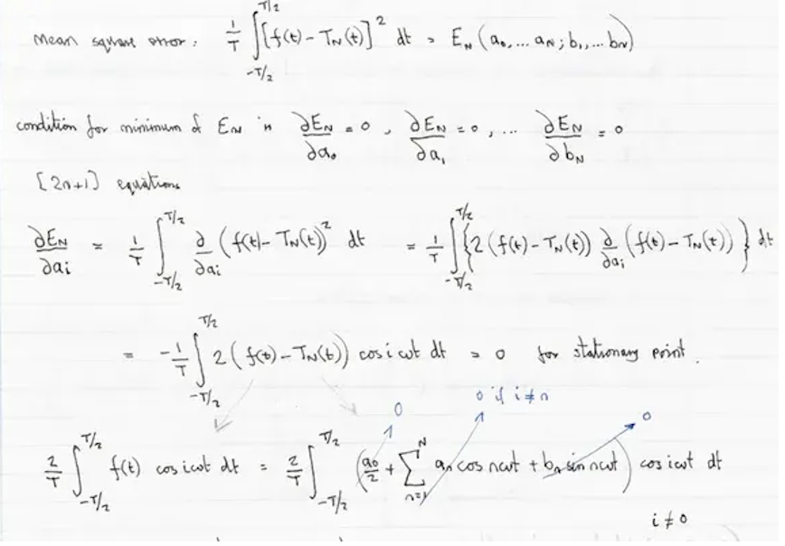

# Guide: Mastering OCR with DeepSeek

This guide details the use of the **DeepSeek-OCR** model, a cutting-edge solution for optical character recognition and document analysis.

## Architecture and Operation

Unlike traditional OCR systems, DeepSeek-OCR is an end-to-end Vision-Language model designed to "read" and "understand" documents visually.

### Technical Architecture
It combines two innovative components:

1.  **DeepEncoder (380M)**: A hybrid visual encoder that integrates **SAM-base** (for local perception) and **CLIP-large** (for global knowledge), connected by a 16x convolutive compressor. This enables processing high-resolution images with very few visual tokens.
2.  **MoE Decoder (3B)**: Based on DeepSeek3B-MoE (570M active parameters), it generates structured text from the compressed visual tokens.

### Resolution Modes and Token Consumption

The model adjusts its token consumption based on image resolution. The higher the image resolution, the more tokens it consumes, but the greater the precision.

| Mode | Resolution (px) | Vision Tokens | Recommended Use |
| :--- | :--- | :--- | :--- |
| **Tiny** | 512 x 512 | 64 | Slides, very large text |
| **Small** | 640 x 640 | 100 | Simple documents, tickets |
| **Base** | 1024 x 1024 | 256 | Standard A4 pages |
| **Large** | 1280 x 1280 | 400 | Dense documents, small text |
| **Gundam** | Dynamic | ~800 | Newspapers, blueprints, complex scans |

:::tip Optimization
To optimize costs and latency, resize your images to the minimum resolution necessary for the text to remain readable.
:::

### Multilingual Support
The model has been trained on a large corpus of multilingual documents and supports recognition of nearly **100 languages** (including French, English, Chinese, Arabic, etc.), with or without layout preservation.

## Prompt Guide (Prompt Engineering)

The quality of the output directly depends on the prompt used. DeepSeek-OCR responds to specific instructions to activate its various capabilities.

### 1. Standard OCR (Markdown)  
To extract text with its structure (headings, paragraphs, tables).

**Prompt:**  
> `Convert the document to markdown.`

**Result:** Structured text, formatted tables, layout preserved.

### 2. "Deep parsing" (Figures, graphs, formulas)
To analyze the semantic content of graphs, chemical formulas, or geometric diagrams.

**Prompt:**
> `Parse the figure.`

**Capabilities:**
-   **Graphs (Bar/Line/Pie)**: Converts into HTML or Markdown table.
-   **Chemical Formulas**: Converts into SMILES format.
-   **Geometry**: Describes geometric elements.

### 3. Grounding (Localization)
To find the coordinates of a specific element in the image.

**Prompt:**
> `Locate <|ref|>element to find<|/ref|> in the image.`

**Example:** `Locate <|ref|>Total<|/ref|> in the image.`
**Result:** Returns the bounding box coordinates of the element.

### 4. Object Detection
To list and locate all visible objects.

**Prompt:**
> `Identify all objects in the image and output them in bounding boxes.`

## Implementation Tutorial (Python)

Here is a complete example showing how to structure your API call to use these capabilities.

### Prerequisites: image format and dependencies
-   **Format**: JPEG or PNG.
-   **Mode**: RGB (no alpha transparency).
-   **PDF**: Must be converted to images beforehand (150–300 DPI).
-   **Size**: It is recommended to resize very high-resolution images to avoid size limit errors (413 Payload Too Large).

Install the required libraries:
```bash
pip install requests Pillow
```

### Code: Document analysis (OCR)

Take the example of this Swiss receipt:


Here is a robust script that handles image resizing and optimal encoding:

```python
import base64
import io
import requests
from PIL import Image

# Configuration
API_KEY = "YOUR_API_TOKEN"
API_URL = "https://api.ai.cloud-temple.com/v1/chat/completions"
IMAGE_PATH = "ReceiptSwiss.jpg"  # Make sure the image is in the current directory

def encode_image_optimized(path):
    """
    Optimizes the image (resizing + JPEG compression) for the API.
    """
    with Image.open(path) as img:
        # 1. Convert to RGB (to avoid issues with PNG/Alpha)
        if img.mode != 'RGB':
            img = img.convert('RGB')
        
        # 2. Intelligent resizing if too large (> 2048px)
        # This prevents 413 (Payload Too Large) errors and speeds up processing
        max_size = 2048
        if max(img.size) > max_size:
            img.thumbnail((max_size, max_size))
            
        # 3. JPEG compression in memory
        buffer = io.BytesIO()
        img.save(buffer, format="JPEG", quality=85)
        
        return base64.b64encode(buffer.getvalue()).decode('utf-8')

# 1. Building the multimodal message
encoded_image = encode_image_optimized(IMAGE_PATH)

payload = {
    "model": "deepseek-ai/DeepSeek-OCR",
    "messages": [
        {
            "role": "user",
            "content": [
                {
                    "type": "text",
                    "text": "Convert the document to markdown."  # OCR Standard Prompt
                },
                {
                    "type": "image_url",
                    "image_url": {
                        "url": f"data:image/jpeg;base64,{encoded_image}"
                    }
                }
            ]
        }
    ],
    "temperature": 0.0,  # CRUCIAL: 0.0 for fidelity
    "max_tokens": 4096
}

# 2. Send
print("Sending the request...")
response = requests.post(
    API_URL, 
    headers={"Authorization": f"Bearer {API_KEY}"}, 
    json=payload
)

# 3. Result
if response.status_code == 200:
    print("\n--- OCR Result ---\n")
    print(response.json()['choices'][0]['message']['content'])
else:
    print(f"Error {response.status_code}: {response.text}")
```

**Example output:**
```markdown

# Berghotel
**Grosse Scheidegg**
3818 Grindelwald
Family R. Müller

Order No.  4572
Bar    Table   7/01

2x Latte Macchiato    at   4.50 CHF   9.00
1x Gloki    at   5.00 CHF   5.00
...

**Total:** CHF **54.50**
**Including 7.6% VAT** 54.50 CHF: 3.85

### Code: graph analysis (deep parsing)

To analyze a financial chart in a report, simply change the prompt text in the payload above:

```python
# ... in the payload ...
"text": "Parse the figure." 
# ...
```

The model will return a textual or tabular representation of the chart's data.

## Advanced Use Cases

### Extraction of Complex Tables
DeepSeek-OCR excels at converting tables, even those without clear border lines.

**Input Image:**


**Model Output (Prompt: "Convert the document to markdown table."):**
```markdown


# PaaS RESOURCES

## Red Hat OpenShift laaS Workload Units - On-Demand - 12-Month Reservation - Excluding OpenShift License

|    | Unit    | Unit Price € HT/month | Commitment |
|---|---|---|---|
| OPENSHIFT - Control Plane - 3 Nodes - FR1 Region    | 1 dedicated plan    | 1,956.81 €    | 12 months    |
| OPENSHIFT - WORKER NODES - TINY - 3 x (10 cores / 20 threads - 64 GB RAM - 512 GB FLASH 1500 IOPS) | 3 dedicated workers    | 834.62 €    | 12 months    |
| OPENSHIFT - WORKER NODES - SMALL - 3 x (20 cores / 40 threads - 128 GB RAM - 512 GB FLASH 1500 IOPS) | 3 dedicated workers    | 2,756.21 €    | 12 months    |
| OPENSHIFT - WORKER NODES - STANDARD - 3 x (32 cores / 64 threads - 384 GB RAM - 512 GB FLASH 1500 IOPS) | 3 dedicated workers    | 5,812.82 €    | 12 months    |
| OPENSHIFT - WORKER NODES - ADVANCED - 3 x (48 cores / 96 threads - 768 GB RAM - 512 GB FLASH 1500 IOPS) | 3 dedicated workers    | 8,413.27 €    | 12 months    |
| OPENSHIFT - WORKER NODES - PERF - 3 x (56 cores / 112 threads - 1.5 TB RAM - 512 GB FLASH 1500 IOPS) | 3 dedicated workers    | 13,835.78 €    | 12 months    |
| OPENSHIFT - WORKER NODES - GPU - 3 x (32 cores / 64 threads - 512 GB RAM - 512 GB FLASH 1500 IOPS - 2x NVIDIA L40S 48GB) | 3 dedicated workers + GPU    | 13,378.32 €    | 12 months    |
| OPENSHIFT - WORKER NODES - GPU - 3 x (32 cores / 64 threads - 512 GB RAM - 512 GB FLASH 1500 IOPS - 2x NVIDIA H100 80GB) | 3 dedicated workers + GPU    | 26,954.41 €    | 24 months    |

## Kubernetes Manage Work Units - (excluding infrastructure)

|    | Unit | Unit Price € HT/month | Commitment |
|---|---|---|---|
| KUBERNETES MANAGE - PRODUCTION (including 3 Worker Nodes)    | 1 virtual cluster    | 2,250.00 €    | 1 month    |
| KUBERNETES MANAGE - DEV/TEST/STAGING (including 3 Worker Nodes)    | 1 virtual cluster    | 1,500.00 €    | 1 month    |
| ADDITIONAL WORKER NODE for Kubernetes Manage - PRODUCTION    | 1 additional worker node    | 450.00 €    | 1 month    |
| ADDITIONAL WORKER NODE for Kubernetes Manage - DEV/TEST/STAGING    | 3 additional worker nodes    | 300.00 €    | 1 month    |

## AI Work Units - LLMaas

|    | Unit | Unit Price € HT/month | Commitment |
|---|---|---|---|
| LLMaas - input tokens / million    | 1 million tokens    | 0.90 €    | N/A    |
| LLMaas - output tokens / million    | 1 million tokens    | 4.00 €    | N/A    |
| LLMaas - reasoning tokens / million    | 1 million tokens    | 21.00 €    | N/A    |
| LLMaas - speech-to-text / minute    | 1 minute    | 0.010 €    | N/A    |
| LLMaas - text-to-speech / minute    | 1 minute    | 0.010 €    | N/A    |

### Mathematical Formulas (LaTeX)
Ideal for academic documents. The model recognizes equations and outputs them in standard LaTeX syntax.

**Input Image:**



**Model Output (Prompt: "Convert to latex."):**

> Here is the mathematical rendering of the OCR result:

Mean square error:

$$
\frac{1}{T} \int_{-T/2}^{T/2} \left[ f(t) - T_N(t) \right]^2 dt = E_N \left( a_0, \ldots, a_N; b_1, \ldots, b_N \right)
$$

Condition for minimum of $E_N$ in:

$$
\frac{\partial E_N}{\partial a_0} = 0, \frac{\partial E_N}{\partial a_i} = 0, \ldots, \frac{\partial E_N}{\partial b_N} = 0
$$

(2n+1) equations:

$$
\frac{\partial E_N}{\partial a_i} = \frac{1}{T} \int_{-T/2}^{T/2} \frac{\partial}{\partial a_i} \left( f(t) - T_N(t) \right)^2 dt = \frac{1}{T} \int_{-T/2}^{T/2} \left\{ 2 \left( f(t) - T_N(t) \right) \frac{\partial}{\partial a_i} \left( f(t) - T_N(t) \right) \right\} dt
$$

$$
= -\frac{1}{T} \int_{-T/2}^{T/2} 2 \left( f(t) - T_N(t) \right) \cos i \omega t dt = 0 \quad \text{for stationary point.}
$$

$$
\frac{2}{T} \int_{-T/2}^{T/2} f(t) \cos i \omega t dt = \frac{2}{T} \int_{-T/2}^{T/2} \left[ \frac{a_0}{2} + \sum_{n=1}^{N} \left( a_n \cos n \omega t + b_n \sin n \omega t \right) \right] \cos i \omega t dt \quad i \neq 0
$$

## Known Limitations

-   **Orientation**: The model does not support automatic rotation. Ensure your images are properly oriented (text horizontal).
-   **Handwriting**: Although performant, the error rate is higher on complex cursive handwriting compared to printed text.
-   **Very high resolution**: Images exceeding the "Gundam" mode dimensions (~2000x2000) are resized, which may render microscopic text unreadable. Split very large images into multiple smaller ones.
