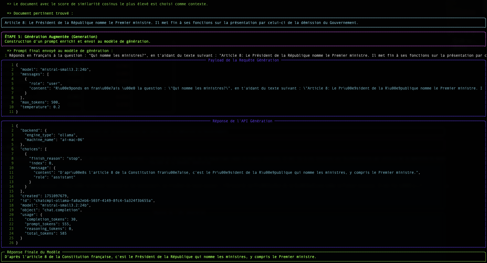

# RAG: Query Your Data with an LLM

This document explains the fundamental concepts behind the **Retrieval-Augmented Generation (RAG)** technique.

:::tip Example Code Available
The concepts discussed here are illustrated in a complete and functional demonstrator available on our GitHub. It serves as an excellent starting point to understand the practical implementation of a RAG pipeline.

➡️ **[Access the Simple RAG Demo code](https://github.com/Cloud-Temple/product-llmaas-how-to/tree/main/simple_rag_demo)**
:::

## The Problem: LLMs Lack Long-Term Memory

A large language model (LLM) like Mistral or Granite is very powerful, but it only knows the data it was trained on. It doesn't know your internal documents, recent news articles, or the specifics of your business.

**RAG** is a technique that allows the LLM to have an "external memory" by providing, at the time of the question, the most relevant document excerpts to help it formulate its response.

The process occurs in two steps:
1. **Retrieval (Recovery):** Find the right documents.
2. **Augmented Generation (Augmented Generation):** Use these documents to generate a response.

It is this **Retrieval** step that is at the heart of our subject. How does a computer manage to "understand" that a question and a paragraph are talking about the same thing? The magic happens through **vectors**.

## Step 1: Embedding: Transforming Words into Numbers

A computer does not understand words, but it is excellent at manipulating numbers. The **embedding** is the process that translates a text (a word, a sentence, a document) into a list of numbers, called a **vector**.

:::tip What is a vector?
In simple terms, a vector is a list of numbers that represents a point in a multi-dimensional space. Each number in the vector corresponds to a coordinate on an "axis" of this space. For text embeddings, these axes are not `x`, `y`, `z` but abstract semantic dimensions (for example, one axis could represent the concept of "royalty", another the concept of "cat", etc.).
:::

`"The cat is on the mat."`  →  `[-0.01, 0.98, 0.45, ..., -0.33]`

This vector is not random. It represents the "position" of the text in a multi-dimensional semantic space. Texts with similar meanings will have vectors that point in similar directions.

:::tip Geographical Analogy
Imagine a geographical map. "Paris" and "France" would be very close, just like "Rome" and "Italy". "Paris" would be farther from "Rome" than from "France", but closer than from "Tokyo". Embedding does the same thing, but with thousands of "dimensions" instead of two, to capture complex semantic nuances.
:::

In our script, the endpoint `/v1/embeddings` and the model `granite-embedding:278m` are responsible for this translation.

### Focus on Granite Embedding Models

Embeddings are an integral part of the LLM ecosystem. A precise and efficient way to represent words, queries, and documents in numerical form is essential for a wide range of enterprise tasks, including semantic search, vector search, and RAG, as well as maintaining efficient vector databases. An effective embedding model can significantly improve the system's ability to understand user intent and increase the relevance of information and sources in response to a query.

While the past two years have seen the proliferation of increasingly competitive open source autoregressive LLMs for tasks such as text generation and synthesis, open source embedding models published by major providers remain relatively rare.

#### Why Granite Embedding?

The new **Granite Embedding** models from IBM, which we are making available to you, represent an improved evolution of the Slate family of RoBERTa-based only language encoder models. They stand out on several key points crucial for enterprise use:

1.  **Ethical and Commercially Safe Training**: While the majority of open-source embedding models in the Hugging Face MTEB ranking rely on research-only licensed training datasets (such as MS-MARCO), IBM has verified the commercial eligibility of all data sources used to train Granite Embedding.
2.  **Intellectual Property Indemnification**: Highlighting the care taken for its enterprise use, IBM supports Granite Embedding with the same unlimited indemnification for third-party intellectual property claims as that provided for the use of other models developed by IBM.
3.  **Performance and Efficiency**: IBM's efforts in organizing and filtering training data have not prevented the Granite Embedding models from keeping pace with the leading open-source embedding models of similar size.

The benchmarks below illustrate two key advantages:

-   **Search Accuracy**: The first graph shows that Granite models (in blue) are highly competitive, and even superior, to models of similar size on semantic search tasks (`Retrieval Tasks`).
-   **Inference Speed**: The second graph shows that Granite models are **significantly faster** (lower time per request) than most popular alternatives, which is a considerable advantage for real-time applications.

*Comparison of performance on retrieval (BEIR) and code retrieval (CoIR) tasks.*

*Comparison of latency (time per request in seconds) between different embedding models.*

It is this balance between **performance, speed, legal security, and ethics** that led us to choose the `granite-embedding:278m` model (the most powerful multilingual version) as the default embedding service.

## Step 2: The Search: Measuring Semantic Proximity

Once our question and all our documents are transformed into vectors, the search becomes a mathematical problem: **find the document vector that is most "close" to the question vector.**

There are several ways to measure this "closeness". Our script uses two of them: Cosine Similarity and Euclidean Distance.

### Cosine Similarity (The Standard)

-   **Concept** : It does not measure distance, but the **angle** between two vectors. A small angle (close to 0°) means the vectors point in the same direction, and therefore the texts have a very similar meaning.
-   **Score** : The cosine of a 0° angle is 1 (perfect similarity). The cosine of a 90° angle is 0 (no similarity).
-   **Why is it so widely used?** For text, the *semantic direction* is much more important than the *magnitude* (length) of the vector. Cosine similarity ignores magnitude and focuses only on direction.

**Simple example in 2D:**
-   Question : `v_q = [2, 2]`
-   Doc A : `v_a = [4, 4]` (same direction, longer)
-   Doc B : `v_b = [-2, 2]` (different direction)

The cosine similarity calculation will give:
-   `cos(v_q, v_a) = 1.0` → 0° angle. Perfect similarity.
-   `cos(v_q, v_b) = 0.0` → 90° angle. No similarity.

This is the result we want: Document A is semantically identical to the question, even though its formulation is longer.

### The Euclidean Distance (The Rule)

-   **Concept** : It is the "straight-line" distance between the endpoints of the two vectors.
-   **Score** : A score of 0 means that the vectors are identical. The higher the score, the farther they are.
-   **Inconvenience for text** : It is sensitive to magnitude. In our example above, the distance between `v_q` and `v_a` would not be zero, as the vectors do not have the same length, even if they have the same direction.

## Conclusion

The table displayed by the `simple-rag-demo` script allows you to visualize these two metrics. You will notice that although rankings may sometimes differ slightly, the **cosine similarity is generally the preferred metric** for text-based semantic search applications.

The biggest challenge, as shown in the example, remains the **quality of the embedding model**. A good model will produce vectors that accurately capture meaning, making proximity calculations, regardless of the method, much more reliable.