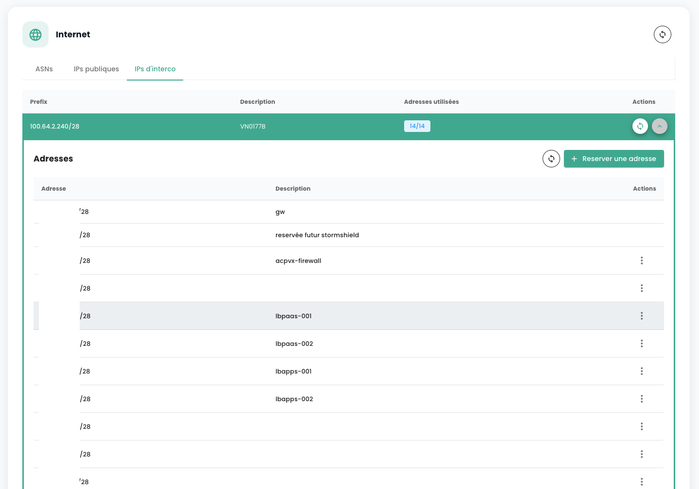

## Managing Your Internet Connectivity

Connectivity management is handled via the **'Network'** > **'Internet'** menu. This menu centralizes IP address management, offering two distinct categories:

1. **Public IP Addresses**: These are used to expose your services on the Internet, facilitating incoming and outgoing data exchanges.
2. **Interconnection IP Addresses**: These addresses allow your gateways to direct traffic to the specific Cloud Temple network, ensuring a secure and efficient connection.

Public IP addresses enable Internet access, while interconnection IP addresses used with the BGP4 protocol ensure secure connections between networks. The latter facilitate reliable and secure exchanges between your tenant and the Cloud Temple network. The joint use of these addresses improves traffic management and enhances network security and performance.

Here is the main interface for managing IP addresses:

The home tab corresponds to your internal ASN dedicated to your tenant. It notably indicates important information for configuring your BGP connectivity.

### Public IP Addresses

You can view and comment on the blocks and IP addresses associated with your tenant via the IPAM integrated into the Cloud Temple console:

The order of public IP addresses is done via the **'Order public IPs'** button:

The reservation and assignment of an IP address are done via the **'Reserve an address'** button:

Modification or deletion of the reservation via the **'Actions'** buttons:

Deleting a reservation means that the resource becomes available for another use but remains allocated and billed to the customer.

On certain lines, the **'Action'** button is not available, indicating that the IP addresses are reserved and therefore not available for use.

### Interconnection IP Addresses

Similarly, you can view and comment on interconnection IP address blocks. You can visualize the interconnection subnets with the Cloud Temple network and their usage:

You can easily modify, as with public addresses, their usage in the integrated IPAM management:

