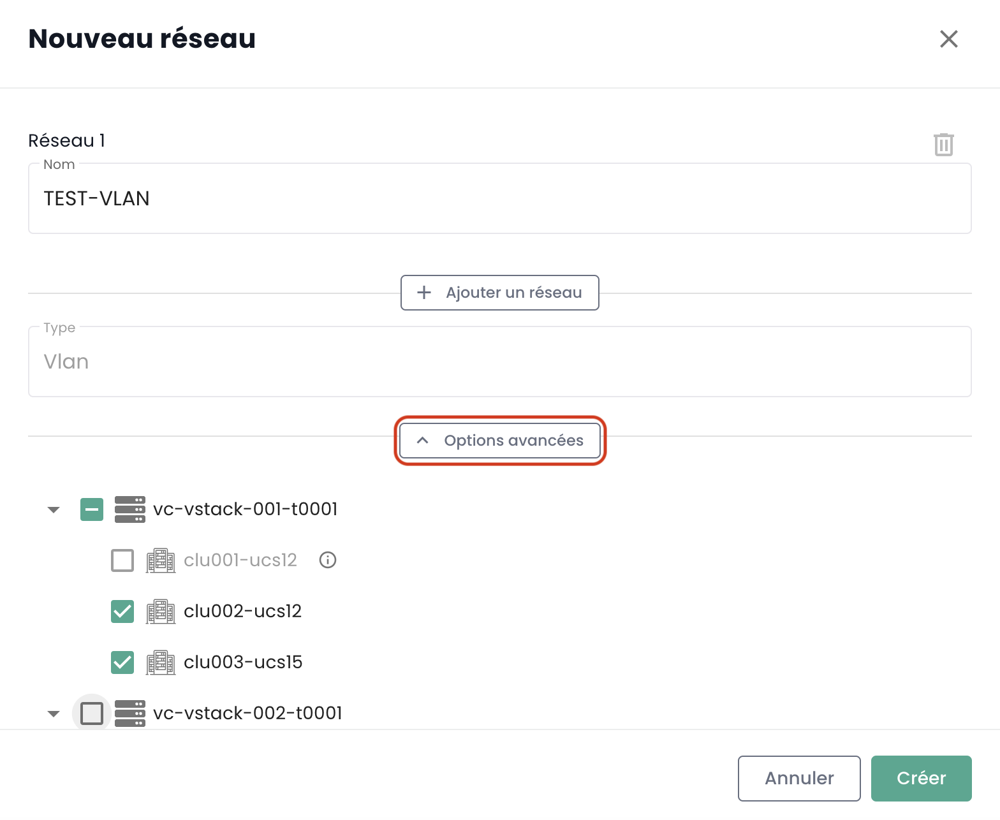

## Regional Private Networks

The management of private networks within a region is done directly in the Cloud Temple console.

### Within a tenant

The creation of a virtual network is done in the __*Network*__ menu on the green banner to the left of the screen.

Then click on the __*New Network*__ button.

You must specify the name of your network that will be displayed. By default, all of your clusters will access your new network.
However, in the __*Advanced Options*__ submenu, you can more precisely specify the propagation scope within the tenant among your different clusters.

All possible actions on your networks are found in the __*Actions*__ menu of each of them:

- Activating the sharing of a network between tenants of the same organization.
- Deactivating the sharing of a network between tenants of the same organization.
- Adding the sharing of a network between tenants of the same organization.
- Deleting the sharing of a network between tenants of the same organization.
- Graphically visualizing the propagation of a network across all your clusters and hypervisors within a tenant.
- Deleting a propagation within a tenant.
- Modifying a propagation within a tenant.
- Deleting a network.

#### Visualizing the propagation of your networks

You can easily visualize the propagation of a network to your different clusters within the same tenant in the __*Actions*__ menu.
Choose the *"View propagation"* option:

#### Modifying the propagation

Modifying a propagation within a tenant is done through the *"Propagate"* option:
then choose the clusters to be included in this propagation.

__*Note:*__ *Propagation modification is limited to 20 networks per action.*

#### Deleting a network

Deleting a network within a tenant is done through the *"Delete Network"* option:

### Network sharing between tenants

By default, __networks are only available within a tenant__. You can choose to __share a network between multiple tenants__ for technical or connectivity reasons.
It is thus possible to share a network between your __[Tenant](../../../console/iam/concepts/#tenant)__ within the same organization.

Simply enable sharing as shown below.

Once sharing is enabled, you just need to add a share as shown below.

Then select the target tenant. Note, the list of tenants is dynamic.
It depends on your organization and your rights.

Once the network is shared, it will be visible in the 'Shared Networks' tab from your second tenant.

