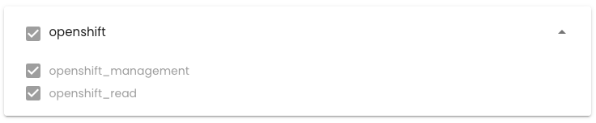
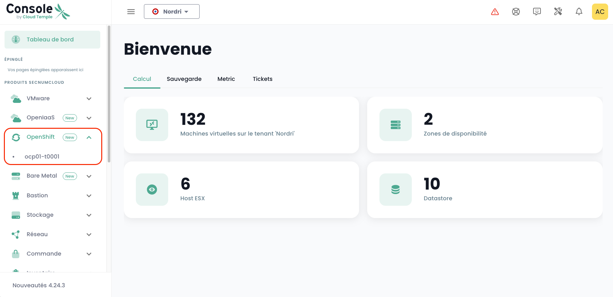

## Deploy a Redhat Openshift Platform within Your Tenant

### Assigning Access Rights

It is essential that the [Tenant](../console/iam/concepts.md#tenants) administrator grants the Openshift platform management rights to the Openshift administrator user to enable access:



### Accessing the Openshift Environment within a Tenant

After assigning the rights, the '__Openshift__' module will appear in the Cloud Temple console menu:



You will then see the Openshift clusters deployed within your tenant.

Click on the cluster you wish to manage. You will enter the cluster management environment:


After authentication, you can manage your cluster:


### Resources of Your Environment

Here is the connection and configuration information specific to your OpenShift environment.

#### Connection Details

To access the various OpenShift components, ensure your tenant is whitelisted in the console (refer to the documentation: [Cloud Temple Documentation](https://docs.cloud-temple.com/)).

- __URL Shiva Tenant__ :  
  [https://**your-tenant-id**.shiva.cloud-temple.com/](https://**your-tenant-id**.shiva.cloud-temple.com/)  
  
- __OpenShift UI__ :  
  [https://ui-ocp01-**your-id**.paas.cloud-temple.com/](https://ui-ocp01-**your-id**.paas.cloud-temple.com/)  
  
- __External API__ :  
  [https://api-ocp01-**your-id**.paas.cloud-temple.com](https://api-ocp01-**your-id**.paas.cloud-temple.com)  
  
- __GitOps (ARGOCD)__ :  
  [https://gitops-ocp01-**your-id**.paas.cloud-temple.com/applications](https://gitops-ocp01-**your-id**.paas.cloud-temple.com/applications)  
  
#### Connecting to the Cluster via CLI

To connect via the command line (CLI), use the following command:

```bash
oc login https://api-ocp01-{your-id}.paas.cloud-temple.com/ --web
```

#### Accessing the Registry

To access the registry, log in using the following commands:

```bash
oc login https://api-ocp01-{your-id}.paas.cloud-temple.com --web
docker login -u {your-username} -p $(oc whoami -t) registry-ocp01-{your-id}.paas.cloud-temple.com
```

Next, test building and uploading a Docker image:

```bash
docker build -t <namespace>/temp:latest .
docker tag <namespace>/temp:latest registry-ocp01-{your-id}.paas.cloud-temple.com/<namespace>/temp:latest
docker push registry-ocp01-{your-id}.paas.cloud-temple.com/<namespace>/temp:latest
```

#### Configuration of Routers and Load Balancers

The platform offers flexible options for __traffic routing__ and __load balancing__ :

- By default, private load balancers are used for routes and ingresses.  
- Domains :  
  - `*.apps-priv-ocp01-{your-id}.paas.cloud-temple.com`  
  - `*.apps-ocp01-{your-id}.paas.cloud-temple.com`  

Ensure your routes or ingresses are configured with the appropriate labels or ingress classes for correct routing.

Example :

```yaml
metadata:
  labels:
    ct-router-type: public
```

#### IaaS Interconnection

Network configurations play a crucial role in securing communications with OpenShift.

- __Interconnection Network__ : 100.67.0.0/28  
- __VIP of the private load balancer__ : 100.67.0.3  

Ensure your firewall has a dedicated interface and allows traffic between the specified networks.