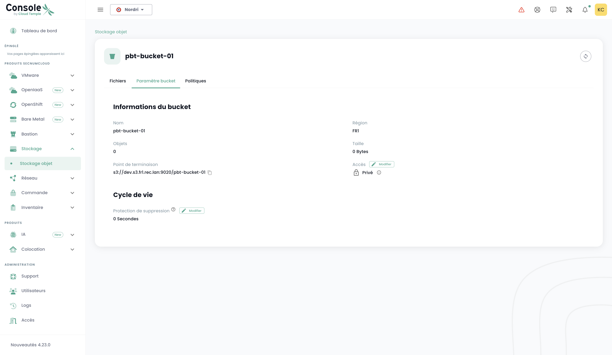

## List all S3 buckets in your tenant

You can access all your buckets via the '__Object Storage__' menu in the Cloud Temple console:


You can see all the accounts created on your tenant that are authorized to access the S3 service via the '__Storage Accounts__' tab.


## Creating a new storage account

Creating a storage account on your tenant is done by pressing the '__New storage account__' button at the top right, in the '__Storage Accounts__' tab:


The platform then provides you with the access key and the secret key for your bucket:


__WARNING:__ The secret and access keys are presented only once. After this first appearance, it becomes impossible to view the secret key again. It is therefore essential to note this information immediately; otherwise, you will need to generate a new set of keys.

Regeneration is done in the key options by selecting the "Reset access key" option.


## Creating an S3 bucket

Creating a new bucket is done by clicking on the '__New bucket__' button at the top right of the screen:


A window will then appear, and you need to fill in:

1. The **region** for creating your bucket,
2. The **type** of bucket: performance or archival,
3. The **name** of your bucket (it must be unique).


As of April 3, 2024, the available region is **FR1** (Paris), and only the performance type is available.

You must also choose who can access your bucket:

- **Private** access: By default, access is limited to specific IP addresses of Cloud Temple.
- **Public** access: Access is open to all Internet addresses (notably via the rule 0.0.0.0/0). We do not recommend this configuration due to its security implications.
- **Customized** access: This option allows you to specify IPv4 addresses or subnet ranges that you want to authorize.

## Associating a storage account with a bucket

Account associations with buckets are made in the '__Policies__' tab


This association allows the storage account to access the bucket. There are four roles:

1. **Maintainer**: Read, write, manage rights, and policy management permissions.

The S3 permissions for this role:
```json
{
    "name": "maintainer",
    "permissions": [
        "s3:*"
    ]
}
```

2. **Writer and Reader**: Read, edit, modify, delete files in the buckets.

The S3 permissions for this role:
```json
{
    "name": "read_write",
    "permissions": [
        "s3:Get*",
        "s3:List*",
        "s3:*Object"
    ]
}
```

3. **Writer**: Edit, modify, delete files in the buckets.

The S3 permissions for this role:
```json
{
    "name": "write_only",
    "permissions": [
        "s3:List*",
        "s3:*Object"
    ]
}
```

4. **Reader**: Read and download files in the buckets.

The S3 permissions for this role:
```json
{
    "name": "read_only",
    "permissions": [
        "s3:Get*",
        "s3:List*"
    ]
}
```


## Browsing an S3 bucket

When you click on the name of a bucket, you first access the '__Files__' tab to view its contents:


In the '__Settings__' tab, you can see the detailed information of your S3 bucket:



You then have:

1. The name of the S3 bucket,
2. Its region,
3. The number of objects it contains and the size in bytes of the bucket,
4. Its endpoint,
5. The lifecycle settings that notably define the expiration of bucket objects. '__0__' corresponds to infinite retention.

You can modify the retention parameter via the '__Modify__' button in the lifecycle:


Finally, you can change its access typology.

## Access limitations to your S3 buckets

It is very simple to configure access restrictions to your S3 buckets. When creating a bucket, you have the choice between three access configurations:


- **Private** access: By default, access is limited to specific IP addresses of Cloud Temple.
- **Public** access: Access is open to all Internet addresses (notably via the rule 0.0.0.0/0). We do not recommend this configuration due to its security implications.
- **Customized** access: This option allows you to specify IPv4 addresses or subnet ranges that you want to authorize:


*IPv6 support is expected in the first half of 2025.*

## Deleting an S3 bucket

Deleting a bucket is done in the actions associated with the bucket by selecting the __'Delete'__ option.


_**WARNING: Deletion is permanent and there is no way to recover the data.**_


## How is Cloud Temple's S3 offering billed?

The price is a monthly rate, per GiB of storage, billed monthly. However, the platform accounts for usage by the hour and does the billing on a monthly basis of 720 hours.

For example, if you use 30 GiB for 1 hour, then nothing, then a few days later 30 GiB for 2 hours, the monthly bill will be *( Price (1 x 30 GiB) + 2 x Price (30 GiB) ) / 720* for the considered month. Billing is in arrears.