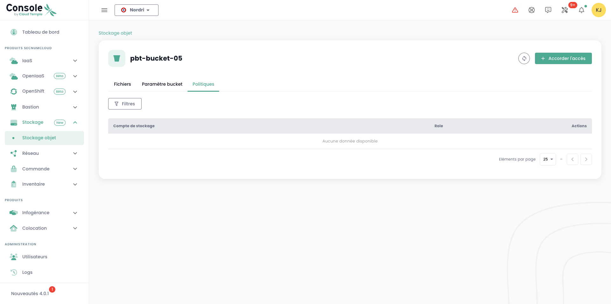

## List all S3 buckets in your tenant

You can access all your buckets via the '__Object Storage__' menu on the Cloud Temple console:

You can see all the accounts created on your tenant and authorized to access the S3 service via the '__Storage Accounts__' tab.

## Creating a new storage account

Creating a storage account on your tenant is done by pressing the '__New Storage Account__' button at the top right, in the '__Storage Accounts__' tab:

The platform will then give you the access key and the secret key of your bucket:

__ATTENTION:__ The secret and access keys are shown only once. After this initial appearance, it becomes impossible to view the secret key again. It is therefore essential to record this information immediately; otherwise, you will need to generate a new pair of keys.

Regeneration is done via the key options by choosing the "Reset access key" option.

## Creating an S3 bucket

Creating a new bucket is done by clicking on the '__New Bucket__' button at the top right of the screen:

A window will then appear, and you need to fill in:

1. The **region** for creating your bucket,
2. The **type** of bucket: performance or archival,
3. The **name** of your bucket (it must be unique).

As of April 3, 2024, the available region is **FR1** (Paris) and only the performance type is available.

You must also choose who can access your bucket:

- **Private** Access: By default, access is limited to specific Cloud Temple IP addresses.
- **Public** Access: Access is open to all Internet addresses (notably via the rule 0.0.0.0/0). We do not recommend this configuration due to its security implications.
- **Custom** Access: This option allows you to specify the IPv4 addresses or subnet ranges you wish to authorize.

## Associating a storage account with a bucket

Account to bucket associations are made in the '__Policies__' tab.

This association allows the storage account to access the bucket. There are three roles:

1. **Maintainer**: Read, write, rights management, and policy management permissions
2. **Reader**: Read and download files in buckets.
3. **Writer**: Read, edit, modify, and delete files in buckets.

## Browsing an S3 bucket

When you click on the name of a bucket, you first access the '__Files__' tab to see its content:

In the '__Settings__' tab, you can see the detailed information about your S3 bucket:

You will have:

1. The name of the S3 bucket,
2. Its region,
3. The number of objects it contains and the size of the bucket in bytes,
4. Its endpoint,
5. The lifecycle settings that define the expiration of the bucket's objects. '__0__' corresponds to infinite retention.

You can modify the retention parameter via the '__Edit__' button in the lifecycle:

Finally, you can modify its access typology.

## Limiting access to your S3 buckets

It is very simple to configure access restrictions to your S3 buckets. When creating a bucket, you have the choice between three access configurations:

- **Private** Access: By default, access is limited to specific Cloud Temple IP addresses.
- **Public** Access: Access is open to all Internet addresses (notably via the rule 0.0.0.0/0). We do not recommend this configuration due to its security implications.
- **Custom** Access: This option allows you to specify the IPv4 addresses or subnet ranges you wish to authorize:

*IPv6 support is planned for the first half of 2025.*

## Deleting an S3 bucket

Deleting a bucket is done through the actions associated with the bucket by choosing the '__Delete__' option.

_**ATTENTION: Deletion is permanent, and there is no way to recover the data.**_

## How is Cloud Temple's S3 offer billed?

The price is a monthly rate, per GiB of storage, billed monthly. However, the platform calculates usage hourly and invoices on a monthly basis of 720 hours.

For example, if you consume 30 GiB for 1 hour in a month, then nothing, then a few days later 30 GiB for 2 hours, the monthly invoice will be *( Price (1 x 30 GiB) + 2 x Price (30 GiB) ) / 720* for the considered month. Billing is post-paid.