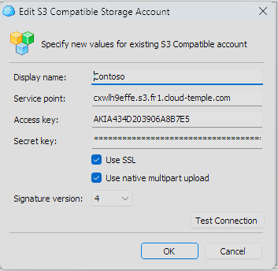

## Using MINIO

You can use the minio client for instance:

https://min.io/docs/minio/linux/reference/minio-mc.html

For example: 
```
    mc alias set <alias_name> https://reks2ee2b1.s3.fr1.cloud-temple.com <access_key> <secret_key>
```
Upload a file: 
```
    mc cp test.txt <alias_name>/<bucket_name>
```
Retrieve a file:
```
    mc ls <alias_name>/<bucket_name>
```
## Cloud Berry Explorer

you can also use [Cloud Berry Explorer](https://www.msp360.com/explorer/).

1. Connect using your endpoint and your key:



2. Once connected, enter the bucket name in the navigation bar:


3. You can then use the bucket normally:


## Using WINSCP 6.3.x

You can use [Winscp](https://winscp.net/eng/download.php):

1. Connect using your endpoint, your access key, and your secret key:


2. Once connected, use WINSCP normally like an FTP or SCP site:


## Adding the HASH of a file during object upload

Overall, file HASH is supported on our object storage via metadata. Some clients allow calculating a HASH on the fly and adding it as metadata (minio-mc with md5 for example), for others, the data must be specified directly in the metadata.

1. Case of adding a HASH with the minio-mc client: this client supports on-the-fly MD5 hash calculation and storing it in the metadata


            ╰─➤  cat test.txt                       
            This is a test
            ╰─➤  md5 test.txt                       
            MD5 (test.txt) = 8b34b2754802a46e3475998dfcf76f83
            ╰─➤  mc cp -md5 test.txt CLR-PUB/CLR-PUB
            ...lesur/Downloads/test.txt: 18 B / 18 B  ▓▓▓▓▓▓▓▓▓▓▓▓▓▓▓▓▓▓▓▓▓▓▓▓▓▓▓▓▓▓▓▓▓▓▓▓▓▓▓▓▓▓▓▓▓▓▓▓▓▓▓▓▓▓▓▓▓▓▓▓▓▓▓▓▓▓▓▓▓▓▓▓▓▓▓▓▓▓▓▓▓▓▓▓▓▓▓▓▓▓▓▓▓▓▓▓▓▓▓▓▓▓▓▓▓▓  111 B/s 0s
            ╰─➤  mc stat CLR-PUB/CLR-PUB/test.txt
            Name      : test.txt
            Date      : 2024-06-08 10:21:31 CEST 
            Size      : 18 B   
            ETag      : 8b34b2754802a46e3475998dfcf76f83 
            Type      : file 
            Encryption: SSE-S3
            Metadata  :
                Content-Type: text/plain 

2. Example of adding a sha256 "manually": to do this, we use the file's S3 attributes.

            ╰─➤  cat test.txt
            This is a test
            ╰─➤  shasum -a 256 test.txt                            
            2c5165a6a9af06b197b63b924d7ebaa0448bc6aebf8d2e8e3f58ff0597f12682  test.txt
            ╰─➤  mc cp -md5 test.txt CLR-PUB/CLR-PUB -attr "checksum-sha256=$(shasum -a 256 test.txt | cut -f1 -d' ')"
            ...lesur/Downloads/test.txt: 18 B / 18 B  ▓▓▓▓▓▓▓▓▓▓▓▓▓▓▓▓▓▓▓▓▓▓▓▓▓▓▓▓▓▓▓▓▓▓▓▓▓▓▓▓▓▓▓▓▓▓▓▓▓▓▓▓▓▓▓▓▓▓▓▓▓▓▓▓▓▓▓▓▓▓▓▓▓▓▓▓▓▓▓▓▓▓▓▓▓▓▓▓▓▓▓▓▓▓▓▓▓▓▓▓▓▓▓▓▓▓  141 B/s 0s
            ╰─➤  mc stat CLR-PUB/CLR-PUB/test.txt                                                                     
            Name      : test.txt
            Date      : 2024-06-08 10:41:17 CEST 
            Size      : 18 B   
            ETag      : 8b34b2754802a46e3475998dfcf76f83 
            Type      : file 
            Encryption: SSE-S3
            Metadata  :
                X-Amz-Meta-Checksum-Sha256: 2c5165a6a9af06b197b63b924d7ebaa0448bc6aebf8d2e8e3f58ff0597f12682 
                Content-Type              : text/plain