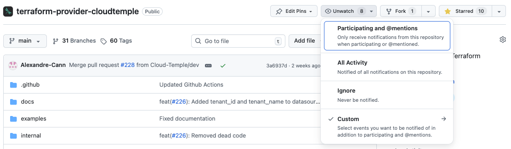
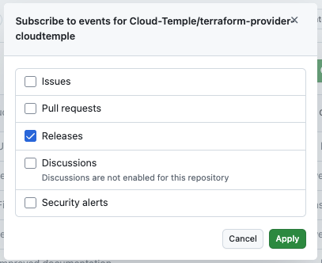

The Cloud Temple Terraform provider allows you to manage your Cloud Temple account infrastructure using the Infrastructure as Code (IaC) approach. It offers complete integration with Cloud Temple infrastructure services, enabling you to provision, configure, and manage your cloud resources in a declarative and reproducible manner.

## Key Features

- **Infrastructure as Code**: Define your infrastructure in versionable configuration files
- **Declarative Management**: Describe the desired state of your infrastructure, Terraform handles the rest
- **Complete Automation**: Automate the provisioning and management of your resources
- **Reproducibility**: Deploy identical environments reliably
- **Dependency Management**: Terraform automatically manages the order of resource creation

## Supported Products

The Cloud Temple Terraform provider supports the following services:

### IaaS VMware

Manage your VMware virtual machines with all advanced virtualization features:

- **Virtual Machines**: Create and configure virtual machines
- **Virtual Disks**: Create and configure virtual disks
- **Network Adapters**: Manage virtual machine network adapters
- **Virtual Controllers**: Manage disk controllers and other devices
- **Cloud-Init**: Automated configuration at startup
- **Backup**: Integration with Cloud Temple backup policies

### IaaS OpenSource

Provision and manage virtual machines on the OpenSource infrastructure based on XCP-ng:

- **Virtual Machines**: Create and manage virtual machines
- **Virtual Disks**: Create and configure virtual disks
- **Network Adapters**: Create and configure virtual machine network adapters
- **Replication**: Data replication policies
- **High Availability**: HA configuration (disabled, restart, best-effort)
- **Cloud-Init**: NoCloud compatible automated configuration
- **Backup**: Integration with Cloud Temple backup policies

### Object Storage

Manage your S3-compatible object storage spaces:

- **Buckets**: Create and configure buckets
- **Storage Accounts**: Manage S3 identities and credentials
- **ACL**: Granular access control to buckets
- **Versioning**: Object version management

## Prerequisites

Before using the Cloud Temple Terraform provider, ensure you have:

### Access to Cloud Temple Console

You must have access to the [Cloud Temple Console](https://shiva.cloud-temple.com) with appropriate rights on the tenant you want to work with.

### API Key

The provider requires Cloud Temple API credentials:

- **Client ID**: Client identifier for authentication
- **Secret ID**: Secret associated with the client ID

These credentials can be generated from the Cloud Temple Console by following [this procedure](https://docs.cloud-temple.com/console/api#cl%C3%A9s-api).

### Rights and Permissions

Depending on the resources you want to manage, you must have the appropriate roles:

#### For IaaS VMware

- `compute_iaas_vmware_infrastructure_read`
- `compute_iaas_vmware_infrastructure_write`
- `compute_iaas_vmware_management`
- `compute_iaas_vmware_read`
- `compute_iaas_vmware_virtual_machine_power`
- `backup_iaas_spp_read` and `backup_iaas_spp_write` (for backup)

#### For IaaS OpenSource

- `compute_iaas_opensource_management`
- `compute_iaas_opensource_read`
- `compute_iaas_opensource_virtual_machine_power`
- `backup_iaas_opensource_read` and `backup_iaas_opensource_write` (for backup)

#### For Object Storage

- `object-storage_write`
- `object-storage_read`
- `object-storage_iam_management`

#### Common Rights

- `activity_read`
- `tag_read` and `tag_write`

## Terraform Compatibility

The Cloud Temple provider is compatible with:

- **Terraform**: Version 1.0 and higher
- **OpenTofu**: Compatible with recent versions

## Logging and Debugging

To enable detailed provider logging:

```bash
# DEBUG level logging
export TF_LOG=DEBUG
terraform apply

# JSON format logging
export TF_LOG=JSON
terraform apply

# Save logs to a file
export TF_LOG_PATH=./terraform.log
terraform apply
```

## Support and Resources

- **Official Documentation**: [Terraform Registry](https://registry.terraform.io/providers/Cloud-Temple/cloudtemple/latest/docs)
- **Source Code**: [GitHub](https://github.com/Cloud-Temple/terraform-provider-cloudtemple)
- **Issues**: [GitHub Issues](https://github.com/Cloud-Temple/terraform-provider-cloudtemple/issues)

## Stay Informed

To be automatically notified of new releases of the Cloud Temple Terraform provider, you can subscribe to notifications from the GitHub repository.

### Subscribe to Release Notifications

1. Go to the [provider's GitHub repository](https://github.com/Cloud-Temple/terraform-provider-cloudtemple)

2. Click the **Watch** button at the top right of the repository



3. Select **Custom** then check **Releases**



You will now receive an email notification for each new provider release.

## Next Steps

- [Concepts](concepts) : Understand the provider's key concepts
- [Getting Started](quickstart) : Create your first infrastructure
- [Tutorials](tutorials) : Practical examples and use cases
