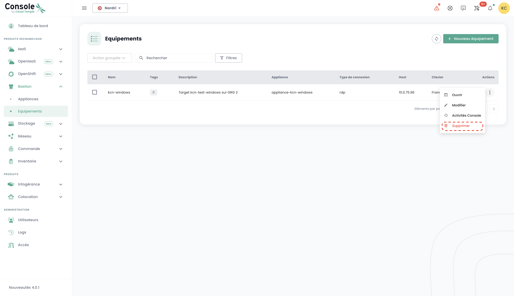

Estos tutoriales te ayudan a desplegar y gestionar un Bastion Cloud Temple desde el portal Shiva.

## Prerrequisitos

1. Haberse suscrito a la oferta Cloud Temple (suscripción Appliance Bastion).
2. Los equipos a administrar deben ser accesibles desde la red donde se despliega el Appliance Bastion.
3. Tener los derechos sobre el módulo Bastion.
4. En el marco de un despliegue del Appliance onpremise, los flujos correspondientes deben estar abiertos.

## Interfaz

Una vez conectado al portal web Shiva, dirígete a la pestaña "Bastion" del menú izquierdo.

La pestaña « Equipements » te permite consultar la lista de tus equipos. Un equipo corresponde a una configuración de
conexión vía un Appliance Bastion. Para cada equipo, se indica su nombre, sus etiquetas, su
descripción, el Appliance que le está asociado, el tipo de conexión (SSH o RDP), la IP del host y finalmente la configuración del teclado.

Puedes filtrar la lista de tus equipos según las etiquetas que les están asignadas, y un motor de búsqueda permite buscar una sesión con su nombre.

La pestaña « Appliances » te da la lista de tus Appliances Bastion. Para cada Appliance, se especifica el nombre del Appliance y su descripción.

Un motor de búsqueda está disponible para permitirte buscar un Appliance con su nombre.

## Desplegar un Appliance
Antes de poder desplegar un Appliance, se debe hacer una solicitud de suscripción a un Appliance a través de una solicitud al soporte.

## Abrir un flujo hacia un equipo
En la pestaña « Appliances », haz clic en la barra de acción del Appliance que deseas abrir. Luego haz clic en el botón « Ouvrir ».

Luego introduce la información necesaria para la conexión:

    - Elección del protocolo (SSH o RDP);
    - Dirección IP del host a administrar;
    - Información de identificación;
    - Configuración del teclado.

Luego haz clic en « Connecter » para abrir el Appliance. La consola de la máquina virtual a administrar se abre entonces.

## Registrar un equipo

Para acceder regularmente a un equipo a administrar, es más adecuado crear una configuración de equipo, que solo requerirá tu nombre de usuario y tu contraseña en cada conexión.

Para ello, dirígete a la pestaña « Equipements » del menú « Bastion » y luego, haz clic en el botón « Nouveau équipement ».

Luego introduce la información necesaria para la creación de tu equipo:

    - Nombre del equipo;
    - Descripción;
    - Appliance asociado;
    - Tipo de protocolo (SSH o RDP);
    - Dirección IP del host;
    - Idioma del teclado.

Una notificación que indica la creación de tu configuración de equipo debería aparecer en la parte superior derecha de la página. La configuración se añade luego a la lista de tus equipos.

Para crear una nueva conexión, también puedes pasar por la pestaña « Appliances » haciendo clic en la barra de acción del Appliance al que deseas asociar una configuración de equipo.

## Conectarse a un equipo

Dirígete a la pestaña « Equipements » de la pestaña « Bastion ». Haz clic en la barra de acciones del equipo que deseas abrir, y haz clic en el botón « Ouvrir ».

En cada conexión al equipo, solo necesitas introducir tu información de autenticación.

Después de haber ingresado tus credenciales, aparecerá una notificación confirmando el inicio de la sesión y se abrirá la consola hacia tu máquina virtual.

## Modificar una configuración de equipo

Dirígete a la pestaña « Equipements » de la sección « Bastion », haz clic en la barra de acción del equipo que deseas modificar, y haz clic en el botón « Modifier ».

Luego puedes modificar el nombre del equipo, su descripción, el Appliance asociado, el protocolo (SSH o RDP), la dirección IP del host o el idioma del teclado.

## Eliminar una configuración de equipo

Dirígete a la pestaña « Equipements » de la sección « Bastion », haz clic en la barra de acción del equipo que deseas eliminar, y haz clic en el botón « Supprimer ».

