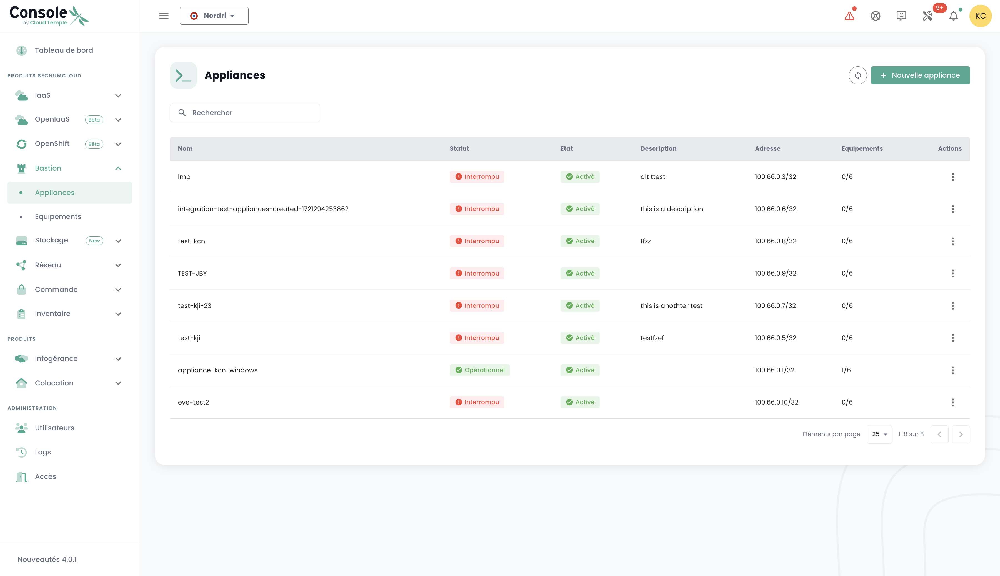

Estos tutoriales le ayudan a desplegar y gestionar un Bastión Cloud Temple desde el portal Shiva. 

## Prerrequisitos

1. Haber suscrito a la oferta Cloud Temple (suscripción Appliance Bastion).
2. Los equipos a administrar deben ser accesibles desde la red donde se despliega el Appliance Bastion.
3. Tener los derechos sobre el módulo Bastion.
4. En el marco de un despliegue del Appliance on-premise, los flujos correspondientes deben estar abiertos.

## Interfaz

Una vez conectado al portal web Shiva, diríjase a la pestaña "Bastion" del menú de la izquierda. 

La pestaña « Equipements » le permite consultar la lista de sus equipos. Un equipo corresponde a una configuración de
conexión a través de un Appliance Bastion. Para cada equipo, se indica su nombre, sus etiquetas, su 
descripción, el Appliance que le está asociado, el tipo de conexión (SSH o RDP), la IP del host y finalmente la configuración del teclado.

Puede filtrar la lista de sus equipos según las etiquetas que les son asignadas, y un motor de búsqueda permite buscar una sesión por su nombre. 

La pestaña « Appliances » le da la lista de sus Appliances Bastion. Para cada Appliance, el nombre del Appliance y su descripción están especificados. 

Un motor de búsqueda está disponible para permitirle buscar un Appliance por su nombre.

## Desplegar un Appliance
Antes de poder desplegar un Appliance, debe hacer una solicitud de suscripción a un Appliance mediante una petición al soporte.

## Abrir un flujo hacia un equipo
En la pestaña « Appliances », haga clic en la barra de acciones del Appliance que desea abrir. Luego haga clic en el botón « Ouvrir ».

Luego proporcione la información necesaria para la conexión:

    - Elección del protocolo (SSH o RDP);
    - Dirección IP del host a administrar;
    - Información de identificación;
    - Configuración del teclado.

Luego haga clic en « Connecter » para abrir el Appliance. La consola de la máquina virtual a administrar se abrirá entonces. 

## Registrar un equipo

Para acceder regularmente a un equipo a administrar, es más adecuado crear una configuración de equipo, que solo requerirá su nombre de usuario y su contraseña en cada conexión. 

Para ello, diríjase a la pestaña « Equipements » del menú « Bastion », luego, haga clic en el botón « Nouveau équipement ».

Luego proporcione la información necesaria para la creación de su equipo:

    - Nombre del equipo;
    - Descripción;
    - Appliance asociado;
    - Tipo de protocolo (SSH o RDP);
    - Dirección IP del host;
    - Idioma del teclado.

Una notificación indicando la creación de su configuración de equipo debería aparecer en la parte superior derecha de la página. La configuración se añadirá luego a la lista de sus equipos. 

Para crear una nueva conexión, también puede pasar por la pestaña « Appliances » haciendo clic en la barra de acciones del Appliance al que desea asociar una configuración de equipo.

## Conectarse a un equipo

Diríjase a la pestaña « Equipements » de la pestaña « Bastion ». Haga clic en la barra de acciones del equipo que desea abrir, y haga clic en el botón « Ouvrir ».

En cada conexión al equipo, solo necesitará proporcionar su información de autenticación.

Después de ingresar sus credenciales, aparecerá una notificación confirmando el inicio de la sesión y se abrirá la consola hacia su máquina virtual.

## Modificar una configuración de equipo

Diríjase a la pestaña « Equipements » de la sección « Bastion », haga clic en la barra de acciones del equipo que desea modificar, y haga clic en el botón « Modifier ».

Luego puede modificar el nombre del equipo, su descripción, el Appliance asociado, el protocolo (SSH o RDP), la dirección IP del host o el idioma del teclado. 

## Eliminar una configuración de equipo

Diríjase a la pestaña « Equipements » de la sección « Bastion », haga clic en la barra de acciones del equipo que desea eliminar, y haga clic en el botón « Supprimer ».

