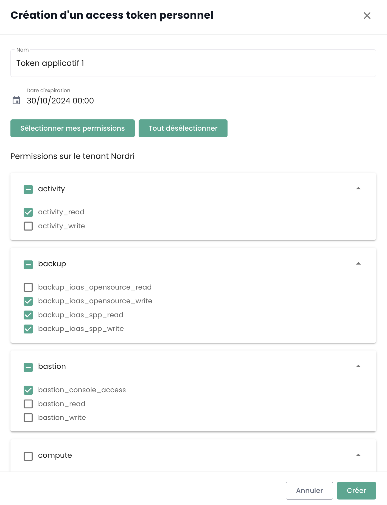

## Claves API

La __clave API__ permite autenticarse cuando desea realizar solicitudes a la API. La generación de una clave API, también llamada __Personal Access Token (PAT)__,
es una forma segura de conectarse a las API de Shiva sin pasar por una interfaz gráfica. Cada uno de estos tokens está vinculado a un tenant y al usuario que lo creó.

La creación de este token se realiza desde su cuenta. Es posible generar varias claves y configurar para cada una los permisos dentro del límite de sus derechos.

Para crear una clave API, simplemente __haga clic en su perfil__ :


En el menú del perfil, haga clic en __'Token de acceso personal'__


Entonces verá en la pantalla todas las claves API que se han creado para este usuario en este tenant. Haga clic en __'Nuevo token de acceso personal'__



Entonces debe:

- Indicar el nombre de este nuevo token,
- Indicar una fecha de caducidad (máximo 12 meses de validez),
- Elegir los permisos asociados al token.

Los detalles de su token se muestran entonces. __Atención, ya no será posible acceder a ellos posteriormente.__

Si no anota esta información, deberá destruir y recrear el token.


Por una cuestión de seguridad, se recomienda crear varios tokens, cada uno con un uso específico (un token para cada aplicación o cada proceso empresarial) en lugar de crear 1 token con todos los derechos.

Luego verá el nuevo token creado y su futura fecha de caducidad.


## Acceso al portal API

La documentación OpenAPI 3.0 (Swagger) de las API de la consola Cloud Temple está disponible directamente en la aplicación:


El acceso a las API requiere estar autenticado. Una vez autenticado, todas las operaciones deben tener el encabezado
__'Authorization'__ con el bearer access token obtenido durante la fase de autenticación.

La URL de los puntos de acceso se proporciona directamente en __Swagger__ (en el objeto "Servers" de cada página de API).

## Las actividades

El seguimiento de las solicitudes de tipo escritura (POST, PUT, PATCH, DELETE) se asegura mediante la gestión de actividades. Cada solicitud de este tipo genera automáticamente una actividad asociada. Un código de estado HTTP 201 confirma la creación exitosa de la actividad. El identificador único de esta actividad se devuelve en los encabezados de la respuesta, bajo la clave 'Location'.


Una vez recuperado el identificador, es posible acceder a los detalles de la actividad utilizando la API del módulo Activity:


El contenido de la actividad incluye todas las informaciones esenciales para identificar la operación, su fecha de ejecución, así como su estado de avance. Aquí está el modelo de una actividad:

```
    {
    "tenantId": "UUIDV4",
    "description": "STRING",
    "type": "ComputeActivity" | "BackupActivity" | "IAMActivity" | "TagActivity" | "RTMSActivity" | "BastionActivity" | "SupportActivity",
    "tags": "STRING[]",
    "initiator": "UUIDV4",
    "concernedItems": [
        {
        "type": "string",
        "id": "string"
        }
    ],
    "id": "UUIDV4",
    "creationDate": "DATE",
    "operationType": "read" | "write",
    "state": "CompletedState | RunningState | WaitingState | FailedState"
}
```

El objeto **state** puede tomar diferentes formas según el estado de la actividad, a saber:

**waiting**, estado antes de que la operación haya comenzado:
```
    waiting: {}
```
**running**, estado cuando la operación está en curso:
```
    running: {
    status: string;
    startDate: Date;
    progression: number;
    };
```
**failed**, estado si la operación ha fallado:
```
    failed: {
    startDate: Date;
    stopDate: Date;
    reason: string;
    };
```
**completed**, estado si la operación ha terminado:
```
    completed: {
    startDate: Date;
    stopDate: Date;
    result: string;
    };
```

**Nota: el Identificador (UUIDv4) del recurso creado está disponible en el resultado de la actividad una vez que ésta se ha completado.**

## Límites API

### ¿Por qué límites?

La consola Cloud Temple define __límites en el volumen de solicitudes__ que un usuario puede dirigir
a la API en un período determinado. El establecimiento de estos límites de frecuencia es una medida común en la gestión de API, adoptada por varios motivos esenciales:

- **Prevenir abusos**: Estos límites contribuyen a salvaguardar la integridad de la API previniendo los usos
abusivos o inadecuados susceptibles de comprometer su funcionamiento.
- **Asegurar la calidad de servicio**: Al regular el acceso a la API, nos aseguramos de una distribución equitativa
de los recursos, permitiendo así a todos los usuarios beneficiarse de una experiencia estable y de alto rendimiento.

Tomemos el ejemplo de un script mal diseñado o ineficaz que intenta hacer llamadas repetitivas a la API,
arriesgándose a saturar los recursos y degradar el rendimiento. Al establecer umbrales de solicitudes,
prevenimos estas situaciones y aseguramos el mantenimiento de __un servicio fluido y sin interrupciones__ para todos nuestros clientes.

### ¿Cuáles son los límites de tasa para la API de la consola Cloud Temple?

Aplicamos restricciones cuantitativas en las interacciones de los usuarios con la consola
para cada producto.

Los límites se definen en __solicitudes por segundo (r/s) y por IP de origen__. Más allá del umbral límite, el sistema responderá
con un código de error HTTP 429, señalando que se ha superado el límite de solicitudes autorizadas.

Aquí están los límites definidos:

| Producto               | Umbral límite |
|----------------------|--------------|
| Consola Cloud Temple | 60 r/s       |
| Identidad (IAM)      | 60 r/s       |
| IaaS - Cálculo       | 60 r/s       |
| IaaS - Almacenamiento| 20 r/s       |
| IaaS - Respaldo      | 60 r/s       |
| PaaS - S3            | 60 r/s       |
| PaaS - Openshift     | 60 r/s       |
| Red                  | 60 r/s       |
| Alojamiento          | 60 r/s       |

### ¿Cómo funcionan los límites de tasa?

Si el número de solicitudes enviadas a un punto de API excede el límite autorizado, el punto de API reaccionará devolviendo
__un código de respuesta HTTP 429__. Este código indica que el usuario ha superado el número de solicitudes permitidas.
Cuando esto se produce, el punto de API también proporcionará un objeto JSON como respuesta,
el cual contendrá información detallada sobre la limitación aplicada:
```
    {
        "error": {
            "status": "429 Too Many Requests",
            "message": "Too Many Requests"
        }
    }
```
### ¿Cómo evitar realizar demasiadas solicitudes?

Se recomienda limitar el número de llamadas a la API efectuadas por su automatización para mantenerse por debajo
del límite de tasa fijado para el terminal.

Esta situación ocurre a menudo cuando varias solicitudes son ejecutadas en paralelo,
utilizando múltiples procesos o hilos.

Existen varias formas de mejorar la eficiencia de su automatización, en particular mediante el uso de mecanismos
de __cache__ e implementando __un sistema de reintento con atenuación progresiva__. Esta metodología consiste
en realizar una breve pausa cuando se encuentra un error de límite de tasa, y luego volver a intentar la solicitud.
Si la solicitud falla nuevamente, la duración de la pausa se incrementa progresivamente hasta que la solicitud tenga éxito
o hasta que se alcance un número máximo de reintentos.

Este enfoque tiene muchos beneficios:

- __La atenuación progresiva__ garantiza que los primeros intentos se realicen rápidamente, mientras se prevén demoras más largas en caso de fallos repetidos.
- La adición de __una variación aleatoria__ a la pausa ayuda a evitar que todos los intentos se realicen simultáneamente.

Es importante señalar que __las solicitudes fallidas no afectan su límite de tasa__.
Sin embargo, reciclar continuamente una solicitud podría no ser una solución viable a largo plazo,
ya que este comportamiento podría modificarse en el futuro. Por lo tanto, le recomendamos no depender exclusivamente de este mecanismo.

Las bibliotecas __[Backoff](https://pypi.org/project/backoff/)__ y __[Tenacity](https://pypi.org/project/tenacity/)__ en Python
son buenos puntos de partida para implementar estrategias de atenuación.

## Ciclo de vida de un endpoint API

La información sobre la evolución de los endpoints de la API está disponible en las notas de actualización:


Encontrará la lista de endpoints que están obsoletos actividad por actividad.

Además, los endpoints que están obsoletos aparecerán de esta manera en nuestras API:
__~~this/is/an/endpoint~~__ así como una fecha de eliminación definitiva en la descripción.
