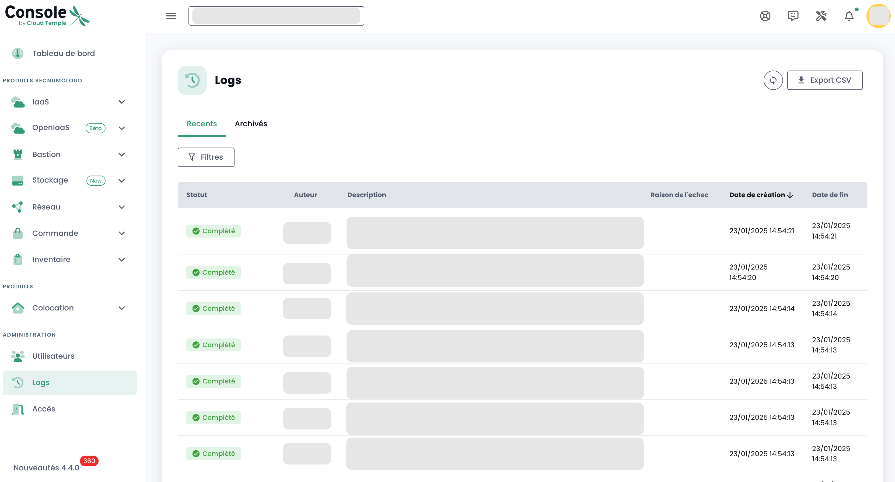

## Prérequis
- Haber suscrito una oferta de Cloud Temple. Para suscribirse fácilmente, puede [contactarnos](https://www.cloud-temple.com/contactez-nous/) o por correo a la dirección __contact@cloud-temple.com__.
- Tener acceso a la consola Shiva
- Tener su IPv4 pública declarada en la zona de confianza de Cloud Temple (el acceso a la consola shiva está limitado a las direcciones de confianza identificadas)

## Conexión a su tenant Cloud Temple
Shiva es accesible a través de la URL a continuación:
    https://shiva.cloud-temple.com
    O desde la URL directa que se le haya comunicado por correo.

La primera página le permite seleccionar [la organización](iam/concepts.md#organisations) en la que se ha creado su usuario.
Una vez que la empresa esté indicada, por favor haga clic en __'Iniciar sesión'__.

A continuación, será redirigido a una página que le pedirá que se autentique.
Una vez conectado, llegará a esta página.

## Gestión del idioma
La consola está disponible en __francés__, __inglés__. Puede cambiar el idioma de funcionamiento a través del ícono __idioma__ situado en la parte superior derecha de la pantalla.

El cambio de idioma de un usuario se realiza en su __'Perfil'__, en la parte superior derecha de la pantalla, en los __'Configuraciones de usuario'__.

La configuración se hace para cada tenant [Tenant](iam/concepts.md#tenant).

## Acceso al soporte técnico

En cualquier momento, puede contactar con __el equipo de soporte de Cloud Temple__ a través del __ícono 'flotador'__ situado en la parte superior derecha de la pantalla.

Será guiado durante todo el proceso de solicitud de soporte.

La primera etapa es la identificación del tipo de solicitud de soporte:

- Solicitar un consejo sobre la utilización de un producto (fuera de incidentes),
- Solicitar asistencia relacionada con su cuenta de cliente,
- Declarar un incidente o solicitar soporte técnico.
- Solicitar la asistencia de un servicio profesional (disponibilidad de un ingeniero de Cloud Temple para una problemática).

Luego tiene la posibilidad de dar precisiones e incluir archivos (imagen o registros, por ejemplo).

El solicitante también puede especificar un nivel de criticidad (P1 a P4) en la descripción del ticket, en caso de incidente, como:

**CRÍTICO (P1)**:

- Sospecha de fuga de datos sensibles
- Detección de acceso no autorizado a sus datos
- Compromiso de sus credenciales de administración
- Indisponibilidad total de sus servicios críticos
- Comportamientos anormales en datos sensibles
- Violación de datos personales

**ALTO (P2)**:

- Mal funcionamiento de los accesos de usuario
- Anomalía en la encriptación de sus datos
- Pérdida de acceso a ciertas funcionalidades críticas
- Incoherencia en los datos
- Lentitud mayor que impacta la actividad

**MEDIO (P3)**:

- Problema de rendimiento localizado
- Incidente en una función no crítica
- Error de configuración con impacto limitado
- Dificultad de acceso puntual

**BAJO (P4)**:

- Solicitud de investigación
- Anomalía sin impacto directo
- Pregunta de conformidad
- Necesidad de aclaración técnica

Una vez realizada su solicitud, es posible encontrar sus solicitudes a través del __ícono 'flotador'__ situado en la parte superior derecha de la pantalla:

## Acceso a las funcionalidades de usuario vía la interfaz web

El conjunto de funcionalidades accesibles a su usuario (de acuerdo con sus derechos) está situado a la izquierda de la pantalla, en la banda verde.
Las funcionalidades están agrupadas por módulo. Esto reúne principalmente:

- El __inventario__ de sus recursos,
- El __seguimiento de las operaciones__,
- El __pilotaje de los recursos IaaS__ (Cálculo, almacenamiento, red, ...)
- El __pilotaje de los recursos OpenIaaS__ (Cálculo, almacenamiento, red, ...)
- El acceso a __servicios adicionales__ (Bastion, monitoring, ...)
- La __administración de su organización__ (Gestión de los tenants, derechos, ...)

La activación de un módulo para un usuario depende de los derechos del usuario. Por ejemplo, el módulo __'Orden'__ no estará disponible si el usuario no dispone del derecho __'ORDER'__.

Aquí está una presentación de los diferentes módulos disponibles. Nuevos módulos enriquecen la consola regularmente:

- __Tablero__: permite tener rápidamente una vista del __total de recursos de cálculo y almacenamiento__, las estadísticas de __respaldo__ y una __síntesis de los casos de soporte__,
- __Inventario__: permite tener una vista de todos sus recursos del tipo __'máquinas virtuales'__. Si se utilizan __etiquetas__, permite tener una vista por __etiqueta__ (por ejemplo, vista de negocio, vista de aplicación, ...),
- __Gestión__: Da acceso al seguimiento de sus __solicitudes de soporte__ y a la __metrología de servicios__,
- __IaaS__: permite el __pilotaje de las infraestructuras IaaS de VMware__ (Máquinas virtuales, clústeres, hipervisores, replicaciones, respaldo, ...),
- __OpenIaaS__: permite el __pilotaje de los recursos de Xen Orchestra__ (Máquinas virtuales, respaldo, ...),
- __OpenShift__: permite el pilotaje de su **arquitectura PaaS RedHat Openshift** y la gestión de sus contenedores en las 3 zonas de disponibilidad de la plataforma.
- __Bastion__: Permite desplegar y pilotar appliances bastion SSH/RDP en sus redes,
- __Red__: permite el pilotaje de las __redes de nivel 2 y 3__, las __IPs públicas__ y sus __circuitos de telecomunicaciones__,
- __Colocación__: Ofrece la vista de los equipos situados en la zona de __colocación compartida o dedicada__,
- __Orden__: Permite la ordenación de recursos y el seguimiento de los despliegues,
- __Administración__: Agrupa las funciones de administración de los usuarios y de los tenants así como el acceso a la registración global.

Los pictogramas __'NEW'__ significan que el producto en cuestión ha sido proporcionado pero aún no está calificado __oferta SecNumCloud__ y __'BETA'__ significan que el producto en cuestión ha sido proporcionado y recién calificado __oferta SecNumCloud__.

**Registro - Seguimiento de Actividades**
=====================================

La página de actividades está destinada a proporcionar una visibilidad completa sobre todas las operaciones de lectura y escritura realizadas en la consola, asegurando así una trazabilidad y una seguridad mejoradas. Pone en relieve las dos pestañas principales: Recientes y Archivadas.

### **Estructura de la Página**

#### **Pestañas**
	+ **Recientes**
		- Operaciones recientes
		- Seguimiento en tiempo real
	+ **Archivadas**
		- Operaciones en un período más largo
		- Operaciones archivadas para trazabilidad y conformidad
#### **Información Mostrada**
	+ Fecha y Hora
	+ Tipo de operación
    + Estado
	+ Usuario
	+ Descripción de la operación
#### **Funcionalidad**
	+ Búsqueda/Filtrado para operaciones específicas

### **Uso**
* **Acceso:** permiso `activity_read`
* **Navegación:**
	- Seleccione la pestaña "Recientes" para las operaciones en tiempo real.
	- Elija "Archivadas" para consultar el historial.
	- Utilice las funcionalidades de búsqueda y filtrado para localizar operaciones específicas.

#### **Nota de Conformidad**
De conformidad con la calificación SecNumCloud, el almacenamiento de eventos de la consola Cloud Temple es por un período mínimo de **6 meses**, garantizando así el cumplimiento de los requisitos de seguridad y trazabilidad.

## Acceso a las funcionalidades de usuario vía API

El acceso al conjunto de funcionalidades de la consola Shiva es posible a través de la API Shiva. Puede tener el detalle de los verbos y configuraciones vía __'Perfil'__ y __'APIs'__:

## Provider Terraform

Cloud Temple pone a su disposición un provider de Terraform para pilotar "as code" su plataforma Cloud. Es accesible aquí:

https://registry.terraform.io/providers/Cloud-Temple/cloudtemple/latest