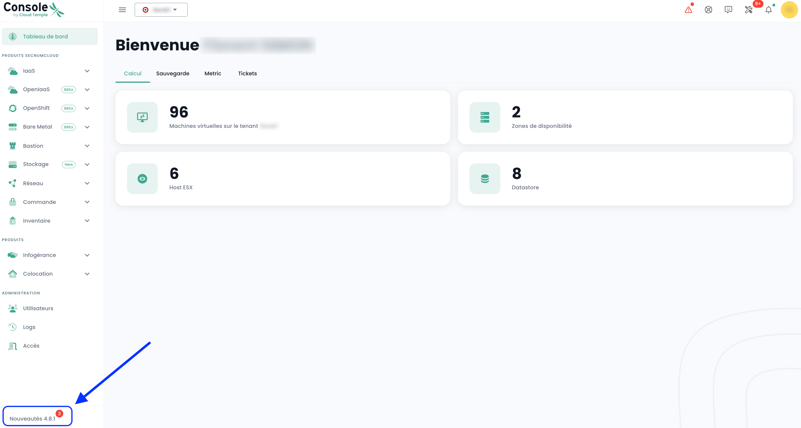

## Prérequis
- Haber suscrito a una oferta Cloud Temple. Para suscribirse fácilmente, puede [contactarnos](https://www.cloud-temple.com/contactez-nous/) o por correo a la dirección __contact@cloud-temple.com__.
- Tener acceso a la consola Shiva.
- Tener su IPv4 pública declarada en la zona de confianza Cloud Temple (el acceso a la consola Shiva está limitado a las direcciones de confianza identificadas).

## Conexión a su tenant Cloud Temple
Shiva es accesible a través de la URL siguiente:
    https://shiva.cloud-temple.com
    O bien desde la URL directa que se le haya comunicado por correo.

La primera página le permite seleccionar [la organización](iam/concepts.md#organisations) en la cual su usuario ha sido creado.
Una vez que ha ingresado la empresa, haga clic en __'Se connecter'__.

Será redirigido a una página que le pedirá autenticarse.
Una vez conectado, llegará a esta página.

## Gestión del idioma
La consola está disponible en __francés__, __inglés__. Puede cambiar el idioma de funcionamiento mediante el ícono __idioma__ situado arriba a la derecha de la pantalla.

El cambio de idioma de un usuario debe realizarse en su __'Perfil'__, en la parte superior derecha de la pantalla, en los __'Parámetros de usuario'__.

La configuración se realiza para cada tenant [Tenant](iam/concepts.md#tenant).

## Acceso al soporte técnico

En todo momento, puede contactar al __equipo de soporte Cloud Temple__ a través del __ícono 'boya'__ situado en la parte superior derecha de la pantalla.

Se le guiará en todo el proceso de solicitud de soporte.

El primer paso es la identificación del tipo de solicitud de soporte:

- Pedir un consejo sobre el uso de un producto (fuera de incidentes),
- Solicitar asistencia relacionada con su cuenta de cliente,
- Declarar un incidente o solicitar soporte técnico.
- Solicitar la asistencia de un servicio profesional (disponibilidad de un ingeniero de Cloud Temple para un problema específico).

Luego tiene la posibilidad de dar detalles e incluir archivos (por ejemplo imagen o registros).

El solicitante también puede especificar un nivel de criticidad (P1 a P4) en la descripción del ticket, en caso de un incidente, como:

**CRÍTICO (P1)**:

- Sospecha de fuga de datos sensibles
- Detección de acceso no autorizado a sus datos
- Compromiso de sus credenciales de administración
- Indisponibilidad total de sus servicios críticos
- Comportamientos anormales en datos sensibles
- Violación de datos personales

**ALTO (P2)h**:

- Mal funcionamiento de los accesos de usuarios
- Anomalía en el cifrado de sus datos
- Pérdida de acceso a algunas funcionalidades críticas
- Incoherencia en los datos
- Lentitud significativa que afecta la actividad

**MEDIO (P3)**:

- Problema de rendimiento localizado
- Incidente en una función no crítica
- Error de configuración con impacto limitado
- Dificultad de acceso puntual

**BAJO (P4)**:

- Solicitud de investigación
- Anomalía sin impacto directo
- Pregunta de conformidad
- Necesidad de aclaración técnica

Una vez realizada su solicitud, es posible encontrar sus solicitudes a través del __ícono 'boya'__ situado en la parte superior derecha de la pantalla:

## Acceso a las funcionalidades del usuario a través de la interfaz web

Todas las funcionalidades accesibles a su usuario (según sus derechos) se encuentran en la parte izquierda de la pantalla, en el barra verde.
Las funcionalidades se agrupan por módulo. Principalmente se agrupan en:

- El __inventario__ de sus recursos,
- El __seguimiento de operaciones__,
- La __gestión de recursos IaaS__ (Cómputo, almacenamiento, red, ...)
- La __gestión de recursos OpenIaaS__ (Cómputo, almacenamiento, red, ...)
- El acceso a __servicios adicionales__ (Bastión, monitoreo, ...)
- La __administración de su organización__ (Gestión de tenants, derechos, ...)

La activación de un módulo para un usuario depende de los derechos del usuario. Por ejemplo, el módulo __'Pedido'__ no estará disponible si el usuario no tiene el derecho __'ORDER'__.

Aquí una presentación de los diferentes módulos disponibles. Nuevos módulos enriquecen la consola regularmente:

- __Tablero de Control__: permite obtener una vista rápida del __total de recursos de cómputo y almacenamiento__, las estadísticas de las __copias de seguridad__ y un __resumen de los tickets de soporte__,
- __Inventario__: permite obtener una vista de todos sus recursos del tipo __'máquinas virtuales'__. Si se utilizan __tags__, permite una vista por __tag__ (por ejemplo, vista por negocio, vista por aplicación, ...),
- __Infogestión__: da acceso al seguimiento de sus __solicitudes de soporte__ y a la __metrología de los servicios__,
- __IaaS__: permite la __gestión de infraestructuras VMware IaaS__ (Máquinas virtuales, clusters, hipervisores, réplicas, copias de seguridad, ...),
- __OpenIaaS__: permite la __gestión de recursos Xen Orchestra__ (Máquinas virtuales, copias de seguridad, ...),
- __OpenShift__: permite la gestión de su **arquitectura PaaS RedHat OpenShift** y la administración de sus contenedores en las 3 zonas de disponibilidad de la plataforma.
- __Bastion__: permite desplegar y gestionar appliances bastión SSH/RDP en sus redes,
- __Red__: permite la gestión de __redes de nivel 2 y 3__, de __IPs públicas__ y de sus __circuitos de telecomunicaciones__,
- __Colocación__: ofrece la vista sobre los equipos situados en la zona de __colocación compartida o dedicada__,
- __Pedido__: permite la realización de pedidos de recursos y el seguimiento de despliegues,
- __Administración__: agrupa las funciones de administración de usuarios y tenants así como el acceso a la auditoría global.

Los pictogramas __'NEW'__ significan que el producto en cuestión ha sido habilitado pero aún no está calificado como __oferta SecNumCloud__ y __'BETA'__ significan que el producto en cuestión ha sido habilitado y acaba de ser calificado como __oferta SecNumCloud__.

**Auditoría - Seguimiento de Actividades**
=====================================

La página de actividades está destinada a proporcionar una visión completa sobre todas las operaciones de lectura y escritura realizadas en la consola, asegurando así una mayor trazabilidad y seguridad. Destaca dos pestañas principales: Recientes y Archivadas.

### **Estructura de la Página**

#### **Pestañas**
	+ **Recientes**
		- Operaciones recientes
		- Seguimiento en tiempo real
	+ **Archivadas**
		- Operaciones en un periodo más largo
		- Operaciones archivadas para trazabilidad y conformidad
#### **Información Mostrada**
	+ Fecha y Hora
	+ Tipo de operación
	+ Estado
	+ Usuario
	+ Descripción de la operación
#### **Funcionalidad**
	+ Búsqueda/Filtrado para operaciones específicas

### **Uso**

* **Acceso:** permiso `activity_read`
* **Navegación:**
	- Seleccione la pestaña "Recientes" para operaciones en tiempo real.
	- Elija "Archivadas" para consultar el historial.
	- Use las funciones de búsqueda y de filtrado para localizar operaciones específicas.

#### **Nota de Conformidad**
De acuerdo con la calificación SecNumCloud, el almacenamiento de los eventos en la consola Cloud Temple es de al menos **6 meses**, garantizando así el cumplimiento de los requisitos de seguridad y trazabilidad.

## Consulta de las últimas actualizaciones

Haga clic en la parte inferior izquierda de la barra verde en el ícono __'Novedades'__. Verá el detalle de los cambios para cada versión de la consola Cloud Temple.

## Acceso a las funcionalidades del usuario a través de la API

El acceso a todas las funcionalidades de la consola Shiva es posible a través de la API Shiva. Puede ver el detalle de los verbos y las configuraciones a través de __'Perfil'__ y __'APIs'__:

## Provider Terraform

Cloud Temple pone a su disposición un proveedor Terraform para gestionar su plataforma Cloud como código. Está accesible aquí:

https://registry.terraform.io/providers/Cloud-Temple/cloudtemple/latest