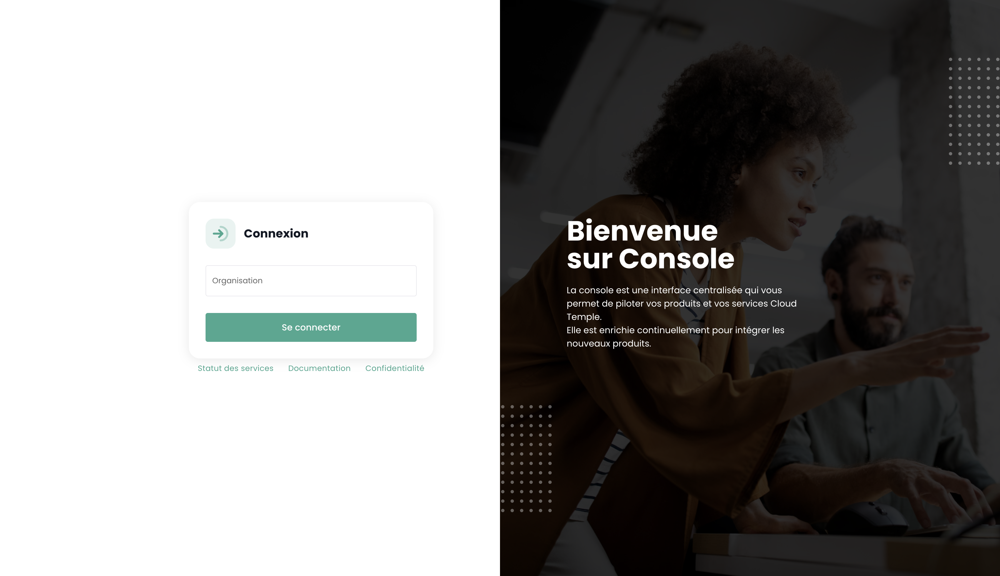

## Prérequis
- Tener suscrito una oferta Cloud Temple. Para suscribirse fácilmente, puede [contactarnos](https://www.cloud-temple.com/contactez-nous/) o por correo electrónico a la dirección __contact@cloud-temple.com__.
- Tener acceso a la consola Shiva
- Tener su IPv4 pública declarada en la zona de confianza Cloud Temple (el acceso a la consola Shiva está limitado a las direcciones de confianza identificadas)

## Conexión a su tenant Cloud Temple
Shiva es accesible a través de la URL a continuación:
    https://shiva.cloud-temple.com
    O bien desde la URL directa que se le ha comunicado por correo.

La primera página le permite seleccionar [la organización](iam/concepts.md#organisations) en la cual su usuario ha sido creado.
Una vez ingresada la empresa, haga clic en __'Se connecter'__.

Luego será redirigido a una página que le pedirá autenticarse.
Una vez conectado, llegará a esta página.

## Gestión del idioma
La consola está disponible en __francés__, __inglés__. Puede cambiar el idioma de funcionamiento utilizando el ícono __idioma__ situado en la parte superior derecha de la pantalla.

El cambio de idioma de un usuario se realiza en su __'Perfil'__, en la parte superior derecha de la pantalla, en los __'Parámetros de usuario'__.

La configuración se realiza para cada tenant [Tenant](iam/concepts.md#tenant).

## Acceso al soporte técnico

En cualquier momento, puede contactar con __el equipo de soporte Cloud Temple__ a través del __ícono 'boya'__ situado en la parte superior derecha de la pantalla.

Será guiado durante todo el proceso de solicitud de soporte.

La primera etapa es la identificación del tipo de solicitud de soporte:

- Pedir un consejo sobre el uso de un producto (sin incidente),
- Pedir asistencia relacionada con su cuenta de cliente,
- Declarar un incidente o solicitar soporte técnico.
- Solicitar la asistencia de un servicio profesional (disposición de un ingeniero Cloud Temple para un problema).

Después tendrá la posibilidad de dar precisiones e incluir archivos (imagen o registros, por ejemplo).

El solicitante también puede precisar un nivel de criticidad (P1 a P4) en la descripción del ticket, en caso de un incidente, como:

**CRÍTICO (P1)**:

- Sospecha de fuga de datos sensibles
- Detección de un acceso no autorizado a sus datos
- Compromiso de sus credenciales de administración
- Indisponibilidad total de sus servicios críticos
- Comportamientos anormales en datos sensibles
- Violación de datos personales

**ALTA (P2)**:

- Mal funcionamiento de los accesos de usuarios
- Anomalía en el cifrado de sus datos
- Pérdida de acceso a ciertas funcionalidades críticas
- Inconsistencias en los datos
- Lentitudes mayores afectando la actividad

**MEDIA (P3)**:

- Problema de rendimiento localizado
- Incidente en una función no crítica
- Error de configuración con impacto limitado
- Dificultad de acceso puntual

**BAJA (P4)**:

- Solicitud de investigación
- Anomalía sin impacto directo
- Pregunta de conformidad
- Necesidad de aclaración técnica

Una vez realizada su solicitud, es posible encontrar sus solicitudes a través del __ícono 'boya'__ situado en la parte superior derecha de la pantalla:

## Acceso a las funcionalidades del usuario a través de la interfaz web

El conjunto de las funcionalidades accesibles a su usuario (en función de sus derechos) está situado a la izquierda de la pantalla, en la banda verde.
Las funcionalidades se agrupan por módulos. Principalmente incluye:

- El __inventario__ de sus recursos,
- El __seguimiento de las operaciones__,
- El __pilotaje de los recursos IaaS__ (Cálculo, almacenamiento, red, ...)
- El __pilotaje de los recursos OpenIaaS__ (Cálculo, almacenamiento, red, ...)
- El acceso a __servicios anexos__ (Bastión, monitoreo, ...)
- La __administración de su organización__ (Gestión de los tenants, de los derechos, ...)

La activación de un módulo para un usuario depende de los derechos del usuario. Por ejemplo, el módulo __'Commande'__ no estará disponible si el usuario no dispone del derecho __'ORDER'__.

Aquí hay una presentación de los diferentes módulos disponibles. Nuevos módulos enriquecen la consola regularmente:

- __Tablero de Control__ : permite ver rápidamente el __total de los recursos de cálculo y almacenamiento__, las estadísticas de la __copia de seguridad__ y un __resumen de los casos de soporte__,
- __Inventario__ : permite ver el conjunto de sus recursos del tipo __'máquinas virtuales'__. Si se utilizan __tags__, permite una vista por __tag__ (por ejemplo, vista de negocio, vista de aplicación, ...),
- __Gestión__ : da acceso al seguimiento de sus __solicitudes de soporte__ y a la __metrología de servicios__,
- __IaaS__ : permite el __pilotaje de las infraestructuras IaaS de VMware__ (Máquinas virtuales, clústeres, hipervisores, réplicas, copias de seguridad, ...),
- __OpenIaaS__ : permite el __pilotaje de los recursos de Xen Orchestra__ (Máquinas virtuales, copias de seguridad, ...),
- __OpenShift__ : permite el pilotaje de su **arquitectura PaaS de RedHat Openshift** y la gestión de sus contenedores en las 3 zonas de disponibilidad de la plataforma.
- __Bastión__ : permite desplegar y pilotar appliances bastión SSH/RDP en sus redes,
- __Red__ : permite el pilotaje de las __redes de nivel 2 y 3__, de las __IP públicas__ y de sus __circuitos de telecomunicaciones__,
- __Colocación__ : ofrece la vista de los equipos situados en la zona de __colocación compartida o dedicada__,
- __Pedido__ : permite el pedido de recursos y el seguimiento de implementaciones,
- __Administración__ : agrupa las funciones de administración de usuarios y tenants así como el acceso a la journalización global.

Los pictogramas __'NEW'__ significan que el producto en cuestión ha sido provisionado pero aún no está calificado como __oferta SecNumCloud__ y __'BETA'__ significan que el producto en cuestión ha sido provisionado y recién calificado como __oferta SecNumCloud__.

## Acceso a las funcionalidades del usuario a través de la API

El acceso al conjunto de las funcionalidades de la consola Shiva es posible a través de la API Shiva. Puede obtener el detalle de los verbos y configuraciones a través de __'Perfil'__ y __'APIs'__:

## Provider Terraform

Cloud Temple pone a su disposición un provider Terraform para pilotar *"as code"* su plataforma Cloud. Está accesible aquí:

https://registry.terraform.io/providers/Cloud-Temple/cloudtemple/latest