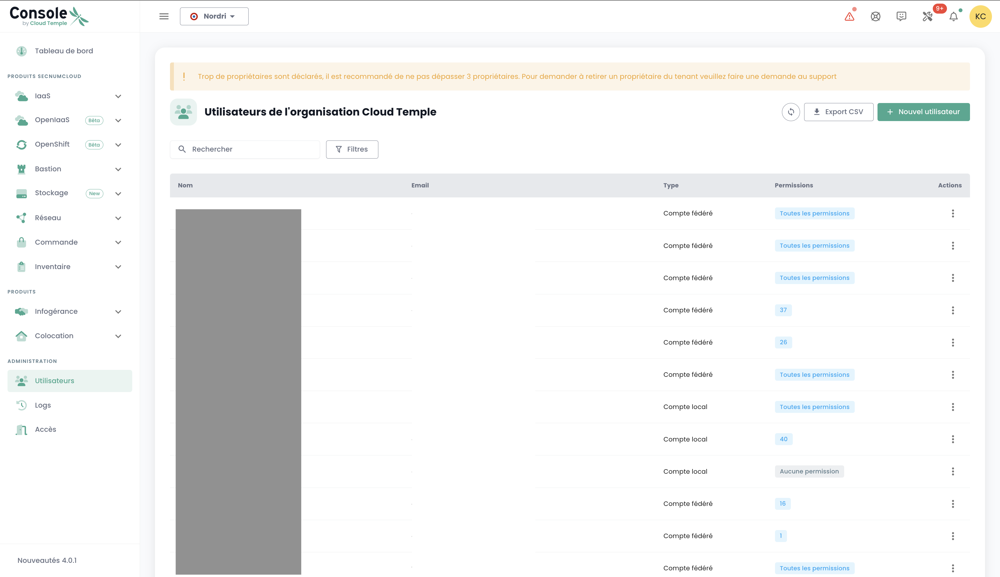
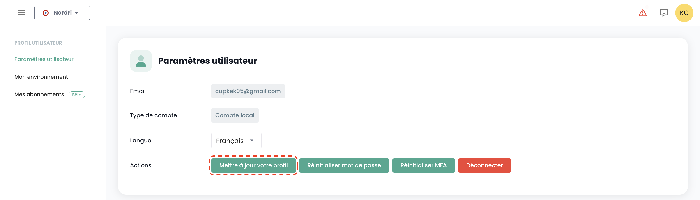
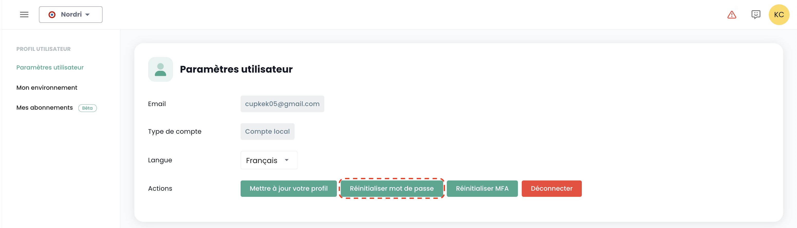
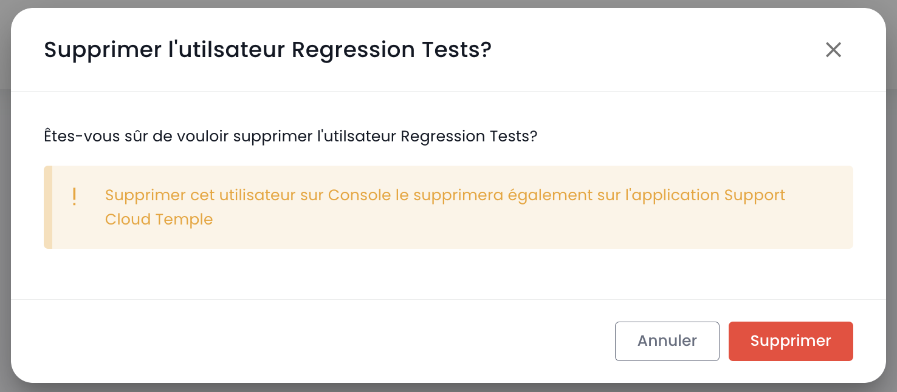
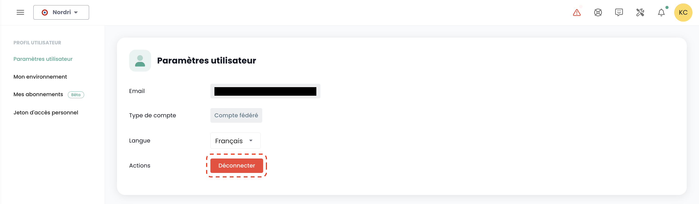
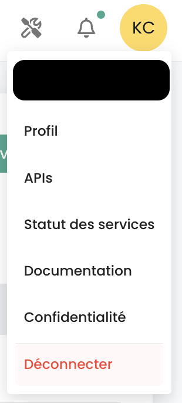
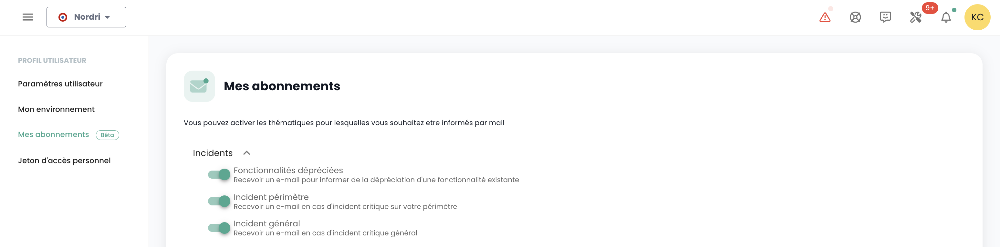

## Utilisateurs

Les comptes d'accès à la consola Shiva son creados por la cuenta maestra del contratante por invitación (cualquiera que sea el repositorio de autenticación).
La información de identificación es global a su [Organización](#organisations).

*__Nota:__ [La federación de identidad se gestiona a nivel de la organización](#organisations#mecanismes-dauthentification)*

### Creación de una cuenta de usuario en su organización

La creación de una cuenta de usuario en su organización se realiza por invitación. Para invitar a un usuario a una [Organización](#organisations), vaya al menú __'Administración'__ a la izquierda de su pantalla en la banda verde y luego en el submenú __'Usuarios'__.

Haga clic en el botón __'Nuevo Usuario'__ desde la página de usuarios.

Indique luego la dirección de correo del usuario

El usuario recibirá un correo de verificación.

Una vez realizada la verificación, el usuario podrá conectarse a la consola.

### Asignación de permisos a un usuario

La gestión de derechos de los usuarios se realiza desde la página de usuario.

Por defecto, un usuario no tiene derechos. Por lo tanto, es necesario que el administrador que hizo la invitación le otorgue los derechos necesarios para su actividad. Simplemente haga clic en el menú __'Acciones'__ del usuario y elija la opción __'Modificar'__.

El menú de activación de derechos aparecerá entonces:

La configuración de los permisos debe realizarse para cada [Tenant](#tenants) de la [Organización](#organisations).

La lista de permisos y su definición está disponible [aquí](#permissions).

### Reinscripción de un usuario

Cuando un usuario ha sido aprovisionado pero no ha validado su inscripción dentro del plazo de expiración del correo enviado por la Consola, ya no puede confirmar su inscripción. Es entonces posible enviarle un enlace para que renueve su primera inscripción.

La reinscripción de un usuario se realiza en la pestaña __'Usuario'__ del panel de Administración, en la parte inferior izquierda de la pantalla.

Seleccione el usuario que desea reinscribir, luego haga clic en el botón de acción al final de la línea y luego __'Reinscripción'__.

**Warning**: Asegúrese de ser el autor de la solicitud de reinscripción de su cuenta de usuario. Gracias por señalar todas las solicitudes que no provengan de usted a través de un ticket de soporte.

### Actualizar su perfil

Esta acción solo está disponible para una cuenta local (no SSO).

Seleccione en su __'Perfil'__, en la parte superior derecha de la pantalla, luego __'Configuración de usuario'__ y seleccione la acción __'Actualizar su perfil'__.

Luego vaya a su bandeja de entrada y haga clic en el enlace generado por la Consola. Simplemente siga los pasos para actualizar su perfil.

**Warning**: Asegúrese de ser el autor de la solicitud de actualización del perfil. Gracias por señalar todas las solicitudes que no provengan de usted a través de un ticket de soporte.

### Restablecimiento de la contraseña

Esta acción solo está disponible para una cuenta local (no SSO).

Seleccione en su __'Perfil'__, en la parte superior derecha de la pantalla, luego __'Configuración de usuario'__ y seleccione la acción __'Restablecer contraseña'__.

Luego vaya a su bandeja de entrada y haga clic en el enlace generado por la Consola. Simplemente siga los pasos para actualizar su contraseña.

**Warning**: Asegúrese de ser el autor de la solicitud de restablecimiento de su contraseña. Gracias por señalar todas las solicitudes que no provengan de usted a través de un ticket de soporte.

### Restablecimiento del factor doble de autenticación

Esta acción solo está disponible para una cuenta local (no SSO).

Seleccione en su __'Perfil'__, en la parte superior derecha de la pantalla, luego __'Configuración de usuario'__ y seleccione la acción __'Restablecer MFA'__.

Luego vaya a su bandeja de entrada y haga clic en el enlace generado por la Consola. Simplemente siga los pasos para actualizar su factor doble de autenticación.

**Warning**: Asegúrese de ser el autor de la solicitud de restablecimiento de su factor doble de autenticación. Gracias por señalar todas las solicitudes que no provengan de usted a través de un ticket de soporte.

### Eliminación de un usuario

La eliminación de un usuario se realiza en la pestaña __'Usuario'__ del panel de Administración, en la parte inferior izquierda de la pantalla.

Seleccione el usuario que desea eliminar, luego haga clic en el botón de acción al final de la línea y luego __'Eliminar'__.

Nota: No puede eliminarse a usted mismo ni eliminar a un usuario __'Propietario'__.

### Cerrar sesión

Cerrar sesión de un usuario se realiza en su __'Perfil'__, en la parte superior derecha de la pantalla, luego __'Desconectar'__.

Una desconexión automática se realiza cuando expira el token (JWT Token) de sesión.

### Cambiar el idioma de un usuario

El cambio de idioma de un usuario se realiza en su __'Perfil'__, en la parte superior derecha de la pantalla, en los __'Configuración de usuario'__.

La configuración se realiza para cada [Tenant](#tenants).

### Suscripción a notificaciones temáticas

La gestión de suscripciones permite recibir correos electrónicos relativos a los temas activados que serán enviados automáticamente durante la ocurrencia de eventos correspondientes.

Es accesible en el perfil de usuario, en la pestaña "Mis suscripciones":

Por ejemplo, en caso de incidente, se generarán notificaciones por correo electrónico específicas de este tema.

La lista de temas disponibles puede evolucionar y enriquecerse progresivamente para adaptarse a las necesidades y cambios en nuestro entorno operativo.

## Permisos

La consola Shiva permite una gestión precisa de los derechos de los usuarios de una organización, con una segregación por tenant.
Inicialmente, es la cuenta principal del contratante la que permite la configuración inicial de las cuentas y los permisos asociados.
Posteriormente, el derecho __'iam_write'__ permite a una cuenta administrar los permisos de otros usuarios.

### Permisos disponibles para los usuarios de su organización

Cuando se crea un usuario, no tiene ningún permiso por defecto. Cada permiso se otorga individualmente y funciona de manera independiente, sin superposición con otros permisos. Se aplican en conjunto, lo que significa que un usuario debe tener todos los permisos requeridos para realizar una acción específica.

Los siguientes permisos son configurables para cada usuario y para cada tenant de su organización:
	•	Permisos de tipo “read”: solo permiten la consulta de los recursos sin posibilidad de modificación.
	•	Permisos de tipo “write”: autorizan la modificación de las configuraciones.
 	•	Permisos de tipo “management”: autorizan la gestión avanzada de los recursos.

- __Estos son permisos, no roles.__ Como tal, es necesario tener el permiso READ y WRITE para modificar una configuración.

Última actualización: 23/01/2025

| Nombre del permiso                            | Descripción del permiso                                                                                                        |
| --------------------------------------------- | ------------------------------------------------------------------------------------------------------------------------------ |
| activity_read                                 | Consulta de los registros logs y actividades                                                                                   |
| activity_write                                | Gestión de los registros logs y actividades                                                                                    |
| backup_iaas_opensource_read                   | Gestión de recursos de tipo backup - Oferta OpenIaaS - consulta                                                                |
| backup_iaas_opensource_write                  | Gestión de recursos de tipo backup - Oferta OpenIaaS - modificación                                                            |
| backup_iaas_spp_read                          | Gestión de recursos de tipo backup - Oferta Vmware - consulta                                                                  |
| backup_iaas_spp_write                         | Gestión de recursos de tipo backup - Oferta Vmware - modificación                                                              |
| bastion_read                                  | Consulta de recursos de tipo bastion                                                                                           |
| bastion_write                                 | Gestión de recursos (appliances, sesiones,...) de tipo Bastion                                                                 |
| bastion_console_access                        | Autorización de acceso a la consola (ssh/rdp) de un recurso protegido por una appliance Bastion                                |
| compute_iaas_opensource_console_access        | Oferta OpenIaaS - Apertura de la consola de una máquina virtual                                                                |

| compute_iaas_opensource_infrastructure_read   | Oferta OpenIaaS - Consulta de datos avanzados de los recursos Xen Orchestra |
| compute_iaas_opensource_infrastructure_write  | Oferta OpenIaaS - Gestión avanzada de los recursos Xen Orchestra                                                                          |
| compute_iaas_opensource_read                  | Oferta OpenIaaS - Consulta de los recursos de tipo Máquinas Virtuales                                                        |
| compute_iaas_opensource_management            | Oferta OpenIaaS - Gestión de los recursos de tipo Máquinas Virtuales                                                             |
| compute_iaas_opensource_virtual_machine_power | Oferta OpenIaaS - Gestión de la alimentación de una máquina virtual                                                              |
| compute_iaas_vmware_console_access            | Oferta Vmware - Apertura de la consola de una máquina virtual                                                                 |
| compute_iaas_vmware_infrastructure_read       | Oferta Vmware - Consulta de datos avanzados de los recursos VMware (reglas de afinidad/anti-afinidad, configuración DRS, etc)  |
| compute_iaas_vmware_infrastructure_write      | Oferta Vmware - Gestión avanzada de los recursos VMware                                                                           |
| compute_iaas_vmware_read                      | Oferta Vmware - Consulta de los recursos de tipo Máquinas Virtuales                                                         |
| compute_iaas_vmware_management                | Oferta Vmware - Gestión de los recursos de tipo Máquinas Virtuales (permite el cifrado de una máquina virtual)                                                              |
| compute_iaas_vmware_virtual_machine_power     | Oferta Vmware - Gestión de la alimentación de una máquina virtual                                                               |
| baremetal_read                                | Oferta Bare Metal - Consulta de los recursos de tipo Bare Metal                                                               |
| baremetal_console_access                      | Oferta Bare Metal - Apertura de la consola de un Bare Metal                                                                  |
| console_public_access_read                    | Consulta de las IPs autorizadas a acceder a la consola                                                                         |
| console_public_access_write                   | Añadir IPs autorizadas a acceder a la consola                                                                                  |
| compute_virtual_machine_power                 | Gestión de la alimentación de una máquina virtual                                                                              |
| documentation_read                            | Consulta de los recursos de documentación de confluence                                                                        |
| housing_read                                  | Consulta de los recursos de tipo colocation                                                                                 |
| iam_offline_access                            | Creación y eliminación de Access Tokens Personales (PAT)                                                                        |
| iam_read                                      | Consulta de los derechos de usuarios                                                                                           |
| iam_write                                     | Gestión de los derechos de usuarios                                                                                                |
| intervention_read                             | Consulta de los cambios y puestas en producción previstas en la plataforma                                                  |
| inventory_read                                | Consulta de los recursos de tipo Inventario                                                                                 |
| inventory_write                               | Gestión de los recursos de tipo Inventario                                                                                      |
| monitoring_read                               | Consulta del monitoreo                                                                                                     |
| monitoring_write                              | Gestión del monitoreo                                                                                                          |
| metric_read                                   | Consulta de los datos de salud en las máquinas virtuales y hosts                                                         |
| network_read                                  | Consulta de los recursos de red                                                                                             |
| network_write                                 | Gestión de los recursos de red                                                                                                  |
| order_read                                    | Consulta de los pedidos de infraestructura                                                                                     |
| order_write                                   | Creación de pedidos de infraestructura                                                                                            |
| object-storage_iam_management                 | Permite gestionar las cuentas de almacenamiento en el producto S3                                                                       |
| object-storage_read                           | Permite ver los buckets y las configuraciones de los buckets                                                                   |
| object-storage_write                          | Permite editar los buckets y las configuraciones de los buckets                                                                  |
| openshift_management                          | Permite conectarse a las plataformas Openshift (scopeado al tenant)                                                          |
| support_management                            | Consulta de todos los tickets de soporte del tenant                                                                       |
| support_read                                  | Consulta de sus tickets de soporte del tenant                                                                                  |
| support_write                                 | Creación de un ticket de soporte en el tenant                                                                                     |
| tag_read                                      | Consulta de las etiquetas, excepto las etiquetas RTMS                                                                                   |
| tag_write                                     | Gestión de las etiquetas, excepto las etiquetas RTMS                                                                                        |
| ticket_comment_read                           | Consulta de los comentarios                                                                                                  |
| ticket_comment_write                          | Gestión de los comentarios                                                                                                       |
| ticket_read                                   | Consulta de los tickets                                                                                                       |
| ticket_write                                  | Gestión de los tickets                                                                                                            |

## Organizaciones

La organización está ligada a su __cuenta patrocinadora__ y al __contrato Cloud Temple asociado__. Representa su entidad (empresa, departamento, equipo, ...) que lleva la relación contractual entre Cloud Temple y usted.

### Principio de una organización

La organización tiene cuatro grandes roles:

- Representa __la entidad contractual__ para los aspectos de seguimiento y facturación,
- Define __la configuración global del mecanismo de autenticación__: la autenticación puede ser local a nivel de la consola Shiva o remota a través de un servicio de federación de identidad,
- Lleva el conjunto de __cuentas de usuario__,
- __Federa los tenants__ (Producción, Preproducción, Dev, Aplicación 1, Aplicación 2, ...) que usted define para las necesidades de su arquitectura Cloud.

Los roles (derechos/permiso) de los usuarios son configurables para cada tenant definida en su organización. Por ejemplo, una cuenta puede estar autorizada a pedir recursos en un tenant, pero no en otro.

### Mecanismos de autenticación

La consola Shiva permite a nivel de la organización __la configuración del mecanismo de autenticación__. Puede
utilizar el repositorio local de autenticación de la consola Shiva o asociar su organización a uno de
sus repositorios de autenticación.

Los siguientes repositorios externos son compatibles:

- Repositorios compatibles __OpenID Connect__,
- Repositorios compatibles __SAML__,
- __Microsoft ADFS__
- __Microsoft EntraID__ (Microsoft Azure Active Directory)
- Amazon AWS Cognito
- Okta
- Auth0
- KeyCloak

## Tenant

El tenant es un __agrupamiento de recursos dentro de una organización__. Una [Organización](#organisations) tiene al menos un tenant (llamado __tenant por defecto__, pudiendo ser renombrado). Generalmente, se utilizan varios tenants para segmentar las responsabilidades o los perímetros técnicos.

Por ejemplo:

- Un tenant __Producción__
- Un tenant __Preproducción__
- Un tenant __Receta__
- Un tenant __Calificación__
Mais il est aussi possible d'organiser les choses avec une __vista aplicativa__ o por __criticidad__ :

- Un tenant __Aplicación 1__ o __Criticidad 1__
- Un tenant __Aplicación 2__ o __Criticidad 2__
- ...

Los recursos técnicos pedidos son asignados a un tenant específico y no se comparten con otros tenants. Por ejemplo, un cluster de Hypervisor y las redes L2 asociadas solo están disponibles en un tenant.
En cuanto a las redes, es posible solicitar redes __'cross tenant'__ para asegurar la continuidad de red entre los tenants.

Las permisos de los usuarios deben definirse en cada tenant. Así, cada organización debe pensar detenidamente en los tenants deseados. Este punto generalmente se aborda en el taller de inicio, en el momento de la creación de la organización.

Es posible hacer evolucionar la arquitectura añadiendo o eliminando tenants.

Un tenant no puede estar vacío. Debe ser necesariamente inicializado con un mínimo de recursos:

- Una zona de disponibilidad (AZ, es decir, un datacenter físico),
- Un cluster de cálculo,
- Un espacio de almacenamiento,
- Un vlan de red.

| Referencia de pedido                                         | Unidad   | SKU                     |
|--------------------------------------------------------------|----------|-------------------------|
| TENANT - *(REGIÓN)* - Activación de un tenant                | 1 tenant | csp:tenant:v1           |
| TENANT - *(REGIÓN)* - Activación de una zona de disponibilidad| 1 tenant | csp:(region):iaas:az:v1 |

### Gestión de propietarios en un tenant
Cada tenant tiene al menos un propietario, garantizando así una responsabilidad clara y una gestión eficaz de los recursos asociados. Además, es posible declarar varios propietarios en el mismo tenant, permitiendo una colaboración y toma de decisiones compartida. A continuación, encontrará información importante a tener en cuenta al gestionar estos propietarios.

#### Información importante sobre la gestión de propietarios

#### 1. Número de propietarios
* No hay límite técnico en cuanto al número de propietarios que pueden definirse en el tenant.
* La interfaz de gestión (IHM) emite una advertencia cuando hay más de 3 propietarios, para incentivar a limitar el número de propietarios por razones de seguridad y gestión óptima de accesos.

#### 2. Adición de un nuevo propietario
* Al adicionar un nuevo propietario, la actualización de sus permisos puede tardar hasta 60 minutos.
* Este tiempo de propagación es normal y asegura que los derechos de acceso se apliquen correctamente a todos los servicios y recursos asociados.

#### 2. Permisos de un propietario
* Un propietario recibirá todos los permisos relacionados con los productos activados en su tenant.
* No es posible modificar los permisos de un propietario.

#### 3. Retiro de un propietario
* Para retirar un propietario del tenant, el usuario debe presentar una solicitud al soporte.
* Este procedimiento garantiza que las modificaciones de derechos de acceso se realicen de manera segura y conforme a las mejores prácticas de gestión de accesos.

### Autorización de acceso a un tenant: IP autorizadas

El acceso a la consola de gestión cloud está estrictamente limitado a las direcciones IP previamente autorizadas, en conformidad con los requisitos de la cualificación SecNumCloud. Esta restricción garantiza un nivel de seguridad reforzado, permitiendo el acceso solo a usuarios provenientes de rangos de IP especificados, minimizando así los riesgos de acceso no autorizado y protegiendo la infraestructura cloud según los más altos estándares de seguridad.

Nota: *La eliminación de una IP autorizada se realiza mediante una solicitud de soporte en la consola Cloud Temple.*

### Consumo de recursos dentro de un tenant

Es posible visualizar los recursos cloud consumidos dentro de un tenant, ofreciendo así una vista detallada del uso de los diferentes servicios desplegados. Esta funcionalidad permite a los usuarios seguir en tiempo real el consumo de sus recursos, identificar los servicios más solicitados y optimizar su uso en función de las necesidades.

En el menú de la consola, haga clic en "Informe de consumo" y luego seleccione el período de tiempo deseado. Podrá así visualizar en detalle el consumo de los recursos cloud en el período definido, lo que le permitirá analizar el uso de los servicios y optimizar su gestión en consecuencia:

