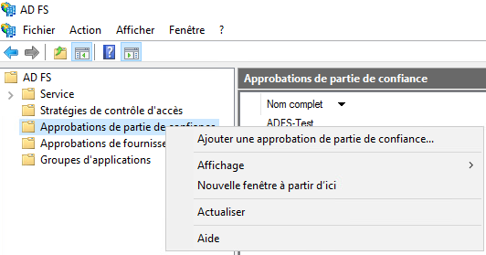
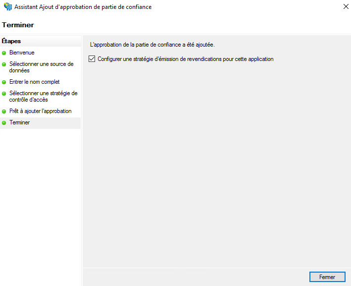
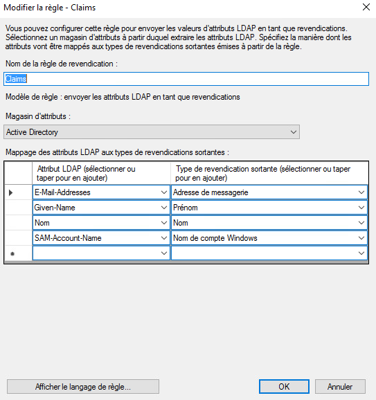

Aquí hay un ejemplo de configuración del repositorio de autenticación de una organización Cloud Temple con __Microsoft ADFS__.

La configuración de su repositorio Microsoft a nivel de una organización Cloud Temple facilita la autenticación de sus usuarios en la consola Shiva.
Esto permite evitar la multiplicación de factores de autenticación y reducir la superficie de ataque.
Si sus usuarios están autenticados en su cuenta Microsoft, la autenticación a los servicios de la consola Shiva será transparente.

Aquí están los diferentes pasos para realizar esta configuración:


## Prerrequisitos
Su servidor Microsoft ADFS debe poder acceder a la URL de Cloud Temple siguiente: https://keycloak-shiva.cloud-temple.com/auth/.

El ADFS debe poder ser accesible desde las redes de Cloud Temple y __exponer un certificado TLS de una CA pública__.

Los usuarios que deseen conectarse al portal deben tener su correo electrónico, nombre y apellido informados en el Active Directory.

## Etapa 2: Solicitar la configuración del SSO (Single Sign-On) de su organización

Esta parte de la configuración se realiza a nivel de la organización por el equipo Cloud Temple.

Para hacerlo, haga __una solicitud de asistencia__ en la consola indicando su deseo de configurar su repositorio de autenticación Microsoft ADFS.

Por favor, proporcione la siguiente información en la solicitud de asistencia:
```
    El nombre de su Organización
    El nombre de un contacto con su correo electrónico y número de teléfono para finalizar la configuración
    URL pública de los Metadatos de la federación del ADFS (<nombre de dominio del adfs>/FederationMetadata/2007-06/FederationMetadata.xml)
    (Ejemplo: https://adfs.test.local/FederationMetadata/2007-06/FederationMetadata.xml)
```
Tan pronto como la configuración se realice del lado de la consola Shiva, se informará al contacto indicado.

El equipo de soporte de Cloud Temple le proporcionará una URL que se parecerá a esta: https://keycloak-shiva.cloud-temple.com/auth/realms/companytest/broker/adfs_test/endpoint/descriptor

*Puede pegar la URL en un navegador para probarla. Si funciona correctamente, debería ver un XML.*

## Etapa 3: Realización de la configuración ADFS
### Configuración de la federación de autenticación

#### Adición de una confiar confiable

En su servidor ADFS, vaya a __"Agregar una confiar confiable"__.



### Configurar los "claims"
Los claims permiten proporcionar información al token que se transmitirá a la consola Cloud Temple.

Transmiten la información del usuario conectado que es necesaria para el buen funcionamiento de los diferentes servicios, tales como su correo electrónico, su nombre y apellido.


Seleccione "Importar los datos, publicados en línea o en una red local, relacionados con la confiar confiable" e ingrese la URL proporcionada por el soporte de Cloud Temple.


Puede ingresar un nombre y una descripción para la confiar confiable, esta parte es opcional.


Por defecto, autorizamos a todos, pero es posible seleccionar __"Autorizar un grupo específico"__ para seleccionar el o los grupos que estarán autorizados a acceder a los servicios de la consola Shiva a través del ADFS.


Una vez que haya completado todos estos pasos, habrá terminado la configuración de la confiar confiable.



Luego deberá editar la política de emisión de reclamaciones de esta nueva confiar confiable.


Haga clic en "Agregar una regla" y especifique el modelo, sea "Transformar una reclamación entrante".


Solo tendrá que ingresar la información según se indica en la captura de pantalla a continuación.


### Agregar los claims
Agregue una segunda regla con, esta vez, el modelo "Enviar atributos LDAP como reclamaciones".


Seleccione la tienda de atributos y agregue los atributos "Direcciones de Email, Nombre, Apellido y Nombre de Cuenta SAM" como se indica en la captura de pantalla a continuación.



Solo necesita aplicar los cambios.

## Etapa 3: Finalización

Ahora puede probar yendo a la consola Shiva y haciendo clic en el botón correspondiente a la autenticación ADFS del cliente; en este ejemplo, es __"ADFS Test"__


