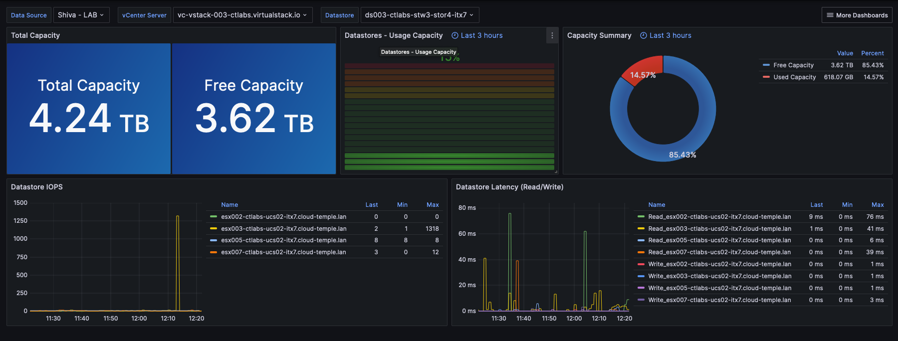

## Concept

La mayoría de los clientes __Cloud Temple__ disponen de herramientas de visualización, monitoreo y metrología para el seguimiento de sus operaciones. 

La filosofía de la consola Shiva es permitir el acceso a los datos para integrarse en este conjunto de herramientas a través de un proxy prometheus integrado.

Este proxy le permite consultar y manipular los datos desde una herramienta de visualización como [Grafana](https://grafana.com).

Es posible, sin embargo, visualizar algunos datos de rendimiento de sus recursos Cloud en la interfaz web de la consola Shiva.

*__Nota:__ La filosofía de __Cloud Temple__ no es integrar múltiples gráficos en la interfaz web, sino ofrecer la máxima información accesible a través de la API.*

## Panel de control integrado a la interfaz web

*__Nota:__ Para acceder a estos paneles, es necesario tener el derecho __'metric_read'__*

### Seguimiento de emisiones de carbono para el cálculo

El panel de control de la consola Shiva integra por defecto un gráfico de seguimiento del consumo eléctrico de su cálculo así como la estimación
de la emisión de carbono asociada.

Es accesible directamente en la página de inicio de la interfaz web de la consola Cloud Temple, haciendo clic en __'Metric'__ :

### Vista global del estado de las máquinas virtuales

La síntesis del estado de las máquinas virtuales es accesible en el menú __'IaaS'__ a la izquierda de su pantalla, en el submenú __'Santé'__ luego __'Machines virtuelles'__

Esta síntesis proporciona, en el intervalo de tiempo seleccionado en __'Filtres'__ :

- el número de CPU y el __promedio de uso de CPU__,
- la cantidad de GB de memoria y el __promedio de uso de memoria__,
- Las medias de __latencia de acceso al almacenamiento__ en lectura y escritura,
- El __'CPU Ready'__ promedio de la máquina virtual (lo que corresponde al tiempo promedio de espera de disponibilidad de un núcleo físico por la máquina virtual).

Para cada VM, puede acceder al historial de sus rendimientos haciendo clic en el icono verde __'Historique'__ de la máquina virtual en la columna acción. :

Luego accede a la página de visualización gráfica de datos históricos, incluyendo una vista de __rendimiento ambiental__:

## Uso con __Grafana__

Es posible para la consola Shiva servir como __datasource__ para su infraestructura [Grafana](https://grafana.com).

Podrá encontrar un conjunto completo de __ejemplos de configuración para Grafana__ aquí:

https://github.com/Cloud-Temple/console-grafana-iaas

