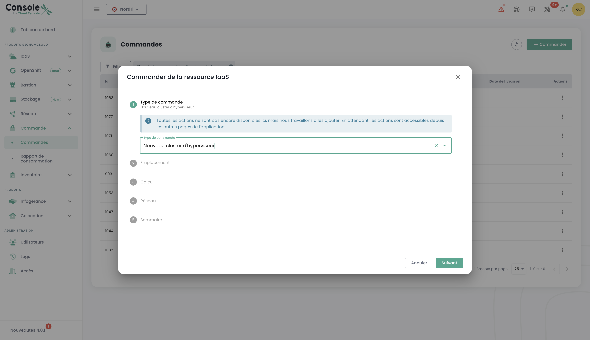

## Concepto

El seguimiento del despliegue de nuevos recursos se realiza en el menú __'Comandos'__ accesible en la barra verde a la izquierda de la pantalla.

Permite visualizar los recursos Cloud solicitados, en proceso de despliegue y los posibles errores dentro de un [Tenant](iam/concepts.md#tenant) de su [Organización](iam/concepts.md#organisations).

*__Nota: En este momento, la vista global a nivel de una organización de todos los recursos desplegados en los diferentes tenants aún no es posible.__ Este tema será tratado en 2024 mediante la implementación de un portal dedicado al solicitante (en el sentido de firmante) y a la gestión de su organización.*

El despliegue de recursos o su eliminación se realiza en cada uno de los productos en los menús __'IaaS'__ y __'Red'__ a la izquierda de la pantalla en la barra verde.

También es posible ver directamente las entregas al nivel de las notificaciones de la consola Cloud Temple:

Desde la página de pedidos, puede ver el estado de avance de una entrega y eventualmente dialogar con el equipo aportando comentarios o precisiones:

**Nota**: **No es posible lanzar varios pedidos del mismo tipo de recurso simultáneamente. Tendrá que esperar a que el pedido en curso sea procesado y finalizado antes de poder realizar uno nuevo. Esto garantiza una gestión eficiente y ordenada de los recursos dentro de su entorno.**

## Solicitar una nueva zona de disponibilidad

Es posible agregar una nueva zona de disponibilidad accediendo al menú "**Pedido**". Esta opción le permite ampliar sus recursos y mejorar la disponibilidad y resiliencia de sus aplicaciones con solo unos pocos clics:

Comience por seleccionar la ubicación deseada, eligiendo primero la región geográfica, luego la correspondiente zona de disponibilidad (AZ) entre las disponibles. Esta etapa permite adaptar el despliegue de sus recursos en función de la localización y de las exigencias de su infraestructura:

Luego, proceda a seleccionar el tipo de clúster de hipervisor deseado, eligiendo el que mejor responda a las necesidades de rendimiento y gestión de su infraestructura cloud:

Luego seleccione el número de hipervisores así como la cantidad de memoria deseada, para adaptar los recursos a la carga de trabajo y los requisitos específicos de su entorno cloud:

Luego seleccione el número de datastores a aprovisionar en el clúster así como sus tipos. Es importante notar que el número máximo de datastores permitido es 10, con un mínimo de 2 datastores requerido. Cada tipo de datastore diferente conllevará la creación de un datastoreCluster adicional. Por ejemplo, si elige 2 datastores de tipo "live" y 1 datastore de tipo "mass", esto resultará en la formación de 2 datastoreClusters distintos:

Defina el tamaño de almacenamiento necesario para la copia de seguridad asegurándose de prever una capacidad equivalente a la de su almacenamiento de producción. Tenga en cuenta una tasa de compresión promedio de 2 para optimizar el espacio de respaldo y asegurar una protección efectiva de sus datos:

Seleccione las redes a propagar según sus necesidades. También tiene la opción de activar la opción "Acceso a Internet" si es necesario, definiendo el número de direcciones IP deseadas, con una opción comprendida entre 1 y un máximo de 8:

Luego obtiene un resumen de las opciones seleccionadas antes de validar su pedido.

## Solicitar recurso adicional de almacenamiento

La lógica de asignación de almacenamiento en modo bloque en los clústeres de cálculo es TODO

### Desplegar un nuevo clúster de cálculo

Proceda a la solicitud de un clúster de hipervisor seleccionando las opciones adecuadas a sus necesidades de virtualización. Defina las características clave tales como el número de hipervisores, el tipo de clúster, la cantidad de memoria, así como los recursos de cálculo requeridos:

Seleccione la zona de disponibilidad:

Elija el tipo de blade de cálculo:

Luego tiene la opción de seleccionar redes ya existentes y propagarlas, o bien crear nuevas directamente en esta etapa, según las necesidades de su infraestructura. Note que el número total de redes configurables está limitado a un máximo de 20:

Luego obtiene un resumen de las opciones seleccionadas antes de validar su pedido y puede visualizar su pedido en curso:

### Desplegar un nuevo clúster de almacenamiento

En el menú "**pedido**", proceda a la solicitud de un **nuevo clúster de almacenamiento** para su entorno seleccionando las opciones que correspondan a sus necesidades en términos de capacidad, rendimiento y redundancia. Seleccione la ubicación:

Defina el número de datastores a aprovisionar en el clúster así como su tipo, respetando los límites siguientes: un mínimo de 2 datastores y un máximo de 10 pueden ser configurados. Elija los tipos de datastores que mejor respondan a sus necesidades en términos de rendimiento, capacidad y uso, para optimizar el almacenamiento de su entorno:

Seleccione el tipo de almacenamiento deseado entre las diferentes opciones disponibles:

Luego accede a un resumen completo de las opciones que ha seleccionado, permitiéndole verificar todos los parámetros antes de validar definitivamente su pedido:

### Desplegar un nuevo datastore dentro de un clúster SDRS VMware

En este ejemplo, vamos a agregar almacenamiento en modo bloque para una infraestructura VMware.
Para agregar un datastore adicional en su clúster de almacenamiento SDRS, vaya al submenú __'Infraestructura'__ y luego __'VMWare'__. 
Elija la stack vmware y la zona de disponibilidad. Luego vaya al submenú __'Almacenamiento'__.

Elija el clúster SDRS que corresponda a las características de rendimiento que desea y haga clic en el botón __'Agregar un datastore'__ que se encuentra en la tabla 
con la lista de los datastores. 

__nota__:  
- *El tamaño de la LUN más pequeña que se puede activar en un clúster es de __500 Gio__.*  
- *El rendimiento de un datastore va desde 500 iops/Tio en promedio hasta 15000 iops/Tio en promedio. __Es una limitación de software realizada a nivel de los controladores de almacenamiento__.*  
- *El volumen de disco consumido por su organización se calcula como la suma de todas las LUNs en todas las AZs utilizadas.*  
- *Los derechos __'order'__ así como __'compute'__ son necesarios en la cuenta para llevar a cabo esta acción.*

### Solicitar nuevas redes

La tecnología de red utilizada en la infraestructura Cloud Temple está basada en [VPLS](https://fr.wikipedia.org/wiki/Virtual_Private_LAN_Service). Le permite beneficiarse de __redes de nivel 2 continuas entre sus zonas de disponibilidad dentro de una región__. 
También es posible compartir redes entre sus tenants y terminarlas en la zona de hosting.
Básicamente, puede imaginar una red Cloud Temple como una vlan 802.1q disponible en cualquier punto de su tenant.

TODO

El pedido de una nueva red y las decisiones de compartirla entre sus tenants, se realizan en el menú __'Red'__ de la barra verde a la izquierda de la pantalla. Las redes serán primero creadas, luego se generará un pedido distinto para propagarlas. Puede seguir el avance de los pedidos en curso accediendo a la pestaña "Pedido" en el menú, o haciendo clic en las etiquetas de información que le redirigen a los pedidos activos o en proceso.

También es posible propagar redes ya existentes o separar ambos pasos, comenzando por la creación de la red, luego procediendo a la propagación posteriormente según sus necesidades. La opción de propagación se encuentra en las opciones de la red seleccionada:

Haga clic en la opción "Propagar" para una red ya existente, luego seleccione el destino de propagación deseado. Esta etapa le permite definir la ubicación o los recursos sobre los cuales la red debe ser propagada:

### Desactivación de una red

Una red también puede ser desactivada si es necesario. Esta opción le permite pausar temporalmente el acceso o uso de la red sin eliminarla definitivamente, ofreciendo así una flexibilidad en la gestión de su infraestructura según sus necesidades.

La opción de desactivación se encuentra en las opciones de la red seleccionada. '

## Agregar hipervisores adicionales a un clúster de cálculo

La lógica de funcionamiento de los clústeres de cálculo es TODO

La adición de hipervisores a un clúster de cálculo se realiza en el menú __'IaaS'__ en la barra verde a la izquierda de la pantalla.
En el siguiente ejemplo, vamos a agregar cálculo en un clúster de hipervisor utilizando la tecnología VMware.
Allez dans le sous menu __'Infrastructure'__ puis __'VMWare'__. Choisissez alors la stack vmware et la zone de disponibilité et le cluster de calcul.
Dans cet exemple, il s'agit du __'clu001-ucs12'__. Cliquez sur le bouton __'Ajouter un host'__ qui se situe dans le tableau avec la liste des hosts, en haut à droite.

__nota__ : 

- *__La configuración de un clúster debe ser homogénea__. Así, no se permite mezclar los tipos de hipervisor dentro de un clúster. Todas las blades deben ser del mismo tipo.*
- *Se requieren los derechos __'order'__ así como __'compute'__ en la cuenta para realizar esta acción.*

## Añadir recursos de memoria adicionales a un clúster de cálculo

La lógica de asignación de memoria en los clústeres de cálculo es TODO

Para añadir memoria RAM a un clúster, basta con ir a la configuración del clúster (como para añadir un host de cálculo mencionado anteriormente) y hacer clic en __'Modificar la memoria'__.

__nota__ :  
- *__Las máquinas se entregan con la totalidad de la memoria física__. La liberación de recursos de memoria es solo una activación de software a nivel de un clúster.*  
- *No es posible modificar la cantidad de memoria física de un tipo de blade. Tenga en cuenta la capacidad máxima de una blade al crear un clúster.*  
- *Se requieren los derechos __'order'__ así como __'compute'__ en la cuenta para realizar esta acción.*