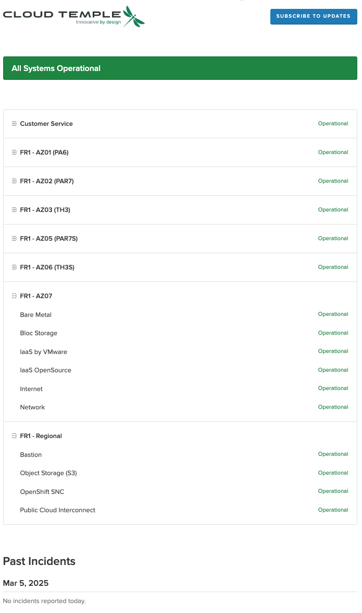

title: Operaciones planificadas y gestión de incidentes
---

Como cualquier plataforma de infraestructura Cloud, la plataforma Cloud Temple es objeto de trabajos y mantenimiento de hardware y software regularmente.

## Acceso a operaciones e incidentes en curso

El icono de seguimiento de operaciones permite visualizar las operaciones planificadas en la infraestructura Cloud Temple así como los incidentes abiertos en el tenant. Este icono es accesible en la barra de iconos en la parte superior izquierda de la pantalla y tiene forma de icono __'Herramientas'__

Este icono tiene como objetivo proporcionar visibilidad sobre las intervenciones planificadas en curso y terminadas y/o los incidentes en el tenant.

Cuando hay intervenciones y/o incidentes en curso, aparece un número en el icono.

Al hacer clic en visualización rápida, encontrará las intervenciones en curso. También es posible hacer clic en __'Todas las intervenciones'__ o __'Todos los incidentes e informes del tenant'__ para mostrar más detalles.

## Seguimiento de intervenciones planificadas

La página Intervenciones está compuesta por dos pestañas. La primera pestaña permite visualizar las intervenciones previstas para los próximos 30 días y las intervenciones en curso.

Las intervenciones terminadas son visibles en la segunda pestaña 'Terminado'

El acceso a esta información requiere para el perfil del usuario el permiso '**intervention_read**'.

## Gestión de incidentes

Se distinguen dos tipos de incidentes: los incidentes globales que afectan a todo el sistema y los incidentes específicos a un perímetro de cliente que impactan únicamente los recursos o servicios asociados a un cliente particular.

### Incidentes globales

La recuperación de información sobre incidentes globales no requiere ningún permiso particular. Se muestra un banner rojo desde la conexión a la consola para advertir de la presencia de un incidente global en curso de resolución. El usuario tiene la posibilidad de ocultar este banner temporalmente durante su sesión, pero éste reaparecerá en cada nueva conexión o al refrescar la página mientras el incidente siga sin resolverse.

Un botón __'Saber más'__ redirige hacia la página pública de seguimiento de incidentes permitiendo acceder a información adicional sobre el incidente en curso:

Es posible obtener los informes de los incidentes globales. El acceso a estos informes requiere el permiso específico '**incident_management**'.

Aquí hay un ejemplo de la pestaña que muestra estos informes:

### Incidentes en un perímetro de cliente

La visibilidad de los incidentes específicos a un perímetro de cliente necesita el permiso **incident_read**. Estos incidentes están representados por un icono dedicado acompañado de una insignia roja indicando el número de incidentes en curso.

El icono es clicable permitiendo listar los tickets asociados a los incidentes. Cada ticket incluye un enlace hacia los detalles del incidente ofreciendo la posibilidad de seguir el avance de su resolución:

Para consultar los detalles de un incidente es necesario ser el autor del ticket de incidente o disponer del permiso **support_management**.

### Gestión de notificaciones

Con el fin de informar rápidamente a los usuarios en caso de nuevo incidente, se ha establecido un sistema de notificaciones por correo electrónico. Desde su perfil de usuario, una pestaña titulada '*Mis suscripciones*' permite a los usuarios suscribirse a las notificaciones para los dos tipos de incidentes. Así, recibirán un correo electrónico en un plazo muy corto cuando se declare o se resuelva un incidente.

El asunto del correo electrónico indicará el tipo de incidente y en el caso de un incidente relacionado con un perímetro, el nombre del perímetro impactado. La notificación también contendrá un enlace que permite acceder directamente a los detalles del incidente:

