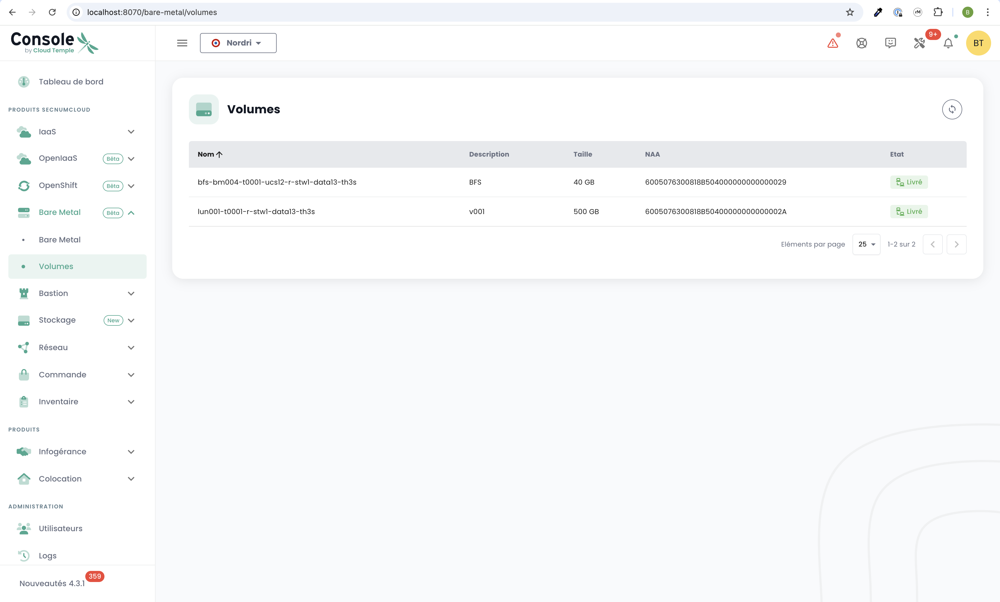

# QuickStart para la oferta Bare Metal

Esta página te guía a través de los pasos iniciales para usar la oferta **Bare Metal** desde la consola de Cloud Temple. Sigue estas instrucciones para descubrir los menús y funcionalidades disponibles.

---

## Requisitos previos
Antes de comenzar, asegúrate de los siguientes puntos:
1. **Suscripción activada**: Tu organización debe haber suscrito a la oferta Bare Metal.
2. **Permisos de usuario**: Tu cuenta de usuario debe tener los derechos necesarios para acceder y gestionar los recursos Bare Metal.

---

## Acceso a la interfaz Bare Metal

Una vez activada la suscripción y configurados los permisos, un nuevo menú titulado **Bare Metal** aparece en la consola de Cloud Temple. Este menú contiene dos submenús principales: **Bare Metal** y **Volumes**.

---

### 1. Submenú **Bare Metal**

El submenú **Bare Metal** te presenta una tabla que lista todas las instancias Bare Metal disponibles. Esta tabla incluye la información principal para cada instancia:
- **Nombre del Bare Metal**
- **Estado**
- **Configuración de hardware**
- **Dirección IP**

#### Funcionalidades principales
- **Botón de acción**: Permite acceder directamente a la consola de administración del Bare Metal.
- **Nombre clickeable**: Al hacer clic en el nombre de una instancia Bare Metal, se muestra una nueva página con los **detalles completos** de la instancia:
  - Información sobre el hardware (RAM, CPU, GPU, etc.).
  - Configuración de red (direcciones IP asociadas).
  - Información de conectividad para la gestión.

---

### 2. Submenú **Volumes**

El submenú **Volumes** muestra una tabla que lista todos los volúmenes de almacenamiento asociados a tu suscripción Bare Metal. Para cada volumen, la siguiente información está disponible:
- **Nombre del volumen**
- **Capacidad**
- **Clase de rendimiento** (IOPS por TB)
- **Estado** (Disponible, En proceso de despliegue, etc.)

#### Funcionalidades principales
- Gestión de volúmenes: Desde esta tabla, puedes mapear los volúmenes a tus instancias Bare Metal.

---