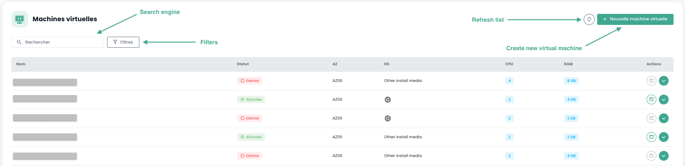

## Calcul

### Pilotaje de las Máquinas virtuales

La interfaz de gestión de sus máquinas virtuales está disponible en la consola Shiva en el menú __'OpenIaaS'__ ubicado en la banda verde a la izquierda de la pantalla.

### Lista de las Máquinas virtuales

En la sección __'Machines virtuelles'__, tiene acceso a la lista de sus máquinas virtuales alojadas en su Cloud de confianza.

Tiene acceso a la siguiente información, para cada máquina virtual:

- Su nombre.
- Su estado (apagada, encendida).
- Su zona de disponibilidad (AZ).
- Su sistema operativo.
- La cantidad de CPU virtuales (vCPU).
- La cantidad de memoria virtual (vRAM).

### Acciones sobre las máquinas virtuales

Las siguientes acciones son posibles desde esta interfaz:

- Actualizar la lista de las máquinas virtuales.
- Filtrar la lista.
- Buscar una máquina virtual por su nombre.
- Crear una nueva máquina virtual.

Cuando hace clic en la flecha desplegable verde a la derecha de la lista para una máquina virtual, accede a toda la información relativa a la misma.

Un panel rápido permite realizar las siguientes acciones:

- Encender la máquina virtual.
- Apagarla.
- Reiniciarla.
- Abrir la consola.
- Montar un ISO.
- Desmontar un ISO.
- Convertir la máquina virtual en un plantilla.
- Moverla.
- Renombrarla.
- Eliminarla.

En la pestaña de información '**Generales**', encuentra información detallada relacionada con su máquina virtual, tales como su ubicación física (AZ, Pool, Host), la RAM, el CPU, las direcciones IP, y otros.

Una pestaña '**Avanzado**' permite consultar información más específica:

- UUID de la máquina virtual
- Herramientas del invitado
- OS invitado
- Unidad de DVD

Así como modificar algunas opciones tales como:
- El orden de inicio
- El secure boot
- El arranque automático (imposible si no hay ninguna política de respaldo asociada a la VM)

