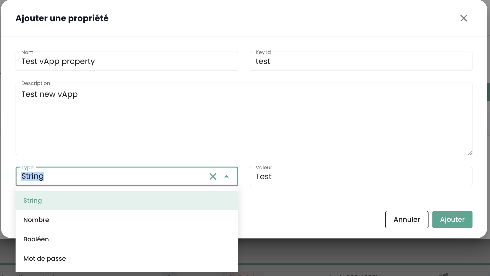
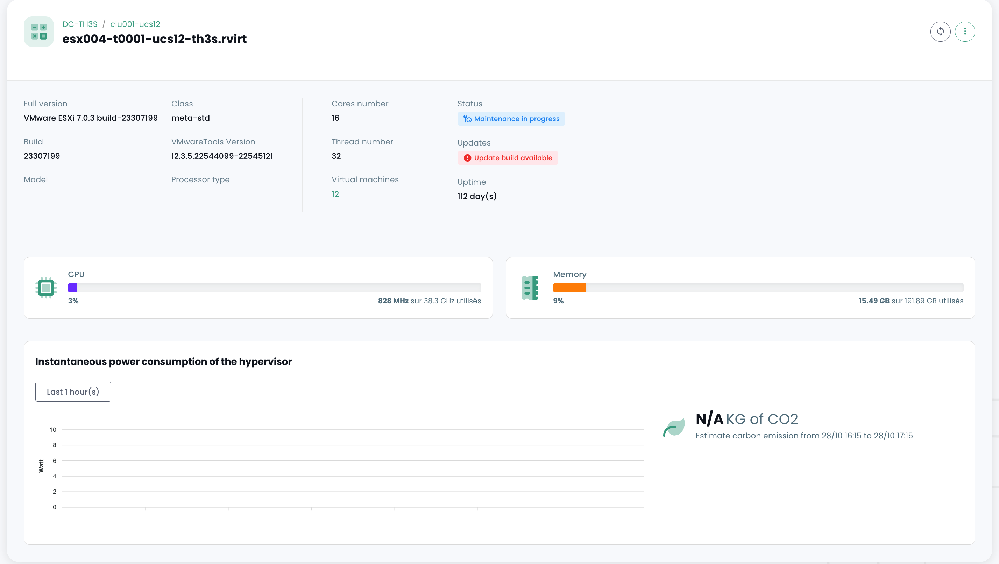

## Cálculo

### Control de las Máquinas Virtuales

La interfaz de gestión de tus máquinas virtuales está disponible en la consola Shiva en el menú __'IaaS'__ situado en la barra verde a la izquierda de la pantalla.

### Lista de máquinas virtuales

En la sección __'Máquinas virtuales'__, tienes acceso a la lista de tus máquinas virtuales alojadas en tu Cloud de confianza.

Tienes acceso a la siguiente información para cada máquina virtual:

- su nombre,
- las etiquetas que se le asignan,
- su estado (apagada, encendida, en procesamiento, host desconectado o inválido),
- su manager (en ambiente VMware, el Vcenter asociado),
- su sistema operativo,
- La cantidad de CPU virtuales (vCPU),
- La cantidad de memoria virtual (vRAM).

### Acciones sobre las máquinas virtuales

Las siguientes acciones son posibles desde esta interfaz:

- Actualizar la lista de máquinas virtuales;
- Exportar la lista en formato CSV;
- Filtrar la lista;
- Buscar una máquina virtual por su nombre;
- Crear una nueva máquina virtual.

__Un banner de alertas puede estar presente en la parte superior de la lista__: indica que se han activado alarmas críticas en una o varias de tus máquinas virtuales.
El botón __'Ver'__ permite consultar las máquinas virtuales que están afectadas por esta notificación.

Cuando haces clic en la flecha desplegable verde a la derecha de la lista para una máquina virtual:

Accedes a toda la información sobre la misma:

Un banner rápido permite realizar las siguientes acciones:

- Encender la máquina virtual;
- Apagarla;
- Reiniciarla;
- Modificar las opciones de alimentación del SO invitado;
- Abrir la consola;
- Montar un ISO;
- Desmontar un ISO;
- Clonar la máquina virtual;
- Moverla (vMotion);
- Renombrarla;
- Eliminarla.

Una vista rápida ofrece una visualización del __almacenamiento__, la __CPU__ y la __RAM__ de la máquina virtual.

En la pestaña __'Informaciones generales'__, encuentras información detallada relacionada con tu máquina virtual, como su SO, su ubicación física (datacenter, datastore, etc.), la RAM, la CPU, las direcciones IP, los logs, y otros.

Desde esta vista, puedes realizar las siguientes acciones:

- Modificar el sistema operativo (la máquina virtual debe estar apagada),
- Actualizar la versión del hardware (la máquina virtual debe estar apagada),
- Modificar la RAM o la CPU.

Una pestaña __'Avanzada'__ permite consultar informaciones más específicas como las infos "VMware tools", la versión de hardware, el administrador, etc...

### Modificación del controlador de disco de una máquina virtual

Puedes modificar el tipo de controlador de disco para tu máquina virtual. Los tipos soportados son __SCSI__ y __NVME__. Puedes añadir controladores con un máximo de 4 controladores de cada tipo.

### Consola de una máquina virtual

La consola de una máquina virtual es accesible desde la lista de máquinas virtuales haciendo clic en el icono __'Consola'__:

Una nueva pestaña de tu navegador se abre y se muestra entonces la consola de tu máquina, basada en un cliente VNC:

Es posible en el menú VNC:

- solicitar el envío de teclas particulares,
- realizar copiar/pegar desde el portapapeles de tu SO,
- pasar a modo de pantalla completa,
- cambiar el tamaño de la ventana (escalado).

La gestión del teclado, con la consola de las máquinas virtuales, funciona perfectamente en un entorno completamente *inglés*.

La entrada realizada en la consola depende del idioma del teclado de tu máquina física, del idioma del teclado de la máquina virtual y de la activación o no de la opción 'enforce keyboard' a la izquierda de la pantalla.
Aquí tienes una síntesis de las situaciones posibles con el idioma francés:

| Idioma del teclado de la máquina física (entrada) | Idioma del teclado de la máquina virtual | Opción 'enforce keyboard' seleccionada | Resultado (salida)                                  |
| -------------------------------------------------- | ----------------------------------------- | -------------------------------------- | --------------------------------------------------- |
| Francés                                            | Francés                                  | No                                     | No recomendable (problema con caracteres especiales)|
| Francés                                            | Francés                                  | Sí                                     | < y > no funcionan                               |
| Francés                                            | Inglés                                   | No                                     | No recomendable (problema con caracteres especiales)|
| Francés                                            | Inglés                                   | Sí                                     | Inglés                                              |
| Inglés                                             | Francés                                  | No                                     | < y > no funcionan                               |
| Inglés                                             | Francés                                  | Sí                                     | < y > no funcionan                               |
| Inglés                                             | Inglés                                   | No                                     | Inglés                                              |
| Inglés                                             | Inglés                                   | Sí                                     | Inglés                                              |

__Nota__:

- Si la combinación __'AltGr'__ y __'@'__ en el teclado no funciona, activa el botón __'enforce key'__ en el menú __'VNC'__ de la consola y vuelve a intentarlo.
- Si sigue sin funcionar y el SO de la máquina física es __Windows, pon el teclado de la máquina física en inglés y trata de introducir el @ de manera clásica__ *(salida azerty: AltGr + tecla del 0 o salida qwerty: tecla del 2)*.

### Catálogos de máquinas virtuales Cloud Temple

Cloud Temple pone a tu disposición un catálogo de `Templates` regularmente enriquecido y actualizado por nuestros equipos.
A la fecha, incluye varias decenas de `Templates` e imágenes para montar en tus máquinas virtuales.

### Configuración avanzada de las máquinas virtuales: Extra Config

Los Extra Config proporcionan un medio flexible para incluir pares clave=valor en la configuración de una máquina virtual. Las claves y los valores son interpretados por el sistema cuando la máquina virtual es desplegada.

A partir de ahora, puedes, tú mismo, modificar las propiedades de tipo __Extra Config__ en las opciones avanzadas de una máquina virtual:

Puedes añadir una propiedad de entre una lista de claves. Además, puedes modificar el valor de una clave que tú mismo hayas añadido. Los pares clave=valor ya existentes no son modificables.

Por favor, contacta al soporte para cualquier solicitud de adición de nuevas claves.

__Nota__: *Para el uso de GPU por parte de la máquina virtual, es obligatorio activar la clave 'pciPassthru.use64bitMMIO' y asignar la cantidad de espacio MMIO (Memory-mapped I/O) necesario mediante 'pciPassthru.64bitMMIOSizeGB'. Es altamente recomendable que te refieras a la [documentación oficial de Nvidia](https://docs.nvidia.com/vgpu/17.0/grid-vgpu-release-notes-vmware-vsphere/index.html#tesla-p40-large-memory-vms).*

### Configuración avanzada de las máquinas virtuales: vAPP

También puedes modificar las propiedades de tipo __vAPP__ en las opciones avanzadas de una máquina virtual:

Puedes añadir una propiedad, modificarla o eliminarla. Se ofrecen cuatro tipos de propiedades: String, Número, Booleano, Contraseña:

__Nota__: *La máquina virtual debe estar detenida para modificar sus propiedades vAPP.*

### Control de los __'hipervisores'__ y __'Cpool'__ (clusters de hipervisores)

El control de tus hipervisores se realiza en el submenú __'Cálculo'__ del menú __'IaaS'__, situado en la barra verde a la izquierda de tu pantalla.

En este submenú, dispones de una vista sobre:

- La stack de software de hipervisores, su AZ y sus recursos,
- La stack de software de backup.

En enero de 2024, la oferta de hipervisores disponibles en la infraestructura cualificada de Cloud Temple se basa en VMware. El software de backup utilizado es IBM Spectrum Protect Plus.

### Control de los clusters VMware

Para acceder al control de los clusters VMware, haz clic en el submenú __'Cálculo'__ del menú __'IaaS'__:

Por defecto, la primera pestaña lista todos los hipervisores (todos los clusters juntos):

Es posible visualizar los detalles de un hipervisor haciendo clic en su nombre:

Existe una pestaña por cluster de hipervisor para consultar los detalles de cada uno:

Si haces clic en un cluster, ves el resumen de su composición:

- El total de la potencia de cálculo expresado en Ghz,
- El total de la memoria disponible y el ratio utilizado,

- El total del espacio de almacenamiento (todos los tipos combinados) así como la parte utilizada,
- Los mecanismos de automatización en caso de indisponibilidad de una blade de cálculo (__'Vsphere DRS'__),
- El número de máquinas virtuales,
- El número de hipervisores.

<!-- TODO: Add missing page. -->
<!-- Al consultar la página de un clúster, varios pestañas están disponibles. La pestaña __'Reglas'__ permite definir las [reglas de afinidad/anti-afinidad](compute.md#gestion-de-laffinité-de-vos-machines-virtuelles) -->

Aparecen para cada hipervisor en la pestaña __'Hosts'__:

- El uso de __CPU__ y __Memoria__,
- El número de máquinas virtuales asignadas,
- La disponibilidad de una nueva build para el sistema operativo del hipervisor si es aplicable,
- El estado del hipervisor (conectado en producción, en mantenimiento, apagado, ...),
- Un menú de acción.

Varias acciones son posibles desde la pestaña __'Hosts'__:

- ordenar nuevos hipervisores a través del botón __'Agregar un host'__:

- posibilidad de consultar __el detalle de un hipervisor__:

- poner en o sacar del __estado de mantenimiento__ un hipervisor,
- __actualizar__ el hipervisor si es necesario; para hacerlo, __debe estar absolutamente en mantenimiento__. Existen dos tipos de actualizaciones:

1. Los builds de VMware (nuevas versiones del hipervisor):

2. La actualización del firmware de tu blade de cálculo (bios y firmware de tarjetas hijas):

*__Nota__*:

- *Cloud Temple pone a disposición los builds para los hipervisores a intervalos regulares. Es importante actualizar regularmente tus hipervisores, principalmente para aplicar los parches de seguridad. Sin embargo, __no actualizamos automáticamente tus hipervisores__. Cloud Temple no tiene visibilidad sobre tus compromisos de disponibilidad de workloads. Por lo tanto, te dejamos implementar tu gestión de cambios y aplicar los nuevos builds en el momento más adecuado.*
- *El proceso de actualización está completamente automatizado. Debes tener al menos dos hipervisores en tu clúster para permitir una actualización sin interrupción del servicio.*

<!-- TODO: Add missing page. -->
<!-- - *Es necesario tener [los permisos adecuados](../console/permissions.md) para realizar las diferentes acciones.* -->

También ves todas las reglas de afinidad/anti-afinidad para tu clúster de hipervisores en la sección __'Reglas'__.

### Gestión de la afinidad de tus máquinas virtuales

Las __reglas de afinidad y anti-afinidad__ permiten controlar la ubicación de las máquinas virtuales en tus hipervisores.
Se pueden usar para gestionar el uso de los recursos de tu __'Cpool'__.
Por ejemplo, pueden ayudar a equilibrar la carga de trabajo entre los servidores o a aislar las cargas de trabajo intensivas en recursos.
En un __'Cpool'__ VMware, estas reglas se usan con frecuencia para gestionar el comportamiento de las máquinas virtuales con vMotion.
vMotion permite mover máquinas virtuales de un host a otro sin interrupción del servicio.

Puedes configurar a través de la gestión de reglas:

- __Reglas de Afinidad__: Estas reglas aseguran que ciertas máquinas virtuales se ejecuten en el mismo host físico.
Se usan para mejorar el rendimiento manteniendo las máquinas virtuales que se comunican con frecuencia
en el mismo servidor para reducir la latencia de la red. Las reglas de afinidad son útiles en escenarios
donde el rendimiento es crítico, como en bases de datos o aplicaciones que requieren una comunicación rápida entre servidores.

- __Reglas de Anti-afinidad__: Por el contrario, estas reglas garantizan que ciertas máquinas virtuales no se ejecuten
en el mismo host físico. Son importantes para la disponibilidad y la resiliencia, por ejemplo,
para evitar que todas las máquinas críticas se vean afectadas en caso de fallo de un único servidor.
Las reglas de anti-afinidad son cruciales para aplicaciones que requieren alta disponibilidad,
como en entornos de producción donde la tolerancia a fallos es una prioridad.
Por ejemplo, no deseas que tus dos Active Directory estén en el mismo hipervisor.

Al crear una regla, defines el tipo de regla (afinidad/anti-afinidad), el nombre de la regla,
su estado de activación (__'Estado'__) y las máquinas afectadas de tu clúster de hipervisores.

*Nota: las reglas de afinidad/anti-afinidad propuestas en la consola son reglas que conciernen a las máquinas virtuales entre sí (no hay reglas entre hipervisores y máquinas virtuales).*

## Respaldo

### Crear una política de respaldo

Para agregar una nueva política de respaldo, se debe hacer una solicitud al soporte. El soporte es accesible desde el ícono de boya en la parte superior derecha de la ventana.

La creación de una nueva política de respaldo se realiza mediante __una solicitud de servicio__ indicando:

    El nombre de tu Organización
    El nombre de un contacto con su correo y n.º de teléfono para finalizar la configuración
    El nombre del tenant
    El nombre de la política de respaldo
    Las características (x días, y semanas, z meses, ...)

### Asignar una política de respaldo a una máquina virtual

Cuando se asigna una SLA a una máquina virtual (VM), todos los discos asociados a esa VM heredan automáticamente la misma SLA. Posteriormente, es posible ejecutar manualmente el respaldo a través de la pestaña "Políticas de respaldo". En ausencia de una ejecución manual, el respaldo se ejecutará automáticamente según el horario configurado por la SLA.

SecNumCloud hace obligatorio asignar una política de respaldo a una máquina virtual antes de su inicio. De lo contrario, recibirás la siguiente notificación:

Haz clic en la pestaña __'Políticas de respaldo'__ del menú de tu máquina virtual. Puedes visualizar la(s) política(s) de respaldo asignada(s) a la VM.

Para asignar una nueva política de respaldo a la máquina virtual, haz clic en el botón __'Agregar una política'__ y selecciona la política de respaldo deseada.

### Asignar una política de respaldo a un disco virtual

También es posible asignar una SLA directamente a un disco virtual específico de una máquina. En este caso, la máquina virtual no hereda esta SLA aplicada individualmente al disco. Sin embargo, no es posible ejecutar manualmente el respaldo a nivel de discos, ya que esta funcionalidad no es compatible en Spectrum Protect Plus.

En cambio, es posible excluir ciertos discos de una o varias políticas de respaldo (SLA) de la VM, lo que permite desasignar una o varias SLA(s) en una base disco por disco. Este enfoque ofrece la flexibilidad de ejecutar manualmente el respaldo de una SLA sin afectar todos los discos de la máquina virtual, permitiendo así una gestión más refinada de los respaldos.

Haz clic en la barra de acciones del disco al que deseas asignar una política de respaldo. Luego, haz clic en __'Políticas'__ y selecciona la política de respaldo deseada.

*Nota*: La política a añadir debe encontrarse en una zona de disponibilidad diferente a la máquina virtual.

### Ejecutar una política de respaldo

En el menú __'Políticas de respaldo'__ de tu máquina virtual, haz clic en el botón __'Ejecutar'__ de la columna __'Acciones'__ de la política de respaldo que deseas ejecutar.

Para ejecutar una política de respaldo, también puedes ir a la sección __'Respaldos'__ en el menú de tu máquina virtual. Haz clic en el botón __'Ejecutar respaldo'__, luego selecciona el respaldo que deseas ejecutar en la lista desplegable.

### Retirar una política de respaldo

En el menú __'Políticas de respaldo'__ de tu máquina virtual, haz clic en el botón __'Retirar'__ de la columna __'Acciones'__ de la política de respaldo que deseas retirar.

__Atención, no es posible retirar la última SLA en una máquina virtual encendida:__

### Eliminación de una política de respaldo: caso de una política de respaldo suspendida ("held")

Cuando se disocia el último recurso de una política SLA, el sistema detecta automáticamente esta situación. En consecuencia, todos los trabajos relacionados con esa política SLA pasan automáticamente al estado "Suspendido" ("Held"). Es importante notar que en este punto, no es posible eliminar directamente la política SLA debido a la existencia de trabajos dependientes. Para proceder con la eliminación de la política, se debe seguir una serie de pasos.

Se debe verificar que los trabajos afectados están efectivamente en estado "Suspendido". Una vez realizada esta verificación, estos trabajos pueden ser eliminados. Solo después de eliminar estos trabajos dependientes, la política SLA podrá ser borrada definitivamente del sistema.
Un caso particular merece una atención específica: la adición de un nuevo recurso a una política SLA cuyos trabajos dependientes no han sido eliminados. En esta situación, se conservarán los identificadores de los trabajos. Sin embargo, es crucial señalar que los trabajos en estado "Suspendido" no se reanudarán automáticamente. Será necesaria una intervención manual para reactivarlos y permitir su ejecución.

nota: Para cualquier precisión sobre esta situación, contacte al soporte de Cloud Temple.

La consola de Cloud Temple impide la asignación de una máquina virtual a una política suspendida:

Del mismo modo, no es posible iniciar una máquina virtual que esté asociada a una política de respaldo suspendida:

### Restaurar un respaldo

La pestaña __'Respaldos'__ del menú de sus máquinas virtuales le permite acceder a la lista de los respaldos de la misma.
Para restaurar un respaldo, haga clic en el botón __'Restaurar'__ en la línea correspondiente al respaldo que desea restaurar.

1. __Modo producción__: El modo producción permite la recuperación ante desastres en el sitio local desde el almacenamiento primario o un sitio de recuperación ante desastres remoto, reemplazando las imágenes originales de la máquina por las imágenes de recuperación. Todas las configuraciones se transfieren en el marco de la recuperación, incluyendo los nombres e identificadores, y todas las tareas de copia de datos asociadas a la máquina virtual continúan ejecutándose. En el marco de una restauración en modo producción, puede optar por reemplazar el almacenamiento en la máquina virtual con un disco virtual de un respaldo anterior de la máquina virtual.

2. __Modo de prueba__: El modo de prueba crea máquinas virtuales temporales para desarrollo, prueba, verificación de instantáneas y verificación de recuperación ante desastres según un plan repetible, sin impacto en los entornos de producción. Las máquinas de prueba se ejecutan tanto tiempo como sea necesario para realizar la prueba y la verificación, después de lo cual se limpian. A través de la red aislada, puede establecer un entorno seguro para probar sus tareas sin interferir con las máquinas virtuales utilizadas para la producción. Las máquinas virtuales que se crean en modo de prueba poseen nombres e identificadores únicos para evitar cualquier conflicto en su entorno de producción.

3. __Modo clon__: El modo clon crea copias de las máquinas virtuales para casos de uso que requieren copias permanentes o de larga duración para la exploración de datos o la duplicación de un entorno de prueba en una red aislada. Las máquinas virtuales creadas en modo clon poseen nombres e identificadores únicos para evitar cualquier conflicto en su entorno de producción. En el modo clon, debe prestar atención al consumo de recursos ya que el modo clon crea máquinas permanentes o de largo plazo.

__La restauración está por defecto en modo "PRUEBA" para preservar la producción__ y le es posible elegir el nombre de la VM restaurada:

Tenga en cuenta que si las pruebas son satisfactorias, es posible pasar una máquina virtual del modo prueba al modo producción:

