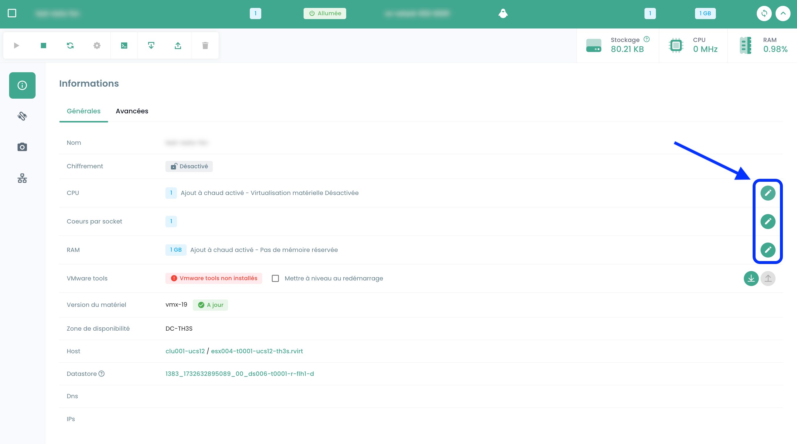
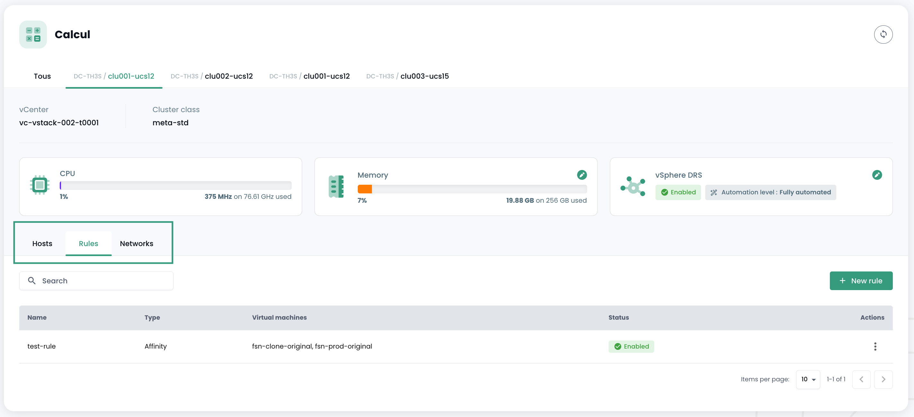
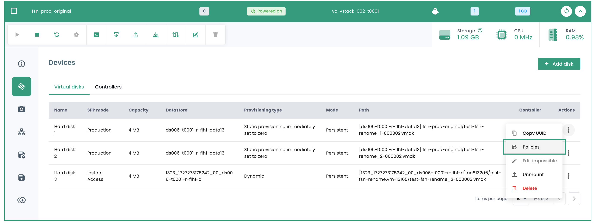
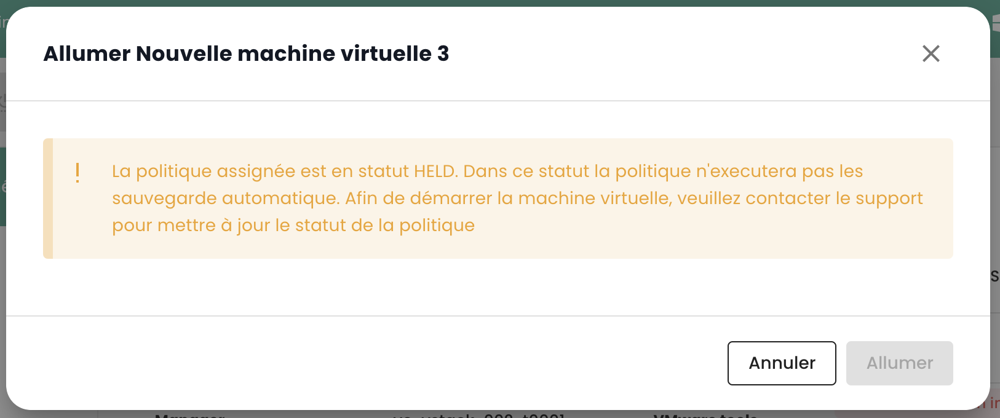

## Cálculo

### Gestión de Máquinas Virtuales

La interfaz de gestión de sus máquinas virtuales está disponible en la consola Shiva en el menú __'IaaS'__ ubicado en la barra verde a la izquierda de la pantalla.

### Lista de máquinas virtuales

En la sección __'Máquinas virtuales'__, tiene acceso a la lista de sus máquinas virtuales alojadas en su Cloud de confianza.


Tiene acceso a la siguiente información para cada máquina virtual:
- su nombre,
- las etiquetas asignadas,
- su estado (apagada, encendida, en procesamiento, host desconectado o inválido),
- su gestor (en un entorno VMware, el Vcenter asociado),
- su sistema operativo,
- La cantidad de CPU virtuales (vCPU),
- La cantidad de memoria virtual (vRAM).

### Acciones en las máquinas virtuales

Las siguientes acciones son posibles desde esta interfaz:

- Refrescar la lista de máquinas virtuales;
- Exportar la lista en formato CSV;
- Filtrar la lista;
- Buscar una máquina virtual por su nombre;
- Crear una nueva máquina virtual.


__Una barra de alertas puede estar presente en la parte superior de la lista__: indica que se han disparado alarmas críticas en una o varias de sus máquinas virtuales.
El botón __'Ver'__ permite consultar las máquinas virtuales afectadas por esta notificación.


Cuando hace clic en la flecha desplegable verde a la derecha de la lista de una máquina virtual:


Accede a toda la información referente a esta:


Una barra rápida permite realizar las siguientes acciones:


- Encender la máquina virtual;
- Apagarla;
- Reiniciarla;
- Modificar las opciones de energía del SE invitado;
- Abrir la consola;
- Montar un ISO;
- Desmontar un ISO;
- Clonar la máquina virtual;
- Moverla (vMotion);
- Renombrarla;
- Eliminarla.

Una vista rápida ofrece una visualización del __almacenamiento__, del __CPU__ y de la __RAM__ de la máquina virtual.


En la pestaña __'Información general'__, encuentra información detallada relacionada con su máquina virtual, como su SO, su ubicación física (centro de datos, datastore, etc.), la RAM, el CPU, las direcciones IP, los logs y más.


Desde esta vista, puede realizar las siguientes acciones:

- Modificar el sistema operativo (la máquina virtual debe estar apagada),
- Actualizar la versión del hardware (la máquina virtual debe estar apagada),
- Modificar la RAM o el CPU.

Una pestaña __'Avanzado'__ permite consultar información más específica como información de "VMware tools", la versión de hardware, el gestor, etc...


### Edición de la RAM o el CPU de una máquina virtual
Vaya a la pestaña __'Máquinas Virtuales'__, muestre los detalles de una máquina virtual, seleccione la pestaña __'Información general'__ y haga clic en el botón de edición de la variable a modificar:



### Los modos de discos

Puede agregar diferentes modos de discos:
  - __Persistente__ : Las modificaciones se escriben inmediata y permanentemente en el disco virtual. **Es el modo recomendado.**
  - __Independiente no persistente__ : Las modificaciones hechas en el disco virtual se registran en un nuevo log y se eliminan al apagar. No se ve afectado por los snapshots. **No es compatible con la copia de seguridad.**
  - __Independiente persistente__ : Las modificaciones se escriben inmediata y permanentemente en el disco virtual. No se ve afectado por los snapshots. **No es compatible con la copia de seguridad.**

### Gestión de controladores de máquina virtual

Puede modificar el tipo de controlador de disco para su máquina virtual.


Las máquinas virtuales pueden estar equipadas con controladores SCSI y NVME, con un límite de 4 controladores de cada tipo. Cada controlador puede gestionar hasta 15 discos.

Un controlador SCSI puede configurarse con diferentes subtipos: Para Virtual, Bus Logic, LSI Logic o LSI Logic SAS.

El controlador Para Virtual se distingue por su capacidad extendida. Puede soportar hasta 64 discos cuando la versión de hardware de la máquina virtual es compatible con un ESXi en versión 6.7 o superior.

> **Importante** : Si desea modificar el tipo de un controlador Para Virtual que posee más de 15 discos, primero deberá desanexar los discos en las ranuras correspondientes.

### Consola de una máquina virtual

La consola de una máquina virtual es accesible desde la lista de máquinas virtuales haciendo clic en el ícono __'Consola'__:


Se abre una nueva pestaña de su navegador donde se muestra la consola de su máquina, basada en un cliente VNC:


En el menú VNC es posible:

- solicitar el envío de teclas específicas,
- realizar copiar/pegar desde el portapapeles de su SO,
- cambiar al modo de pantalla completa,
- cambiar el tamaño de la ventana (escalar).

La gestión del teclado, con la consola de las máquinas virtuales, funciona perfectamente en un entorno completamente *inglés*.

La entrada realizada en la consola depende del idioma del teclado de su máquina física, del idioma del teclado
de la máquina virtual y de la activación o no de la opción 'enforce keyboard' a la izquierda de la pantalla.
Aquí tiene un resumen de las situaciones posibles con el idioma francés:

| Lenguaje del teclado de la máquina física (entrada) | Lenguaje del teclado de la máquina virtual | Opción 'enforce keyboard' seleccionada | Resultado (salida)                                 |
| --------------------------------------------------- | ----------------------------------------- | -------------------------------------- | --------------------------------------------------- |
| Francés                                             | Francés                                  | No                                     | Desaconsejado (problema con caracteres especiales)  |
| Francés                                             | Francés                                  | Sí                                     | < y > no funcionan                                |
| Francés                                             | Inglés                                   | No                                     | Desaconsejado (problema con caracteres especiales)  |
| Francés                                             | Inglés                                   | Sí                                     | Inglés                                             |
| Inglés                                              | Francés                                  | No                                     | < y > no funcionan                                |
| Inglés                                              | Francés                                  | Sí                                     | < y > no funcionan                                |
| Inglés                                              | Inglés                                   | No                                     | Inglés                                             |
| Inglés                                              | Inglés                                   | Sí                                     | Inglés                                             |

__Nota__ :

- Si la combinación __'AltGr'__ y __'@'__ en el teclado no funciona, active el botón __'enforce key'__ en el menú __'VNC'__ de la consola y vuelva a intentarlo.
- Si aún no funciona y el SO de la máquina física es __Windows, configure el teclado de la máquina física en inglés y trate de ingresar @ de manera clásica__ *(salida azerty: AltGr + tecla de 0 o salida qwerty : tecla de 2)*.

### Catálogos de máquinas virtuales Cloud Temple

Cloud Temple pone a su disposición un catálogo de `Templates` que regularmente es enriquecido y actualizado por nuestros equipos.
Hoy en día incluye varias docenas de `Templates` e imágenes para montar en sus máquinas virtuales.


Para publicar un ISO/OVF, vaya a la vista __'Catálogo'__ y haga clic en el botón __'publicar archivos'__ en la parte superior de la página:


Es posible transformar una VM en un modelo y exportarla al catálogo. Para hacerlo, seleccione una máquina virtual y use el botón de acción __'clonar'__:


Seleccione __'Exportar como vm-template'__:


Luego, proporcione la información requerida. Será posible desplegar una nueva VM desde el modelo usando el botón __'Nueva máquina virtual'__ o desde la página __'Catálogos'__. También es posible exportar la VM en formato OVF.

**Cabe destacar**: es posible convertir un archivo OVA a OVF y viceversa. El método más común utilizado es VMware converter, pero también existe un método simple usando ```tar```

Extracción del archivo ova:
```
$ tar -xvf vmName.ova
```

Crear un archivo OVA desde un archivo OVF:
```
$ tar -cvf vmName-NEW.ova vmName.ovf vmName-disk1.vmdk vmName.mf
```

### Configuración avanzada de máquinas virtuales: Extra Config

Las Extra Config proporcionan un medio flexible para incluir pares clave=valor en la configuración de una máquina virtual. Las claves y los valores son interpretados por el sistema cuando la máquina virtual se despliega.

Ahora, usted mismo puede modificar las propiedades de tipo __Extra Config__ en las opciones avanzadas de una máquina virtual:


Puede agregar una propiedad de una lista de claves. Además, puede modificar el valor de una clave que usted mismo haya agregado. Los pares clave=valor ya existentes no se pueden modificar.

Por favor, contacte con el soporte para cualquier solicitud de nuevas claves.


__Nota__ : *Para el uso de GPU por la máquina virtual, es obligatorio activar la clave 'pciPassthru.use64bitMMIO' y asignar la cantidad de espacio MMIO (Memory-mapped I/O) necesario a través de 'pciPassthru.64bitMMIOSizeGB'. Se recomienda encarecidamente que consulte la [documentación oficial de Nvidia](https://docs.nvidia.com/vgpu/17.0/grid-vgpu-release-notes-vmware-vsphere/index.html#tesla-p40-large-memory-vms).*

### Configuración avanzada de máquinas virtuales: vAPP

También puede modificar las propiedades de tipo __vAPP__ en las opciones avanzadas de una máquina virtual:


Puede agregar una propiedad, modificarla o eliminarla. Se proponen cuatro tipos de propiedades: Cadena, Número, Booleano, Contraseña:


__Nota__ : *La máquina virtual debe estar detenida para modificar sus propiedades vAPP.*

### Gestión de __'hipervisores'__ y __'Cpool'__ (grupos de hipervisores)

La gestión de sus hipervisores se realiza en el submenú __'Cálculo'__ del menú __'IaaS'__, situado en la banda verde a la izquierda de su pantalla.


En este submenú, dispondrá de una vista sobre:

- La pila de software de hipervisores, su AZ y sus recursos,
- La pila de software de respaldo.

En enero de 2024, la oferta de hipervisor disponible en la infraestructura calificada Cloud Temple se basa en VMware. El software de respaldo utilizado es IBM Spectrum Protect Plus.

### Gestión de clusters VMware

Para acceder a la gestión de los clusters de VMware, haga clic en el submenú __'Cálculo'__ del menú __'IaaS'__:

Por defecto, la primera pestaña enumera todos los hipervisores (todos los clusters incluidos):


Es posible visualizar los detalles de un hipervisor haciendo clic en su nombre:


Existe una pestaña por cluster de hipervisor para consultar los detalles de cada uno:


Si hace clic en un cluster, verá un resumen de su composición:

- El total de la potencia de cálculo expresado en Ghz,
- El total de la memoria disponible y el ratio utilizado,
- El total del espacio de almacenamiento (todos los tipos incluidos) así como la parte usada,
- Los mecanismos de automatización en caso de indisponibilidad de una blade de cálculo (__'Vsphere DRS'__),
- El número de máquinas virtuales,
- El número de hipervisores.

<!-- TODO: Add missing page. -->
<!-- Al consultar la página de un cluster, hay varias pestañas disponibles. La pestaña __'Reglas'__ le permite definir las [reglas de afinidad / anti-afinidad](compute.md#gestion-de-la-afinidad-de-sus-maquinas-virtuales) -->



En la pestaña __'Hosts'__ verá aparecer para cada hipervisor:

- El uso de __CPU__ y __Memoria__,
- El número de máquinas virtuales asignadas,
- La disponibilidad de una nueva versión para el sistema operativo del hipervisor, si corresponde,
- El estado del hipervisor (conectado en producción, en mantenimiento, apagado, ...),
- Un menú de acciones.


Desde la pestaña __'Hosts'__ son posibles varias acciones:

- Pedir nuevos hipervisores mediante el botón __'Agregar un host'__:


- Posibilidad de consultar __el detalle de un hipervisor__:


- Ingresar o salir del __estado de mantenimiento__ de un hipervisor,
- __Actualizar__ el hipervisor si es necesario; para ello, __debe estar en mantenimiento__. Existen dos tipos de actualizaciones:

1. Las versiones de VMware (nuevas versiones del hipervisor):


2. La actualización del firmware de su blade de cálculo (BIOS y firmware de tarjetas adicionales):


*__Observación__* :

- *Cloud Temple pone a disposición las versiones para los hipervisores a intervalos regulares.
Es importante actualizar regularmente sus hipervisores, especialmente para permitir la aplicación de parches de seguridad.
Sin embargo, __nosotros no actualizamos sus hipervisores por nuestra cuenta__. Cloud Temple no tiene visibilidad sobre los compromisos de disponibilidad de sus workloads.
Por lo tanto, le dejamos implementar su gestión de cambios y aplicar las nuevas versiones en el mejor momento.*
- *El proceso de actualización es totalmente automatizado. Debe disponer de al menos dos hipervisores en su cluster para permitir una actualización sin interrupción del servicio.*

<!-- TODO: Add missing page. -->
<!-- - *Es necesario tener [los permisos adecuados](../console/permissions.md) para realizar las diferentes acciones.* -->

También verá todas las reglas de afinidad/anti-afinidad para su cluster de hipervisores en la sección __'Reglas'__.

### Gestión de la afinidad de sus máquinas virtuales

Las __reglas de afinidad y anti-afinidad__ permiten controlar la ubicación de las máquinas virtuales en sus hipervisores.
Pueden utilizarse para gestionar el uso de los recursos de su __'Cpool'__.
Por ejemplo, pueden ayudar a equilibrar la carga de trabajo entre los servidores o aislar las cargas de trabajo intensivas en recursos.
En un __'Cpool'__ VMware, estas reglas se utilizan a menudo para gestionar el comportamiento de las máquinas virtuales con vMotion.
vMotion permite mover máquinas virtuales de un host a otro sin interrupción del servicio.

Puede configurarlas gracias a la gestión de reglas:

- __Reglas de Afinidad__ : Estas reglas aseguran que ciertas máquinas virtuales se ejecuten en el mismo host físico.
Se utilizan para mejorar el rendimiento manteniendo las máquinas virtuales que se comunican con frecuencia
en el mismo servidor para reducir la latencia de la red. Las reglas de afinidad son útiles en escenarios
donde el rendimiento es crítico, como en el caso de bases de datos o aplicaciones que requieren comunicación rápida entre servidores.

- __Reglas de Anti-afinidad__ : Por el contrario, estas reglas garantizan que ciertas máquinas virtuales no se ejecuten
en el mismo host físico. Son importantes para la disponibilidad y resiliencia, por ejemplo,
para evitar que todas las máquinas críticas se vean afectadas en caso de fallo de un único servidor.
Las reglas de anti-afinidad son cruciales para aplicaciones que requieren alta disponibilidad,
como en entornos de producción donde la tolerancia a fallos es una prioridad.
Por ejemplo, no desea que sus dos Actives Directory estén en el mismo hipervisor.

Al crear una regla, define el tipo de regla (afinidad / anti-afinidad), el nombre de la regla,
su estado de activación (__'Estatuto'__) y las máquinas afectadas de su cluster de hipervisores.


*Nota : las reglas de afinidad/anti-afinidad propuestas en la consola son reglas entre máquinas virtuales (no hay reglas entre hipervisores y máquinas virtuales).*

## Respaldo

### Crear una política de respaldo

Para agregar una nueva política de respaldo, es necesario hacer una solicitud al soporte. El soporte es accesible desde el ícono de boya en la parte superior derecha de la ventana.

La creación de una nueva política de respaldo se realiza mediante __una solicitud de servicio__ indicando:

    El nombre de su Organización
    El nombre de un contacto con su correo y número de teléfono para finalizar la configuración
    El nombre del tenant
    El nombre de la política de respaldo
    Las características (x días, y semanas, z meses, ...)


### Asignar una política de respaldo a una máquina virtual

Cuando se asigna un SLA a una máquina virtual (VM), todos los discos asociados a esta VM heredan automáticamente el mismo SLA. Posteriormente, es posible iniciar manualmente la ejecución del respaldo a través de la pestaña "Políticas de respaldo". En caso de no ejecutar manualmente, el respaldo se ejecutará automáticamente según la planificación configurada por el SLA.

SecNumCloud hace obligatorio asignar una política de respaldo a una máquina virtual antes de su inicio. De lo contrario, verá la siguiente notificación:


Haga clic en la pestaña __'Políticas de respaldo'__ del menú de su máquina virtual. Aquí puede visualizar la o las políticas de respaldo asignadas a la misma.

Para asignar una nueva política de respaldo a la máquina virtual, haga clic en el botón __'Agregar una política'__ y seleccione la política de respaldo deseada.


### Asignar una política de respaldo a un disco virtual

También es posible asignar un SLA directamente a un disco virtual específico de una máquina. En este caso, la máquina virtual no hereda este SLA aplicado individualmente al disco. Sin embargo, no es posible iniciar manualmente la ejecución del respaldo a nivel de los discos, ya que esta funcionalidad no es compatible con Spectrum Protect Plus.

En cambio, es posible excluir ciertos discos de una o varias políticas de respaldo (SLA) de la VM, lo que permite desasignar una o más SLA(s) en una base disco por disco. Este enfoque ofrece la flexibilidad de lanzar manualmente la ejecución del respaldo de una SLA sin afectar todos los discos de la máquina virtual, permitiendo así una gestión más fina de los respaldos.

Haga clic en la barra de acciones del disco al cual desea asignar una política de respaldo. Luego, haga clic en __'Políticas'__ y seleccione la política de respaldo deseada.



*Nota* : La política a agregar debe encontrarse en una zona de disponibilidad diferente a la de la máquina virtual.

### Ejecutar una política de respaldo

En el menú __'Políticas de respaldo'__ de su máquina virtual, haga clic en el botón __'Ejecutar'__ de la columna __'Acciones'__ de la política de respaldo que desea ejecutar.


Para ejecutar una política de respaldo, también puede ir a la sección de __'Respaldos'__ en el menú de
su máquina virtual. Haga clic en el botón __'Ejecutar el respaldo'__, luego seleccione el respaldo que desea ejecutar en la lista desplegable.


### Retirar una política de respaldo

En el menú __'Políticas de respaldo'__ de su máquina virtual, haga clic en el botón __'Retirar'__ de la columna __'Acciones'__ de la política de respaldo que desea retirar.


__Atención, no es posible retirar la última SLA en una máquina virtual encendida :__


### Supresión de una política de respaldo: caso de una política de respaldo suspendida ("held")

Cuando el último recurso está disociado de una política SLA, el sistema detecta automáticamente esta situación. En consecuencia, todos los trabajos relacionados con esta política SLA cambian automáticamente al estado "Suspendido" ("Held"). Es importante notar que en este punto, la eliminación directa de la política SLA no es posible debido a la existencia de trabajos dependientes. Para proceder con la eliminación de la política, se debe seguir una serie de pasos.

Hay que verificar que los trabajos en cuestión estén efectivamente en el estado "Suspendido". Una vez realizada esta verificación, estos trabajos pueden ser eliminados. Solo después de eliminar estos trabajos dependientes, la política SLA podrá ser definitivamente borrada del sistema.

Un caso particular merece atención específica: la adición de un nuevo recurso a una política SLA cuyos trabajos dependientes no han sido eliminados. En esta situación, los identificadores de los trabajos serán conservados. Sin embargo, es crucial notar que los trabajos en estado "Suspendido" no se reanudarán automáticamente. Una intervención manual será necesaria para reactivarlos y permitir su ejecución.

nota : Para cualquier precisión sobre esta situación, contacte al soporte de Cloud Temple.

La consola de Cloud Temple impide la asignación de una máquina virtual a una política suspendida:


De igual manera, no es posible iniciar una máquina virtual que está asociada a una política de respaldo suspendida:



### Restaurar un respaldo

La pestaña __'Respaldos'__ del menú de sus máquinas virtuales le permite acceder a la lista de los respaldos de la misma.
Para restaurar un respaldo, haga clic en el botón __'Restaurar'__ en la línea correspondiente al respaldo que desea restaurar.


1. __Modo producción__ : El modo producción permite la recuperación ante desastres en el sitio local desde el almacenamiento primario o un sitio de recuperación ante desastres remoto, reemplazando las imágenes de máquina originales por las imágenes de recuperación. Todas las configuraciones son transferidas en el marco de la recuperación, incluidos los nombres y los identificadores, y todos los trabajos de copia de datos asociados a la máquina virtual continúan ejecutándose. En el marco de una restauración en modo producción, puede elegir reemplazar el almacenamiento en la máquina virtual por un disco virtual proveniente de un respaldo de máquina virtual anterior.

2. __Modo prueba__ : El modo prueba crea máquinas virtuales temporales para el desarrollo, la prueba, la verificación de instantáneas y la verificación de recuperación ante desastres en función de una programación reiterable, sin impacto en los entornos de producción. Las máquinas de prueba se ejecutan tanto tiempo como sea necesario para realizar la prueba y la verificación, luego se limpian. A través de la red aislada, puede establecer un entorno seguro para probar sus trabajos sin interferir con las máquinas virtuales utilizadas para la producción. Las máquinas virtuales que se crean en modo prueba poseen nombres e identificadores únicos para evitar cualquier conflicto en su entorno de producción.

3. __Modo clon__ : El modo Clon crea copias de las máquinas virtuales para los casos de uso que requieren copias permanentes o de larga ejecución para la exploración de datos o la duplicación de un entorno de prueba en una red aislada. Las máquinas virtuales creadas en modo clon poseen nombres e identificadores únicos para evitar cualquier conflicto en su entorno de producción. En modo clon, debe ser atento al consumo de recursos ya que el modo clon crea máquinas permanentes o a largo plazo.

__La restauración es por defecto en modo "TEST" para preservar la producción__ y es posible elegir el nombre de la vm restaurada:


Tenga en cuenta que si las pruebas son satisfactorias, es posible pasar una máquina virtual del modo prueba al modo producción:


