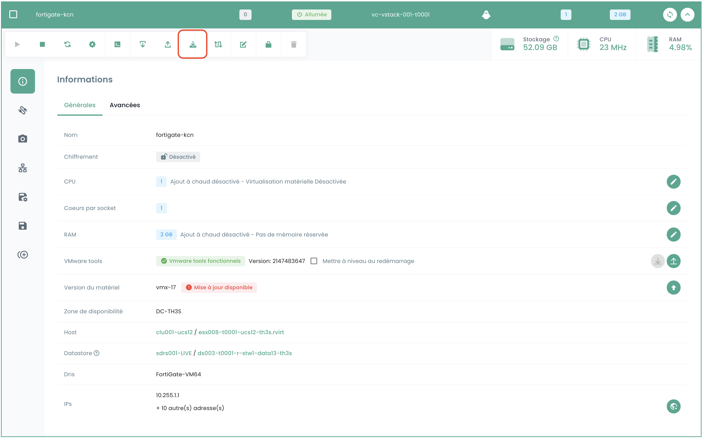
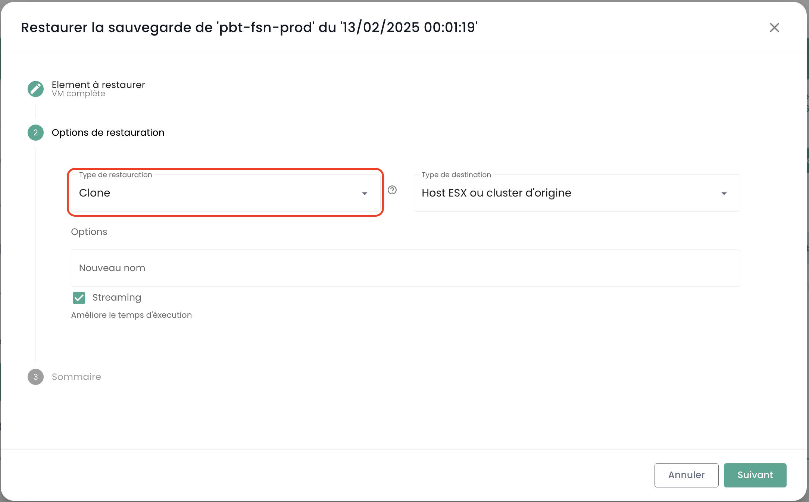
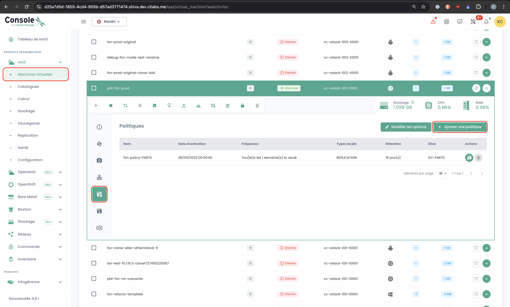
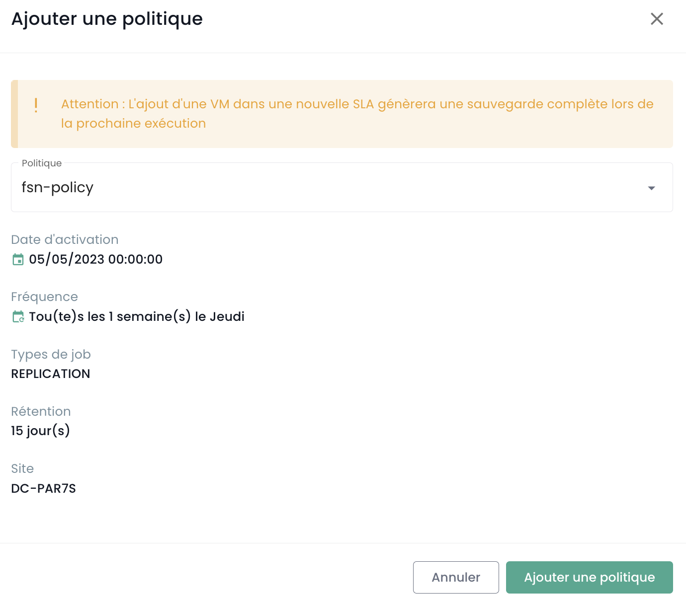
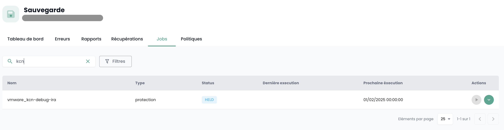
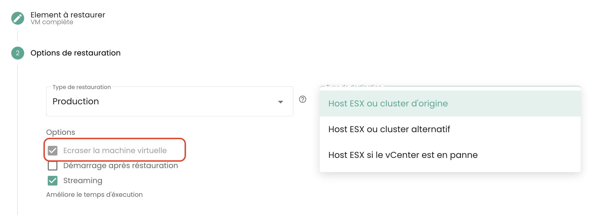

#### ¿Cómo clonar una máquina virtual?

Hay 2 formas de clonar una máquina virtual:

- La primera opción permite clonar una máquina virtual directamente desde el icono __'Clone'__ de su máquina virtual:

- La segunda solución consiste en clonar la máquina virtual utilizando __una copia de seguridad__ de la máquina virtual y luego utilizando __la restauración en modo clon__ de una copia de seguridad.
Vaya a la sección __'Sauvegarde'__ de su máquina virtual y elija la acción __'Restaurer'__:

Luego elija la opción __'Clone'__ de restauración:

#### ¿Por qué cuando ingreso a la página "políticas de copia de seguridad" y selecciono una política, no veo las mismas máquinas virtuales que cuando voy a "informe de copias de seguridad" y selecciono la misma política?

Esto significa que las máquinas virtuales ausentes tuvieron la política en cuestión asignada durante un tiempo (explicando su presencia en los informes de copias de seguridad) pero que __ya no es el caso actualmente__.

#### ¿Cómo añadir una política de copia de seguridad a una máquina virtual?

Vaya a la página __'Machines Virtuelles'__ en la sección __'IaaS'__ del menú verde en el lado izquierdo de la pantalla.

Seleccione una máquina virtual y luego la pestaña __'Politiques de sauvegardes'__ de esa máquina:

Añadir la política de copia de seguridad deseada:

### ¿Cómo eliminar una política de copia de seguridad de una máquina virtual?

Vaya a la página __'Machines Virtuelles'__, seleccione una máquina virtual y luego la pestaña __'Politiques de sauvegardes'__ de esa máquina.

Eliminar la política de copia de seguridad deseada y confirmar la eliminación:

__*Nota:*__ *¡Atención! __Secnumcloud impone que haya al menos una política de copia de seguridad__ para cada máquina virtual.*

### ¿Cómo saber si una copia de seguridad se ha ejecutado correctamente?

Hay 2 soluciones posibles:

1. Vaya a la página __'Jobs'__ del menú __'Sauvegarde'__ en el menú verde a la izquierda de su pantalla. Elija el job correspondiente a la copia de seguridad y selecciónelo.
Luego, encuentre el *jobsession* correspondiente a su copia de seguridad, selecciónelo usando el menú __'Actions'__.

Estas acciones le permiten obtener los registros detallados de la ejecución de la copia de seguridad. Puede buscar en los registros de copia de seguridad:

2. Vaya a la página __'Rapports de sauvegarde'__ y seleccione la política que le interese:

Entonces puede filtrar por fecha, descargar el informe en formato __PDF__ o __CSV__ para usarlo en herramientas de terceros.

### ¿Cómo iniciar una restauración?

Vaya a la página __'Machines Virtuelles'__, seleccione una máquina virtual y luego la pestaña __'Sauvegardes'__ de esa máquina. Para iniciar la restauración, seleccione la copia de seguridad a restaurar.

### ¿Qué es la opción de quiescing?

El __quiescing__ es un proceso que consiste en prevenir al sistema para que se ponga en un estado adecuado antes de comenzar el snapshot.
Por defecto, el __quiescing está activado__. Puede ser desactivado manualmente en caso de que el sistema maneje mal el snapshot o si el agente del hipervisor no está instalado en la máquina virtual.

Para hacerlo, en la sección __'Sauvegardes'__ de su máquina virtual, haga clic en __'Modifier les options'__ y desactive el __quiescing__:

### ¿Cuáles son las opciones de restauración de una máquina virtual?

Hay 3 opciones principales para restaurar una VM, sobre su destino inicial o sobre un destino diferente:

- __'CLONE'__: Restaura la máquina virtual renombrándola, sin reemplazar la máquina virtual original.

- __'PRODUCTION'__: Restaura y __reemplaza__ la máquina virtual de producción (la máquina virtual actualmente en producción es __destruida__).

- __'TEST'__: Restaura la máquina virtual de producción __sin sobrescribir__.

### ¿Cómo restaurar y reemplazar la máquina virtual de producción sin mantener la máquina virtual actualmente en producción?

Elija el modo de restauración __'Production'__. La opción 'sobrescribir la máquina virtual' es por defecto.

### ¿Por qué el número de máquinas virtuales es diferente entre los módulos de copia de seguridad y computo?

La diferencia de máquinas virtuales puede deberse a que el módulo de copias de seguridad no ha recuperado las últimas máquinas creadas.

Para actualizar el módulo de copias de seguridad, debe solicitar a la capa de software de copia de seguridad que reinventeorie las máquinas virtuales.
Para ello, en el menú __'Infrastructure'__ del menú verde a la izquierda de la pantalla, navegue hacia el submenú __'Spectrum Protect Plus'__ y utilice el botón __'Action'__ del inventario:

Tenga en cuenta que se indica la fecha del último inventario.

Si persiste una diferencia de máquinas virtuales, esto puede deberse a las máquinas virtuales que hospedan el sistema que permite
las copias de seguridad. De hecho, estas no se contabilizan a sí mismas en el cálculo del número de máquinas en el módulo de copias de seguridad.

### ¿Cómo inventariar las máquinas virtuales en el módulo de copia de seguridad?

Para iniciar un inventario de las máquinas virtuales en el módulo de copia de seguridad, en el menú __'Infrastructure'__ del menú verde a la izquierda de la pantalla, navegue hacia el submenú __'Spectrum Protect Plus'__ y utilice el botón __'Action'__ del inventario:

Tenga en cuenta que se indica la fecha del último inventario.

### ¿Por qué falla la copia de seguridad de mi máquina virtual indicando un problema de snapshot?

Este error significa que es la primera vez que su máquina intenta ser respaldada.

__Durante la primera copia de seguridad de una máquina virtual, no debe haber ningún snapshot presente en la máquina.__

### ¿Cómo restaurar y reemplazar la máquina virtual de producción, manteniendo y renombrando la máquina virtual de producción?

Así es como proceder:

- Elija el modo __'CLONE'__ (el modo clon provoca un cambio de dirección MAC y de UUID de la máquina virtual),
- Renombre la máquina virtual restaurada con el nombre definitivo (de la VM de producción),
- Renombre la antigua máquina virtual de producción (a _OLD).

### ¿Cómo restaurar una máquina virtual sin reemplazar la máquina virtual original?

Así es como proceder:

- Elija el modo __'CLONE'__ (el modo clon provoca un cambio de dirección MAC y de UUID de la máquina virtual)
- Defina el nombre del clon (_REST u otros)

### ¿Por qué no puedo eliminar un disco en modo instant access en mi máquina virtual?

Ejecute el inventario de la copia de seguridad: en el menú __'Infrastructure'__ del menú verde a la izquierda de la pantalla, navegue
hacia el submenú __'Spectrum Protect Plus'__ y utilice el botón __'Action'__ del inventario:

Realice la eliminación del disco una vez finalizado el inventario. Actualice la máquina virtual para verificar que el disco ha sido eliminado.

### ¿Por qué no puedo iniciar una máquina virtual con una política en estado Held (política suspendida)?

Una política en estado "Held" es una funcionalidad que permite suspender temporalmente las acciones de retención y eliminación de datos, garantizando así que los datos permanezcan intactos y disponibles más allá de su período de retención estándar por razones específicas como el cumplimiento o las necesidades legales.

Supongamos que una empresa tiene una política de retención de respaldo de 30 días para ciertos datos de producción. Debido a una investigación legal, reciben una solicitud para preservar todos los respaldos pertinentes por un período indefinido. Tiene la posibilidad de suspender la política de respaldo asociada a través del estado "Held" para impedir la eliminación automática de estos respaldos después de 30 días, asegurando así que los datos permanezcan disponibles durante toda la duración de la investigación.

Una política de copia de seguridad suspendida (en estado Held) no ejecutará las copias de seguridad del horario que le ha sido asignado, la máquina virtual no puede entonces ser considerada como protegida lo que no respeta las normas SecNumCloud.

No dude en consultar a nuestro equipo de soporte sobre este tema.