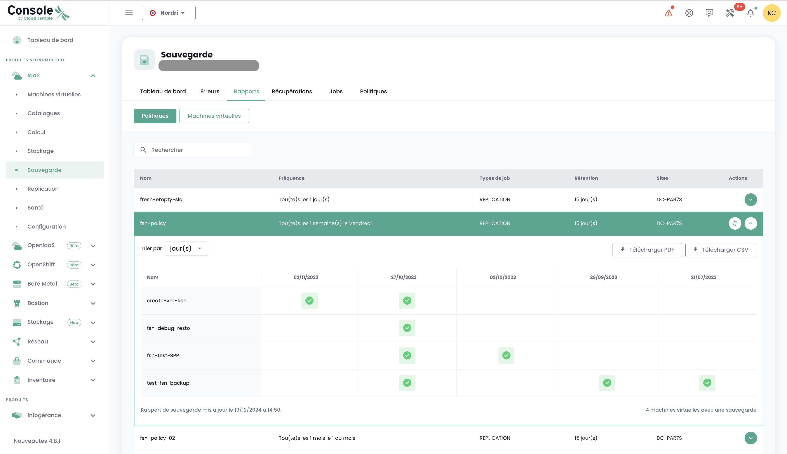

## ¿Cómo clonar una máquina virtual?

Existen 2 maneras de clonar una máquina virtual:

- La primera opción permite clonar una máquina virtual directamente desde el icono __'Clonar'__ de su máquina virtual:

- La segunda solución consiste en clonar la máquina virtual utilizando __una copia de seguridad__ de la máquina virtual y luego utilizar __la restauración en modo clon__ de una copia de seguridad.
Vaya a la parte __'Copia de Seguridad'__ de su máquina virtual y elija la acción __'Restaurar'__:

Luego, elija la opción de restauración __'Clonar'__:

## ¿Por qué cuando voy a la página "políticas de copia de seguridad" y selecciono una política, no veo las mismas máquinas virtuales que cuando voy a "informe de copias de seguridad" y selecciono la misma política?

Esto significa que las máquinas virtuales faltantes tuvieron la política en cuestión asignada por un tiempo (explicando su presencia en los informes de copias de seguridad), pero que __esto ya no es así actualmente__.

## ¿Cómo agregar una política de copia de seguridad a una máquina virtual?

Vaya a la página __'Máquinas Virtuales'__ en la sección __'IaaS'__ de la barra de menú verde en el lado izquierdo de la pantalla.

Seleccione una máquina virtual y luego la pestaña __'Políticas de copia de seguridad'__ de esa máquina:

Agregue la política de copia de seguridad deseada:

## ¿Cómo eliminar una política de copia de seguridad de una máquina virtual?

Vaya a la página __'Máquinas Virtuales'__, seleccione una máquina virtual y luego la pestaña __'Políticas de copia de seguridad'__ de esa máquina.

Elimine la política de copia de seguridad deseada y confirme la eliminación:

__*Nota:*__ *¡Atención! __SecNumCloud impone que debe haber al menos una política de copia de seguridad__ para cada máquina virtual.*

## ¿Cómo saber si una copia de seguridad se ha ejecutado correctamente?

Hay 2 soluciones posibles:

1. Vaya a la página __'Trabajos'__ del menú __'Copia de Seguridad'__ en la barra verde a la izquierda de su pantalla. Elija el trabajo correspondiente a la copia de seguridad y selecciónelo.
Luego, encuentre la *jobsession* correspondiente a su copia de seguridad, selecciónela a través del menú __'Acciones'__.

Estas acciones permiten obtener los logs detallados de la ejecución de la copia de seguridad. Puede buscar en los registros de copia de seguridad:

2. Vaya a la página __'Informes de copia de seguridad'__ y seleccione la política que le interese:

Puede entonces filtrar por una fecha, descargar el informe en formato __PDF__ o __CSV__ para explotarlo en herramientas de terceros.

## ¿Cómo iniciar una restauración?

Vaya a la página __'Máquinas Virtuales'__, seleccione una máquina virtual y luego la pestaña __'Copias de Seguridad'__ de esa máquina. Para iniciar la restauración, seleccione la copia de seguridad a restaurar.

## ¿Qué es la opción de quiescing?

El __quiescing__ es un proceso que consiste en advertir al sistema para que se coloque en un estado apropiado antes de comenzar el snapshot.
Por defecto, el __quiescing está activado__. Se puede desactivar manualmente en caso de que el sistema maneje mal el snapshot o si el agente del hipervisor no está instalado en la máquina virtual.

Para hacerlo, en la parte __'Copias de Seguridad'__ de su máquina, virtual, haga clic en __'Modificar las opciones'__ y desactive el __quiescing__:

## ¿Cuáles son las opciones de restauración de una máquina virtual?

Hay 3 opciones principales para restaurar una máquina virtual, en su destino inicial o en un destino diferente:

- __'CLONAR'__: Restaura la máquina virtual renombrándola, sin reemplazar la máquina virtual original.

- __'PRODUCCIÓN'__: Restaura y __reemplaza__ la máquina virtual de producción (la máquina virtual actualmente en producción es __destruida__)

- __'PRUEBA'__: Restaura la máquina virtual de producción __sin sobrescribirla__.

Encontrará más detalles en [la documentación sobre la copia de seguridad](../../../iaas/backup.md).

## ¿Cómo restaurar y reemplazar la máquina virtual de producción, sin mantener la máquina virtual actualmente en producción?

Elija el modo de restauración __'Producción'__. La opción 'sobrescribir la máquina virtual' es predeterminada.

## ¿Por qué el número de máquinas virtuales es diferente entre los módulos de copia de seguridad y computación?

La diferencia de máquinas virtuales puede deberse a que el módulo de copias de seguridad no ha recuperado las últimas máquinas creadas.

Para actualizar el módulo de copias de seguridad, se debe solicitar a la capa de software de copia de seguridad que reinvente las máquinas virtuales.
Para hacerlo, en el menú __'Infraestructura'__ de la barra verde a la izquierda de la pantalla, navegue hasta el submenú __'Spectrum Protect Plus'__ y use el botón __'Acción'__ del inventario:

Tenga en cuenta que se indica la fecha del último inventario.

Si persiste una diferencia en el número de máquinas virtuales, puede deberse a las máquinas virtuales que hospedan el sistema que permite las copias de seguridad. De hecho, estas no se contabilizan a sí mismas en el cálculo del número de máquinas en el módulo de copias de seguridad.

## ¿Cómo hacer el inventario de las máquinas virtuales en el módulo de copia de seguridad?

Para iniciar un inventario de las máquinas virtuales en el módulo de copias de seguridad, en el menú __'Infraestructura'__ de la barra verde a la izquierda de la pantalla, navegue hasta el submenú __'Spectrum Protect Plus'__ y use el botón __'Acción'__ del inventario:

Tenga en cuenta que se indica la fecha del último inventario.

## ¿Por qué la copia de seguridad de mi máquina virtual falla indicando un problema de snapshot?

Este error significa que es la primera vez que su máquina intenta ser respaldada.

__Durante la primera copia de seguridad de una máquina virtual, no debe haber ningún snapshot presente en la máquina.__

## ¿Cómo restaurar y reemplazar la máquina virtual de producción, manteniendo y renombrando la máquina virtual de producción?

Así es como proceder:

- Elija el modo __'CLONAR'__ (el modo clonar implica un cambio de dirección MAC y de UUID de la máquina virtual),
- Renombre la máquina virtual restaurada con el nombre definitivo (de la máquina de producción),
- Renombre la antigua máquina virtual de producción (en _OLD).

## ¿Cómo restaurar una máquina virtual, sin reemplazar la máquina virtual original?

Así es como proceder:

- Elija el modo __'CLONAR'__ (el modo clonar implica un cambio de dirección MAC y de UUID de la máquina virtual)
- Defina el nombre del clon (_REST u otros)

## ¿Por qué no puedo eliminar un disco en modo instant access en mi máquina virtual?

Ejecute el inventario de la copia de seguridad: en el menú __'Infraestructura'__ de la barra verde a la izquierda de la pantalla, navegue
hasta el submenú __'Spectrum Protect Plus'__ y use el botón __'Acción'__ del inventario:

Realice la eliminación del disco una vez finalizado el inventario. Actualice la máquina virtual para verificar que el disco se ha eliminado correctamente.

## ¿Por qué no puedo iniciar una máquina virtual con una política en estado Held (política suspendida)?

Una política en estado "Held" es una característica que permite suspender temporalmente las acciones de retención y eliminación de datos, garantizando así que los datos permanezcan intactos y disponibles más allá de su período estándar de retención por razones específicas como el cumplimiento o necesidades legales.

Supongamos que una empresa tiene una política de retención de copias de seguridad de 30 días para ciertos datos de producción. Debido a una investigación legal, reciben una solicitud para preservar todas las copias de seguridad relevantes por un período indefinido. Tiene la opción de suspender la política de copia de seguridad asociada mediante el estado "Held" para evitar la eliminación automática de estas copias de seguridad después de 30 días, asegurando así que los datos permanezcan disponibles durante toda la duración de la investigación.

Una política de copia de seguridad suspendida (en estado Held) no ejecutará las copias de seguridad del plan que se le asignó, por lo que la máquina virtual no se puede considerar protegida, lo cual no cumple con las normas de SecNumCloud.

No dude en consultar a nuestro equipo de soporte sobre este tema.