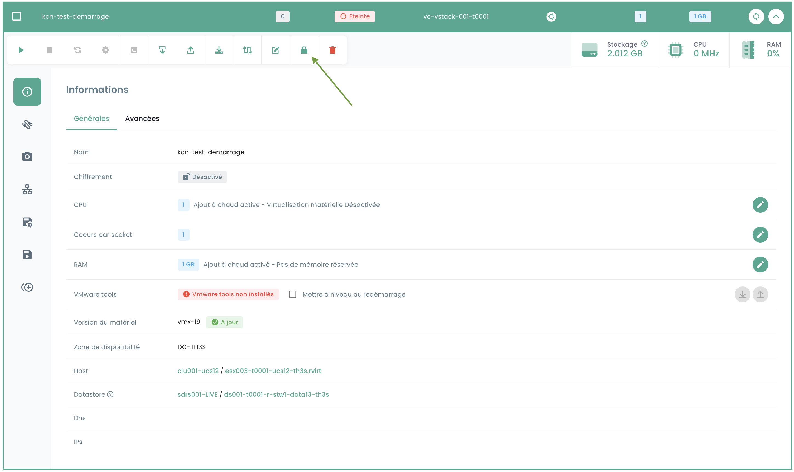

Este tutorial le ayuda a cifrar una máquina virtual IaaS VMware desde el portal Shiva.

### Requisitos previos

1. **Proveedor de claves (HSM/KMS)**:
   - Un proveedor de claves debe estar configurado en el vStack. (Si no hay ningún proveedor de claves configurado, póngase en contacto con el servicio de soporte a través de un ticket.)
   - Asegúrese de que el proveedor de claves esté correctamente activado.

2. **Estado de la máquina virtual**:
   - La máquina virtual debe estar apagada.
   - La máquina virtual no debe estar en modo spp 'test'.
   - La máquina virtual no debe estar ya cifrada.
   - La máquina virtual no debe tener instantáneas.
   - La máquina virtual no debe estar replicada.

### Interfaz

Una vez conectado al portal web Shiva, desde el menú __'IaaS'__, submenú __'Configuración'__ y luego la pestaña __'vCenters'__, encontrará información que indica si el cifrado está habilitado en el vstack en cuestión.

Luego vaya al submenú __'Máquinas virtuales'__ y seleccione la máquina que desea cifrar.

En la información general de la máquina virtual, encontrará información que indica si la máquina ya está cifrada o no.

Si la máquina virtual cumple con los requisitos previos, puede continuar con el procedimiento haciendo clic en el botón con un logo de candado en la barra de herramientas que indica __'Cifrar la máquina virtual'__.

Aparecerá una ventana de confirmación, seleccione Cifrar.

Una vez completada la acción, debería ver la información que ha cambiado y que indica que su máquina está cifrada.

