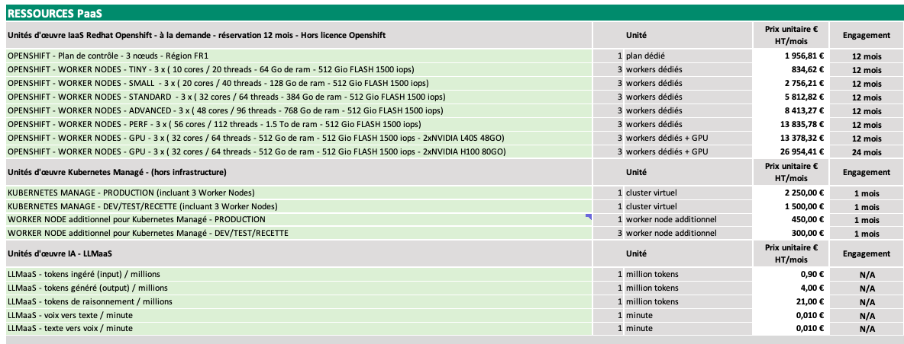

# Guía: Dominar el OCR con DeepSeek

Esta guía detalla el uso del modelo **DeepSeek-OCR**, una solución de vanguardia para la compresión óptica de contexto y el análisis de documentos.

## Arquitectura y funcionamiento

A diferencia de los OCR tradicionales, DeepSeek-OCR es un modelo de visión-lenguaje de extremo a extremo diseñado para "leer" y "comprender" visualmente los documentos.

### Arquitectura técnica
Combina dos componentes innovadores:
1.  **DeepEncoder (380M)**: Un codificador visual híbrido que combina **SAM-base** (para la percepción local) y **CLIP-large** (para el conocimiento global), conectados mediante un compresor convolucional de 16x. Esto permite procesar imágenes de alta resolución con muy pocos tokens visuales.
2.  **Decodificador MoE (3B)**: Basado en DeepSeek3B-MoE (570M parámetros activos), genera texto estructurado a partir de los tokens visuales comprimidos.

### Modos de resolución y consumo  
El modelo adapta su consumo de tokens según la resolución de la imagen. Cuanto mayor sea la imagen, mayor será el consumo de tokens, pero también mayor será la precisión.

| Modo | Resolución (px) | Tokens de Visión | Uso recomendado |
| :--- | :--- | :--- | :--- |
| **Tiny** | 512 x 512 | 64 | Diapositivas, texto muy grande |
| **Small** | 640 x 640 | 100 | Documentos simples, entradas |
| **Base** | 1024 x 1024 | 256 | Páginas A4 estándar |
| **Large** | 1280 x 1280 | 400 | Documentos densos, caracteres pequeños |
| **Gundam** | Dinámico | ~800 | Periódicos, planos, escaneos complejos |

:::tip Optimización  
Para optimizar sus costos y la latencia, redimensione sus imágenes a la resolución mínima necesaria para que el texto siga siendo legible.  
:::

### Multilingual support
The model has been trained on a large corpus of multilingual documents and supports recognition of nearly **100 languages** (including French, English, Chinese, Arabic, etc.), with or without layout preservation.

## Guía de prompts (Ingeniería de prompts)

La calidad del resultado depende directamente del prompt utilizado. DeepSeek-OCR responde a instrucciones específicas para activar sus distintas capacidades.

### 1. OCR estándar (Markdown)
Para extraer el texto con su estructura (títulos, párrafos, tablas).

**Prompt:**
> `Convert the document to markdown.`

**Resultado:** Texto estructurado, tablas formateadas, formato preservado.

### 2. "Análisis profundo" (Figuras, gráficos, fórmulas)
Para analizar el contenido semántico de gráficos, fórmulas químicas o geométricas.

**Prompt:**
> `Parse the figure.`

**Capacidades:**
-   **Gráficos (barras/líneas/pastel)** : Convierte en tabla HTML o Markdown.
-   **Fórmulas químicas** : Convierte al formato SMILES.
-   **Geometría** : Describe los elementos geométricos.

### 3. Grounding (localización)
Para encontrar las coordenadas de un elemento específico en la imagen.

**Prompt:**
> `Localiza <|ref|>elemento a encontrar<|/ref|> en la imagen.`

**Ejemplo:** `Localiza <|ref|>Total<|/ref|> en la imagen.`
**Resultado:** Devuelve las coordenadas de la caja delimitadora (bounding box) del elemento.

### 4. Detección de objetos  
Para listar y localizar todos los objetos visibles.

**Prompt:**  
> `Identify all objects in the image and output them in bounding boxes.`

## Implementación tutorial (Python)

Aquí tienes un ejemplo completo que muestra cómo estructurar tu llamada a la API para utilizar estas capacidades.

### Requis: formato de la imagen y dependencias
-   **Formato**: JPEG o PNG.
-   **Modo**: RGB (sin transparencia Alpha).
-   **PDF**: Deben convertirse a imágenes con antelación (150-300 DPI).
-   **Tamaño**: Se recomienda redimensionar las imágenes de muy alta resolución para evitar errores por límite de tamaño (413 Payload Too Large).

Instale las bibliotecas necesarias:
```bash
pip install requests Pillow
```

### Código: análisis de documento (OCR)

Tomemos como ejemplo este ticket de caja suizo:


Aquí tienes un script robusto que gestiona el redimensionamiento y el codificado óptimo de la imagen:

```python
import base64
import io
import requests
from PIL import Image

# Configuración
API_KEY = "SU_TOKEN_API"
API_URL = "https://api.ai.cloud-temple.com/v1/chat/completions"
IMAGE_PATH = "ReceiptSwiss.jpg"  # Asegúrese de que la imagen est en el directorio actual

def encode_image_optimized(path):
    """
    Optimiza la imagen (redimensionamiento + compresión JPEG) para la API.
    """
    with Image.open(path) as img:
        # 1. Conversión a RGB (para evitar problemas con PNG/Alpha)
        if img.mode != 'RGB':
            img = img.convert('RGB')
        
        # 2. Redimensionamiento inteligente si es demasiado grande (> 2048px)
        # Esto evita el error 413 (Payload Too Large) y acelera el procesamiento
        max_size = 2048
        if max(img.size) > max_size:
            img.thumbnail((max_size, max_size))
            
        # 3. Compresión JPEG en memoria
        buffer = io.BytesIO()
        img.save(buffer, format="JPEG", quality=85)
        
        return base64.b64encode(buffer.getvalue()).decode('utf-8')

# 1. Construcción del mensaje multimodal
encoded_image = encode_image_optimized(IMAGE_PATH)

payload = {
    "model": "deepseek-ai/DeepSeek-OCR",
    "messages": [
        {
            "role": "user",
            "content": [
                {
                    "type": "text",
                    "text": "Convierte el documento a markdown."  # Prompt OCR estándar
                },
                {
                    "type": "image_url",
                    "image_url": {
                        "url": f"data:image/jpeg;base64,{encoded_image}"
                    }
                }
            ]
        }
    ],
    "temperature": 0.0,  # CRUCIAL: 0.0 para la fidelidad
    "max_tokens": 4096
}

# 2. Envío
print("Enviando la solicitud...")
response = requests.post(
    API_URL, 
    headers={"Authorization": f"Bearer {API_KEY}"}, 
    json=payload
)

# 3. Resultado
if response.status_code == 200:
    print("\n--- Resultado OCR ---\n")
    print(response.json()['choices'][0]['message']['content'])
else:
    print(f"Error {response.status_code}: {response.text}")
```

**Ejemplo de salida:**
```markdown

# Berghotel
**Grosse Scheidegg**
3818 Grindelwald
Familia R. Müller

N. de reserva  4572
Bar    Mesa   7/01

2xLatte Macchiato    a   4.50 CHF   9.00
1xGloki    a   5.00 CHF   5.00
...

**Total:** CHF **54.50**
**Incl. 7.6% IVA** 54.50 CHF: 3.85

### Código: análisis de gráfico (análisis profundo)

Para analizar un gráfico financiero en un informe, simplement cambie el texto del prompt en el payload anterior:

```python
# ... en el payload ...
"text": "Analiza la figura."

# ...
```

El modelo devolverá una representación textual o tabular de los datos del gráfico.

## Cas de uso avanzados

### Extracción de tablas complejas  
DeepSeek-OCR destaca en la conversión de tablas, incluso sin líneas de separación claras.

**Imagen de entrada:**



**Salida del modelo (Prompt: "Convert the document to markdown table."):**
```markdown


# PAAS RESOURCES

## Unidades de obra laaS Redhat Openshift - bajo demanda - reserva 12 meses - Sin licencia Openshift

|    | Unidad    | Precio unitario € IVA excl. / mes | Compromiso |
|---|---|---|---|
| OPENSHIFT - Plan de control - 3 nodos - Región FR1    | 1 plan dedicado    | 1 956,81 €    | 12 meses    |
| OPENSHIFT - NODOS WORKER - TINY - 3 x (10 núcleos / 20 hilos - 64 GB de RAM - 512 GB FLASH 1500 IOPS) | 3 nodos worker dedicados    | 834,62 €    | 12 meses    |
| OPENSHIFT - NODOS WORKER - SMALL - 3 x (20 núcleos / 40 hilos - 128 GB de RAM - 512 GB FLASH 1500 IOPS) | 3 nodos worker dedicados    | 2 756,21 €    | 12 meses    |
| OPENSHIFT - NODOS WORKER - STANDARD - 3 x (32 núcleos / 64 hilos - 384 GB de RAM - 512 GB FLASH 1500 IOPS) | 3 nodos worker dedicados    | 5 812,82 €    | 12 meses    |
| OPENSHIFT - NODOS WORKER - ADVANCED - 3 x (48 núcleos / 96 hilos - 768 GB de RAM - 512 GB FLASH 1500 IOPS) | 3 nodos worker dedicados    | 8 413,27 €    | 12 meses    |
| OPENSHIFT - NODOS WORKER - PERF - 3 x (56 núcleos / 112 hilos - 1,5 TB de RAM - 512 GB FLASH 1500 IOPS) | 3 nodos worker dedicados    | 13 835,78 €    | 12 meses    |
| OPENSHIFT - NODOS WORKER - GPU - 3 x (32 núcleos / 64 hilos - 512 GB de RAM - 512 GB FLASH 1500 IOPS - 2xNVIDIA L40S 48GB) | 3 nodos worker dedicados + GPU    | 13 378,32 €    | 12 meses    |
| OPENSHIFT - NODOS WORKER - GPU - 3 x (32 núcleos / 64 hilos - 512 GB de RAM - 512 GB FLASH 1500 IOPS - 2xNVIDIA H100 80GB) | 3 nodos worker dedicados + GPU    | 26 954,41 €    | 24 meses    |

## Unidades de obra Kubernetes Manage - (fuera de infraestructura)

|    | Unidad    | Precio unitario € IVA no incluido/mes | Compromiso |
|---|---|---|---|
| KUBERNETES MANAGE - PRODUCCIÓN (incluye 3 nodos trabajadores)    | 1 clúster virtual    | 2.250,00 €    | 1 mes    |
| KUBERNETES MANAGE - DEV/PRUEBAS/RECEPCIÓN (incluye 3 nodos trabajadores)    | 1 clúster virtual    | 1.500,00 €    | 1 mes    |
| NODO TRABAJADOR adicional para Kubernetes Manage - PRODUCCIÓN    | 1 nodo trabajador adicional    | 450,00 €    | 1 mes    |
| NODO TRABAJADOR adicional para Kubernetes Manage - DEV/PRUEBAS/RECEPCIÓN    | 3 nodos trabajadores adicionales    | 300,00 €    | 1 mes    |

## Unidades de obra de IA - LLMaas

|    | Unidad    | Precio unitario € IVA excl. / mes | Compromiso |
|---|---|---|---|
| LLMaas - tokens ingresados (entrada) / millones    | 1 millón de tokens    | 0,90 €    | N/A    |
| LLMaas - tokens generados (salida) / millones    | 1 millón de tokens    | 4,00 €    | N/A    |
| LLMaas - tokens de razonamiento / millones    | 1 millón de tokens    | 21,00 €    | N/A    |
| LLMaas - voz a texto / minuto    | 1 minuto    | 0,010 €    | N/A    |
| LLMaas - texto a voz / minuto    | 1 minuto    | 0,010 €    | N/A    |

### Fórmulas matemáticas (LaTeX)
Ideal para documentos académicos. El modelo reconoce las ecuaciones y las exporta en sintaxis LaTeX estándar.

**Imagen de entrada:**


**Salida del modelo (Prompt: "Convert to latex.") :**

> Aquí se muestra el resultado matemático del OCR:

Error cuadrático medio:

$$
\frac{1}{T} \int_{-T/2}^{T/2} \left[ f(t) - T_N(t) \right]^2 dt = E_N \left( a_0, \ldots, a_N; b_1, \ldots, b_N \right)
$$

Condición para el mínimo de $E_N$:

$$
\frac{\partial E_N}{\partial a_0} = 0, \frac{\partial E_N}{\partial a_i} = 0, \ldots, \frac{\partial E_N}{\partial b_N} = 0
$$

(2n+1) ecuaciones:

$$
\frac{\partial E_N}{\partial a_i} = \frac{1}{T} \int_{-T/2}^{T/2} \frac{\partial}{\partial a_i} \left( f(t) - T_N(t) \right)^2 dt = \frac{1}{T} \int_{-T/2}^{T/2} \left\{ 2 \left( f(t) - T_N(t) \right) \frac{\partial}{\partial a_i} \left( f(t) - T_N(t) \right) \right\} dt
$$

$$
= -\frac{1}{T} \int_{-T/2}^{T/2} 2 \left( f(t) - T_N(t) \right) \cos i \omega t dt = 0 \quad \text{para punto estacionario.}
$$

$$
\frac{2}{T} \int_{-T/2}^{T/2} f(t) \cos i \omega t dt = \frac{2}{T} \int_{-T/2}^{T/2} \left[ \frac{a_0}{2} + \sum_{n=1}^{N} \left( a_n \cos n \omega t + b_n \sin n \omega t \right) \right] \cos i \omega t dt \quad i \neq 0
$$

## Limitaciones conocidas

-   **Orientación**: El modelo no gestiona la rotación automática. Asegúrese de que sus imágenes estén correctamente orientadas (texto horizontal).
-   **Texto manuscrito**: Aunque es eficiente, la tasa de error es mayor en escritura cursiva compleja que en texto impreso.
-   **Muy alta resolución**: Las imágenes que superan las dimensiones del modo "Gundam" (~2000x2000) se redimensionan, lo que puede hacer ilegible el texto microscópico. Divida las imágenes muy grandes en varias partes.
