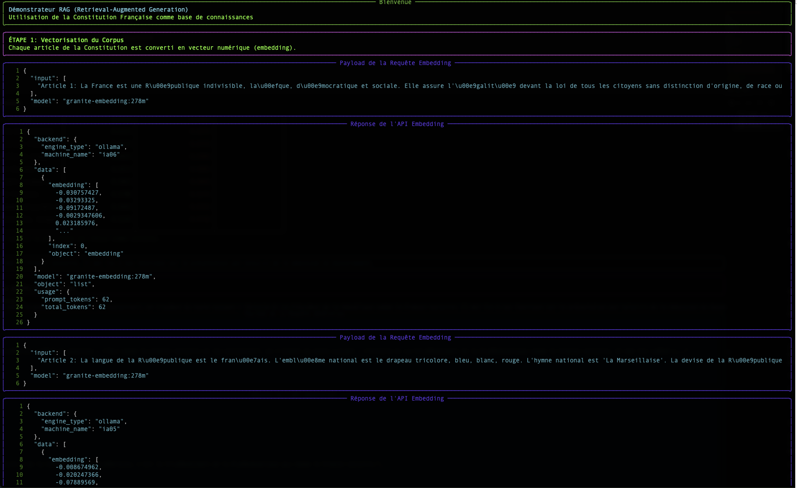
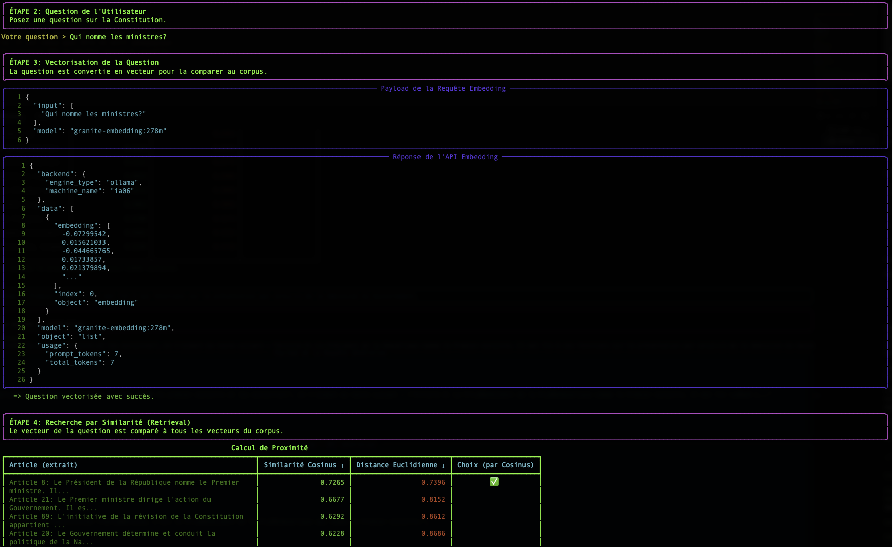
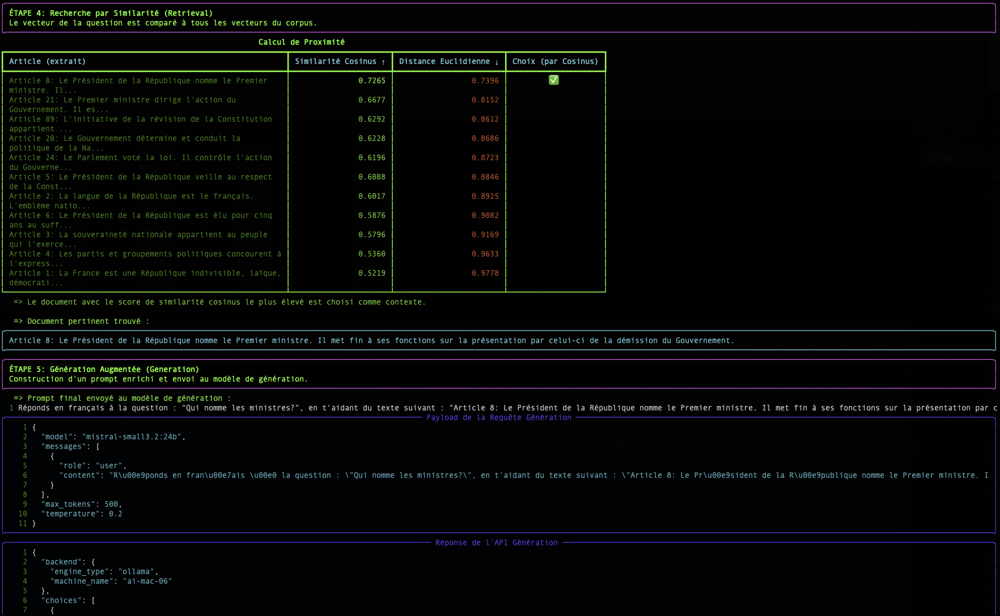

# Entender RAG: El Embedding y la Distancia Vectorial

El script `simple-rag-demo` es una excelente ilustración del funcionamiento de un sistema RAG (Retrieval-Augmented Generation). Esta página explica los conceptos fundamentales que lo hacen funcionar: el **embedding** y la **búsqueda por similitud**.

## El problema: Los LLM no tienen memoria a largo plazo

Un gran modelo de lenguaje (LLM) como Mistral o Granite es muy potente, pero solo conoce los datos con los que fue entrenado. No conoce sus documentos internos, los últimos artículos de prensa o las especificidades de su negocio.

El **RAG** es una técnica que permite dar al LLM un "memoria externa" proporcionándole, en el momento de la pregunta, los fragmentos de documentos más relevantes para ayudarle a formular su respuesta.

El proceso se desarrolla en dos etapas:
1. **Recuperación (Retrieval)**: Encontrar los buenos documentos.
2. **Generación Ampliada (Augmented Generation)**: Utilizar estos documentos para generar una respuesta.

Es la etapa de "Recuperación" la que nos interesa aquí. ¿Cómo puede un ordenador "entender" que una pregunta es semánticamente cercana a un párrafo? La respuesta es: con vectores.

## Paso 1: El embedding - Transformar palabras en números

Un ordenador no entiende las palabras, pero es excelente para manipular números. El **embedding** es el proceso que traduce un texto (una palabra, una frase, un documento) en una lista de números, llamada **vector**.

`"El gato está en la alfombra."`  →  `[-0.01, 0.98, 0.45, ..., -0.33]`

Este vector no es aleatorio. Representa la "posición" del texto en un espacio semántico multidimensional. Textos con un significado similar tendrán vectores que apuntan en direcciones similares.

**Analogía**: Imagina un mapa geográfico. "París" y "Francia" estarían muy cerca, al igual que "Roma" e "Italia". "París" estaría más lejos de "Roma" que de "Francia", pero más cerca que de "Tokio". El embedding hace lo mismo, pero con miles de "dimensiones" en lugar de dos, para capturar matices de significado complejos.

En nuestro script, el endpoint `/v1/embeddings` y el modelo `granite-embedding:278m` son responsables de esta traducción.

## Paso 2: La Búsqueda - Medir la Proximidad Semántica

Una vez que nuestra pregunta y todos nuestros documentos se transforman en vectores, la búsqueda se convierte en un problema matemático: **encontrar el vector de documento más "cerca" del vector de la pregunta.**

Existe varias formas de medir esta "proximidad". Nuestro script utiliza dos: la Similitud Coseno y la Distancia Euclidiana.

### La Similitud Coseno (el estándar)

-   **Concepto** : No mide la distancia, sino el **ángulo** entre dos vectores. Un ángulo pequeño (cercano a 0°) indica que los vectores apuntan en la misma dirección, por lo tanto, los textos tienen un significado muy similar.
-   **Puntuación** : El coseno de un ángulo de 0° es 1 (similitud perfecta). El coseno de un ángulo de 90° es 0 (ninguna similitud).
-   **¿Por qué es tan utilizada?** Para el texto, la *dirección* semántica es mucho más importante que la *magnitud* (la longitud) del vector. La similitud coseno ignora la magnitud y se enfoca únicamente en la dirección.

**Ejemplo simple en 2D :**
-   Pregunta : `v_q = [2, 2]`
-   Doc A : `v_a = [4, 4]` (mismo sentido, más largo)
-   Doc B : `v_b = [-2, 2]` (dirección diferente)

El cálculo de la similitud coseno dará:
-   `cos(v_q, v_a) = 1.0` → Ángulo de 0°. Similitud perfecta.
-   `cos(v_q, v_b) = 0.0` → Ángulo de 90°. Ninguna similitud.

Este es el resultado que queremos: el Documento A es semánticamente idéntico a la pregunta, incluso si su formulación es más larga.

### La Distancia Euclidiana (La Regla)

-   **Concepto** : Es la distancia "en línea recta" entre los puntos extremos de los dos vectores.
-   **Puntuación** : Una puntuación de 0 significa que los vectores son idénticos. Cuanto mayor sea la puntuación, más alejados estarán.
-   **Inconveniente para el texto** : Es sensible a la magnitud. En nuestro ejemplo anterior, la distancia entre `v_q` y `v_a` no sería nula, ya que los vectores no tienen la misma longitud, aunque tengan la misma dirección.

## Conclusión

La tabla mostrada por el script `simple-rag-demo` le permite visualizar estas dos métricas. Notará que, aunque los rankings pueden diferir ligeramente en ocasiones, la **similitud coseno es generalmente la métrica de elección** para aplicaciones de búsqueda semántica basadas en texto.

El mayor desafío, como muestra el ejemplo, sigue siendo la **calidad del modelo de embedding**. Un buen modelo producirá vectores que capturen fielmente el significado, haciendo que el cálculo de proximidad, cualquiera que sea el método, sea mucho más confiable.