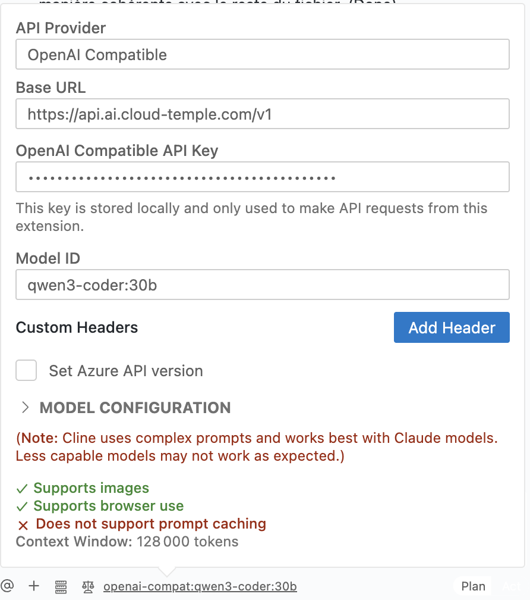
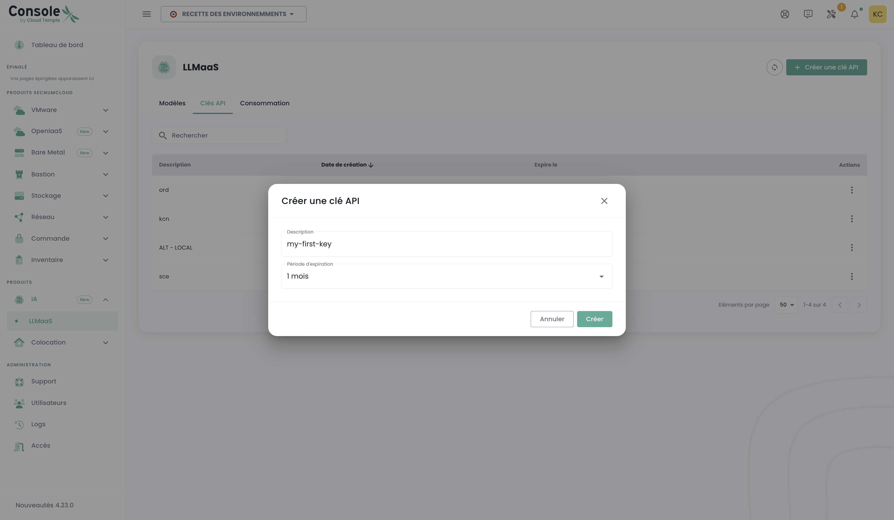

# Tutoriales LLMaaS

## Overview

These advanced tutorials cover integration, optimization, and best practices to fully leverage LLMaaS Cloud Temple in production. Each tutorial includes tested code and real performance metrics.

## 🚀 LangChain Integrations and Frameworks

### 1. Integración básica con LangChain

Este primer ejemplo muestra cómo integrar nuestra API LLMaaS con el popular framework LangChain creando un "wrapper" personalizado. Un wrapper es una clase que "envuelve" nuestra API para hacerla compatible con los mecanismos internos de LangChain.

#### Código explicado

El código siguiente define una clase `CloudTempleLLM` que hereda de la clase base `LLM` de LangChain. Esto nos permite definir un comportamiento personalizado manteniendo compatibilidad con el ecosistema LangChain (cadenas, agentes, etc.).

1. **`CloudTempleLLM(LLM)`** : Nuestra clase hereda de `LLM`, lo que nos obliga a implementar ciertos métodos, especialmente `_call`.
2. **`_call(self, prompt: str, ...)`** : Este es el núcleo de nuestro wrapper. Cada vez que LangChain necesite invocar a nuestro modelo de lenguaje, llamará a este método. Dentro de él, formateamos una solicitud HTTP POST estándar con los encabezados adecuados (`Authorization`) y el `payload` esperado por nuestra API `/v1/chat/completions`.
3. **`ejemplo_langchain_basic()`** : Esta función de demostración muestra cómo usar nuestro wrapper. La instanciamos, creamos un `PromptTemplate` para estructurar nuestra solicitud y los combinamos en una `LLMChain`. Cuando ejecutamos la cadena (`chain.run(...)`), LangChain invoca internamente el método `_call` que hemos definido.

Este enfoque es útil si deseas un control total sobre la forma en que LangChain interactúa con la API, aunque es más verboso que el uso del cliente `ChatOpenAI` (ver [Referencia de API](./api#langchain)).

```python
# Instalación de dependencias
# pip install langchain requests pydantic

from langchain.llms.base import LLM
from langchain.schema import LLMResult, Generation
from typing import Optional, List, Any
from pydantic import Field
import requests
import json
import os

# --- Configuración ---

# Se recomienda almacenar su clave API en una variable de entorno
API_KEY = os.getenv("LLMAAS_API_KEY", "su-clave-api-aquí")
BASE_URL = "https://api.ai.cloud-temple.com/v1"

class CloudTempleLLM(LLM):
    """
    Envoltorio personalizado de LangChain para la API LLMaaS de Cloud Temple.
    Esta clase permite utilizar nuestra API como un LLM estándar en LangChain.
    """
    
    api_key: str = Field(default="")
    model_name: str = Field(default="granite3.3:8b")
    temperature: float = Field(default=0.7)
    max_tokens: int = Field(default=1000)
    
    @property
    def _llm_type(self) -> str:
        """Identificador único para nuestro tipo de LLM."""
        return "cloud_temple_llmaas"
    
    def _call(self, prompt: str, stop: Optional[List[str]] = None) -> str:
        """
        Método principal que realiza la llamada a la API LLMaaS.
        LangChain utiliza este método para cada solicitud al modelo.
        """
        headers = {
            "Authorization": f"Bearer {self.api_key}",
            "Content-Type": "application/json"
        }
        
        payload = {
            "model": self.model_name,
            "messages": [{"role": "user", "content": prompt}],
            "temperature": self.temperature,
            "max_tokens": self.max_tokens
        }
        
        if stop:
            payload["stop"] = stop
        
        # Ejecución de la solicitud POST hacia la API
        response = requests.post(
            f"{BASE_URL}/chat/completions",
            headers=headers,
            json=payload,
            timeout=60
        )
        
        response.raise_for_status()  # Lanza una excepción en caso de error HTTP
        result = response.json()
        
        # Devuelve el contenido del mensaje del asistente
        return result['choices'][0]['message']['content']

# --- Ejemplo de uso ---
from langchain.chains import LLMChain
from langchain.prompts import PromptTemplate

def ejemplo_langchain_wrapper():
    """Muestra el uso del wrapper LLM con una cadena LangChain."""
    
    # 1. Inicialización de nuestro LLM personalizado
    llm = CloudTempleLLM(
        api_key=API_KEY,
        model_name="granite3.3:8b"
    )
    
    # 2. Creación de una plantilla de prompt para estructurar las solicitudes
    template = """
    Eres un experto en {dominio}. 
    Responde a esta pregunta de manera detallada y profesional:
    
    Pregunta: {pregunta}
    
    Respuesta:
    """
    prompt = PromptTemplate(
        input_variables=["dominio", "pregunta"],
        template=template
    )
    
    # 3. Creación de una cadena que combina el prompt y el LLM
    chain = LLMChain(llm=llm, prompt=prompt)
    
    # 4. Ejecución de la cadena con variables específicas
    result = chain.run(
        dominio="ciberseguridad",
        pregunta="¿Cuáles son las mejores prácticas para proteger una API REST?"
    )
    
    return result

# --- Ejecución de la prueba ---
if __name__ == "__main__":
    if API_KEY == "su-clave-api-aquí":
        print("Por favor, configure su LLMAAS_API_KEY en sus variables de entorno.")
    else:
        respuesta = ejemplo_langchain_wrapper()
        print("Respuesta del experto en ciberseguridad:\n")
        print(respuesta)
```

### 2. RAG (Retrieval-Augmented Generation) con la API LLMaaS

El RAG es una técnica potente que permite a un modelo de lenguaje (LLM) responder preguntas basándose en una base de conocimientos externa. Este tutorial te guiará a través de la creación de un pipeline RAG sencillo utilizando nuestra API para embeddings y generación, y FAISS, una biblioteca de similitud vectorial, para crear un índice en memoria.

#### Código explicado

El pipeline se descompone en varias etapas lógicas:

1. **Configuración**: Importamos las bibliotecas necesarias y cargamos nuestra clave API desde las variables de entorno. Definimos los modelos a utilizar: `granite-embedding:278m` para la vectorización y `granite3.3:8b` para la generación.
2. **`LLMaaSEmbeddings`**: Como en el ejemplo anterior, necesitamos un envoltorio para interactuar con nuestra API de embeddings. Esta clase se encarga de transformar los fragmentos de texto (chunks) en vectores numéricos (embeddings).
3. **`setup_rag_pipeline`**: Esta función coordina la creación del pipeline.
    * **Carga de documentos**: `DirectoryLoader` carga los archivos de texto de nuestra base de conocimientos.
    * **División en chunks**: `RecursiveCharacterTextSplitter` divide los documentos en fragmentos más pequeños. Esto es esencial para que el modelo de embedding pueda procesar eficientemente el texto y para que la búsqueda de similitud sea precisa.
    * **Vectorización e indexación**: `FAISS.from_documents` es un paso clave. Toma los fragmentos de texto, utiliza nuestra clase `LLMaaSEmbeddings` para llamar a la API y obtener los vectores correspondientes, y luego almacena estos vectores en un índice FAISS en memoria.
    * **Configuración del LLM**: Utilizamos `ChatOpenAI`, que es nativamente compatible con nuestra API para la parte de generación de respuestas.
    * **Creación de la cadena `RetrievalQA`**: Es la cadena de LangChain que une todos los elementos. Cuando se le plantea una pregunta, ella:
        a. Utiliza el `retriever` (basado en nuestro índice FAISS) para encontrar los fragmentos de texto más relevantes.
        b. "Introduce" (stuff) estos fragmentos en un prompt junto con la pregunta.
        c. Envía este prompt enriquecido al LLM para generar una respuesta contextual.
4. **Ejecución**: La función `main` simula un uso real creando archivos de conocimiento temporales, construyendo el pipeline y planteando una pregunta.

```python
import os
import tempfile
import shutil
from pathlib import Path
from dotenv import load_dotenv
from typing import List
# --- Imports LangChain ---
from langchain_core.embeddings import Embeddings
from langchain_openai import ChatOpenAI
from langchain_community.document_loaders import DirectoryLoader, TextLoader
from langchain.text_splitter import RecursiveCharacterTextSplitter
from langchain_community.vectorstores import FAISS
from langchain.chains import RetrievalQA

# --- Configuración ---

# Carga las variables de entorno (por ejemplo: LLMAAS_API_KEY)
load_dotenv()
API_KEY = os.getenv("LLMAAS_API_KEY")
BASE_URL = os.getenv("API_URL", "https://api.ai.cloud-temple.com/v1")
EMBEDDING_MODEL = "granite-embedding:278m"
LLM_MODEL = "granite3.3:8b"

# --- Custom Embedding Class ---
class LLMaaSEmbeddings(Embeddings):
    """Custom embedding class for the Cloud Temple LLMaaS API."""
    def __init__(self, api_key: str, model_name: str):
        if not api_key:
            raise ValueError("The LLMaaS API key cannot be empty.")
        self.api_key = api_key
        self.model_name = model_name
        self.base_url = BASE_URL
        self.headers = {
            "Authorization": f"Bearer {self.api_key}",
            "Content-Type": "application/json",
        }

    def _embed(self, texts: List[str]) -> List[List[float]]:
        import httpx
        payload = {"input": texts, "model": self.model_name}
        try:
            with httpx.Client(timeout=60.0) as client:
                response = client.post(f"{self.base_url}/embeddings", headers=self.headers, json=payload)
                response.raise_for_status()
                data = response.json()['data']
                data.sort(key=lambda e: e['index'])
                return [item['embedding'] for item in data]
        except httpx.HTTPStatusError as e:
            print(f"HTTP error during embedding generation: {e.response.text}")
            raise
        except Exception as e:
            print(f"An unexpected error occurred during embedding generation: {e}")
            raise

    def embed_documents(self, texts: List[str]) -> List[List[float]]:
        return self._embed(texts)

    def embed_query(self, text: str) -> List[float]:
        # The _embed method expects a list, so we wrap the single text.
        return self._embed([text])[0]

# --- RAG Pipeline ---
def setup_rag_pipeline(documents_path: str):
    """Complete configuration of the RAG pipeline with LLMaaS tools."""
    print("1. Loading and splitting documents...")
    loader = DirectoryLoader(documents_path, glob="*.txt", loader_cls=TextLoader, loader_kwargs={'encoding': 'utf-8'})
    documents = loader.load()
    text_splitter = RecursiveCharacterTextSplitter(chunk_size=1000, chunk_overlap=200)
    splits = text_splitter.split_documents(documents)
    print(f"   -> {len(documents)} document(s) loaded and split into {len(splits)} chunks.")
    
    print(f"2. Creating embeddings via LLMaaS (model: {EMBEDDING_MODEL})...")
    embeddings = LLMaaSEmbeddings(api_key=API_KEY, model_name=EMBEDDING_MODEL)
    
    print("3. Creating in-memory vector index (FAISS)...")
    vectorstore = FAISS.from_documents(splits, embeddings)
    print("   -> FAISS index created successfully.")
    
    print(f"4. Configuring the LLM (model: {LLM_MODEL})...")
    # Fix for Pydantic/LangChain compatibility
    from langchain_core.caches import BaseCache
    from langchain_core.callbacks.base import Callbacks
    ChatOpenAI.model_rebuild()
    
    llm = ChatOpenAI(
        api_key=API_KEY,
        base_url=BASE_URL,
        model=LLM_MODEL,
        temperature=0.3,
        model_kwargs={"max_tokens": 300}
    )
    
    print("5. Creating the Question/Answer chain (RAG)...")
    qa_chain = RetrievalQA.from_chain_type(
        llm=llm,
        chain_type="stuff",
        retriever=vectorstore.as_retriever(),
        return_source_documents=True
    )
    print("   -> RAG pipeline ready.")
    return qa_chain

# --- Ejecución ---
def main():
    """Función principal para ejecutar el pipeline RAG de extremo a extremo."""
    if not API_KEY:
        print("Error: La variable de entorno LLMAAS_API_KEY no está definida.")
        return

    # Crear documentos de prueba temporales
    temp_dir = tempfile.mkdtemp()
    print(f"\nCreación de documentos de prueba en: {temp_dir}")
    try:
        documents_content = {
            "overview.txt": "Cloud Temple es un proveedor de cloud soberano francés calificado SecNumCloud.",
            "pricing.txt": "Los precios de la API LLMaaS son de 0,9€ por millón de tokens de entrada y 4€ por millón de tokens de salida."
        }
        for filename, content in documents_content.items():
            with open(Path(temp_dir) / filename, 'w', encoding='utf-8') as f:
                f.write(content)
        
        # Configurar y ejecutar el pipeline
        rag_chain = setup_rag_pipeline(temp_dir)
        
        print("\n--- Pregunta al Pipeline RAG ---")
        question = "¿Cuál es el precio de los tokens de salida en la API LLMaaS de Cloud Temple?"
        result = rag_chain({"query": question})
        
        print(f"\nPregunta: {question}")
        print(f"Respuesta: {result['result']}")
        print("\nFuentes utilizadas para la respuesta:")
        for source in result["source_documents"]:
            print(f"- Archivo: {os.path.basename(source.metadata['source'])}")
            print(f"  Contenido: \"{source.page_content}\"")

    finally:
        # Limpiar el directorio temporal
        print(f"\nLimpieza del directorio temporal: {temp_dir}")
        shutil.rmtree(temp_dir)

if __name__ == "__main__":
    main()
```

### 3. Integration with a vector database (Qdrant)

For production RAG applications, using a dedicated vector database such as **Qdrant** is recommended. Unlike FAISS, which operates in memory, Qdrant provides data persistence, advanced search capabilities, and better scalability.

#### Código explicado

Este tutorial adapta el pipeline RAG anterior para utilizar Qdrant.

1. **Requisitos previos**: La primera etapa consiste en ejecutar una instancia de Qdrant. El método más sencillo es usar Docker.
2. **`setup_qdrant_rag_pipeline`**:
    * **Embeddings y documentos**: La creación de embeddings y documentos permanece igual que en el ejemplo anterior.
    * **Conexión a Qdrant**: En lugar de crear un índice FAISS, utilizamos `Qdrant.from_documents`. Este método de LangChain gestiona varias etapas:
        a. Se conecta a su instancia de Qdrant mediante la URL proporcionada.
        b. Crea una nueva "colección" (el equivalente de una tabla en una base de datos SQL) si no existe.
        c. Llama a nuestra clase `LLMaaSEmbeddings` para vectorizar los documentos.
        d. Inserta los documentos y sus vectores en la colección de Qdrant.
    * **`force_recreate=True`**: Para este tutorial, usamos este parámetro para asegurarnos de que la colección esté vacía en cada ejecución. En producción, lo pondrías en `False` para conservar tus datos.
3. **El resto del pipeline** (configuración del LLM, creación de la cadena `RetrievalQA`) es idéntico, lo que demuestra la flexibilidad de LangChain: basta con cambiar la fuente del `retriever` (el buscador de información) para pasar de FAISS a Qdrant.

:::info Requisitos previos: Iniciar Qdrant
Para este tutorial, necesitarás una instancia de Qdrant. Puedes iniciarla fácilmente con Docker:

```bash
# 1. Descargar la última imagen de Qdrant
docker pull qdrant/qdrant

# 2. Iniciar el contenedor Qdrant
docker run -p 6333:6333 -p 6334:6334 qdrant/qdrant
```
:::

El código siguiente muestra cómo adaptar el pipeline RAG para utilizar Qdrant como base de datos vectorial.

```python
import os
from dotenv import load_dotenv
from langchain_openai import ChatOpenAI
from langchain.chains import RetrievalQA
from langchain_community.vectorstores import Qdrant
from langchain.docstore.document import Document
from langchain.text_splitter import RecursiveCharacterTextSplitter
from typing import List
from langchain_core.embeddings import Embeddings
# (The LLMaaSEmbeddings class is the same as in the previous example,
# We reuse it here. Make sure it is defined in your script.

# --- Configuración ---
load_dotenv()
API_KEY = os.getenv("LLMAAS_API_KEY")
BASE_URL = os.getenv("API_URL", "https://api.ai.cloud-temple.com/v1")
MODELO_EMBEDDING = "granite-embedding:278m"
MODELO_LLM = "granite3.3:8b"
QDRANT_URL = os.getenv("QDRANT_URL", "http://localhost:6333")
NOMBRE_COLECCIÓN_QDRANT = "tutorial_collection"

# --- Clase de Embedding (reutilizada del ejemplo anterior) ---
class LLMaaSEmbeddings(Embeddings):
    def __init__(self, api_key: str, model_name: str):
        if not api_key: raise ValueError("API Key is required.")
        self.api_key, self.model_name, self.base_url = api_key, model_name, BASE_URL
        self.headers = {"Authorization": f"Bearer {self.api_key}", "Content-Type": "application/json"}
    def _embed(self, texts: List[str]) -> List[List[float]]:
        import httpx
        payload = {"input": texts, "model": self.model_name}
        with httpx.Client(timeout=60.0) as client:
            r = client.post(f"{self.base_url}/embeddings", headers=self.headers, json=payload)
            r.raise_for_status()
            data = r.json()['data']
            data.sort(key=lambda e: e['index'])
            return [item['embedding'] for item in data]
    def embed_documents(self, texts: List[str]) -> List[List[float]]: return self._embed(texts)
    def embed_query(self, text: str) -> List[float]: return self._embed([text])[0]

def setup_qdrant_rag_pipeline():
    """Configura y devuelve una cadena RAG utilizando Qdrant."""
    print("1. Inicialización del cliente de embedding LLMaaS...")
    embeddings = LLMaaSEmbeddings(api_key=API_KEY, model_name=EMBEDDING_MODEL)

    print("2. Preparación de los documentos...")
    documents_content = [
        "Cloud Temple es un proveedor de cloud soberano francés con la calificación SecNumCloud.",
        "Los precios de LLMaaS son de 0,9€ para la entrada y 4€ para la salida por millón de tokens."
    ]
    documents = [Document(page_content=d) for d in documents_content]
    
    print(f"3. Conexión a Qdrant y llenado de la colección '{QDRANT_COLLECTION_NAME}'...")
    vectorstore = Qdrant.from_documents(
        documents,
        embeddings,
        url=QDRANT_URL,
        collection_name=QDRANT_COLLECTION_NAME,
        force_recreate=True, # Asegura una colección limpia para el tutorial
    )
    print("   -> Colección creada y poblada con éxito.")

    print(f"4. Configuración del LLM ({LLM_MODEL})...")
    llm = ChatOpenAI(
        api_key=API_KEY,
        base_url=BASE_URL,
        model=LLM_MODEL,
        temperature=0.3
    )

    print("5. Creación de la cadena RAG...")
    qa_chain = RetrievalQA.from_chain_type(
        llm=llm,
        retriever=vectorstore.as_retriever(),
        return_source_documents=True
    )
    print("   -> Cadena RAG con Qdrant lista.")
    return qa_chain

# --- Ejecución ---
def main_qdrant():
    """Función principal para ejecutar el pipeline RAG con Qdrant."""
    if not API_KEY:
        print("Error: La variable de entorno LLMAAS_API_KEY no está definida.")
        return
        
    try:
        rag_chain = setup_qdrant_rag_pipeline()
        question = "¿Cuáles son las tarifas de la API LLMaaS de Cloud Temple?"

        print(f"\n--- Consulta del pipeline ---")
        result = rag_chain({"query": question})

        print(f"\nPregunta: {question}")
        print(f"Respuesta: {result['result']}")
        print("\nFuentes utilizadas para la respuesta:")
        for source in result["source_documents"]:
            print(f"- Contenido: \"{source.page_content}\"")
            
    except Exception as e:
        print(f"\nSe ha producido un error: {e}")
        print("Asegúrese de que el contenedor Qdrant esté correctamente en ejecución.")

if __name__ == "__main__":
    main_qdrant()
```

### 4. Agents LangChain con Herramientas

Un agente es un modelo de lenguaje (LLM) que no se limita a responder una pregunta, sino que puede utilizar un conjunto de **herramientas** (funciones, APIs, etc.) para construir una respuesta más compleja. Puede razonar, descomponer un problema, elegir una herramienta, ejecutarla, observar el resultado y repetir este ciclo hasta obtener una respuesta final.

#### Código explicado

Este ejemplo crea un agente simple capaz de utilizar dos herramientas: una para consultar una API (simulada) de Cloud Temple y otra para realizar cálculos.

1. **Definición de herramientas**: Las clases `CloudTempleAPITool` y `CalculatorTool` heredan de `BaseTool`. Cada herramienta tiene:
    * Un `name`: un nombre simple y descriptivo.
    * Una `description`: **crucial**, es lo que el LLM lee para decidir qué herramienta utilizar. Debe ser muy clara sobre lo que hace la herramienta y cuándo usarla.
    * Un método `_run`: el código que se ejecuta realmente cuando el agente elige esta herramienta.
2. **`create_agent_with_tools`**:
    * **Inicialización del LLM**: Utilizamos nuestro wrapper `CloudTempleLLM` definido en el primer tutorial.
    * **Lista de herramientas**: Le proporcionamos al agente la lista de herramientas que tiene permiso para usar.
    * **Prompt del agente**: El prompt es muy específico. Se trata de un "prompt de razonamiento" que instruye al LLM sobre cómo pensar (`Thought`), elegir una acción (`Action`), proporcionar una entrada para dicha acción (`Action Input`) y observar el resultado (`Observation`). Este es el mecanismo central del marco ReAct (Reasoning and Acting) utilizado aquí.
    * **Creación del agente**: `create_react_agent` combina el LLM, las herramientas y el prompt para crear el agente.
    * **`AgentExecutor`**: Es el motor que ejecuta al agente en bucle hasta que produce una `Final Answer`. El parámetro `verbose=True` es muy útil para ver el "diálogo interno" del agente (sus pensamientos, sus acciones, etc.).

```python
from langchain.agents import Tool, AgentExecutor, create_react_agent
from langchain.tools import BaseTool
from langchain.prompts import PromptTemplate
import requests
import json
import os
# (The CloudTempleLLM class is the same as in the first example)

# --- Definición de Herramientas ---

class CloudTempleAPITool(BaseTool):
    """Una herramienta que simula una llamada a una API interna para obtener información sobre los servicios."""
    name = "cloud_temple_api_checker"
    description = "Útil para obtener información sobre servicios, productos y ofertas de Cloud Temple."

    def _run(self, query: str) -> str:
        # En un caso real, esto llamaría a una API verdadera.
        print(f"--- Herramienta CloudTempleAPITool llamada con la consulta: '{query}' ---")
        if "service" in query.lower():
            return "Cloud Temple ofrece los siguientes servicios: IaaS, PaaS, LLMaaS, Seguridad Gestión."
        return "Información no encontrada."

    async def _arun(self, query: str) -> str:
        # Implementación asíncrona no necesaria para este ejemplo.
        raise NotImplementedError("La herramienta API no soporta ejecución asíncrona.")

class SimpleCalculatorTool(BaseTool):
    """Una herramienta simple para realizar cálculos matemáticos."""
    name = "simple_calculator"
    description = "Útil para realizar cálculos matemáticos simples. Toma una expresión válida en Python."

    def _run(self, expression: str) -> str:
        print(f"--- Herramienta SimpleCalculatorTool llamada con la expresión: '{expression}' ---")
        try:
            # ATENCIÓN: eval() es peligroso en producción. Solo para demostración.
            return str(eval(expression))
        except Exception as e:
            return f"Error de cálculo: {e}"

    async def _arun(self, expression: str) -> str:
        raise NotImplementedError("La herramienta Calculadora no soporta ejecución asíncrona.")

# --- Creación del Agente ---

def create_agent():
    """Configura y devuelve un agente LangChain con las herramientas definidas."""
    print("1. Inicialización del LLM para el agente...")
    llm = CloudTempleLLM(api_key=os.getenv("LLMAAS_API_KEY", "su-clave-api-aquí"))

    tools = [CloudTempleAPITool(), SimpleCalculatorTool()]
    
    # El plantilla de prompt es crucial: guía al LLM en su razonamiento.
    template = """
    Responde a las siguientes preguntas lo mejor que puedas. Tienes acceso a las siguientes herramientas:

    {tools}

    Utiliza el siguiente formato:

    Pregunta: la pregunta a la que debes responder
    Pensamiento: siempre debes reflexionar sobre lo que vas a hacer
    Acción: la acción a realizar, debe ser una de [{tool_names}]
    Entrada de la Acción: la entrada para la acción
    Observación: el resultado de la acción
    ... (esta secuencia Pensamiento/Acción/Entrada de la Acción/Observación puede repetirse)
    Pensamiento: Ahora conozco la respuesta final.
    Respuesta Final: la respuesta final a la pregunta original

    ¡Comienza!

    Pregunta: {input}
    Pensamiento: {agent_scratchpad}
    """
    
    prompt = PromptTemplate.from_template(template)
    
    print("2. Creación del agente con el marco ReAct...")
    agent = create_react_agent(llm, tools, prompt)

    # El AgentExecutor es responsable de ejecutar los ciclos del agente.
    agent_executor = AgentExecutor(agent=agent, tools=tools, verbose=True)
    print("   -> Agente listo.")
    return agent_executor

# --- Execution ---

def run_agent():
    """Ejecuta al agente con diferentes preguntas para probar sus capacidades."""
    if os.getenv("LLMAAS_API_KEY") is None:
        print("Por favor, configure su LLMAAS_API_KEY.")
        return
        
    agent_executor = create_agent()
    
    print("\n--- Prueba 1: Pregunta que requiere una herramienta de información ---")
    question1 = "¿Cuáles son los servicios ofrecidos por Cloud Temple?"
    response1 = agent_executor.invoke({"input": question1})
    print(f"\nRespuesta final del agente: {response1['output']}")
    
    print("\n--- Prueba 2: Pregunta que requiere un cálculo ---")
    question2 = "¿Cuál es el resultado de 125 * 8 + 50?"
    response2 = agent_executor.invoke({"input": question2})
    print(f"\nRespuesta final del agente: {response2['output']}")

if __name__ == "__main__":
    run_agent()
```

### 5. Integración del SDK de OpenAI

**Migración transparente desde OpenAI**

```python
from openai import OpenAI
# Configuración para Cloud Temple LLMaaS
def setup_cloud_temple_client():
    """Configuración del cliente OpenAI para Cloud Temple"""
    
    client = OpenAI(
        api_key="your-cloud-temple-api-key",
        base_url="https://api.ai.cloud-temple.com/v1"
    )
    
    return client

def test_openai_compatibility():
    """Prueba de compatibilidad con el SDK OpenAI"""
    
    client = setup_cloud_temple_client()
    
    # Completación de chat estándar
    response = client.chat.completions.create(
        model="granite3.3:8b",
        messages=[
            {"role": "system", "content": "Eres un asistente de IA profesional."},
            {"role": "user", "content": "Explícame la arquitectura cloud native."}
        ],
        max_tokens=300,
        temperature=0.7
    )
    
    print(f"Respuesta: {response.choices[0].message.content}")
    
    # Streaming
    stream = client.chat.completions.create(
        model="granite3.3:8b",
        messages=[
            {"role": "user", "content": "Escribe un poema sobre la IA."}
        ],
        stream=True,
        max_tokens=200
    )
    
    print("Stream:")
    for chunk in stream:
        if chunk.choices[0].delta.content is not None:
            print(chunk.choices[0].delta.content, end="")
    print()

# Compatibility test
test_openai_compatibility()
```

### 6. Integration de Semantic Kernel (Microsoft)

[Semantic Kernel](https://learn.microsoft.com/fr-fr/semantic-kernel/overview/) es un SDK open-source de Microsoft que permite integrar modelos de lenguaje grandes (LLM) en aplicaciones .NET, Python y Java. Aunque está optimizado para los servicios Azure OpenAI, su flexibilidad permite utilizarlo con cualquier API compatible con OpenAI, incluida la nuestra.

#### Código explicado

Este ejemplo no requiere el SDK completo de Semantic Kernel. Muestra cómo se puede implementar el **concepto de "función semántica"** mediante una simple llamada a nuestra API. Una función semántica es esencialmente un *prompt* estructurado enviado a un modelo de lenguaje (LLM) para realizar una tarea específica.

1. **`semantic_kernel_simple()`**: Esta función simula una "función de resumen".
2. **Prompt estructurado**: Utilizamos un mensaje `system` para asignar un rol al LLM ("Eres un experto en resúmenes") y un mensaje `user` que contiene el texto a resumir. Este es el núcleo del concepto de función semántica.
3. **Llamada directa a la API**: Una simple llamada `requests.post` al endpoint `/v1/chat/completions` es suficiente para ejecutar la función.

Este ejemplo ilustra que no siempre es necesario utilizar un marco pesado. Para tareas simples y bien definidas, una llamada directa a la API de LLMaaS suele ser la solución más eficiente y eficaz.

```python
import requests
import os
from dotenv import load_dotenv

def semantic_kernel_simulation():
    """
    Simula una "función semántica" de resumen llamando directamente a la API LLMaaS.
    """
    load_dotenv()
    api_key = os.getenv("LLMAAS_API_KEY")
    if not api_key:
        print("Por favor, establezca la variable de entorno LLMAAS_API_KEY.")
        return

    headers = {
        "Authorization": f"Bearer {api_key}",
        "Content-Type": "application/json"
    }
    
    text_to_summarize = """
    La inteligencia artificial (IA) está transformando numerosos sectores industriales al automatizar tareas, 
    optimizar procesos y permitir análisis predictivos avanzados. 
    Cloud Temple, con su oferta LLMaaS soberana y certificada SecNumCloud, permite a las empresas 
    integrar estas capacidades de IA garantizando la seguridad y confidencialidad de sus datos.
    """
    
    # El prompt combina una instrucción (rol del sistema) y datos (rol del usuario)
    payload = {
        "model": "granite3.3:8b",
        "messages": [
            {"role": "system", "content": "Eres un asistente experto en síntesis de documentos técnicos."},
            {"role": "user", "content": f"Resume el siguiente texto en una sola frase concisa: {text_to_summarize}"}
        ],
        "max_tokens": 100,
        "temperature": 0.5
    }
    
    try:
        response = requests.post(
            "https://api.ai.cloud-temple.com/v1/chat/completions",
            headers=headers,
            json=payload,
            timeout=30
        )
        response.raise_for_status()
        result = response.json()
        summary = result['choices'][0]['message']['content']
        
        print("Texto original:\n", text_to_summarize)
        print("\nResumen generado:\n", summary)
        return summary
        
    except requests.exceptions.RequestException as e:
        print(f"Se produjo un error de API: {e}")

if __name__ == "__main__":
    semantic_kernel_simulation()
```

### 7. Framework Haystack

[Haystack](https://haystack.deepset.ai/) es otro framework open-source potente para construir aplicaciones de búsqueda semántica, RAG y agentes. Al igual que con Semantic Kernel, nuestra API puede integrarse directamente.

#### Código explicado

Este ejemplo simula un "pipeline" básico de Haystack para la búsqueda de respuestas en un contexto dado (Question Answering).

1. **`process_with_context`** : Esta función representa el núcleo de un pipeline de QA. Recibe un `contexto` (por ejemplo, un párrafo de documento) y una `pregunta`.
2. **Prompt contextual**: El prompt está cuidadosamente estructurado para incluir tanto el contexto como la pregunta. Esta es una técnica fundamental en RAG: se proporcionan al LLM las informaciones relevantes para que pueda formular una respuesta factual.
3. **Llamada a la API**: Una vez más, una simple llamada `requests.post` a nuestra API es suficiente. El LLM recibe el contexto y la pregunta, y su tarea consiste en sintetizar una respuesta basada *únicamente* en la información proporcionada.

Este ejemplo ilustra la flexibilidad de la API LLMaaS, que puede servir como componente básico para la generación de texto en cualquier framework, incluso aquellos para los que no existe una integración oficial.

```python
import requests
import os
from dotenv import load_dotenv

def haystack_simulation():
    """
    Simula un pipeline de Question-Answering tipo Haystack
    utilizando una llamada directa a la API LLMaaS.
    """
    load_dotenv()
    api_key = os.getenv("LLMAAS_API_KEY")
    if not api_key:
        print("Por favor, establezca la variable de entorno LLMAAS_API_KEY.")
        return

    headers = {
        "Authorization": f"Bearer {api_key}",
        "Content-Type": "application/json"
    }
    
    # El contexto es la información que el LLM está autorizado a utilizar.
    context = """
    Un cloud soberano es una infraestructura de computación en la nube que se encuentra completamente 
    dentro de las fronteras de un país específico y sujeta a sus leyes. 
    Los principales beneficios son la garantía de residencia de los datos, el cumplimiento con 
    las regulaciones locales (como el RGPD en Europa) y una protección reforzada contra 
    el acceso por parte de entidades extranjeras según leyes extraterritoriales como la CLOUD Act estadounidense.
    """
    
    question = "¿Cuáles son los beneficios de un cloud soberano?"

    # El prompt guía al LLM para que base su respuesta únicamente en el contexto proporcionado.
    prompt = f"""
    Basándote únicamente en el siguiente contexto, responde a la pregunta.

    Contexto:
    ---
    {context}
    ---
    
    Pregunta: {question}
    """
    
    payload = {
        "model": "granite3.3:8b",
        "messages": [{"role": "user", "content": prompt}],
        "max_tokens": 200,
        "temperature": 0.2  # Temperatura baja para obtener una respuesta factual
    }
    
    try:
        response = requests.post(
            "https://api.ai.cloud-temple.com/v1/chat/completions",
            headers=headers,
            json=payload,
            timeout=30
        )
        response.raise_for_status()
        result = response.json()
        answer = result['choices'][0]['message']['content']
        
        print(f"Pregunta: {question}")
        print("\nRespuesta generada:\n", answer)
        return answer
        
    except requests.exceptions.RequestException as e:
        print(f"Se produjo un error de API: {e}")

if __name__ == "__main__":
    haystack_simulation()
```

### 8. Integration LlamaIndex

[LlamaIndex](https://www.llamaindex.ai/) es un framework especializado en la construcción de aplicaciones RAG. Ofrece componentes de alto nivel para la ingesta de datos, indexación e interrogación. Nuestra API, al ser compatible con la interfaz OpenAI, se integra de forma muy sencilla.

#### Código explicado

Este ejemplo muestra cómo configurar LlamaIndex para utilizar la API LLMaaS para la generación de texto, al tiempo que se emplea un modelo de embedding local para la vectorización.

1. **`setup_and_run_llamaindex`**: Esta función única coordina todo el proceso.
    * **Configuración del LLM**: LlamaIndex proporciona una clase `OpenAILike` que permite conectarse a cualquier API que respete el formato de OpenAI. Solo hay que proporcionar el `api_base` y una `api_key`. Es el método más sencillo para hacer compatible nuestro LLM.
    * **Configuración de los Embeddings**: Para este ejemplo, utilizamos un modelo de embedding local (`HuggingFaceEmbedding`). Esto demuestra la flexibilidad de LlamaIndex, que permite combinar componentes. Podría usarse igualmente la clase `LLMaaSEmbeddings` de los ejemplos anteriores para utilizar nuestra API de embedding.
    * **`Settings`**: El objeto `Settings` de LlamaIndex es una forma práctica de configurar los componentes predeterminados (LLM, modelo de embedding, tamaño de los chunks, etc.) que serán utilizados por otros objetos de LlamaIndex.
    * **Ingesta de datos**: `SimpleDirectoryReader` carga los documentos de un directorio.
    * **Creación del índice**: `VectorStoreIndex.from_documents` es el método de alto nivel de LlamaIndex. Gestiona automáticamente el fragmentado en chunks, la vectorización de los chunks (usando el `embed_model` configurado en `Settings`) y la creación del índice en memoria.
    * **Motor de consulta**: `.as_query_engine()` crea una interfaz sencilla para hacer preguntas a nuestro índice. Cuando se llama a `.query()`, el motor vectoriza la pregunta, encuentra los documentos más relevantes en el índice y los envía al LLM (configurado en `Settings`) junto con la pregunta para generar una respuesta.

```python
# Dependencies:
# pip install llama-index llama-index-llms-openai-like llama-index-embeddings-huggingface

import os
from dotenv import load_dotenv
from llama_index.core import VectorStoreIndex, SimpleDirectoryReader, Settings
from llama_index.llms.openai_like import OpenAILike
from llama_index.embeddings.huggingface import HuggingFaceEmbedding
import shutil

def setup_and_run_llamaindex():
    """
    Configura y ejecuta un pipeline RAG simple con LlamaIndex y la API LLMaaS.
    """
    load_dotenv()
    api_key = os.getenv("LLMAAS_API_KEY")
    if not api_key:
        print("Por favor, establezca la variable de entorno LLMAAS_API_KEY.")
        return

    # 1. Configuración del LLM para utilizar la API LLMaaS a través de la interfaz OpenAILike
    print("1. Configuración del LLM para apuntar a la API LLMaaS...")
    llm = OpenAILike(
        api_key=api_key,
        api_base="https://api.ai.cloud-temple.com/v1",
        model="granite3.3:8b",
        is_chat_model=True,
        # A veces es necesario agregar parámetros de contexto para ciertos modelos
        # context_window=3900, 
    )

    # 2. Configuración del modelo de embedding (local en este ejemplo para simplicidad)
    print("2. Configuración del modelo de embedding local...")
    embed_model = HuggingFaceEmbedding(
        model_name="sentence-transformers/all-MiniLM-L6-v2"
    )

    # 3. Aplicación de las configuraciones globales mediante el objeto Settings de LlamaIndex
    Settings.llm = llm
    Settings.embed_model = embed_model
    print("   -> LLM y modelo de embedding configurados.")

    # 4. Creación de una base de conocimientos simple en un directorio temporal
    print("4. Creación y carga de una base de conocimientos temporal...")
    temp_dir = "temp_llama_data"
    os.makedirs(temp_dir, exist_ok=True)
    knowledge_file = os.path.join(temp_dir, "knowledge.txt")
    with open(knowledge_file, "w", encoding="utf-8") as f:
        f.write("La oferta LLMaaS de Cloud Temple es una solución de IA generativa soberana, "
                "completamente operada en Francia y calificada SecNumCloud por la ANSSI.")
    
    documents = SimpleDirectoryReader(temp_dir).load_data()
    print(f"   -> {len(documents)} documento(s) cargado(s).")

    # 5. Creación del índice vectorial. LlamaIndex gestiona el chunking y el embedding.
    print("5. Creación del índice vectorial...")
    index = VectorStoreIndex.from_documents(documents)
    print("   -> Índice creado.")

    # 6. Creación del motor de consulta y consulta a la base de conocimientos
    print("6. Creación del motor de consulta y consulta...")
    query_engine = index.as_query_engine()
    question = "¿Cuáles son las garantías de soberanía de la oferta LLMaaS?"
    response = query_engine.query(question)
    
    print(f"\nPregunta: {question}")
    print(f"Respuesta: {response}")

    # Limpieza del directorio temporal
    shutil.rmtree(temp_dir)
    print(f"\nDirectorio temporal '{temp_dir}' eliminado.")

if __name__ == "__main__":
    setup_and_run_llamaindex()
```

### 9. Configuración de la extensión CLINE para VSCode

Este tutorial le guiará para configurar la extensión CLINE en Visual Studio Code con el fin de utilizar directamente los modelos de lenguaje de Cloud Temple desde su editor.

#### Pasos de configuración

1. **Abrir la configuración de CLINE**: En VSCode, abre la configuración de la extensión CLINE.
2. **Crear un nuevo modelo**: Agrega una nueva configuración de modelo.
3. **Rellenar los campos**: Configura los campos como se indica a continuación, basándote en la imagen de abajo.

    

    * **Proveedor de API**: Selecciona `Compatible con OpenAI`.
    * **URL base**: Ingresa el punto final de la API LLMaaS de Cloud Temple: `https://api.ai.cloud-temple.com/v1`.
    * **Clave de API Compatible con OpenAI**: Pega la clave de API que generaste desde la consola Cloud Temple.
    
    :::tip Generación de la clave API
    Para generar tu clave de API, ve a la consola Cloud Temple, sección **LLMaaS** > **Claves API**, y haz clic en **"Crear una clave API"**.
    
    
    :::
    
    * **ID del modelo**: Especifica el modelo que deseas utilizar, por ejemplo `qwen3-coder:30b`. Puedes encontrar la lista de modelos disponibles en la sección [Modelos](./models.md).
    * **Configuración del modelo**:
        * **Soporta imágenes**: Marca esta casilla si el modelo admite imágenes.
        * **Soporta uso en navegador**: Marca esta casilla.
        * **Tamaño de la ventana de contexto**: Indica el tamaño de la ventana de contexto del modelo (por ejemplo: `128000`).
        * **Tokens máximos de salida**: Deja en `-1` para una salida ilimitada por defecto.
        * **Temperatura**: Configura la temperatura según tus necesidades (por ejemplo: `0`).

Ahora puedes seleccionar un modelo en CLINE y utilizarlo para generar código, responder preguntas, etc.

## 💡 Advanced Examples

You will find in the GitHub repository below a collection of code examples and scripts demonstrating the various features and use cases of Cloud Temple's LLM as a Service (LLMaaS) offering:

[Cloud-Temple/product-llmaas-how-to](https://github.com/Cloud-Temple/product-llmaas-how-to/tree/main)

It includes practical guides for:
- __Information Extraction and Text Analysis:__ Ability to analyze documents and extract structured data such as entities, events, relationships, and attributes, leveraging domain-specific ontologies (e.g., legal, HR, IT).

- __Conversational Interaction and Chatbots:__ Development of conversational agents capable of engaging in dialogue, maintaining conversation history, using system instructions (system prompts), and invoking external tools.

- __Audio Transcription (Speech-to-Text):__ Conversion of audio content into text, including for large files, using techniques such as segmentation, normalization, and batch processing.

- __Text Translation:__ Translation of documents from one language to another, managing context across multiple segments to improve coherence.

- __Model Management and Evaluation:__ Listing available language models via the API, checking their specifications, and running tests to compare performance.

- __Real-Time Response Streaming:__ Demonstration of the capability to receive and display model responses progressively (token by token), essential for interactive applications.

- __RAG Pipeline with In-Memory Knowledge Base:__ Educational RAG demonstrator illustrating the Retrieval-Augmented Generation process. Uses the LLMaaS API for embedding and generation, with vector storage in memory (FAISS) for clear understanding of the workflow.

- __RAG Pipeline with Vector Database (Qdrant):__ Complete and containerized RAG demonstrator using Qdrant as the vector database. The LLMaaS API is used for document embedding and generating augmented responses.