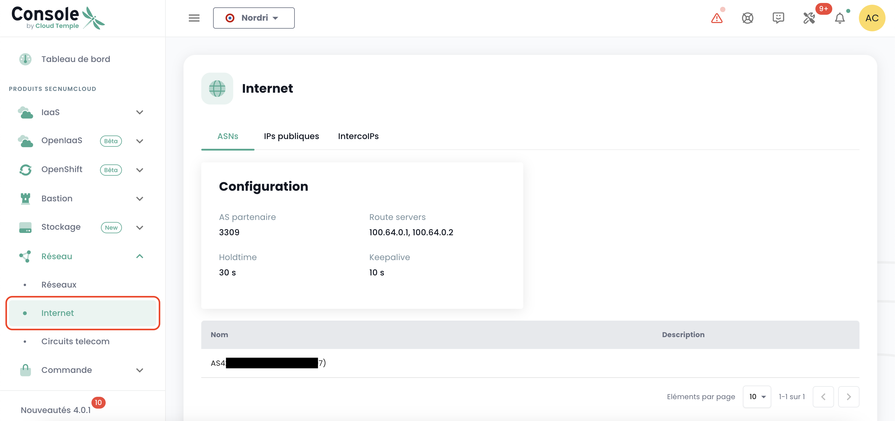
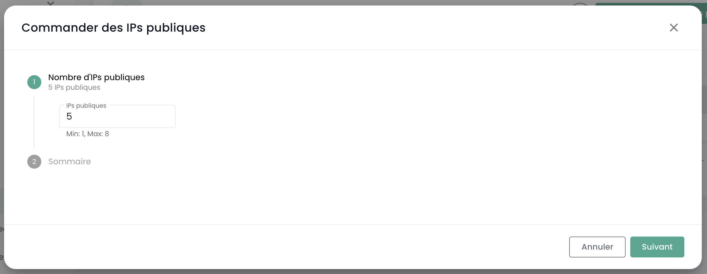
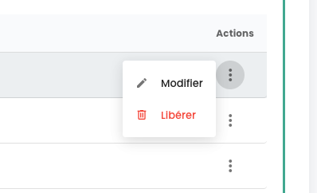

## Gestión de sus conectividades de Internet

La gestión de la conectividad se realiza a través del menú **'Red'** > **'Internet'**. Este menú centraliza la gestión de las direcciones IP, ofreciendo dos categorías distintas:

1. **Direcciones IP Públicas** : se utilizan para exponer sus servicios en Internet, facilitando así los intercambios de datos entrantes y salientes.
2. **Direcciones IP de Interconexión** : estas direcciones permiten a sus gateways dirigir el tráfico hacia la red específica de Cloud Temple, asegurando una conexión segura y eficiente.

Las direcciones IP públicas permiten el acceso a Internet, mientras que las direcciones IP de interconexión utilizadas con el protocolo BGP4 aseguran conexiones seguras entre redes. Estas últimas facilitan intercambios fiables y seguros entre su tenant y la red de Cloud Temple. El uso conjunto de estas direcciones mejora la gestión del tráfico y refuerza la seguridad y el rendimiento de la red.

Aquí está la interfaz principal para la gestión de las direcciones IP:

La pestaña de inicio corresponde a su ASN interno dedicado a su tenant. Indica, en particular, la información importante para la configuración de su conectividad BGP.

### Direcciones IP Públicas

Es posible ver y comentar los bloques y direcciones de IP asociados a su tenant a través del IPAM integrado en la consola Cloud Temple:

La orden de direcciones IPs públicas se hace a través del botón **'Ordenar IPs públicas'** :

La reserva y la asignación de una dirección IP se realizan a través del botón **'Reservar una dirección'** :

La modificación o eliminación de la reserva a través de los botones **'Acciones'** :

Eliminar una reserva significa que el recurso queda disponible para otro uso, pero sigue asignado y facturado al cliente.

En algunas líneas, el botón **'Acción'** no está disponible, indicando que las direcciones IP están reservadas y, por lo tanto, no disponibles para su uso.

### Direcciones IP de Interconexión

De la misma manera, puede ver y comentar los bloques de direcciones IP de interconexión. Puede visualizar las subredes de interconexiones con la red Cloud Temple y su uso:

Puede modificar fácilmente, al igual que las direcciones públicas, su uso en la gestión IPAM integrada:

