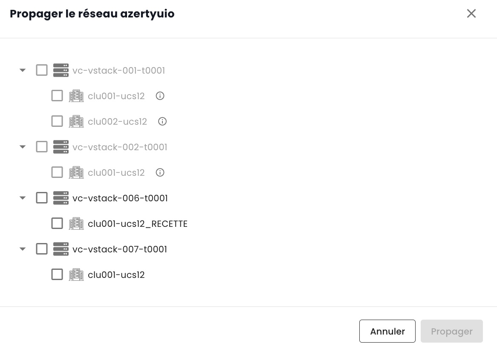

## Redes privadas regionales

El control de las redes privadas dentro de una región se realiza directamente en la consola de Cloud Temple. 

### Dentro de un tenant

La creación de una red virtual se hace en el menú __*Network*__ en la barra verde a la izquierda de la pantalla.

Luego, haga clic en el botón __*Nueva red*__

Debe especificar el nombre de su red que se mostrará. Por defecto, todos sus clusters accederán a su nueva red.
Sin embargo, en el submenú __*Opciones Avanzadas*__, puede especificar más detalladamente el alcance de la propagación dentro del tenant entre sus diferentes clusters.

Todas las acciones posibles en sus redes se encuentran en el menú __*Acciones*__ de cada una de ellas:

- La activación del intercambio de una red entre tenants de una misma organización.
- La desactivación del intercambio de una red entre tenants de una misma organización.
- La adición de un intercambio de una red entre tenants de una misma organización.
- La eliminación de un intercambio de una red entre tenants de una misma organización.
- La visualización gráfica de la propagación de una red en todos sus clusters e hipervisores dentro de un tenant.
- La eliminación de una propagación dentro de un tenant.
- La modificación de una propagación dentro de un tenant.
- La eliminación de una red.

#### Visualización de la propagación de sus redes

Puede visualizar fácilmente en el menú __*Acciones*__ la propagación de una red hacia sus diferentes clusters dentro de un mismo tenant.
Elija la opción *"Visualizar la propagación"*:

 

#### Modificación de la propagación

La modificación de una propagación dentro de un tenant se realiza mediante la opción *"Propagar"*:
Luego, elija los clusters que deben integrarse en esta propagación.

__*Nota:*__ *La modificación de la propagación está limitada a 20 redes por acción.*

#### Eliminación de una red

La eliminación de una red dentro de un tenant se realiza mediante la opción *"Eliminar la red"*:

### Compartir red entre tenants

Por defecto, __las redes están disponibles únicamente dentro de un tenant__. Puede optar por __compartir una red entre varios tenants__ por razones técnicas o de conectividad.
Es posible compartir una red entre sus __[Tenant](../../../console/iam/concepts/#tenant)__ dentro de una misma organización.

Simplemente active el intercambio como se muestra a continuación.

Una vez que se haya activado el intercambio, simplemente agregue un intercambio como se muestra a continuación.

Luego, seleccione el tenant de destino. Atención, la lista de tenants es dinámica.
Depende de su organización y sus permisos.

Una vez que la red se haya compartido, será visible en la pestaña 'Redes compartidas' desde su segundo tenant.

