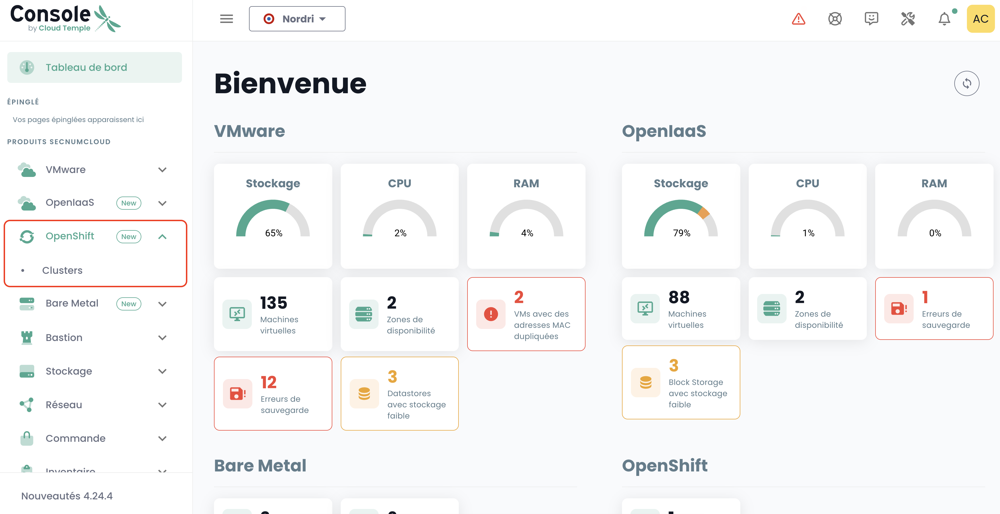

## Despliegue de una plataforma Redhat Openshift en su tenant

### Asignación de derechos de acceso

Es indispensable que el administrador del [Tenant](../console/iam/concepts.md#tenants) otorgue el derecho de gestión de la plataforma Openshift al usuario administrador de Openshift para poder acceder:


### Acceso al entorno Openshift dentro de un tenant

Después de la asignación de derechos, el módulo '__Openshift__' aparece en el menú de la consola Cloud Temple:



Entonces verá aparecer los clusters Openshift que están desplegados dentro de su tenant.

Haga clic en el cluster que deseas administrar. Accederá al entorno de administración del cluster:


Después de la autenticación, puede administrar su cluster:


### Recursos de su entorno

A continuación se presentan las informaciones de conexión y configuración propias de su entorno OpenShift.

#### Detalles de conexión

Para acceder a los diferentes componentes de OpenShift, asegúrese de que su tenant esté en la lista blanca en la consola (consulte la documentación: [Cloud Temple Documentation](https://docs.cloud-temple.com/)).

- __URL Shiva Tenant__:
  [https://**su-id-tenant**.shiva.cloud-temple.com/](https://**su-id-tenant**.shiva.cloud-temple.com/)  
  
- __OpenShift UI__:
  [https://ui-ocp01-**su-id**.paas.cloud-temple.com/](https://ui-ocp01-**su-id**.paas.cloud-temple.com/)  
  
- __API externa__:
  [https://api-ocp01-**su-id**.paas.cloud-temple.com](https://api-ocp01-**su-id**.paas.cloud-temple.com)  
  
- __GitOps (ARGOCD)__:
  [https://gitops-ocp01-**su-id**.paas.cloud-temple.com/applications](https://gitops-ocp01-**su-id**.paas.cloud-temple.com/applications)  
  
#### Conexión al cluster via CLI

Para conectarse a través de la línea de comandos (CLI), use el siguiente comando:

```bash
oc login https://api-ocp01-{su-id}.paas.cloud-temple.com/ --web
```

#### Acceso al registro

Para acceder al registro, inicie sesión usando los siguientes comandos:

```bash
oc login https://api-ocp01-{su-id}.paas.cloud-temple.com --web
docker login -u {su-usuario} -p $(oc whoami -t) registry-ocp01-{su-id}.paas.cloud-temple.com
```

Luego, pruebe la construcción y carga de una imagen Docker:

```bash
docker build -t <namespace>/temp:latest .
docker tag <namespace>/temp:latest registry-ocp01-{su-id}.paas.cloud-temple.com/<namespace>/temp:latest
docker push registry-ocp01-{su-id}.paas.cloud-temple.com/<namespace>/temp:latest
```

#### Configuración de routers y Load Balancers

La plataforma ofrece opciones flexibles para el __enrutamiento de flujos__ y el __balanceo de carga__:

- Por defecto, se utilizan load balancers privados para las rutas y los ingresses.  
- Dominios:  
  - `*.apps-priv-ocp01-{su-id}.paas.cloud-temple.com`  
  - `*.apps-ocp01-{su-id}.paas.cloud-temple.com`  

Asegúrese de que sus rutas o ingresses estén configurados con las etiquetas o clases de ingress apropiadas para garantizar un enrutamiento correcto.

Ejemplo:

```yaml
metadata:
  labels:
    ct-router-type: public
```

#### Interconexión IaaS

Las configuraciones de red juegan un papel crucial para asegurar las comunicaciones con OpenShift.

- __Red de interconexión__: 100.67.0.0/28  
- __VIP del load balancer privado__: 100.67.0.3  

Verifique que su firewall tenga una interfaz dedicada y permita el tráfico entre las redes especificadas.