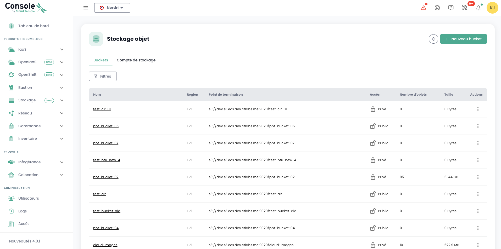
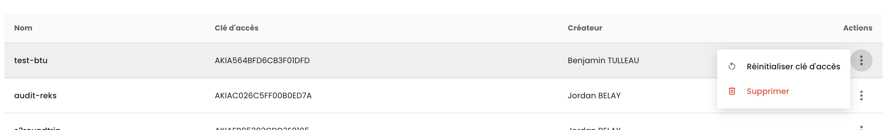
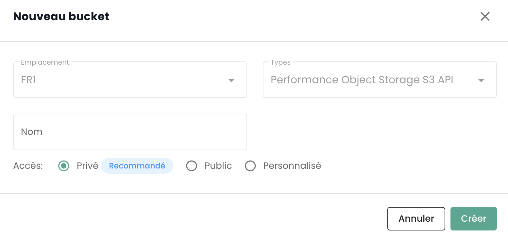
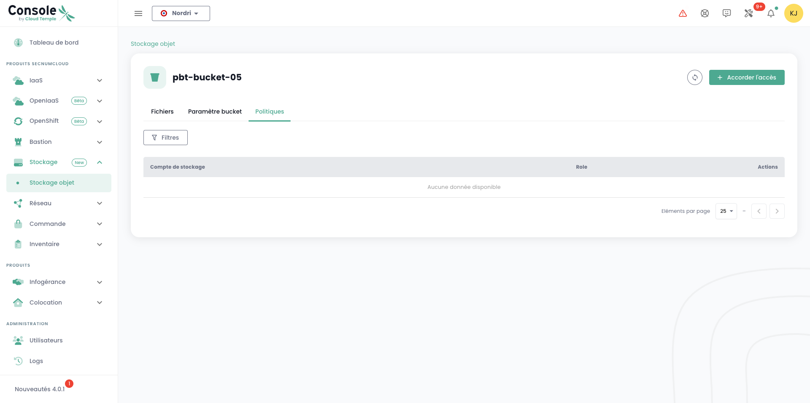
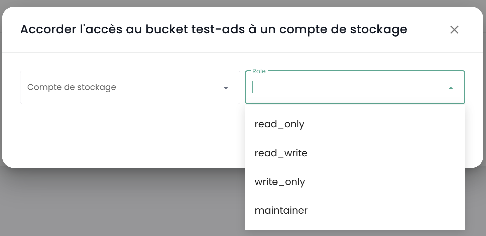
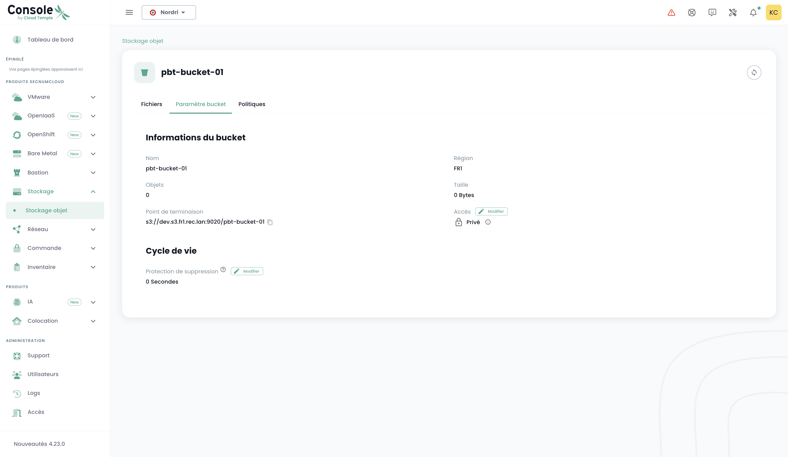

## Listar todos los buckets S3 de su tenencia

Puede acceder a todos sus buckets a través del menú '__Almacenamiento de Objetos__' en la consola de Cloud Temple:



Puede ver todas las cuentas creadas en su tenencia y autorizadas para acceder al servicio S3 a través de la pestaña '__Cuentas de almacenamiento__'.


## Creación de una nueva cuenta de almacenamiento

La creación de una cuenta de almacenamiento en su tenencia se realiza presionando el botón '__Nueva cuenta de almacenamiento__' en la parte superior derecha, en la pestaña '__Cuentas de almacenamiento__':


La plataforma le dará entonces la clave de acceso y la clave secreta de su bucket:


__ATENCIÓN:__ Las claves secreta y de acceso se presentan una sola vez. Después de esta primera aparición, se vuelve imposible acceder nuevamente a la clave secreta. Es esencial anotar esta información inmediatamente; de lo contrario, será necesario generar un nuevo par de claves.

La regeneración se realiza en las opciones de las claves seleccionando la opción "Reinicializar clave de acceso".




## Creación de un bucket S3 

La creación de un nuevo bucket se realiza haciendo clic en el botón '__Nuevo bucket__' en la parte superior derecha de la pantalla:


Se mostrará una ventana en la que deberá proporcionar:

1. La **región** de creación de su bucket,
2. El **tipo** de bucket: rendimiento o archivo,
3. El **nombre** de su bucket (debe ser único).



A partir del 3 de Abril de 2024, la región disponible es **FR1** (París) y solo está disponible el tipo rendimiento.

También deberá elegir quién puede acceder a su bucket:

- Acceso **Privado**: Por defecto, el acceso está limitado a las direcciones IP específicas de Cloud Temple.
- Acceso **Público**: El acceso está abierto a todas las direcciones de Internet (particularmente a través de la regla 0.0.0.0/0). Desaconsejamos esta configuración debido a sus implicaciones en términos de seguridad.
- Acceso **Personalizado**: Esta opción le permite especificar las direcciones IPv4 o los rangos de subred que desea autorizar.

## Asociación de una cuenta de almacenamiento a un bucket

Las asociaciones de cuenta a los buckets se realizan en la pestaña '__Políticas__'



Esta asociación permite dar acceso de la cuenta de almacenamiento al bucket. Hay cuatro roles:

1. **Mantenedor**: Los derechos de lectura, escritura, gestión de permisos y gestión de políticas

Los permisos S3 detrás de este rol:
```json
{
    "name": "maintainer",
    "permissions": [
        "s3:*"
    ]
}
```

2. **Escritor y Lector**: Leer y editar, modificar, eliminar archivos en los buckets.

Los permisos S3 detrás de este rol:
```json
{
    "name": "read_write",
    "permissions": [
        "s3:Get*"
        "s3:List*"
        "s3:*Object"
    ]
}
```

3. **Escritor**: Leer y editar, modificar, eliminar archivos en los buckets.

Los permisos S3 detrás de este rol:
```json
{
    "name": "write_only",
    "permissions": [
        "s3:List*"
        "s3:*Object"
    ]
}
```

4. **Lector**: Leer los archivos en los buckets y descargarlos.

Los permisos S3 detrás de este rol:
```json
{
    "name": "read_only",
    "permissions": [
        "s3:Get*"
        "s3:List*"
    ]
}
```



## Navegar un bucket S3

Cuando hace clic en el nombre de un bucket, accede primero a la pestaña '__Archivos__' para ver su contenido:


En la pestaña '__Parámetros__' puede ver los detalles de la información de su bucket S3:



Verá entonces:

1. El nombre del bucket S3,
2. Su región,
3. El número de objetos que contiene y el tamaño en bytes del bucket,
4. Su punto de terminación,
5. Los parámetros de ciclo de vida que definen, entre otras cosas, la expiración de los objetos del bucket. '__0__' corresponde a una retención infinita.

Puede modificar el parámetro de retención a través del botón '__Modificar__' del ciclo de vida:


Finalmente, puede modificar su tipología de acceso.

## Limitaciones de acceso a sus buckets S3

Es muy sencillo configurar las restricciones de acceso a sus buckets S3. Durante la creación de un bucket, tiene la opción de elegir entre tres configuraciones de acceso:


- Acceso **Privado**: Por defecto, el acceso está limitado a las direcciones IP específicas de Cloud Temple.
- Acceso **Público**: El acceso está abierto a todas las direcciones de Internet (particularmente a través de la regla 0.0.0.0/0). Desaconsejamos esta configuración debido a sus implicaciones en términos de seguridad.
- Acceso **Personalizado**: Esta opción le permite especificar las direcciones IPv4 o los rangos de subred que desea autorizar:


*El soporte para IPv6 está previsto para el primer semestre de 2025.*

## Eliminación de un bucket S3

La eliminación de un bucket se realiza en las acciones asociadas al bucket seleccionando la opción __'Eliminar'__.


_**ATENCIÓN: La eliminación es definitiva y no hay manera de recuperar los datos.**_


## ¿Cómo se cobra la oferta S3 de Cloud Temple?

El precio es un precio mensual, por Gio de almacenamiento, facturado mensualmente. Sin embargo, la plataforma contabiliza el uso por hora y realiza la facturación sobre una base mensual de 720 horas.

Por ejemplo, si consume en el mes 30 Gio durante 1h y luego nada, y luego algunos días después 30 Gio durante 2h, la factura mensual será de *(Precio (1 x 30Gio) + 2 x Precio (30Gio)) / 720* en el mes considerado. La facturación es a término vencido.