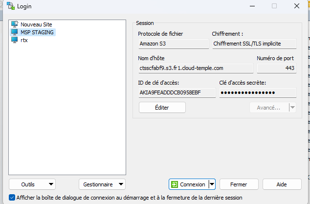

## Utiliser MINIO

Vous pouvez utiliser le client minio par exemple :

https://min.io/docs/minio/linux/reference/minio-mc.html

Par exemple : 
```
    mc alias set <alias_name> https://reks2ee2b1.s3.fr1.cloud-temple.com <access_key> <secret_key>
```
Pousser un fichier : 
```
    mc cp test.txt <alias_name>/<bucket_name>
```
Récupérer un fichier :
```
    mc ls <alias_name>/<bucket_name>
```
## Cloud Berry Explorer

puede utilizar también [Cloud Berry Explorer](https://www.msp360.com/explorer/).

1. Conéctese usando su endpoint y su clave:


2. Una vez conectado, introduzca el nombre del bucket en la barra de navegación:


3. Podrá entonces usar el bucket normalmente: 


## Utiliser WINSCP 6.3.x

Puede utilizar [Winscp](https://winscp.net/eng/download.php) :

1. Conéctese usando su endpoint, su clave de acceso y su clave secreta:



2. Una vez conectado, utilice WINSCP normalmente como un sitio FTP o SCP:


## Ajouter le HASH d'un fichier lors de l'upload d'un objet

Globalmente, el HASH de los archivos es soportado en nuestro almacenamiento de objetos vía los metadatos. Algunos clientes permiten calcular en tiempo real un HASH y añadirlo en los metadatos (minio-mc con md5 por ejemplo), para otros, hay que especificar los datos en los metadatos directamente.

1. Caso de añadir un HASH con el cliente minio-mc: este cliente soporta el cálculo en tiempo real de un hash MD5 y el almacenamiento en los metadatos


            ╰─➤  cat test.txt                       
            Esto es una prueba 
            ╰─➤  md5 test.txt                       
            MD5 (test.txt) = 8b34b2754802a46e3475998dfcf76f83
            ╰─➤  mc cp -md5 test.txt CLR-PUB/CLR-PUB
            ...lesur/Downloads/test.txt: 18 B / 18 B  ▓▓▓▓▓▓▓▓▓▓▓▓▓▓▓▓▓▓▓▓▓▓▓▓▓▓▓▓▓▓▓▓▓▓▓▓▓▓▓▓▓▓▓▓▓▓▓▓▓▓▓▓▓▓▓▓▓▓▓▓▓▓▓▓▓▓▓▓▓▓▓▓▓▓▓▓▓▓▓▓▓▓▓▓▓▓▓▓▓▓▓▓▓▓▓▓▓▓▓▓▓  111 B/s 0s
            ╰─➤  mc stat CLR-PUB/CLR-PUB/test.txt
            Name      : test.txt
            Date      : 2024-06-08 10:21:31 CEST 
            Size      : 18 B   
            ETag      : 8b34b2754802a46e3475998dfcf76f83 
            Type      : file 
            Encryption: SSE-S3
            Metadata  :
                Content-Type: text/plain 

2. Ejemplo de añadir un sha256 "manualmente": para esto utilizamos los atributos S3 del archivo.

            ╰─➤  cat test.txt
            Esto es una prueba
            ╰─➤  shasum -a 256 test.txt                            
            2c5165a6a9af06b197b63b924d7ebaa0448bc6aebf8d2e8e3f58ff0597f12682  test.txt
            ╰─➤  mc cp -md5 test.txt CLR-PUB/CLR-PUB -attr "checksum-sha256=$(shasum -a 256 test.txt | cut -f1 -d' ')"
            ...lesur/Downloads/test.txt: 18 B / 18 B  ▓▓▓▓▓▓▓▓▓▓▓▓▓▓▓▓▓▓▓▓▓▓▓▓▓▓▓▓▓▓▓▓▓▓▓▓▓▓▓▓▓▓▓▓▓▓▓▓▓▓▓▓▓▓▓▓▓▓▓▓▓▓▓▓▓▓▓▓▓▓▓▓▓▓▓▓▓▓▓▓▓▓▓▓▓▓▓▓▓▓▓▓▓▓▓▓▓▓▓▓▓▓▓  141 B/s 0s
            ╰─➤  mc stat CLR-PUB/CLR-PUB/test.txt                                                                     
            Name      : test.txt
            Date      : 2024-06-08 10:41:17 CEST 
            Size      : 18 B   
            ETag      : 8b34b2754802a46e3475998dfcf76f83 
            Type      : file 
            Encryption: SSE-S3
            Metadata  :
                X-Amz-Meta-Checksum-Sha256: 2c5165a6a9af06b197b63b924d7ebaa0448bc6aebf8d2e8e3f58ff0597f12682 
                Content-Type              : text/plain