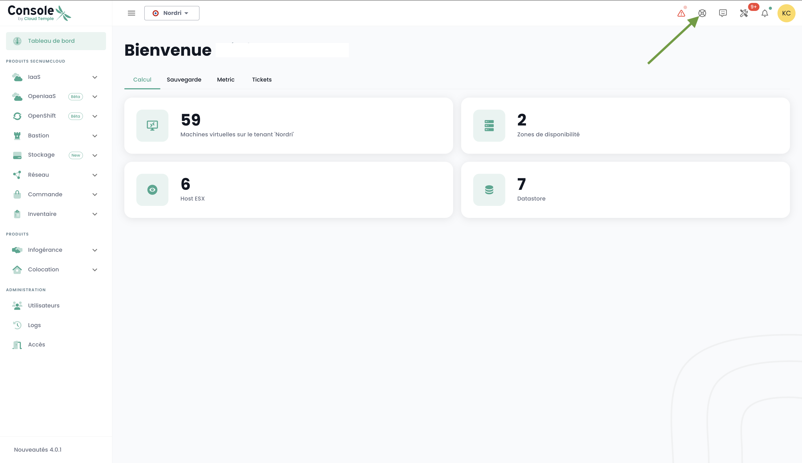
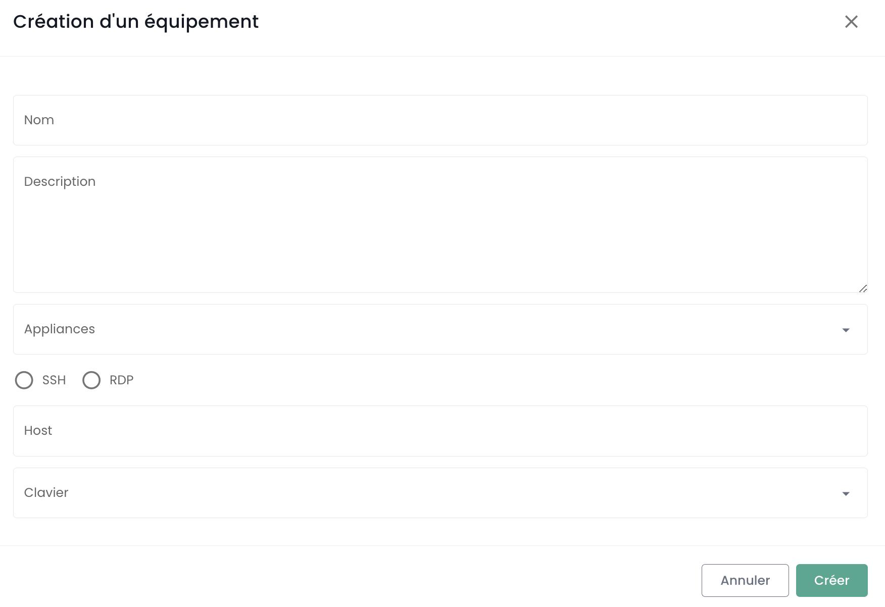

Questa guida di avvio presenta come richiedere la creazione di un'Appliance e come registrare una nuova sessione e connettersi ad essa.

## Prerequisiti

1. Avere sottoscritto l'offerta Cloud Temple (sottoscrizione Appliance Bastion).
2. Gli apparati da amministrare devono essere accessibili dalla rete in cui è distribuita l'Appliance Bastion.
3. Avere i diritti sul modulo Bastion.
4. Nel contesto di una distribuzione dell'Appliance on-premise, i flussi corrispondenti devono essere aperti.

## I flussi necessari per il funzionamento del prodotto Bastion

Diversi flussi sono necessari per il corretto funzionamento dell'Appliance Bastion.

### La passerella bastion
| Source                   | Destination                                 | Protocollo |
|--------------------------|---------------------------------------------|------------|
| Appliance bastion client | 91.223.207.71 (botg.shiva.cloud-temple.com) | UDP/4242   |

### Flusso di amministrazione RDP

| Source                   | Destination                 | Protocollo |
|--------------------------|-----------------------------|------------|
| Appliance bastion client | Le instanze da amministrare | TCP/3389   |

### Flusso di amministrazione SSH

| Source                   | Destination                 | Protocollo |
|--------------------------|-----------------------------|------------|
| Appliance bastion client | Le instanze da amministrare | TCP/22     |

## Richiedere la creazione di un'Appliance
Prima di poter distribuire un'Appliance, è necessario richiedere una sottoscrizione per un'Appliance tramite una richiesta al supporto.
Il supporto è accessibile nella console Shiva dall'icona salvagente sulla barra in alto a destra della finestra.

## Registrare un apparato

Per accedere regolarmente a un apparato da amministrare, è più adatto creare una sessione, che richiederà solo il tuo nome utente e la password ad ogni connessione.

Per fare ciò, vai alla scheda « Apparati » del menu « Bastion », quindi clicca sul pulsante « Nuovo apparato ».

Inserisci quindi le informazioni necessarie alla creazione del tuo apparato:

    - Nome dell'apparato;
    - Descrizione;
    - Appliance associata;
    - Tipo di protocollo (SSH o RDP);
    - Indirizzo IP dell’host;
    - Configurazione della tastiera.

Una notifica che indica la creazione dell’apparato dovrebbe apparire in alto a destra della pagina. La sessione viene quindi aggiunta all'elenco dei tuoi apparati.

Per creare un nuovo apparato, puoi anche passare dalla scheda « Appliances » cliccando sulla barra d’azione dell’Appliance a cui desideri associare un apparato.

## Connettersi a un apparato

Vai alla scheda « Apparati » della scheda « Bastion ». Clicca sulla barra d’azione dell’apparato che desideri aprire e clicca sul pulsante « Apri ».

Ad ogni connessione all’apparato, devi solo inserire le informazioni di autenticazione.

Dopo aver inserito le tue credenziali, una notifica che conferma l'inizio della connessione al tuo apparato appare e si apre la console verso la tua macchina virtuale.