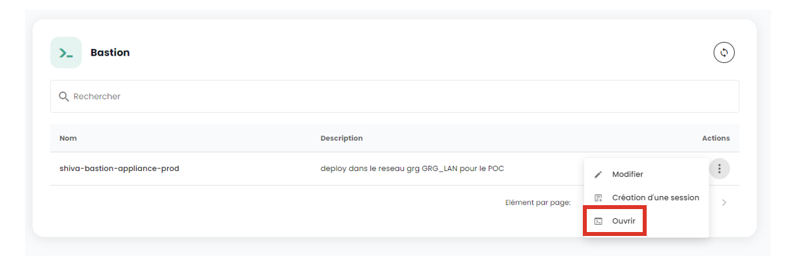

Questi tutorial ti aiutano a distribuire e gestire un Bastion Cloud Temple dal portale Shiva.

## Prerequisiti

1. Avere sottoscritto all'offerta Cloud Temple (sottoscrizione Appliance Bastion).
2. Gli equipaggiamenti da amministrare devono essere accessibili dalla rete dove è distribuita l'Appliance Bastion.
3. Avere i diritti sul modulo Bastion.
4. Nel contesto di una distribuzione del Appliance onpremise, i flussi corrispondenti devono essere aperti.

## Interfaccia

Una volta connesso al portale web Shiva, vai alla scheda "Bastion" del menu di sinistra.

La scheda "Equipements" ti consente di consultare l'elenco dei tuoi equipaggiamenti. Un equipaggiamento corrisponde a una configurazione di connessione tramite un Appliance Bastion. Per ogni equipaggiamento sono indicati il nome, i tag, la descrizione, l'Appliance associata, il tipo di connessione (SSH o RDP), l'IP dell'host e infine la configurazione della tastiera.

Puoi filtrare l'elenco dei tuoi equipaggiamenti in base ai tag assegnati, e un motore di ricerca consente di cercare una sessione con il suo nome.

La scheda "Appliances" ti fornisce l'elenco delle tue Appliance Bastion. Per ogni Appliance sono specificati il nome e la descrizione.

Un motore di ricerca è disponibile per consentirti di cercare un'Appliance con il suo nome.

## Distribuire un'Appliance
Prima di poter distribuire un'Appliance, è necessario fare una richiesta di sottoscrizione a un'Appliance tramite una richiesta al supporto.

## Aprire un flusso verso un equipaggiamento
Nella scheda "Appliances", clicca sulla barra di azione dell'Appliance che desideri aprire. Clicca poi sul bottone "Ouvrir".

Inserisci poi le informazioni necessarie alla connessione:

    - Scelta del protocollo (SSH o RDP);
    - Indirizzo IP dell'host da amministrare;
    - Informazioni di identificazione;
    - Configurazione della tastiera.

Clicca poi su "Connecter" per aprire l'Appliance. La console della macchina virtuale da amministrare si apre.

## Registrare un equipaggiamento

Per accedere regolarmente a un equipaggiamento da amministrare, è più adatto creare una configurazione di equipaggiamento, che richiederà solo il tuo nome utente e la tua password ad ogni connessione.

Per fare questo, vai nella scheda "Equipements" del menu "Bastion", poi clicca sul bottone "Nouveau équipement".

Inserisci poi le informazioni necessarie alla creazione del tuo equipaggiamento:

    - Nome dell'equipaggiamento;
    - Descrizione;
    - Appliance associata;
    - Tipo di protocollo (SSH o RDP);
    - Indirizzo IP dell'host;
    - Lingua della tastiera.

Dovrebbe apparire una notifica che indica la creazione della tua configurazione di equipaggiamento nella parte superiore destra della pagina. La configurazione viene poi aggiunta all'elenco dei tuoi equipaggiamenti.

Per creare una nuova connessione, puoi anche passare dalla scheda "Appliances" cliccando sulla barra di azione dell'Appliance a cui desideri associare una configurazione di equipaggiamento.

## Connettersi a un equipaggiamento

Vai nella scheda "Equipements" della scheda "Bastion". Clicca sulla barra di azione dell'equipaggiamento che desideri aprire, e clicca sul bottone "Ouvrir".

Ad ogni connessione all'equipaggiamento, devi solo inserire le tue informazioni di autenticazione.

Dopo aver inserito le tue credenziali, appare una notifica che conferma l'inizio della sessione e si apre la console verso la tua macchina virtuale.

## Modificare una configurazione di equipaggiamento

Vai nella scheda "Equipements" della sezione "Bastion", clicca sulla barra di azione dell'equipaggiamento che desideri modificare, e clicca sul bottone "Modifier".

Puoi poi modificare il nome dell'equipaggiamento, la descrizione, l'Appliance associata, il protocollo (SSH o RDP), l'indirizzo IP dell'host o la lingua della tastiera.

## Eliminare una configurazione di equipaggiamento

Vai nella scheda "Equipements" della sezione "Bastion", clicca sulla barra di azione dell'equipaggiamento che desideri eliminare, e clicca sul bottone "Supprimer".

