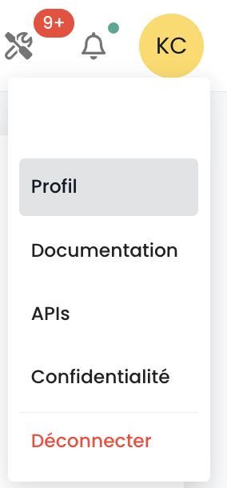
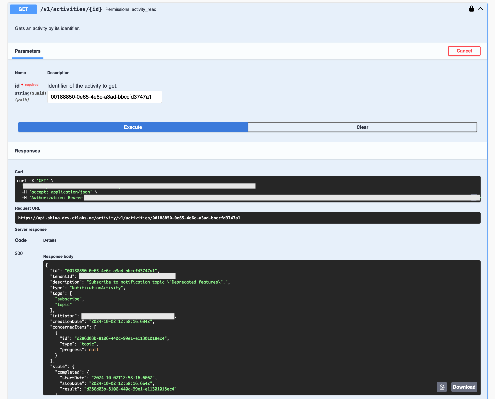

## Chiavi API

La __chiave API__ permette di autenticarsi quando si vogliono fare richieste all'API. La generazione di una chiave API, chiamata anche __Personal Access Token (PAT)__, è un modo sicuro di collegarsi alle API di Shiva senza passare attraverso un'interfaccia grafica. Ognuno di questi token è legato a un tenant e all'utente che lo ha creato.

La creazione di questo token avviene dal proprio account. È possibile generare più chiavi e configurare le autorizzazioni per ciascuna nel limite dei propri diritti.

Per creare una chiave API, è sufficiente __cliccare sul proprio profilo__:



Nel menu del profilo, cliccare su __'Token di accesso personale'__


A questo punto, viene visualizzato l'insieme delle chiavi API create per quell'utente all'interno di quel tenant. Cliccare su __'Nuovo token di accesso personale'__


Poi è necessario:

- Indicare il nome di questo nuovo token,
- Indicare una data di scadenza (massimo 12 mesi di validità),
- Scegliere i permessi associati al token.

I dettagli riguardanti il tuo token verranno quindi visualizzati. __Attenzione, non sarà più possibile accedervi successivamente.__

Se non annoti queste informazioni, dovrai distruggere e ricreare il token.


Per motivi di sicurezza, si raccomanda di creare più token, ciascuno con un'utilità specifica (un token per ogni applicazione o processo aziendale) piuttosto che creare un unico token con tutti i diritti.

Vedi quindi il nuovo token creato e la sua futura data di scadenza.


## Accesso al portale API

La documentazione OpenAPI 3.0 (Swagger) delle API della console Cloud Temple è disponibile direttamente nell’applicazione:


L'accesso alle API richiede autenticazione. Una volta autenticati, tutte le operazioni devono avere l'header
__'Authorization'__ con il bearer access token ottenuto nella fase di autenticazione.

L'URL dei punti di accesso è fornito direttamente in __Swagger__ (nell'oggetto "Servers" di ciascuna pagina delle API).

## Le attività

Il monitoraggio delle richieste di tipo scrittura (POST, PUT, PATCH, DELETE) è garantito tramite la gestione delle attività. Ogni richiesta di questo tipo genera automaticamente un'attività associata. Un codice di stato HTTP 201 conferma la creazione avvenuta con successo dell'attività. L'identificativo unico di questa attività viene restituito negli header della risposta, sotto la chiave 'Location'.


Una volta recuperato l'identificativo, è possibile accedere ai dettagli dell'attività utilizzando l'API del modulo Activity:



Il contenuto dell'attività include tutte le informazioni essenziali per identificare l'operazione, la sua data di esecuzione e il suo stato di avanzamento. Ecco il modello di un'attività:

```
    {
    "tenantId": "UUIDV4",
    "description": "STRING",
    "type": "ComputeActivity" | "BackupActivity" | "IAMActivity" | "TagActivity" | "RTMSActivity" | "BastionActivity" | "SupportActivity",
    "tags": "STRING[]",
    "initiator": "UUIDV4",
    "concernedItems": [
        {
        "type": "string",
        "id": "string"
        }
    ],
    "id": "UUIDV4",
    "creationDate": "DATE",
    "operationType": "read" | "write",
    "state": "CompletedState | RunningState | WaitingState | FailedState"
}
```

L'oggetto **state** può assumere diverse forme a seconda dello stato dell'attività, ovvero:

**waiting**, stato prima che l'operazione sia iniziata:
```
    waiting: {}
```
**running**, stato quando l'operazione è in corso:
```
    running: {
    status: string;
    startDate: Date;
    progression: number;
    };
```
**failed**, stato se l'operazione è fallita:
```
    failed: {
    startDate: Date;
    stopDate: Date;
    reason: string;
    };
```
**completed**, stato se l'operazione è completata:
```
    completed: {
    startDate: Date;
    stopDate: Date;
    result: string;
    };
```

**Nota: l'Identificativo (UUIDv4) della risorsa creata è disponibile nel risultato dell'attività una volta che questa è completata.**

## Limiti API

### Perché dei limiti?

La console Cloud Temple definisce __dei limiti sul volume di richieste__ che un utente può inviare
all'API in un determinato periodo. L'istituzione di questi limiti di frequenza è una misura comune nella gestione delle API, adottata per molteplici motivi essenziali:

- **Prevenzione degli abusi**: Questi limiti contribuiscono a salvaguardare l'integrità dell'API prevenendo usi abusivi o maldestri che potrebbero compromettere il suo funzionamento.
- **Assicurazione della qualità del servizio**: Regolando l'accesso all'API, si garantisce una distribuzione equa delle risorse, permettendo così a tutti gli utenti di beneficiare di un'esperienza stabile e performante.

Prendiamo l’esempio di uno script mal progettato o inefficiente che tenta chiamate ripetitive all’API,
rischiando di saturare le risorse e degradare le prestazioni. Stabilendo dei limiti di richiesta,
preveniamo queste situazioni e assicuriamo il mantenimento di un__servizio fluido e senza interruzioni__ per l'intera clientela.

### Quali sono i limiti di tasso per l'API della console Cloud Temple?

Applichiamo restrizioni quantitative sulle interazioni degli utenti con la console per ogni prodotto.

I limiti sono definiti in __richieste per secondo (r/s) e per IP sorgente__. Oltre la soglia limite, il sistema risponderà con un codice errore HTTP 429, segnalando che il limite di richieste autorizzate è stato superato.

Ecco i limiti definiti:

| Prodotto                 | Soglia limite |
|-------------------------|--------------|
| Console Cloud Temple    | 60 r/s       |
| Identità (IAM)          | 60 r/s       |
| IaaS - Calcolo          | 60 r/s       |
| IaaS - Archiviazione    | 20 r/s       |
| IaaS - Backup           | 60 r/s       |
| PaaS - S3               | 60 r/s       |
| PaaS - Openshift        | 60 r/s       |
| Rete                    | 60 r/s       |
| Hosting                 | 60 r/s       |

### Come funzionano i limiti di tasso?

Se il numero di richieste inviate a un punto API supera il limite autorizzato, il punto API reagirà restituendo __un codice di risposta HTTP 429__. Questo codice indica che l'utente ha superato il numero di richieste consentite. Quando ciò si verifica, il punto API fornirà anche un oggetto JSON in risposta, che conterrà informazioni dettagliate sulla limitazione applicata:
```
    {
        "error": {
            "status": "429 Too Many Requests",
            "message": "Too Many Requests"
        }
    }
```
### Come evitare di fare troppe richieste?

Si raccomanda di limitare il numero di chiamate API effettuate dalla propria automazione in modo da rimanere al di sotto dei limiti di tasso fissati per il punto finale.

Questa situazione si verifica spesso quando più richieste vengono eseguite in parallelo, utilizzando più processi o thread.

Esistono diversi modi per migliorare l'efficienza dell'automazione, incluso l'uso di meccanismi di __caching__ e l'implementazione di un __sistema di riprova con attenuazione progressiva__. Questo metodo implica una breve attesa quando si incontra un errore di limite di tasso, per poi riprovare la richiesta. Se la richiesta fallisce nuovamente, la durata dell'attesa viene aumentata progressivamente fino a quando la richiesta non riesce o fino a quando non viene raggiunto un numero massimo di tentativi.

Questo approccio presenta numerosi vantaggi:

- __L'attenuazione progressiva__ garantisce che i primi tentativi vengano riprodotti rapidamente, prevedendo tempi più lunghi in caso di fallimenti ripetuti.
- L'aggiunta di una __variazione casuale__ all'attesa contribuisce a evitare che tutti i tentativi si verifichino simultaneamente.

È importante notare che __le richieste infruttuose non influiscono sul proprio limite di tasso__. Tuttavia, inviare in modo continuo una richiesta potrebbe non essere una soluzione praticabile a lungo termine, poiché questo comportamento potrebbe essere modificato in futuro. Pertanto, si consiglia di non dipendere esclusivamente da questo meccanismo.

Le librerie __[Backoff](https://pypi.org/project/backoff/)__ e __[Tenacity](https://pypi.org/project/tenacity/)__ in Python sono buoni punti di partenza per implementare strategie di attenuazione.

## Ciclo di vita di un endpoint API

Le informazioni sull'evoluzione degli endpoint dell'API sono disponibili nelle note di rilascio:


Troverai l'elenco di endpoint che sono deprecati attività per attività.

Inoltre, gli endpoint deprecati appariranno in questo modo sulle nostre API: __~~this/is/an/endpoint~~__ insieme a una data di rimozione definitiva nella descrizione.