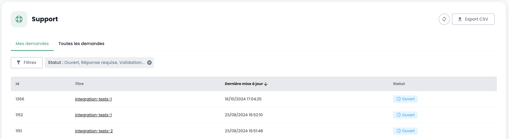

## Prérequis
- Avoir souscrit à une offre Cloud Temple. Per sottoscrivere semplicemente, potete [contattarci](https://www.cloud-temple.com/contactez-nous/) o via mail all'indirizzo __contact@cloud-temple.com__.
- Avere un accesso alla console Shiva
- Avere il proprio IPv4 pubblico dichiarato nella zona di fiducia Cloud Temple (l'accesso alla console shiva è limitato agli indirizzi di fiducia identificati)

## Connessione al vostro tenant Cloud Temple
Shiva è accessibile tramite l'URL sotto riportato:
    https://shiva.cloud-temple.com
    Oppure dall'URL diretto che vi è stato comunicato via mail.

La prima pagina consente di selezionare [l'organizzazione](iam/concepts.md#organisations) in cui è stato creato il vostro utente.
Una volta inserita l'azienda, fate clic su __'Se connecter'__.

Sarete quindi reindirizzati a una pagina in cui vi viene chiesto di autenticarvi.
Una volta connessi, arriverete su questa pagina.

## Gestione della lingua
La console è disponibile in __francese__, __inglese__. Potete cambiare la lingua di funzionamento tramite l'icona __langue__ situata in alto a destra dello schermo.

Il cambio di lingua di un utente deve essere effettuato nel suo __'Profil'__, in alto a destra dello schermo, nei __'Paramètres utilisateur'__.

La configurazione è fatta per ciascun tenant [Tenant](iam/concepts.md#tenant).

## Accesso al supporto tecnico

In qualsiasi momento, potete contattare __l'équipe di supporto Cloud Temple__ tramite l'icona __'bouée'__ situata in alto a destra dello schermo.

Sarete guidati durante tutto il processo di richiesta di supporto.

La prima fase è l'identificazione del tipo di richiesta di supporto:

- Chiedere un consiglio sull'utilizzo di un prodotto (esclusi incidenti),
- Chiedere assistenza in relazione al vostro account cliente,
- Segnalare un incidente o chiedere supporto tecnico.
- Chiedere l'assistenza di un servizio professionale (disponibilità di un ingegnere Cloud Temple per una problematica).

Avrete quindi la possibilità di fornire dettagli e includere file (immagini o registri ad esempio).

Il richiedente può anche specificare un livello di criticità (P1 a P4) nella descrizione del ticket, in caso di un incidente, come:

**CRITICO (P1) - Notifica immediata**:

- Sospetto di fuga di dati sensibili
- Rilevamento di un accesso non autorizzato ai vostri dati
- Compromissione delle vostre credenziali di amministrazione
- Indisponibilità totale dei vostri servizi critici
- Comportamenti anomali sui dati sensibili
- Violazione di dati personali

**ALTA (P2) - Notifica < 2h**:

- Malfunzionamento degli accessi utenti
- Anomalia nella crittografia dei vostri dati
- Perdita di accesso ad alcune funzionalità critiche
- Incoerenza nei dati
- Rallentamenti significativi che impattano l'attività

**MEDIA (P3) - Notifica < 4h**:

- Problema di performance localizzato
- Incidente su una funzione non critica
- Errore di configurazione con impatto limitato
- Difficoltà di accesso occasionale

**BASSA (P4) - Notifica < 24h**:

- Richiesta di investigazione
- Anomalia senza impatto diretto
- Domanda di conformità
- Necessità di chiarimento tecnico

Una volta effettuata la vostra richiesta, è possibile ritrovare le vostre richieste tramite l'icona __'bouée'__ situata in alto a destra dello schermo:

## Accesso alle funzionalità utente tramite l'interfaccia web

Tutte le funzionalità accessibili al vostro utente (in base ai suoi diritti) si trovano a sinistra dello schermo, nel banner verde.
Le funzionalità sono raggruppate per modulo. I principali raggruppamenti includono:

- L'__inventario__ delle vostre risorse,
- Il __monitoraggio delle operazioni__,
- Il __controllo delle risorse IaaS__ (Calcolo, storage, rete, ...)
- Il __controllo delle risorse OpenIaaS__ (Calcolo, storage, rete, ...)
- L'accesso ai __servizi accessori__ (Bastion, monitoring, ...)
- L'__amministrazione della vostra organizzazione__ (Gestione dei tenant, dei diritti, ...)

L'attivazione di un modulo per un utente dipende dai diritti dell'utente. Ad esempio, il modulo __'Commande'__ non sarà disponibile se l'utente non dispone del diritto __'ORDER'__.

Ecco una presentazione dei vari moduli disponibili. Nuovi moduli arricchiscono regolarmente la console:

- __Dashboard__ : permette di avere rapidamente una vista sul __totale delle risorse di calcolo e di storage__, le statistiche del __backup__ e una __sintesi delle pratiche di supporto__,
- __Inventario__ : permette di avere una visione d'insieme delle vostre risorse di tipo __'macchine virtuali'__. Se vengono utilizzati i __tag__, permette di avere una vista per __tag__ (ad esempio, vista business, vista applicativa, ...),
- __Gestione delegata__ : dà accesso al monitoraggio delle vostre __richieste di supporto__ e alla __metrologia dei servizi__,
- __IaaS__ : permette il __controllo delle infrastrutture IaaS VMware__ (Macchine virtuali, cluster, hypervisor, repliche, backup, ...),
- __OpenIaaS__ : permette il __controllo delle risorse Xen Orchestra__ (Macchine virtuali, backup, ...),
- __OpenShift__ : permette il controllo della vostra **architettura PaaS RedHat Openshift** e la gestione dei vostri container nelle 3 zone di disponibilità della piattaforma.
- __Bastion__ : Permette di distribuire e controllare appliance bastion SSH/RDP nelle vostre reti,
- __Networking__ : permette il controllo delle __reti di livello 2 e 3__, degli __IP pubblici__ e dei vostri __circuiti di telecomunicazione__,
- __Colocation__ : Offre una vista sugli apparati situati nella zona di __collocazione condivisa o dedicata__,
- __Ordine__ : Permette l'ordine di risorse e il monitoraggio delle distribuzioni,
- __Amministrazione__ : Raccoglie le funzioni di amministrazione degli utenti e dei tenant, nonché l'accesso alla registrazione globale.

I pittogrammi __'NEW'__ significano che il prodotto in questione è stato fornito ma non è ancora qualificato come __offerta SecNumCloud__ e __'BETA'__ significano che il prodotto in questione è stato fornito ed è stato recentemente qualificato come __offerta SecNumCloud__.

## Accesso alle funzionalità utente tramite l'API

L'accesso a tutte le funzionalità della console Shiva è possibile tramite l'API Shiva. Potete avere i dettagli dei verbi e delle configurazioni tramite __'Profil'__ e __'APIs'__:

## Provider Terraform

Cloud Temple vi mette a disposizione un provider Terraform per controllare *"as code"* la vostra piattaforma Cloud. È accessibile qui:

https://registry.terraform.io/providers/Cloud-Temple/cloudtemple/latest