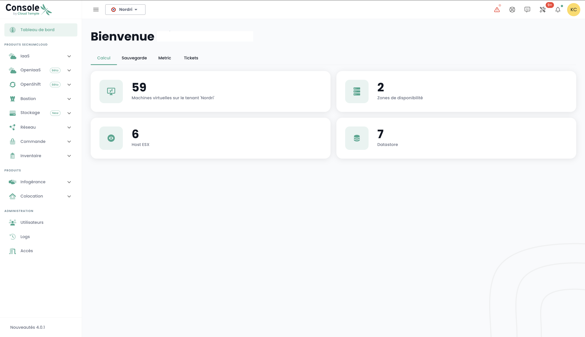

## Prérequis
- Avere sottoscritto a un'offerta Cloud Temple. Per sottoscrivere semplicemente, potete [contattarci](https://www.cloud-temple.com/contactez-nous/) o via email all'indirizzo __contact@cloud-temple.com__.
- Avere accesso alla console Shiva
- Avere il proprio IPv4 pubblico dichiarato nella zona di fiducia Cloud Temple (l'accesso alla console shiva è limitato agli indirizzi di fiducia identificati)

## Connessione al vostro tenant Cloud Temple
Shiva è accessibile tramite l'URL qui sotto:
    https://shiva.cloud-temple.com
    Oppure tramite l'URL diretto che vi è stato comunicato via email.

La prima pagina vi permette di selezionare [l'organizzazione](iam/concepts.md#organisations) in cui il vostro utente è stato creato.
Una volta inserita l'azienda, per favore cliccate su __'Accedi'__.

Sarete poi reindirizzati verso una pagina che richiede di autenticarsi.
Una volta effettuato l'accesso, arriverete su questa pagina.

## Gestione della lingua
La console è disponibile in __francese__, __inglese__. Potete cambiare la lingua di funzionamento tramite l'icona __lingua__ situata in alto a destra dello schermo.

Il cambiamento della lingua di un utente è da effettuare nel suo __'Profilo'__, in alto a destra dello schermo, nei __'Impostazioni utente'__.

La configurazione è fatta per ogni tenant [Tenant](iam/concepts.md#tenant).

## Accesso al supporto tecnico

In qualsiasi momento, potete contattare __il team di supporto Cloud Temple__ tramite l'icona __'boa'__ situata in alto a destra dello schermo.

Sarete guidati durante tutto il processo di richiesta di supporto.

Il primo passo è l'identificazione del tipo di richiesta di supporto:

- Richiedere un consiglio sull'uso di un prodotto (escluso incidente),
- Richiedere assistenza in relazione al vostro account cliente,
- Segnalare un incidente o richiedere supporto tecnico.
- Richiedere l'assistenza di un servizio professionale (messa a disposizione di un ingegnere Cloud Temple su una problematica).

Avrete poi la possibilità di fornire dettagli e includere file (immagine o log ad esempio).

Il responsabile può anche specificare un livello di criticità (P1 a P4) nella descrizione del ticket, in caso di incidente, come:

**CRITICO (P1)**:

- Sospetto di fuga di dati sensibili
- Rilevamento di accesso non autorizzato ai vostri dati
- Compromissione delle vostre credenziali amministrative
- Indisponibilità totale dei vostri servizi critici
- Comportamenti anomali su dati sensibili
- Violazione di dati di carattere personale

**ALTO (P2)**:

- Malfunzionamento degli accessi utente
- Anomalia nella crittografia dei vostri dati
- Perdita di accesso a certe funzionalità critiche
- Incoerenza nei dati
- Lentezze significative che impattano l'attività

**MEDIO (P3)**:

- Problema di performance localizzato
- Incidente su una funzionalità non critica
- Errore di configurazione con impatto limitato
- Difficoltà di accesso puntuale

**BASSO (P4)**:

- Richiesta di indagine
- Anomalia senza impatto diretto
- Questione di conformità
- Necessità di chiarimento tecnico

Una volta effettuata la richiesta, è possibile ritrovare le vostre richieste tramite l'icona __'boa'__ situata in alto a destra dello schermo:

## Accesso alle funzionalità utente tramite l'interfaccia web

Tutte le funzionalità accessibili al vostro utente (in base ai suoi diritti) sono situate a sinistra dello schermo, nella barra verde.
Le funzionalità sono raggruppate per moduli. Questo comprende principalmente:

- L'__inventario__ delle vostre risorse,
- Il __monitoraggio delle operazioni__,
- La __gestione delle risorse IaaS__ (Calcolo, storage, rete, ...)
- La __gestione delle risorse OpenIaaS__ (Calcolo, storage, rete, ...)
- L'accesso ai __servizi accessori__ (Bastion, monitoraggio, ...)
- L'__amministrazione della vostra organizzazione__ (Gestione dei tenant, dei diritti, ...)

L'attivazione di un modulo per un utente dipende dai diritti dell'utente. Ad esempio il modulo __'Ordini'__ non sarà disponibile se l'utente non ha il diritto __'ORDER'__.

Ecco una presentazione dei diversi moduli disponibili. Nuovi moduli arricchiscono la console regolarmente:

- __Dashboard__ : permette di avere una visione rapida del __totale delle risorse di calcolo e storage__, delle statistiche del __backup__ e di una __sintesi dei ticket di supporto__,
- __Inventario__ : permette di avere una visione dell'insieme delle vostre risorse di tipo __'macchine virtuali'__. Se vengono utilizzati i __tag__, permette di avere una visione per __tag__ (ad esempio, visione aziendale, visione applicativa, ...),
- __Gestione IT__ : dà accesso al monitoraggio delle vostre __richieste di supporto__ e alla __metrologia dei servizi__,
- __IaaS__ : permette la __gestione delle infrastrutture IaaS VMware__ (Macchine virtuali, cluster, hypervisor, repliche, backup, ...),
- __OpenIaaS__ : permette la __gestione delle risorse Xen Orchestra__ (Macchine virtuali, backup, ...),
- __OpenShift__ : permette la gestione della vostra **architettura PaaS RedHat Openshift** e il management dei vostri container sulle 3 zone di disponibilità della piattaforma,
- __Bastion__ : Permette di distribuire e gestire appliance bastion SSH/RDP nelle vostre reti,
- __Rete__ : permette la gestione delle __reti di livello 2 e 3__, delle __IP pubbliche__ e dei vostri __circuiti telecom__,
- __Colocation__ : Offre la visione sulle apparecchiature situate in zona di __collocazione condivisa o dedicata__,
- __Ordini__ : Permette l'ordine di risorse e il monitoraggio delle distribuzioni,
- __Amministrazione__ : Raggruppa le funzioni di amministrazione degli utenti e dei tenant nonché l'accesso alla registrazione globale.

I pittogrammi __'NEW'__ significano che il prodotto in questione è stato fornito ma non è ancora qualificato come __offerta SecNumCloud__ e __'BETA'__ significano che il prodotto in questione è stato fornito e appena qualificato come __offerta SecNumCloud__.

**Journalizzazione - Monitoraggio delle Attività**
=====================================

La pagina delle attività è destinata a fornire una visibilità completa su tutte le operazioni di lettura e scrittura eseguite all'interno della console, garantendo così una tracciabilità e una sicurezza accresciute. Mette in evidenza le due schede principali: Recenti e Archiviate.

### **Struttura della Pagina**

#### **Schede**
	+ **Recenti**
		- Operazioni recenti
		- Monitoraggio in tempo reale
	+ **Archiviate**
		- Operazioni su un periodo più lungo
		- Operazioni archiviate per tracciabilità e conformità
#### **Informazioni Visualizzate**
	+ Data e Ora
	+ Tipo di operazione
    + Stato
	+ Utente
	+ Descrizione dell'operazione
#### **Funzionalità**
	+ Ricerca/Filtraggio per operazioni specifiche

### **Utilizzo**

* **Accesso:** permesso `activity_read`
* **Navigazione:**
	- Selezionate la scheda "Recenti" per le operazioni in tempo reale.
	- Scegliete "Archiviate" per consultare la cronologia.
	- Utilizzate le funzionalità di ricerca e filtraggio per trovare operazioni specifiche.

#### **Nota di Conformità**
In conformità alla qualificazione SecNumCloud, l'archiviazione degli eventi della console Cloud Temple è di una durata minima di **6 mesi**, garantendo così il rispetto dei requisiti di sicurezza e tracciabilità.

## Consultazione degli ultimi aggiornamenti

Cliccate in basso a sinistra sulla barra verde sull'icona __'Novità'__. Avrete il dettaglio delle modifiche per ogni versione della console Cloud Temple.

## Accesso alle funzionalità utente tramite l'API

L'accesso all'insieme delle funzionalità della console Shiva è possibile tramite l'API Shiva. Potete avere il dettaglio dei verbi e delle configurazioni tramite __'Profilo'__ e __'API'__:

## Provider Terraform

Cloud Temple mette a vostra disposizione un provider Terraform per gestire *"as code"* la vostra piattaforma Cloud. È accessibile qui:

https://registry.terraform.io/providers/Cloud-Temple/cloudtemple/latest