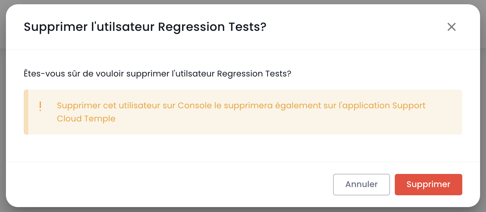

## Utilisateurs

Les comptes d'accès à la console Shiva sont créés par le compte maître del commitente su invito (qualunque sia il repository di autenticazione).
Le informazioni di identificazione sono globali alla tua [Organizzazione](#organisations).

*__Nota :__ [La federazione di identità viene gestita a livello dell'organizzazione](#organisations#mecanismes-dauthentification)*

### Creazione di un account utente nella tua organizzazione

La creazione di un account utente nella tua organizzazione avviene tramite invito. Per invitare un utente in una [Organizzazione](#organisations), vai nel menu __'Amministrazione'__ a sinistra dello schermo sul banner verde e poi nel sottomenu __'Utenti'__.

Clicca sul pulsante __'Nuovo Utente'__ dalla pagina degli utenti.

Indica quindi l'indirizzo email dell'utente

L'utente riceverà quindi un'email di verifica.

Una volta completata la verifica, l'utente potrà accedere alla console.

### Assegnazione dei permessi a un utente

La gestione dei diritti degli utenti si effettua dalla pagina utente.

Di default, un utente non ha diritti. È quindi necessario che l'amministratore che ha fatto l'invito conceda i diritti necessari per la sua attività. È sufficiente cliccare sul menu __'Azioni'__ dell'utente e scegliere l'opzione __'Modifica'__.

Appare quindi il menu di attivazione dei diritti:

La configurazione dei permessi deve essere fatta per ciascun [Tenant](#tenants) dell'[Organizzazione](#organisations).

L'elenco dei permessi e la loro definizione sono accessibili [qui](#permissions).

### Re-iscrizione di un utente

Quando un utente è stato previsto ma non ha confermato la sua iscrizione entro il termine di scadenza dell'email inviata dalla Console, non può più confermare la sua iscrizione. È quindi possibile reinviargli un link affinché rinnovi la sua prima iscrizione.

La re-iscrizione di un utente deve essere effettuata nella scheda __'Utente'__ del pannello di Amministrazione, in basso a sinistra dello schermo.

Seleziona l'utente che desideri re-iscrivere, quindi clicca sul pulsante di azione alla fine della riga, quindi __'Re-iscrizione'__.

**Warning**: Assicurati di essere l'origine della richiesta di re-iscrizione del tuo account utente. Segnala tutte le richieste che non provengono da te tramite un ticket di supporto.

### Aggiornare il proprio profilo

Questa azione è disponibile solo per un account locale (non SSO).

Seleziona nel tuo __'Profilo'__, in alto a destra dello schermo, quindi __'Impostazioni utente'__ e seleziona l'azione __'Aggiorna il tuo profilo'__.

Vai quindi nella tua casella di posta e clicca sul link generato dalla Console. Segui semplicemente i passaggi per aggiornare il tuo profilo.

**Warning**: Assicurati di essere l'origine della richiesta di aggiornamento del profilo. Segnala tutte le richieste che non provengono da te tramite un ticket di supporto.

### Reimpostare la password

Questa azione è disponibile solo per un account locale (non SSO).

Seleziona nel tuo __'Profilo'__, in alto a destra dello schermo, quindi __'Impostazioni utente'__, e seleziona l'azione __'Reimposta password'__.

Vai poi nella tua casella di posta e clicca sul link generato dalla Console. Segui semplicemente i passaggi per aggiornare la tua password.

**Warning**: Assicurati di essere l'origine della richiesta di reimpostazione della tua password. Segnala tutte le richieste che non provengono da te tramite un ticket di supporto.

### Reimpostare l'autenticazione a due fattori

Questa azione è disponibile solo per un account locale (non SSO).

Seleziona nel tuo __'Profilo'__, in alto a destra dello schermo, quindi __'Impostazioni utente'__, e seleziona l'azione __'Reimposta MFA'__.

Vai poi nella tua casella di posta e clicca sul link generato dalla Console. Segui semplicemente i passaggi per aggiornare l'autenticazione a due fattori.

**Warning**: Assicurati di essere l'origine della richiesta di reimpostare l'autenticazione a due fattori. Segnala tutte le richieste che non provengono da te tramite un ticket di supporto.

### Eliminare un utente

L'eliminazione di un utente deve essere effettuata nella scheda __'Utente'__ del pannello di Amministrazione, in basso a sinistra dello schermo.

Seleziona l'utente che desideri eliminare, quindi clicca sul pulsante di azione alla fine della riga, quindi __'Elimina'__.

Nota: Non puoi eliminare te stesso e non puoi eliminare un utente __'Proprietario'__.

### Disconnettersi

La disconnessione di un utente deve essere effettuata nel suo __'Profilo'__, in alto a destra dello schermo, quindi __'Disconnetti'__.

Una disconnessione automatica viene effettuata alla scadenza del token (JWT Token) di sessione.

### Cambiare la lingua di un utente

Per cambiare la lingua di un utente basta andare nel suo __'Profilo'__, in alto a destra dello schermo, nei __'Impostazioni utente'__.

La configurazione è fatta per ciascun tenant [Tenant](#tenants).

### Abbonarsi alle notifiche tematiche

La gestione degli abbonamenti permette di ricevere le email relative ai temi attivati che verranno automaticamente inviati al verificarsi degli eventi corrispondenti.

È accessibile nel profilo utente, nella scheda "I miei abbonamenti" :

 Ad esempio, in caso di incidente, verranno generate notifiche via email specifiche per questo tema.

L'elenco dei temi disponibili è suscettibile di evolversi e arricchirsi progressivamente per adattarsi alle esigenze e ai cambiamenti nel nostro ambiente operativo.

## Permessi

La console Shiva permette una gestione fine dei diritti degli utenti di un'organizzazione, con una segregazione per tenant.
Inizialmente, è l'account principale del commitente che configura inizialmente gli account e i permessi associati.
Successivamente, il diritto __'iam_write'__ consente a un account di gestire i permessi degli altri utenti.

### Permessi disponibili per gli utenti della tua organizzazione

I seguenti permessi sono configurabili per ciascun [utente](#utilisateurs) e per ciascun [tenant](#tenants#selection-dun-tenant) della tua organizzazione.

Permessi disponibili per gli utenti della tua organizzazione

Quando viene creato un utente, non possiede alcun permesso di default. Ogni permesso viene assegnato individualmente e funziona in modo unitario, senza sovrapposizioni con altri permessi. Si applicano insieme, il che significa che un utente deve possedere tutti i permessi richiesti per eseguire un'azione specifica.

I seguenti permessi sono configurabili per ciascun utente e per ciascun tenant della tua organizzazione:
  •	Permessi di tipo “read” : consentono solo la consultazione delle risorse senza possibilità di modifica.
  •	Permessi di tipo “write” : autorizzano la modifica delle configurazioni.
  •	Permessi di tipo “management“ : autorizzano la gestione avanzata delle risorse.

- __Sono dei permessi, non dei ruoli.__ Per questo motivo, è necessario avere il permesso READ e WRITE per modificare una configurazione.

__VERSIONE : 20241007__

| Nome del permesso                             | Descrizione del permesso                                                                                                       |
| --------------------------------------------- | ------------------------------------------------------------------------------------------------------------------------------ |
| activity_read                                 | Consultazione dei log e delle attività                                                                                         |
| activity_write                                | Gestione dei log e delle attività                                                                                              |
| backup_iaas_opensource_read                   | Gestione delle risorse di tipo backup - Offerta OpenIaaS - consultazione                                                       |
| backup_iaas_opensource_write                  | Gestione delle risorse di tipo backup - Offerta OpenIaaS - modifica                                                            |
| backup_iaas_spp_read                          | Gestione delle risorse di tipo backup - Offerta Vmware - consultazione                                                         |
| backup_iaas_spp_write                         | Gestione delle risorse di tipo backup - Offerta Vmware - modifica                                                              |
| bastion_read                                  | Consultazione delle risorse di tipo bastion                                                                                    |
| bastion_write                                 | Gestione delle risorse (appliances, sessioni,...)  di tipo Bastion                                                             |
| bastion_console_access                        | Autorizzazione di accesso alla console (ssh/rdp) di una risorsa protetta da un'appliance Bastion                               |

| compute_iaas_opensource_console_access        | Offre OpenIaaS -Apertura della console di una macchina virtuale                                                                |
| compute_iaas_opensource_infrastructure_read   | Offre OpenIaaS -Consultazione dei dati avanzati delle risorse Xen Orchestra |
| compute_iaas_opensource_infrastructure_write  | Offre OpenIaaS -Gestione avanzata delle risorse Xen Orchestra                                                                          |
| compute_iaas_opensource_read                  | Offre OpenIaaS -Consultazione delle risorse di tipo Macchine Virtuali                                                        |
| compute_iaas_opensource_management            | Offre OpenIaaS -Gestione delle risorse di tipo Macchine Virtuali                                                             |
| compute_iaas_opensource_virtual_machine_power | Offre OpenIaaS -Gestione dell'alimentazione di una macchina virtuale                                                              |
| compute_iaas_vmware_console_access            | Offre Vmware - Apertura della console di una macchina virtuale                                                                 |
| compute_iaas_vmware_infrastructure_read       | Offre Vmware - Consultazione dei dati avanzati delle risorse VMware (regole di affinità/anti-affinità, configurazione drs, ecc.)  |
| compute_iaas_vmware_infrastructure_write      | Offre Vmware - Gestione avanzata delle risorse VMware                                                                           |
| compute_iaas_vmware_read                      | Offre Vmware - Consultazione delle risorse di tipo Macchine Virtuali                                                         |
| compute_iaas_vmware_management                | Offre Vmware - Gestione delle risorse di tipo Macchine Virtuali (consente la crittografia di una macchina virtuale)                                                              |
| compute_iaas_vmware_virtual_machine_power     | Offre Vmware - Gestione dell'alimentazione di una macchina virtuale                                                               |
| baremetal_read                                | Offre Bare Metal - Consultazione delle risorse di tipo Bare Metal                                                               |
| baremetal_console_access                      | Offre Bare Metal - Apertura della console di un Bare Metal                                                                  |
| console_public_access_read                    | Consultazione delle IP autorizzate per accedere alla console                                                                         |
| console_public_access_write                   | Aggiunta di IP autorizzate per accedere alla console                                                                                  |
| compute_virtual_machine_power                 | Gestione dell'alimentazione di una macchina virtuale                                                                              |
| documentation_read                            | Consultazione delle risorse documentazione di confluence                                                                        |
| housing_read                                  | Consultazione delle risorse di tipo colocation                                                                                 |
| iam_offline_access                            | Creazione e cancellazione di Access Token Personali (PAT)                                                                        |
| iam_read                                      | Consultazione dei diritti degli utenti                                                                                           |
| iam_write                                     | Gestione dei diritti degli utenti                                                                                                |
| intervention_read                             | Consultazione delle modifiche e delle implementazioni previste sulla piattaforma                                                  |
| inventory_read                                | Consultazione delle risorse di tipo Inventario                                                                                 |
| inventory_write                               | Gestione delle risorse di tipo Inventario                                                                                      |
| monitoring_read                               | Consultazione del monitoring                                                                                                     |
| monitoring_write                              | Gestione del monitoring                                                                                                          |
| metric_read                                   | Consultazione dei dati di salute sulle macchine virtuali e host                                                         |
| network_read                                  | Consultazione delle risorse di rete                                                                                             |
| network_write                                 | Gestione delle risorse di rete                                                                                                  |
| order_read                                    | Consultazione degli ordini infrastrutturali                                                                                     |
| order_write                                   | Creazione di ordini infrastrutturali                                                                                            |
| object-storage_iam_management                 | Permette di gestire gli account di archiviazione sul prodotto S3                                                                       |
| object-storage_read                           | Permette di visualizzare i bucket e le configurazioni dei bucket                                                                   |
| object-storage_write                          | Permette di modificare i bucket e le configurazioni dei bucket                                                                  |
| openshift_management                          | Permette di connettersi alle piattaforme Openshift (scoperta al tenant)                                                          |
| Owner                                         | L'utente ha i diritti di amministrazione di un tenant                                                                        |
| support_management                            | consultazione di tutti i ticket di supporto del tenant                                                                       |
| support_read                                  | Consultazione dei ticket di supporto del tenant                                                                                  |
| support_write                                 | Creazione di un ticket di supporto sul tenant                                                                                     |
| tag_read                                      | Consultazione dei tag, eccetto i tag RTMS                                                                                   |
| tag_write                                     | Gestione dei tag, eccetto i tag RTMS                                                                                        |
| ticket_comment_read                           | Consultazione dei commenti                                                                                                  |
| ticket_comment_write                          | Gestione dei commenti                                                                                                       |
| ticket_read                                   | Consultazione dei ticket                                                                                                       |
| ticket_write                                  | Gestione dei ticket                                                                                                            |

**Note** :

- *Non c'è alcun limite al numero di proprietari (owners) che possono essere definiti su un tenant. Tuttavia, l'interfaccia di gestione (IHM) avvisa quando ci sono più di 3 proprietari, per incoraggiare a limitare il numero di proprietari per motivi di sicurezza e una gestione ottimale degli accessi.*
- *Quando si aggiunge un nuovo proprietario (owner), l'aggiornamento dei suoi permessi può richiedere fino a 60 minuti. Questo tempo di propagazione è normale e garantisce che i diritti di accesso siano correttamente applicati a tutti i servizi e le risorse associati.*
- *Per rimuovere un proprietario (owner) dal tenant, l'utente deve inviare una richiesta al supporto. Questa procedura garantisce che le modifiche ai diritti di accesso siano effettuate in modo sicuro e conforme alle migliori pratiche di gestione degli accessi.*

### Permessi deprecati

I seguenti permessi non sono più disponibili:

| Nome del permesso                             | Data       | Descrizione del permesso                                                                                   |
| ---------------------------------------------- | ---------- | -------------------------------------------------------------------------------------------------------------- |
| backup_read  (**DEPRECATO**)                  | 07/10/2024 | Consultazione delle risorse di tipo backup                                                                     |
| backup_write (**DEPRECATO**)                  | 07/10/2024 | Gestione delle risorse di tipo backup - modifica                                                           |

| compute_console_access (**DEPRECATO**)        | 07/10/2024 | Apertura della console di una macchina virtuale                                                              |
| compute_infrastructure_read (**DEPRECATO**)   | 07/10/2024 | Consultazione di dati avanzati delle risorse VMware (regole affinità/anti-affinità, configurazione drs, ecc.) |
| compute_infrastructure_write (**DEPRECATO**)  | 07/10/2024 | Gestione avanzata delle risorse VMware                                                                       |
| compute_read (**DEPRECATO**)                  | 07/10/2024 | Consultazione delle risorse di tipo Macchine Virtuali                                                        |
| compute_management (**DEPRECATO**)            | 07/10/2024 | Gestione delle risorse di tipo Macchine Virtuali                                                             |
| compute_virtual_machine_power (**DEPRECATO**) | 07/10/2024 | Gestione dell'alimentazione di una macchina virtuale                                                         |
| iam_manage_permissions (**DEPRECATO**)        | 07/10/2024 | Gestione dei nuovi diritti per se stessi                                                                     |

## Organizzazioni

L'organizzazione è legata al vostro __contoc mandante__ e al __contratto Cloud Temple associato__. Rappresenta la vostra entità (società, dipartimento, squadra, ...) che porta la relazione contrattuale tra Cloud Temple e voi.

### Principio di un'organizzazione

L'organizzazione ha quattro grandi ruoli:

- Rappresenta __l'entità contrattuale__ per gli aspetti di monitoraggio e fatturazione,
- Definisce __la configurazione globale del meccanismo di autenticazione__: l'autenticazione può essere locale a livello della console Shiva o remota tramite un servizio di federazione di identità,
- Porta l'insieme dei __conti utenti__,
- __Federesce i tenant__ (Produzione, Preproduzione, Dev, Applicazione 1, Applicazione 2, ...) che definite per le esigenze della vostra architettura Cloud.

I ruoli (diritti/permessi) degli utenti sono configurabili per ogni tenant definito nella vostra organizzazione. Ad esempio un conto può essere autorizzato a ordinare risorse in un tenant, ma non in un altro.

### Meccanismi di autenticazione

La console Shiva permette a livello dell'organizzazione __la configurazione del meccanismo di autenticazione__. Potete utilizzare il repertorio locale di autenticazione della console Shiva o ancorare la vostra organizzazione a uno dei vostri repertori di autenticazione.

I repertori esterni seguenti sono supportati:

- Repertori compatibili __OpenID Connect__,
- Repertori compatibili __SAML__,
- __Microsoft ADFS__
- __Microsoft EntraID__ (Microsoft Azure Active Directory)
- Amazon AWS Cognito
- Okta
- Auth0
- KeyCloak

## Tenant

Il tenant è un __raggruppamento di risorse all'interno di un'organizzazione__. Una [Organizzazione](#organisations) ha almeno un tenant (chiamato __tenant predefinito__, che può essere rinominato). Generalmente, più tenant vengono utilizzati per segmentare le responsabilità o i perimetri tecnici.

Ad esempio:

- Un tenant __Produzione__
- Un tenant __Preproduzione__
- Un tenant __Ricetta__
- Un tenant __Qualificazione__

Ma è anche possibile organizzare le cose con una __vista applicativa__ o per __criticità__:

- Un tenant __Applicazione 1__ o __Criticità 1__
- Un tenant __Applicazione 2__ o __Criticità 2__
- ...

Le risorse tecniche ordinate sono assegnate a un tenant preciso e non sono condivise con gli altri tenant. Ad esempio, un cluster di Hypervisior e le reti L2 associate sono disponibili solo in un tenant.
Per quanto riguarda le reti, è possibile richiedere reti __'cross tenant'__ per garantire la continuità della rete tra i tenant.

I permessi degli utenti devono essere definiti in ogni tenant. Quindi ciascuna organizzazione deve riflettere attentamente sui tenant desiderati. Questo punto viene generalmente affrontato in un workshop di avviamento, al momento della creazione dell'organizzazione.

È possibile far evolvere l'architettura aggiungendo o rimuovendo tenant.

Un tenant non può essere vuoto. Deve necessariamente essere inizializzato con un minimo di risorsa:

- Una zona di disponibilità (AZ, cioè un datacenter fisico),
- Un cluster di calcolo,
- Uno spazio di archiviazione,
- Un vlan di rete.

| Riferimento dell'ordine                                   | Unità    | SKU                     |
|-----------------------------------------------------------|----------|-------------------------|
| TENANT - *(REGION)* - Attivazione di un tenant            | 1 tenant | csp:tenant:v1           |
| TENANT - *(REGION)* - Attivazione di una zona di disponibilità | 1 tenant | csp:(region):iaas:az:v1 |

### Autorizzazione d'accesso a un tenant: IP autorizzate

L'accesso alla console di gestione cloud è strettamente limitato agli indirizzi IP precedentemente autorizzati, in conformità con i requisiti della qualificazione SecNumCloud. Questa restrizione garantisce un livello di sicurezza rafforzato consentendo l'accesso solo agli utenti provenienti da intervalli di IP specificati, minimizzando così i rischi di accesso non autorizzato e proteggendo l'infrastruttura cloud secondo i più alti standard di sicurezza.

Nota: *La rimozione di un IP autorizzato si fa attraverso una richiesta di supporto nella console Cloud Temple.*

### Consumo di risorse all'interno di un tenant

È possibile visualizzare le risorse cloud consumate all'interno di un tenant, offrendo così una visione dettagliata dell'uso dei diversi servizi dispiegati. Questa funzionalità permette agli utenti di monitorare in tempo reale il consumo delle loro risorse, identificare i servizi più richiesti e ottimizzarne l'uso in base alle necessità.

Nel menu della console, cliccare su "Rapporto di consumo" e poi selezionare il periodo di tempo desiderato. Potrete così visualizzare in dettaglio il consumo delle risorse cloud nel periodo definito, il che vi permetterà di analizzare l'utilizzo dei servizi e ottimizzare la vostra gestione di conseguenza:

