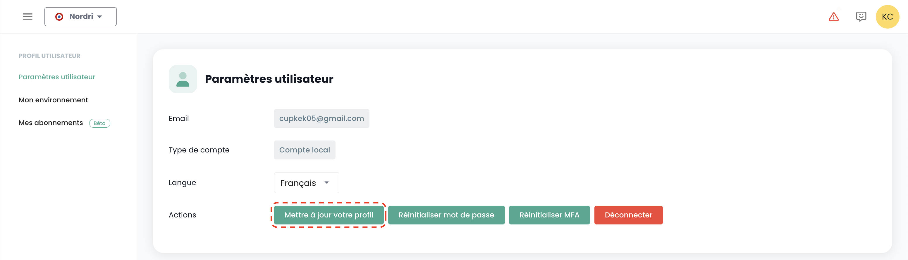

## Utilizzatori

Gli account di accesso alla console Shiva sono creati dall'account master del committente su invito (indipendentemente dal repository di autenticazione).
Le informazioni di autenticazione sono globali alla tua [Organizzazione](#organisations).

*__Nota :__ [La federazione di identità si gestisce a livello dell'organizzazione](#organisations#mecanismes-dauthentification)*

### Creazione di un account utente nella tua organizzazione

La creazione di un account utente nella tua organizzazione avviene tramite invito. Per invitare un utente in una [Organizzazione](#organisations), vai nel menu __'Amministrazione'__ a sinistra dello schermo sulla banda verde e poi nel sottomenu __'Utenti'__.

Clicca sul pulsante __'Nuovo Utente'__ dalla pagina degli utenti.

Indica poi l'indirizzo email dell'utente

L'utente riceverà quindi un'email di verifica.

Una volta completata la verifica, l'utente potrà accedere alla console.

### Assegnazione dei permessi a un utente

La gestione dei diritti utenti avviene dalla pagina utente.

Per impostazione predefinita, un utente non ha alcun diritto. È quindi necessario che l'amministratore che ha effettuato l'invito gli conceda i diritti necessari alla sua attività. È sufficiente cliccare sul menu __'Azioni'__ dell'utente e scegliere l'opzione __'Modifica'__.

Il menu di attivazione dei diritti apparirà quindi:

La configurazione dei permessi deve essere effettuata per ogni [Tenant](#tenants) dell'[Organizzazione](#organisations).

L'elenco dei permessi e la loro definizione sono accessibili [qui](#permissions).

### Re-iscrizione di un utente

Quando un utente è stato fornito ma non ha convalidato la sua iscrizione entro il termine di scadenza dell'email inviata dalla Console, non può più confermare la sua iscrizione. È quindi possibile inviare nuovamente un link per rinnovare la sua prima iscrizione.

La re-iscrizione di un utente va effettuata nella scheda __'Utente'__ del pannello di amministrazione, in basso a sinistra dello schermo.

Seleziona l'utente che desideri re-iscrivere, quindi clicca sul pulsante azione alla fine della riga e poi __'Re-iscrizione'__.

**Warning**: Assicurati di essere tu l'origine della richiesta di re-iscrizione del tuo account utente. Segnala tutte le richieste che non provengono da te tramite un ticket di supporto.

### Aggiornare il proprio profilo

Questa azione è disponibile solo per un account locale (non SSO).

Seleziona nel tuo __'Profilo'__, in alto a destra dello schermo, quindi __'Impostazione utente'__ e seleziona l'azione __'Aggiorna il tuo profilo'__.

Vai quindi nella tua casella di posta elettronica e clicca sul link generato dalla Console. Segui semplicemente i passaggi per aggiornare il tuo profilo.

**Warning**: Assicurati di essere tu l'origine della richiesta di aggiornamento del profilo. Segnala tutte le richieste che non provengono da te tramite un ticket di supporto.

### Reimpostazione della password

Questa azione è disponibile solo per un account locale (non SSO).

Seleziona nel tuo __'Profilo'__, in alto a destra dello schermo, quindi __'Impostazione utente'__ e seleziona l'azione __'Reimposta password'__.

Vai quindi nella tua casella di posta elettronica e clicca sul link generato dalla Console. Segui semplicemente i passaggi per aggiornare la tua password.

**Warning**: Assicurati di essere tu l'origine della richiesta di reimpostazione della tua password. Segnala tutte le richieste che non provengono da te tramite un ticket di supporto.

### Reimpostazione del doppio fattore di autenticazione

Questa azione è disponibile solo per un account locale (non SSO).

Seleziona nel tuo __'Profilo'__, in alto a destra dello schermo, quindi __'Impostazione utente'__ e seleziona l'azione __'Reimposta MFA'__.

Vai quindi nella tua casella di posta elettronica e clicca sul link generato dalla Console. Segui semplicemente i passaggi per aggiornare il tuo doppio fattore di autenticazione.

**Warning**: Assicurati di essere tu l'origine della richiesta di reimpostazione del tuo doppio fattore di autenticazione. Segnala tutte le richieste che non provengono da te tramite un ticket di supporto.

### Eliminazione di un utente

L'eliminazione di un utente va effettuata nella scheda __'Utente'__ del pannello di amministrazione, in basso a sinistra dello schermo.

Seleziona l'utente che desideri eliminare, quindi clicca sul pulsante azione alla fine della riga e poi __'Elimina'__.

Nota: Non puoi eliminare te stesso e non puoi eliminare un utente __'Proprietario'__.

### Disconnessione

La disconnessione di un utente va effettuata nel suo __'Profilo'__, in alto a destra dello schermo, quindi __'Disconnetti'__.

Una disconnessione automatica viene effettuata alla scadenza del token (JWT Token) di sessione.

### Cambiare la lingua di un utente

La modifica della lingua di un utente va effettuata nel suo __'Profilo'__, in alto a destra dello schermo, nelle __'Impostazioni utente'__.

La configurazione viene effettuata per ogni tenant [Tenant](#tenants).

### Abbonamento alle notifiche tematiche

La gestione degli abbonamenti consente di ricevere le email relative alle tematiche attivate che saranno automaticamente inviate al verificarsi degli eventi corrispondenti.

È accessibile nel profilo utente, sotto la scheda "I miei abbonamenti":

 Ad esempio, in caso di incidenti, saranno generate notifiche email specifiche a quella tematica.

L'elenco delle tematiche disponibili è suscettibile di evoluzione e di arricchimento progressivo per adattarsi alle esigenze e ai cambiamenti nel nostro ambiente operativo.

## Permessi

La console Shiva permette una gestione dettagliata dei diritti degli utenti di un'organizzazione, con una segregazione per tenant.
Inizialmente, è l'account principale del committente che consente la configurazione iniziale degli account e dei permessi associati.
Successivamente, il diritto __'iam_write'__ consente a un account di amministrare i permessi degli altri utenti.

### Permessi disponibili per gli utenti della tua organizzazione

Quando un utente viene creato, non possiede alcun permesso per impostazione predefinita. Ogni permesso è assegnato singolarmente e funziona in modo autonomo, senza sovrapporsi ad altri permessi. Si applicano in combinazione, il che significa che un utente deve disporre di tutti i permessi richiesti per eseguire una specifica azione.

I seguenti permessi sono configurabili per ogni utente e per ogni tenant della tua organizzazione:
	• Permessi di tipo "read": consentono solo la consultazione delle risorse senza possibilità di modifica.
	• Permessi di tipo "write": autorizzano la modifica delle configurazioni.
 	• Permessi di tipo "management": autorizzano la gestione avanzata delle risorse.

- __Questi sono permessi, non ruoli.__ A tal fine, è necessario avere i permessi READ e WRITE per modificare una configurazione.

Ultimo aggiornamento: 23/01/2025

| Nome del permesso                             | Descrizione del permesso                                                                                                       |
| --------------------------------------------- | ------------------------------------------------------------------------------------------------------------------------------ |
| activity_read                                 | Consultazione dei registri log e attività                                                                                      |
| activity_write                                | Gestione dei registri log e attività                                                                                           |
| backup_iaas_opensource_read                   | Gestione delle risorse di tipo backup - Offerta OpenIaaS - consultazione                                                       |
| backup_iaas_opensource_write                  | Gestione delle risorse di tipo backup - Offerta OpenIaaS - modifica                                                            |
| backup_iaas_spp_read                          | Gestione delle risorse di tipo backup - Offerta Vmware - consultazione                                                         |
| backup_iaas_spp_write                         | Gestione delle risorse di tipo backup - Offerta Vmware - modifica                                                             |
| bastion_read                                  | Consultazione delle risorse di tipo bastion                                                                                    |
| bastion_write                                 | Gestione delle risorse (appliance, sessioni,...) di tipo Bastion                                                               |
| bastion_console_access                        | Autorizzazione all'accesso alla console (ssh/rdp) di una risorsa protetta da un'appliance Bastion                              |
| compute_iaas_opensource_console_access        | Offerta OpenIaaS - Apertura della console di una macchina virtuale                                                             |
| compute_iaas_opensource_infrastructure_read   | Offerta OpenIaaS - Consultazione dei dati avanzati delle risorse Xen Orchestra                                                 |
| compute_iaas_opensource_infrastructure_write  | Offerta OpenIaaS - Gestione avanzata delle risorse Xen Orchestra                                                               |
| compute_iaas_opensource_read                  | Offerta OpenIaaS - Consultazione delle risorse di tipo Macchine Virtuali                                                       |
| compute_iaas_opensource_management            | Offerta OpenIaaS - Gestione delle risorse di tipo Macchine Virtuali                                                            |
| compute_iaas_opensource_virtual_machine_power | Offerta OpenIaaS - Gestione dell'alimentazione di una macchina virtuale                                                        |
| compute_iaas_vmware_console_access            | Offerta Vmware - Apertura della console di una macchina virtuale                                                               |
| compute_iaas_vmware_infrastructure_read       | Offerta Vmware - Consultazione dei dati avanzati delle risorse VMware (regole affinità/anti-affinità, configurazione drs, ecc.)|
| compute_iaas_vmware_infrastructure_write      | Offerta Vmware - Gestione avanzata delle risorse VMware                                                                        |
| compute_iaas_vmware_read                      | Offerta Vmware - Consultazione delle risorse di tipo Macchine Virtuali                                                         |
| compute_iaas_vmware_management                | Offerta Vmware - Gestione delle risorse di tipo Macchine Virtuali (permette la crittografia di una macchina virtuale)          |
| compute_iaas_vmware_virtual_machine_power     | Offerta Vmware - Gestione dell'alimentazione di una macchina virtuale                                                          |
| baremetal_read                                | Offerta Bare Metal - Consultazione delle risorse di tipo Bare Metal                                                            |
| baremetal_console_access                      | Offerta Bare Metal - Apertura della console di un Bare Metal                                                                   |
| console_public_access_read                    | Consultazione degli IP autorizzati ad accedere alla console                                                                    |
| console_public_access_write                   | Aggiunta di IP autorizzati ad accedere alla console                                                                            |
| compute_virtual_machine_power                 | Gestione dell'alimentazione di una macchina virtuale                                                                           |
| documentation_read                            | Consultazione delle risorse documentazione di confluence                                                                       |
| housing_read                                  | Consultazione delle risorse di tipo colocation                                                                                 |
| iam_offline_access                            | Creazione e rimozione di Access Token Personali (PAT)                                                                          |
| iam_read                                      | Consultazione dei diritti degli utenti                                                                                         |
| iam_write                                     | Gestione dei diritti degli utenti                                                                                              |
| intervention_read                             | Consultazione dei cambiamenti e messe in produzione previste sulla piattaforma                                                 |
| inventory_read                                | Consultazione delle risorse di tipo Inventario                                                                                 |
| inventory_write                               | Gestione delle risorse di tipo Inventario                                                                                      |
| monitoring_read                               | Consultazione del monitoring                                                                                                   |
| monitoring_write                              | Gestione del monitoring                                                                                                        |
| metric_read                                   | Consultazione dei dati di stato sulle macchine virtuali e hosts                                                                |
| network_read                                  | Consultazione delle risorse di rete                                                                                            |
| network_write                                 | Gestione delle risorse di rete                                                                                                 |
| order_read                                    | Consultazione degli ordini infrastrutturali                                                                                    |
| order_write                                   | Creazione di ordini infrastrutturali                                                                                           |
| object-storage_iam_management                 | Permette di gestire i conti di archiviazione sul prodotto S3                                                                   |
| object-storage_read                           | Permette di vedere i bucket e le configurazioni dei bucket                                                                     |
| object-storage_write                          | Permette di modificare i bucket e le configurazioni dei bucket                                                                 |
| openshift_management                          | Permette di connettersi alle piattaforme Openshift (scoperto al tenant)                                                        |
| support_management                            | consultazione di tutti i ticket di supporto del tenant                                                                         |
| support_read                                  | Consultazione dei propri ticket di supporto del tenant                                                                         |
| support_write                                 | Creazione di un ticket di supporto sul tenant                                                                                  |
| tag_read                                      | Consultazione dei tag, eccetto i tag RTMS                                                                                      |
| tag_write                                     | Gestione dei tag, eccetto i tag RTMS                                                                                           |
| ticket_comment_read                           | Consultazione dei commenti                                                                                                     |
| ticket_comment_write                          | Gestione dei commenti                                                                                                          |
| ticket_read                                   | Consultazione dei ticket                                                                                                       |
| ticket_write                                  | Gestione dei ticket                                                                                                            |

## Organisations

L'organizzazione è collegata al vostro __account committente__ e al __contratto Cloud Temple associato__. Rappresenta la vostra entità (azienda, dipartimento, team, ...) che stabilisce il rapporto contrattuale tra Cloud Temple e voi.

### Principio di un'organizzazione

L'organizzazione ha quattro ruoli principali:

- Rappresenta __l'entità contrattuale__ per gli aspetti di monitoraggio e fatturazione,
- Definisce __la configurazione globale del meccanismo di autenticazione__: l'autenticazione può essere locale a livello della console Shiva o remota tramite un servizio di federazione di identità,
- Porta l'insieme dei __conti utenti__,
- __Federalizza i tenant__ (Produzione, Preproduzione, Dev, Applicazione 1, Applicazione 2, ...) che definite per le esigenze della vostra architettura Cloud.

I ruoli (diritti/permessi) degli utenti sono configurabili per ogni tenant definito nella vostra organizzazione. Ad esempio, un account può essere autorizzato a ordinare risorse in un tenant, ma non in un altro.

### Meccanismi di autenticazione

La console Shiva permette a livello dell'organizzazione __il parametraggio del meccanismo di autenticazione__. Potete
utilizzare il repository locale di autenticazione della console Shiva o collegare la vostra organizzazione a uno
dei vostri repository di autenticazione.

Sono supportati i seguenti repository esterni:

- Repository compatibili con __OpenID Connect__,
- Repository compatibili con __SAML__,
- __Microsoft ADFS__
- __Microsoft EntraID__ (Microsoft Azure Active Directory)
- Amazon AWS Cognito
- Okta
- Auth0
- KeyCloak

## Tenant

Il tenant è un __raggruppamento di risorse all'interno di un'organizzazione__. Una [Organizzazione](#organisations) ha almeno un tenant (chiamato __tenant predefinito__, può essere rinominato). Generalmente, vengono utilizzati più tenant per segmentare le responsabilità o i perimetri tecnici.

Per esempio:

- Un tenant __Produzione__
- Un tenant __Preproduzione__
- Un tenant __Ricetta__
- Un tenant __Qualificazione__

È anche possibile organizzare le cose con una __vista applicativa__ o per __criticità__:

- Un tenant __Applicazione 1__ o __Criticità 1__
- Un tenant __Applicazione 2__ o __Criticità 2__
- ...

Le risorse tecniche ordinate sono assegnate a un tenant preciso e non sono condivise con altri tenant. Ad esempio, un cluster di Hypervisor e le reti L2 associate sono disponibili solo in 1 tenant.
Per quanto riguarda le reti, è possibile richiedere reti __'cross tenant'__ al fine di garantire la continuità di rete tra i tenant.

I permessi degli utenti devono essere definiti in ogni tenant. Quindi ogni organizzazione deve riflettere attentamente sui tenant desiderati. Questo punto è generalmente affrontato in un workshop di inizializzazione, al momento della creazione dell'organizzazione.

È possibile far evolvere l'architettura aggiungendo o rimuovendo tenant.

Un tenant non può essere vuoto. Deve necessariamente essere inizializzato con un minimo di risorse:

- Una zona di disponibilità (AZ, ossia un datacenter fisico),
- Un cluster di calcolo,
- Uno spazio di archiviazione,
- Un vlan di rete.

| Riferimento dell'ordine                                       | Unità    | SKU                     |
|--------------------------------------------------------------|----------|-------------------------|
| TENANT - *(REGION)* - Attivazione di un tenant               | 1 tenant | csp:tenant:v1           |
| TENANT - *(REGION)* - Attivazione di una zona di disponibilità| 1 tenant | csp:(region):iaas:az:v1 |

### Gestione dei proprietari di un tenant
Ogni tenant possiede almeno un proprietario, garantendo così una responsabilità chiara e una gestione efficiente delle risorse associate. Inoltre, è possibile dichiarare diversi proprietari su uno stesso tenant, permettendo una collaborazione e una presa di decisioni condivisa. Di seguito, troverete informazioni importanti da tenere in considerazione durante la gestione di questi proprietari.

#### Informazioni importanti sulla gestione dei proprietari

#### 1. Numero di proprietari
* Non c'è alcun limite tecnico al numero di proprietari che possono essere definiti sul tenant.
* L'interfaccia di gestione (IHM) emette un avviso quando ci sono più di 3 proprietari, al fine di incoraggiare a limitare il numero di proprietari per ragioni di sicurezza e gestione ottimale degli accessi.

#### 2. Aggiunta di un nuovo proprietario
* Durante l'aggiunta di un nuovo proprietario, l'aggiornamento dei suoi permessi può richiedere fino a 60 minuti.
* Questo tempo di propagazione è normale e permette di assicurare che i diritti di accesso siano correttamente applicati a tutti i servizi e le risorse associate.

#### 2. Permessi di un proprietario
* A un proprietario saranno attribuiti tutti i permessi legati ai prodotti attivati sul suo tenant.
* Non è possibile modificare i permessi di un proprietario.

#### 3. Rimozione di un proprietario
* Per rimuovere un proprietario dal tenant, l'utente deve presentare una richiesta al supporto.
* Questa procedura permette di garantire che le modifiche ai diritti di accesso siano effettuate in modo sicuro e conforme alle migliori pratiche di gestione degli accessi.

### Autorizzazione di accesso a un tenant: IP autorizzati

L'accesso alla console di gestione cloud è strettamente limitato agli indirizzi IP precedentemente autorizzati, in conformità con i requisiti della qualificazione SecNumCloud. Questa restrizione garantisce un livello di sicurezza rafforzato consentendo l'accesso solo agli utenti provenienti da intervalli di IP specificati, minimizzando così i rischi di accessi non autorizzati e proteggendo l'infrastruttura cloud secondo gli standard di sicurezza più elevati.

Nota: *La rimozione di un IP autorizzato si effettua mediante una richiesta di supporto nella console Cloud Temple.*

### Consumo delle risorse all'interno di un tenant

È possibile visualizzare le risorse cloud consumate all'interno di un tenant, offrendo così una visione dettagliata dell'utilizzo dei diversi servizi deployed. Questa funzionalità permette agli utenti di monitorare in tempo reale il consumo delle proprie risorse, di identificare i servizi più sollecitati e di ottimizzare il loro utilizzo in base alle necessità.

Nel menu della console, cliccare su "Rapporto di consumo" e poi selezionare il periodo di tempo desiderato. Potrete così visualizzare in dettaglio il consumo delle risorse cloud nel periodo definito, il che vi permetterà di analizzare l'utilizzo dei servizi e ottimizzare la vostra gestione di conseguenza:

